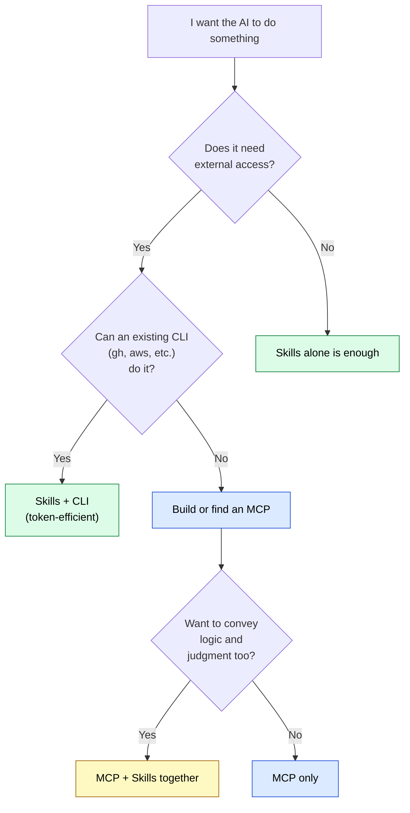

# MCP vs Skills — 3-Line Answer and Decision Guide

> [!IMPORTANT] Answered in 3 lines
> 1. **MCP** = a **connection** to external systems (APIs, DBs, CLIs, filesystems, etc.)
> 2. **Skills** = **knowledge / playbook** kept inside the agent (rules, templates, best practices)
> 3. **Use both when you need both** — they are not exclusive. **Need a connection? MCP. Want to teach knowledge? Skills.**

## At-a-glance mapping

| What you want to do | MCP | Skills |
| --- | :---: | :---: |
| Call an external API | ✅ | ❌ |
| Query an internal database | ✅ | ❌ |
| Access the filesystem | ✅ | ❌ |
| Teach project coding conventions | ❌ | ✅ |
| Teach "how to create a PR" procedure | ❌ | ✅ |
| Provide domain expertise (laws, jargon) | ❌ | ✅ |
| Provide Markdown templates | ❌ | ✅ |
| Teach how to use a CLI (`gh`, `aws`, etc.) | ❌ | ✅ |

## Common search questions, answered in 3 lines

### Q: Should I build MCP or Skills first?

**A**: **Skills first.** Skills start from a single Markdown file and pay off immediately. MCP carries higher implementation and operational cost — only build one when you are **certain you need an external connection**.

### Q: What is skill.md?

**A**: A Markdown file that **teaches an AI agent domain knowledge**. Place it as `SKILL.md` and the agent loads it on demand. It is plain Markdown with frontmatter (name, description) and a body (instructions / procedures).

### Q: Isn't MCP more powerful? Isn't Skills just a watered-down MCP?

**A**: No. **MCP and Skills serve different responsibilities.** MCP supplies "**what you can access**"; Skills supplies "**what you know and how you decide**." When a CLI already exists, `gh` CLI + Skills is often more token-efficient than building an MCP.

### Q: Are Cline / Cursor / Vercel Skills the same?

**A**: They share the same specification base ([Agent Skills Specification](https://agentskills.io)). The **SKILL.md** format is identical, but **placement paths differ**: Claude Code uses `.claude/skills/`, Cursor uses `.cursor/rules/`, Cline uses `.pi/skills/`, Vercel manages them via `npx skills`. See [What is Skills](../skills/what-is-skills) for details.

### Q: I heard MCP is heavy (high token consumption)

**A**: True. Each MCP server consumes context just for its **tool definitions**. Connecting 10 MCPs can cost tens of thousands of tokens. Mitigations: (1) disconnect unused MCPs, (2) use Tool Search / Deferred Loading, (3) replace MCPs with Skills + CLI where possible. The structural reason is explained in [understanding-llm / MCP Context Cost](https://shuji-bonji.github.io/understanding-llm-through-claude-code/06-tool-context/mcp-context-cost).

### Q: Is this different from sub-agents?

**A**: Yes. **Skills are knowledge; sub-agents are separate processes.** Skills are "an instruction sheet for how to do something"; sub-agents are "specialist staff." A sub-agent can carry its own Skills and MCPs. See [Sub-agents](../agents/what-is-subagent) for details.

### Q: What is the typical pattern when using both?

**A**: "**MCP for connection, Skills for behavior**" is the dominant pattern. Examples:
- MCP `github-mcp` fetches PR data → Skills `pr-review` apply review criteria
- MCP `postgres-mcp` reads the DB → Skills `db-conventions` enforce naming rules
- MCP `slack-mcp` posts messages → Skills `notification-style` unify tone

## Decision flow (decide in 10 seconds)

## Going deeper

| What you want to know | Page |
| --- | --- |
| Detailed MCP vs Skills selection | [MCP vs Skills (full version)](../skills/vs-mcp) |
| Skills structure and format | [What is Skills](../skills/what-is-skills) |
| MCP structure and protocol | [What is MCP](../mcp/what-is-mcp) |
| How to create a Skill | [How to Create Skills](../skills/how-to-create-skills) |
| How to build an MCP | [MCP Development](../mcp/development) |
| **Why** Skills must be a separate layer | [understanding-llm / Part 5](https://shuji-bonji.github.io/understanding-llm-through-claude-code/05-on-demand-context/skills) |
| **Why** MCP becomes a context cost | [understanding-llm / Part 6](https://shuji-bonji.github.io/understanding-llm-through-claude-code/06-tool-context/mcp-context-cost) |

---

> **Next**: [MCP vs Skills (full version)](../skills/vs-mcp)
