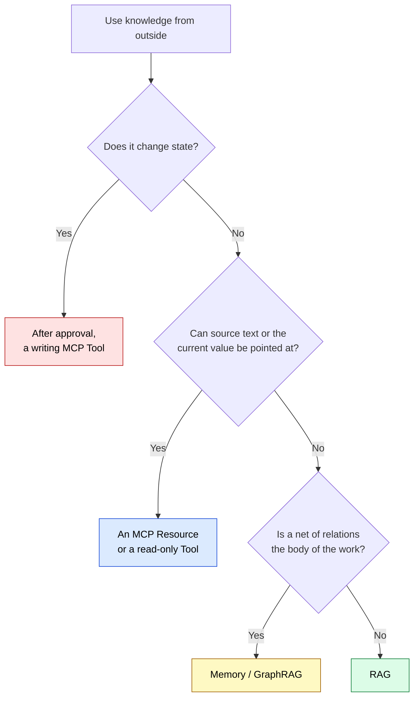

# RAG vs MCP — 3-Line Answer and Decision Guide

> [!IMPORTANT] Answered in 3 lines
> 1. **RAG** = a **type** that cuts documents, looks for similar sentences, and puts them beside generation
> 2. **MCP** = a **protocol** where a host and a server exchange capabilities and context. Used for reads and for execution alike
> 3. **There are two axes** — how knowledge is fetched (scrap search, or pointing at a place) and whether there is a side effect (a read, or a change of state). On the second axis, RAG and MCP are not a pair

## At-a-glance mapping

| What you want to do | RAG | MCP |
| --- | :---: | :---: |
| Search write-ups on an internal wiki | ✅ | ❌ |
| Pick up past wording and phrasing | ✅ | ❌ |
| Narrow down a large body of unstructured text | ✅ | ❌ |
| Take an article of a statute by its article number | ❌ | ✅ |
| Take a section of an RFC with a citation | ❌ | ✅ |
| Check the current replica count | ❌ | ✅ |
| Return the latest value without updating an index | ❌ | ✅ |
| Change a setting or open a ticket | ❌ | ✅ |

❌ means "not suited to that work", not "impossible". Search can be run inside an MCP server, but the inside is still scrap search.

## Common search questions, answered in 3 lines

### Q: Does MCP replace RAG?

**A**: No. **They sit at different layers.** RAG is a type that joins search and generation; MCP is the protocol between a host and a server. Putting RAG inside an MCP server does not stop search from being search.

### Q: Which is newer? Is RAG obsolete?

**A**: It is not obsolete. They suit different work. Structured source text (an article of a statute, a section of an RFC, an API response) is taken more reliably by pointing at a place, while weakly structured write-ups are found faster by search. Structured source text **SHOULD** (should) not be finished with scrap search alone.

### Q: What is the typical pattern when using both?

**A**: "**Write-ups from RAG, source text and current values from MCP**" is the most common pattern. For example:
- The thinking behind incident handling from RAG → the procedure itself through `resources/read`
- An explanation of a term from RAG → the article itself pointed at by number through a statute MCP
- The intent of a design from RAG → the current setting through a read-only Tool

### Q: Does RAG carry over the permissions on the original document?

**A**: It does not. Put a document only HR may read into the index, and **no distinction of permission remains on the search side**. Who may read what **SHOULD** (should) be designed when the index is built.

### Q: May an agent act on a procedure returned by RAG?

**A**: It should not. The result of a reference is not permission to act. If the document is old, the real system is changed on an old procedure. Worse, if the text contains an instruction, the result of a reference becomes the trigger for execution (MCP06 in the OWASP MCP Top 10). The result of a reference **MUST NOT** (must not) be read as an instruction.

### Q: Which side is GraphRAG on?

**A**: It is a type that **knows** by following relations. When a net of relations is the body of the work, it suits better than scrap search. It does not become the doing side.

### Q: Does adding a vector DB make it RAG?

**A**: A vector DB is a place to hold things, not the type itself. Quality is decided by how text is cut and how the result is handed to generation. Bad chunk cuts turn articles and tables into scraps that drift.

## Decision flow (decide in 10 seconds)

Only the write is coloured differently. That is the one box entered after judgment and approval.

## Going deeper

| What you want to know | Page |
| --- | --- |
| The contrast as a way of fetching knowledge | [IV.1 Patterns](../part-4/patterns) |
| The boundary between a read and a change of state | [Knowing and Doing Paths](../strategy/read-and-write-paths) |
| MCP structure and protocol | [What is MCP](../mcp/what-is-mcp) |
| The difference between MCP and Skills | [MCP vs Skills](./mcp-vs-skills) |
| Choosing by freshness, amount of judgment, and state of the data | [Architecture Map](../information/architecture-map) |
| What becomes MCP and what stays an ordinary program | [II.2 Placement](../part-2/placement) |
| How annotations are treated, and the OWASP MCP Top 10 | [MCP Security](../mcp/security) |

---

> **Previous**: [MCP vs Skills](./mcp-vs-skills)
>
> **Next**: [Knowing and Doing Paths](../strategy/read-and-write-paths)
