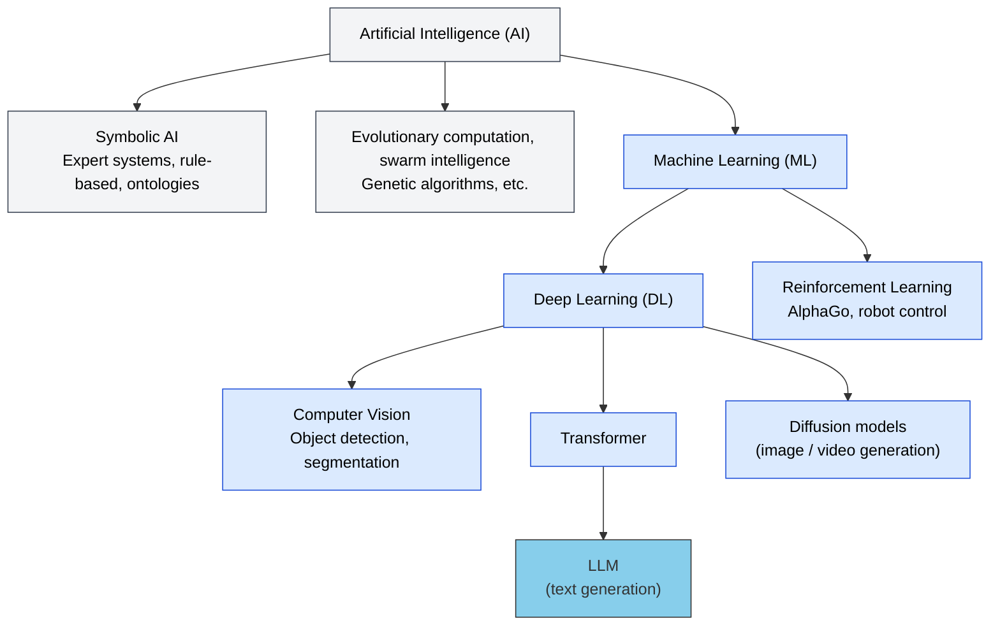
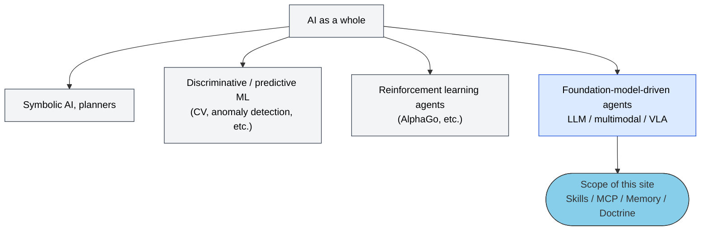
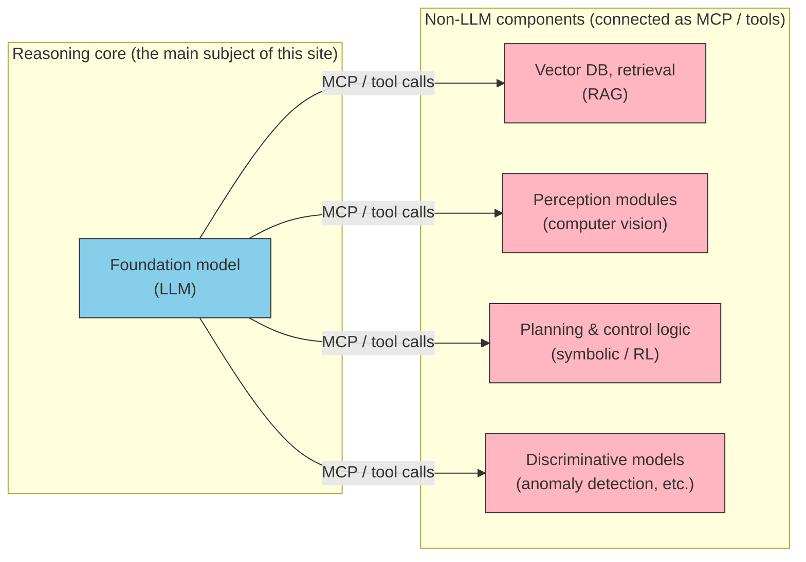

# Does "AI Agent" Mean Only LLMs? — The Scope of This Site

> [!IMPORTANT] Answered in 3 lines
> 1. Academically, **AI agents ⊋ LLM agents**. Reinforcement learning agents (AlphaGo), symbolic AI, and robot control are all agents.
> 2. On this site, "AI agent" means an **agent whose reasoning core is a foundation model (mainly an LLM)** — the same de facto usage as Anthropic / OpenAI / Google in 2026.
> 3. Why the narrower scope: Skills / MCP / Memory / Doctrine — the subject of this site — only make sense as **responses to the structural constraints of LLMs**. AlphaGo does not need a `SKILL.md`.

## Where LLMs Sit in the AI Landscape

LLMs are only one part of the vast field called "AI". In the technical hierarchy, an LLM is one Transformer-based example within deep learning (DL).

Change the classification axis and even more diversity appears.

| Axis | Main categories / examples |
| --- | --- |
| **Capability scope** | Narrow AI (ANI — nearly everything in production today, including LLMs) / General AI (AGI — still research) |
| **Function / output** | Generative (LLMs, diffusion models, speech synthesis) / Discriminative & predictive (spam detection, medical imaging, demand forecasting) |
| **Learning paradigm** | Supervised / unsupervised / **reinforcement learning** / self-supervised |
| **Technical approach** | Symbolic / statistical & connectionist (ML, DL) / evolutionary computation / neuro-symbolic (hybrid) |
| **Application domain** | Computer vision / robotics & Embodied AI / speech (ASR, TTS) / recommendation / domain-specific models like AlphaFold |

The concept of an "agent" itself also predates LLMs. The rational-agent framework since Russell & Norvig covers rule-based reflex agents, BDI architectures, reinforcement learning agents, and robot control.

## Why This Site Still Scopes to Foundation-Model-Driven Agents

Skills / MCP / Memory / Doctrine — the subject of this site — are not a general theory of agents. They are designs that **become necessary precisely because of the structural constraints of LLMs**.

| Building block on this site | LLM structural constraint it responds to |
| --- | --- |
| **Skills** | Knowledge boundary — domain procedures and conventions are not in the weights |
| **MCP** | Accuracy & currency — hallucination and training-data cutoff |
| **Memory** | Statelessness — nothing is remembered across sessions |
| **Doctrine** | No built-in criteria — no native goals, constraints, or priorities |
| **Agent (orchestration)** | Finite context — cannot see everything at once |

> [!TIP] Developer analogy
> AlphaGo does not need a `SKILL.md`. Its decision criteria are baked into the weights, and it never discovers tools from natural-language descriptions. Conversely, the architecture on this site only exists for foundation models that **take instructions in natural language and discover tools through natural language**.

> [!NOTE] Strictly speaking, slightly broader than "LLM"
> The moment [06-physical-ai](../concepts/06-physical-ai) covers VLA (Vision-Language-Action) models, this site's scope steps outside pure text LLMs. The precise scope is "**agents whose reasoning core is a foundation model**". The text often says LLM by convention.

## Are Non-LLM AI Technologies Irrelevant, Then?

No. Real-world agent systems typically use a **hybrid composition**: an LLM as the reasoning core combined with non-LLM components. In this site's five-layer model, those components appear not as the reasoning core but on the **MCP / tool side**.

LLMs can be inferior to other AI techniques in interpretability, deterministic guarantees, latency, and domain accuracy, so production systems integrate the right technique for each job. But **who decides and orchestrates that integration** — that is the role of the foundation model, and the territory this site covers.

## Learn More

| What you want to know | Page |
| --- | --- |
| Why authoritative references are needed (start of Concepts) | [01-vision](../concepts/01-vision) |
| The five-layer model | [03-architecture](../concepts/03-architecture) |
| Extension to the physical world (VLA, Embodied AI) | [06-physical-ai](../concepts/06-physical-ai) |
| Agent terminology for LLM-based systems | [Agent taxonomy](../agents/agent-taxonomy) |

## 🔗 Going Deeper: Why Do LLMs Have Structural Constraints?

This page covered **where LLM agents sit (What)** within the broader AI landscape. To understand **why** LLMs are stateless, context-limited, and prone to hallucination, see the sister site.

- [understanding-llm / Part 1: LLM Structural Problems](https://shuji-bonji.github.io/understanding-llm-through-claude-code/01-llm-structural-problems/) — the eight structural problems that each layer of this site responds to

---

> **Next**: [MCP vs Skills FAQ](./mcp-vs-skills)
