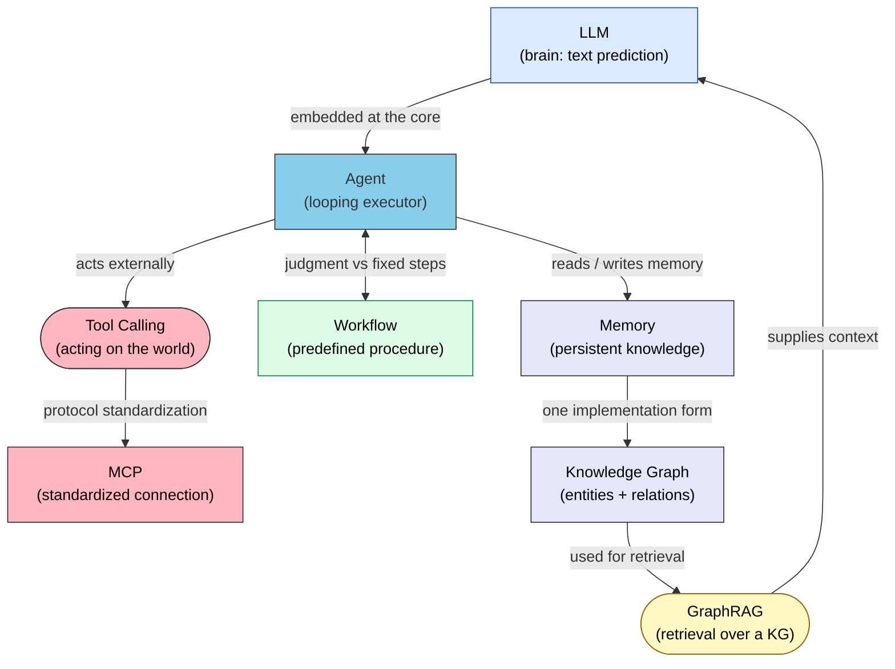
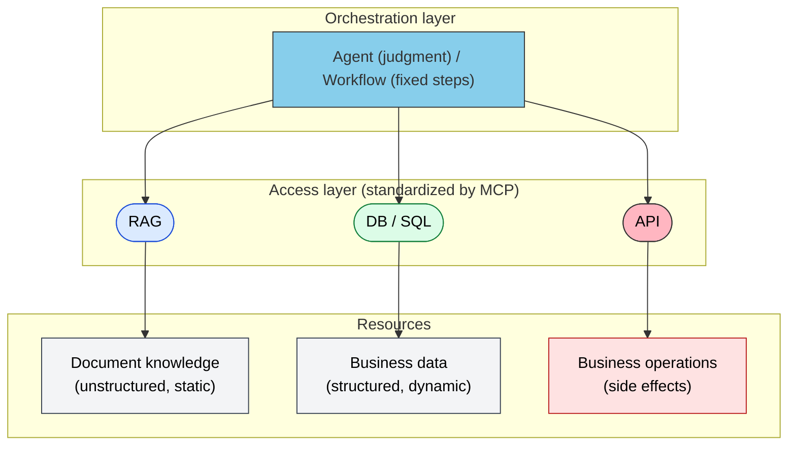

# Architecture Map — Every Keyword's Place and Role in One View

> LLM, Agent, Tool Calling, MCP, Skills, Workflow, Memory, Knowledge Graph, GraphRAG, and RAG are not parallel concepts of equal rank. Each has its own post.

## About This Document

In enterprise AI adoption, a crowd of keywords tends to be presented as "options" at the same level. In reality, they are **parts with different roles**, arranged in layers with dependencies. This page provides that overall view, and doubles as a signpost to the section of this site where each keyword is covered.

> **Audience**: First-time readers of this site; developers and architects who want the big picture of AI adoption

## 1. How the Terms Relate

| Term | In One Phrase | Contrasting Concept |
| --- | --- | --- |
| LLM | A function that predicts | Agent (a subject that loops) |
| Agent | Autonomous judgment loop | Workflow (fixed procedure) |
| Tool Calling | The calling mechanism | MCP (its standard protocol) |
| Memory | What to remember | [Context Window](../glossary#context-window) (volatile) |
| Knowledge Graph | Structured relations | Vector DB (similarity) |
| GraphRAG | Retrieval that walks relations | Plain RAG (fragment retrieval) |

## 2. Resource Types × Access Paths

Most of these keywords can be organized as pairs of "**which resource, accessed by which means**". In this diagram, Agent / Workflow sit on the orchestration side. In the [II.1 five layers](../part-2/layers), however, Agent is one ownership post — not the top of a resource stack.

| Resource Type | Nature | Access Path | Notes |
| --- | --- | --- | --- |
| Document knowledge | Unstructured, static | **RAG** | Read-only "search by meaning". Extends to GraphRAG for cross-document questions |
| Business data | Structured, dynamic | **DB** (SQL / Semantic Layer) | Read access for "exact values". The LLM only generates the query |
| Business operations | Side effects | **API** | **Write and execute** — includes irreversible operations, so permission design is mandatory |
| Relational knowledge | Graph-structured | **Knowledge Graph / Memory** | "Who owns what, what depends on what". Retrieved via GraphRAG |
| Multi-step execution | Combination of the above | **Agent / Workflow** | The orchestration layer spanning resources. Fixed steps → Workflow; judgment needed → Agent |

> [!IMPORTANT]
> The value of this classification is that "**read vs write**" separates naturally. RAG and DB are reads (safe, idempotent); API is operations (side effects, permissions required). When you grant an Agent permissions, this boundary becomes the risk boundary. See [Permission vs Authority](../strategy/permission-vs-authority.md).

> [!NOTE]
> MCP does not get its own row in this table — it runs **across** it, as the connection standard unifying RAG / DB / API access. Skills are the **static knowledge and procedures** the Agent layer consults; they belong to "defining the Agent's behavior", not to access paths.

## 3. Data Flow — a Cycle, Not a One-Way Street

The two return flows are the point. The Business Process **generates new Data**, and the Agent's execution experience accumulates in Memory, growing the Knowledge. Without these return flows, you fall back into the scatter-gather problem of "re-researching everything from scratch every time".

> [!WARNING]
> **If your data is fundamentally scattered, AI is not the solution.** Put RAG or an Agent on top of scattered, dirty data and it will only reproduce the scatter faster. Data curation comes first — unifying relations in a Knowledge Graph, unifying metric definitions in a Semantic Layer.

## 4. Relation to the Five Layers

The diagrams on this page are a map of **resources, access paths, and circulation**. The main map of this book is the [II.1 five layers](../part-2/layers). The axes differ. Do not read this page as another name for the five layers.

| Five layers | How it appears on this page |
| --- | --- |
| Doctrine | Not a node in the diagrams. The measure of purpose, prohibitions, and priority. See the table below and [III.3 Doctrine](../part-3/doctrine) |
| Agent | On the orchestration side. In the five layers it owns understanding and assignment — it is not an upper stack that owns the other layers |
| Skills | Not an access path. Stable knowledge and procedures the Agent reads. Kept off the diagram |
| Memory | Relational knowledge, and one end of the feedback from runs |
| MCP | The connection standard that cuts across RAG / DB / API |

The execution boundary (Harness / [Hooks](../strategy/hooks)) is none of the five layers. It is a machine interrupt at a point in the run — stop, record, after-steps. It does not add a layer.

> [!NOTE]
> When unsure, decide **who owns it** with the five layers first. Then use this page for **which resource, read or write**. Reverse the order and ownership mixes with connection.

## 5. Keyword → Section of This Site

| Keyword | Covered In | Role |
| --- | --- | --- |
| LLM (structural constraints) | [I.1 Constraint summary](../part-1/constraints) / [Sister site: understanding-llm](https://shuji-bonji.github.io/understanding-llm-through-claude-code/) | Why and premises |
| Ownership split (five layers) | [II.1 Five layers](../part-2/layers) / [II.2 Placement](../part-2/placement) | Main map of this book |
| Doctrine (decision criteria) | [III.3 Doctrine](../part-3/doctrine) | Purpose, prohibitions, priority |
| Skills | [III.1 Skills](../skills/what-is-skills.md) | Static knowledge and procedures |
| MCP / Tool Calling | [III.2 MCP](../mcp/what-is-mcp.md) | Connection as an implementation mechanism |
| Memory / Knowledge Graph | [III.4 Memory](../part-3/memory) | How memory and relations persist |
| Agent / Sub-agent / A2A | [III.5 Agent](../agents/index.md) | Taxonomy and design of executors |
| RAG / GraphRAG | This page §2 (no dedicated page) | Read access to document knowledge. For types, see [IV.1 Patterns](../part-4/patterns) |
| Semantic Layer | [MCP / Semantic Layer](../mcp/semantic-layer.md) | Design discipline for structured data access |
| Workflow | [Workflows](../workflows/development-phases.md) | Patterns for fixed procedures |
| Patterns / limits | [IV.1 Patterns](../part-4/patterns) / [IV.2 Limits](../part-4/limits) | Choosing a type and how far it reaches |
| Permission / Authority | [Permission vs. Authority](../strategy/permission-vs-authority.md) | Separating permission from authority |
| Hooks | [Hooks](../strategy/hooks) | Harness-side execution boundary. Not a layer |

> [!TIP]
> When unsure which means to pick, three axes decide it: **freshness** (static → RAG, dynamic → DB/API), **amount of judgment** (none → Workflow, much → Agent), and **state of the data** (dirty → curate first; AI comes last).

## Related Documents

- [Overview (Information)](index.md) — Positioning and structure of this section
- [II.1 Five layers](../part-2/layers) — Main map of this book (ownership)
- [II.2 Placement](../part-2/placement) — Where to put what
- [Hooks](../strategy/hooks) — Execution boundary, not a layer
- [IV.1 Patterns](../part-4/patterns) — Which type to pick when

## Going Deeper: Why LLMs Need an External Information Foundation

This page covered the **structure (What/How)** of information architecture. To understand **why** an LLM alone is not enough — from the LLM's structural constraints — see the sister site.

- [understanding-llm (top page)](https://shuji-bonji.github.io/understanding-llm-through-claude-code/) — The eight structural constraints (Context Rot, Knowledge Boundary, etc.) that make external references necessary

---

> **Previous**: [Overview (Information)](index.md)

**Last updated**: August 2026
