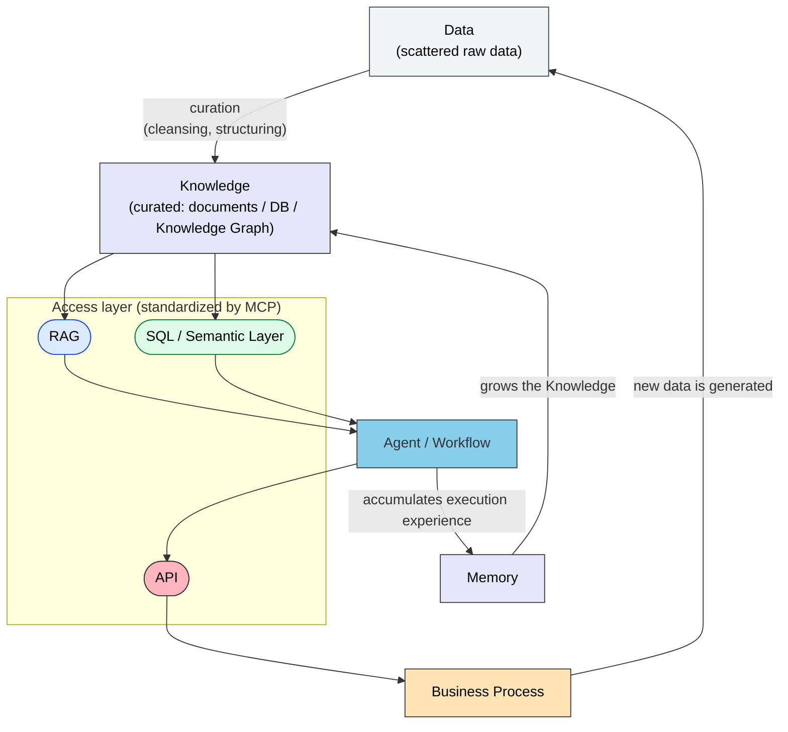

# Architecture Map — Every Keyword's Place and Role in One View

> LLM, Agent, Tool Calling, MCP, Skills, Workflow, Memory, Knowledge Graph, GraphRAG, and RAG are not parallel concepts of equal rank. Each has its own post.

## About This Document

In enterprise AI adoption, a crowd of keywords tends to be presented as "options" at the same level. In reality, they are **parts with different roles**, arranged in layers with dependencies. This page provides that overall view, and doubles as a signpost to the section of this site where each keyword is covered.

> **Audience**: First-time readers of this site; developers and architects who want the big picture of AI adoption

## 1. How the Terms Relate

| Term | In One Phrase | Contrasting Concept |
| --- | --- | --- |
| LLM | A function that predicts | Agent (a subject that loops) |
| Agent | Autonomous judgment loop | Workflow (fixed procedure) |
| Tool Calling | The calling mechanism | MCP (its standard protocol) |
| Memory | What to remember | [Context Window](../glossary#context-window) (volatile) |
| Knowledge Graph | Structured relations | Vector DB (similarity) |
| GraphRAG | Retrieval that walks relations | Plain RAG (fragment retrieval) |

## 2. Resource Types × Access Paths

Most of these keywords can be organized as pairs of "**which resource, accessed by which means**". The Agent is not a peer of the others — it sits above them as the orchestrating layer.

| Resource Type | Nature | Access Path | Notes |
| --- | --- | --- | --- |
| Document knowledge | Unstructured, static | **RAG** | Read-only "search by meaning". Extends to GraphRAG for cross-document questions |
| Business data | Structured, dynamic | **DB** (SQL / Semantic Layer) | Read access for "exact values". The LLM only generates the query |
| Business operations | Side effects | **API** | **Write and execute** — includes irreversible operations, so permission design is mandatory |
| Relational knowledge | Graph-structured | **Knowledge Graph / Memory** | "Who owns what, what depends on what". Retrieved via GraphRAG |
| Multi-step execution | Combination of the above | **Agent / Workflow** | The orchestration layer spanning resources. Fixed steps → Workflow; judgment needed → Agent |

> [!IMPORTANT]
> The value of this classification is that "**read vs write**" separates naturally. RAG and DB are reads (safe, idempotent); API is operations (side effects, permissions required). When you grant an Agent permissions, this boundary becomes the risk boundary. See [Permission vs Authority](../strategy/permission-vs-authority.md).

> [!NOTE]
> MCP does not get its own row in this table — it runs **across** it, as the connection standard unifying RAG / DB / API access. Skills are the **static knowledge and procedures** the Agent layer consults; they belong to "defining the Agent's behavior", not to access paths.

## 3. Data Flow — a Cycle, Not a One-Way Street

The two return flows are the point. The Business Process **generates new Data**, and the Agent's execution experience accumulates in Memory, growing the Knowledge. Without these return flows, you fall back into the scatter-gather problem of "re-researching everything from scratch every time".

> [!WARNING]
> **If your data is fundamentally scattered, AI is not the solution.** Put RAG or an Agent on top of scattered, dirty data and it will only reproduce the scatter faster. Data curation comes first — unifying relations in a Knowledge Graph, unifying metric definitions in a Semantic Layer.

## 4. Keyword → Section of This Site

| Keyword | Covered In | Role |
| --- | --- | --- |
| LLM (structural constraints) | [Sister site: understanding-llm](https://shuji-bonji.github.io/understanding-llm-through-claude-code/) | The "Why" bookshelf |
| Agent / Sub-agent / A2A | [Agents](../agents/index.md) | Taxonomy and design of executors |
| Tool Calling / MCP | [MCP](../mcp/what-is-mcp.md) | Connection as an implementation mechanism |
| Skills | [Skills](../skills/what-is-skills.md) | Static knowledge and procedures as an implementation mechanism |
| Workflow | [Workflows](../workflows/development-phases.md) | Patterns for fixed procedures |
| Memory / Knowledge Graph | [Concepts 08](../concepts/08-memory-and-knowledge.md) | Concepts of memory and knowledge integration |
| RAG / GraphRAG | This section (page in preparation) | Access design for document knowledge |
| Semantic Layer | [MCP / Semantic Layer](../mcp/semantic-layer.md) | Design discipline for structured data access |
| Doctrine (decision criteria) | [Concepts 07](../concepts/07-doctrine-and-intent.md) | Constraints, purpose, decision criteria |
| Permission / Authority | [Strategy](../strategy/permission-vs-authority.md) | Separating permission from authority |

> [!TIP]
> When unsure which means to pick, three axes decide it: **freshness** (static → RAG, dynamic → DB/API), **amount of judgment** (none → Workflow, much → Agent), and **state of the data** (dirty → curate first; AI comes last).

## Related Documents

- [Overview (Information)](index.md) — Positioning and structure of this section
- [Concepts 03: Architecture](../concepts/03-architecture.md) — The three-layer model in detail
- [Concepts 04: AI Design Patterns](../concepts/04-ai-design-patterns.md) — Which pattern to pick when

## 🔗 Going Deeper: Why LLMs Need an External Information Foundation

This page covered the **structure (What/How)** of information architecture. To understand **why** an LLM alone is not enough — from the LLM's structural constraints — see the sister site.

- [understanding-llm (top page)](https://shuji-bonji.github.io/understanding-llm-through-claude-code/) — The eight structural constraints (Context Rot, Knowledge Boundary, etc.) that make external references necessary

---

> **Previous**: [Overview (Information)](index.md)

**Last updated**: August 2026
