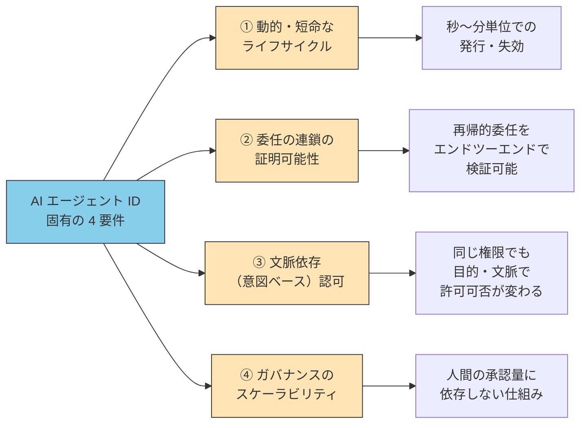
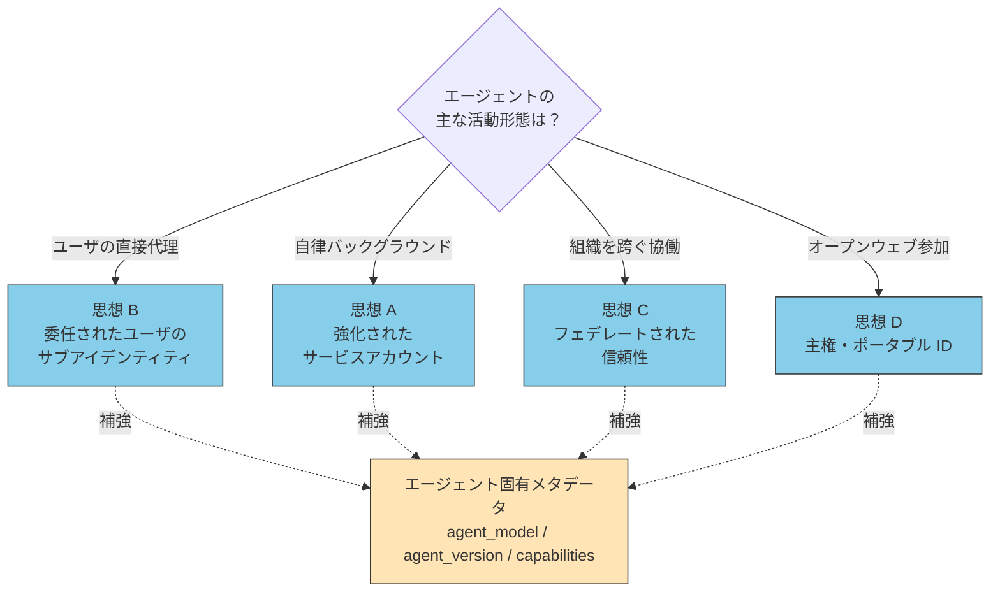
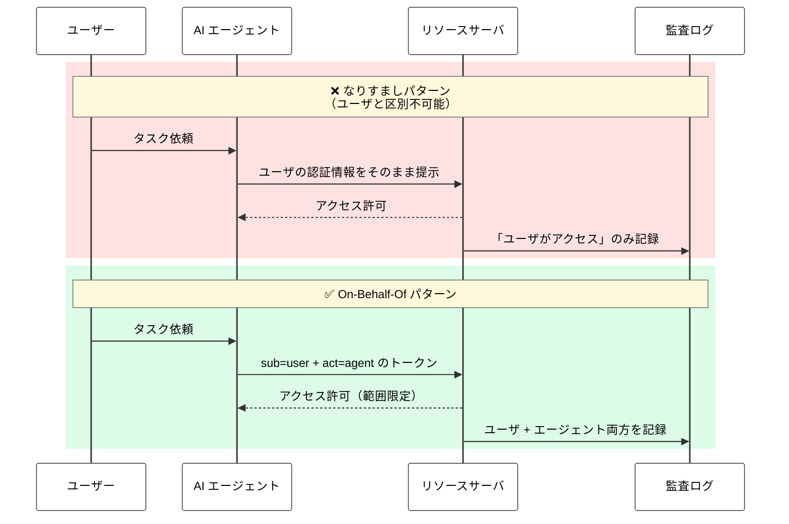
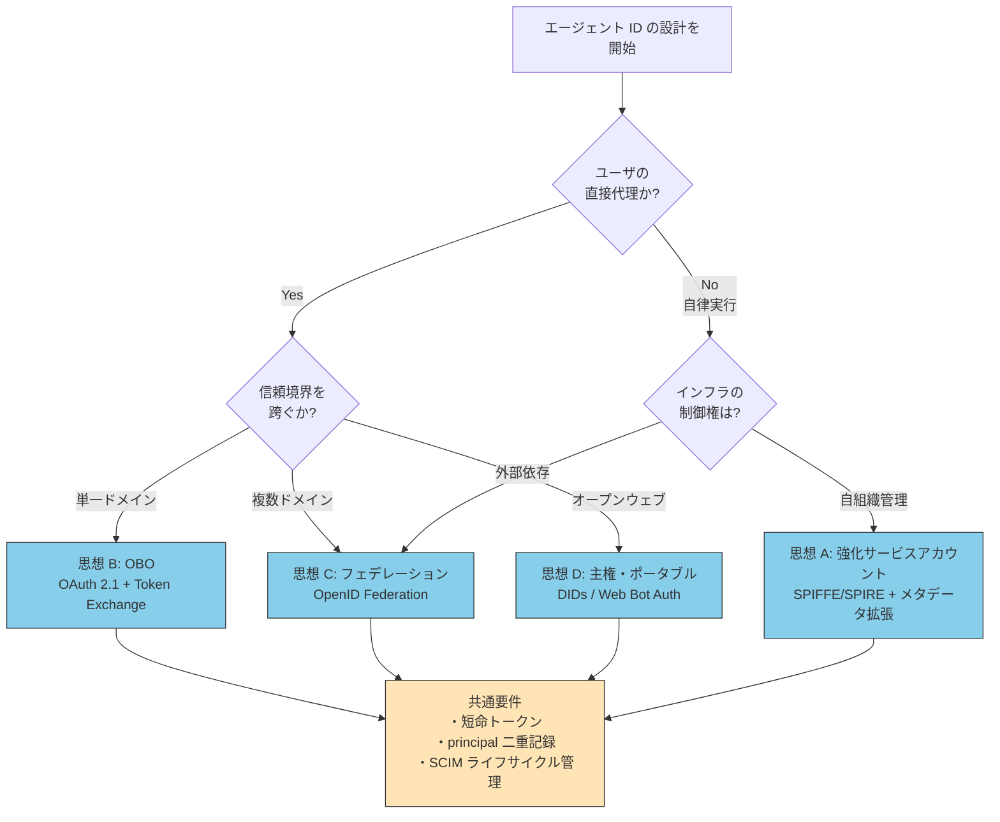

# エージェントID — Non-Human Identity の新カテゴリ

> AIエージェントはなぜサービスアカウントの拡張ではなく、独自のアイデンティティモデルを必要とするのか。OpenID Foundation が示す4つのアーキテクチャ思想を中心に整理する。

::: warning このページの位置づけ
_エージェント分類（執筆予定）_（**WHAT KIND** — どんな種類のエージェントか）
→ **本ページ（IDENTITY — どう識別し、誰の代理か）**
→ _権限管理 RBAC/ABAC/JIT（執筆予定）_（**ACCESS** — 何にアクセスを許すか）

エージェントの **「誰」** を定義するページ。エージェントの種類に応じて、どう識別子と帰属を与えるかを扱う。認可（権限の中身）は別ページに分離する。
:::

::: details メタ情報

|                          |                                                                                                                                                                               |
| ------------------------ | ----------------------------------------------------------------------------------------------------------------------------------------------------------------------------- |
| **この章で固定するもの** | エージェントID の 4 アーキテクチャ思想、なりすましと委任の区別、商用実装の現状                                                                                                |
| **扱わないこと**         | 権限管理の詳細（→ 権限管理ページ）、A2A 通信時の認証フロー（→ [A2Aとは](./what-is-a2a)）、Skill/MCP との責務分離（→ [concepts/03-architecture](../concepts/03-architecture)） |
| **依存**                 | _エージェント分類（執筆予定）_、[concepts/03-architecture](../concepts/03-architecture)（三層モデル）                                                                         |
| **誤用ポイント**         | AIエージェントを従来の NHI（サービスアカウント、API キー）と同じ枠組みで管理し、静的・長寿命の前提を当てはめること                                                            |

:::

## このドキュメントについて

2025〜2026年にかけて、AIエージェントへの ID 付与は「議論」から「本番運用」のフェーズに移った。Microsoft Entra Agent ID（2026年4月 GA）、Okta for AI Agents（2026年4月30日 GA）、AWS Bedrock Agents など主要 IAM ベンダーがエージェント専用 ID プロダクトを投入し、A2A v1.0 は Linux Foundation 下で多数の企業・組織（AWS、Cisco、Google、IBM、Microsoft、Salesforce、SAP、ServiceNow ほか）が参加するプロジェクトとして本番運用フェーズに入っている[^a2a-lf]。OpenID Foundation は 2025年10月に「Identity Management for Agentic AI」v1.1 を公表し、現時点で対応可能な解決策と未解決の課題を体系化した。

[^a2a-lf]: Linux Foundation 公式発表（2026年4月）では、A2A プロトコルプロジェクトの参加組織は 150 を超えると報告されている（[A2A Protocol Surpasses 150 Organizations](https://www.linuxfoundation.org/press/a2a-protocol-surpasses-150-organizations-lands-in-major-cloud-platforms-and-sees-enterprise-production-use-in-first-year)）。

このページでは、AIエージェントに対して **「人間 ID の使い回し」でも「サービスアカウントの拡張」でも不十分な理由** を明らかにし、OpenID Foundation が整理した 4 つのアーキテクチャ思想を中核に、エージェント ID の選定基準を示す。

::: tip 一次資料としての OpenID Foundation ホワイトペーパー
本ページの引用元として最も重要なのは、OpenID Foundation Japan が公開した「Agentic AI のためのアイデンティティ管理 v1.1」（2025年10月、Tobin South 編集）である。原文と日本語訳の両方が公開されており、エージェント ID の設計を扱う日本語の一次資料として現時点で最も権威性が高い。関連する標準・実装の網羅的なリンク集は [references/links.md](https://github.com/shuji-bonji/ai-agent-architecture/blob/main/references/links.md#agentic-ai--アイデンティティとガバナンス) を参照。
:::

## なぜ既存 ID 管理では不十分か

エージェントに ID を与える必要に気付いたとき、最初に検討されるのは既存のアイデンティティモデルの転用である。しかし、いずれも構造的な不一致がある。

| 既存モデル                            | 想定する主体               | AIエージェントに使うときの破綻                                               |
| ------------------------------------- | -------------------------- | ---------------------------------------------------------------------------- |
| **人間 ID**（AD / LDAP / IdP）        | 個人ユーザ                 | エージェントの動作がユーザの動作と区別不可能になり、監査・説明責任が崩れる   |
| **サービスアカウント**                | 決定論的なバッチ・サービス | 動的な委任関係を表現できない。「誰の代理として今動いているか」が記録できない |
| **API キー**                          | クライアントアプリ         | 長期・静的。漏えい時の被害範囲が大きく、最小特権と相反する                   |
| **ワークロード ID**（SPIFFE / SPIRE） | コンテナ・プロセス         | 信頼境界を越える設計ではない。組織を跨ぐ協働で証明可能性が失われる           |

OpenID Foundation のホワイトペーパーは、この不一致の根本原因を以下のように示している。

> 「AIエージェントは従来のソフトウェアとは根本的に異なる。外部サービスに対して自律的な行動をとり、決められた命令を単に実行するのではなく、リアルタイム、非決定的、柔軟な振る舞いを示す。」
> — OpenID Foundation「Agentic AI のためのアイデンティティ管理」v1.1, Section 1.1

つまり、エージェント ID は「**何であるか**」だけでなく「**いま何の文脈で、誰の代理として動いているか**」を表現できる必要がある。これが従来モデルとの最大の差である。

## AIエージェント ID 固有の 4 要件

ホワイトペーパー Section 1 と Section 3 から抽出すると、エージェント ID には次の 4 つの要件が固有に課される。



ホワイトペーパー自身は、これらの要件すべてを満たす単一のモデルはまだ存在しないと明言している。

> 「単一組織の制御下において 1 つのエージェントを複数ツールに安全に接続することは可能であるが、自律エージェントがオープンウェブ全体でシームレスに動作するという広範なビジョンは、依然として大部分が未解決である。」
> — 同 Section 2.14

つまり、本番運用に入った今でも、エージェント ID は **「現在対応可能な領域」と「未解決の領域」の境界線** を理解した上で設計する必要がある。

## 4 つのアーキテクチャ思想

OpenID Foundation が示した中核モデルは、エージェント ID 設計の「**どこから始めるか**」を決める指針である。

> 「ベンダーが独自のシステムを開発するなど、すでに断片化リスクは存在している。エージェントが活動するために何十ものアイデンティティを必要とする未来を避けるために、検討に値するいくつかの重要なモデルが存在する。」
> — 同 Section 3.1

### 思想 A：強化されたサービスアカウント

> 「近い将来最も可能性の高い企業向けの実装は、既知のワークロードアイデンティティ概念の拡張である。エージェントはサービスとして扱われるが、そのアイデンティティトークンはエージェント固有のメタデータ（agent_model、agent_provider、agent_version 等）で強化され、SPIFFE/SPIRE などの標準仕様または独自の拡張を介して検証される。」
> — 同 Section 3.1

既存ワークロード ID の延長線上に、AI 固有メタデータを付加するモデル。**自律的に動くバックグラウンドエージェント**（夜間バッチ、定期ジョブ、社内ボット）に最も馴染む。

### 思想 B：委任されたユーザのサブアイデンティティ（On-Behalf-Of）

> 「ユーザに代わって直接行動するエージェントの基礎となるこのモデルは、ユーザのセッションに本質的にリンクされ、そこから派生するアイデンティティを作成する。これは "On-Behalf-Of"(OBO) フローの正式な実装であり、エージェントのアイデンティティはユーザの権限とは異なるが不可分である。」
> — 同 Section 3.1

ユーザがトリガーするインタラクティブなエージェント（コーディングアシスタント、ブラウザ操作型）に最も馴染む。OAuth 2.0 Token Exchange ベース。

### 思想 C：フェデレートされた信頼性

> 「エージェントは、中央の IdP なしで多様なドメインにわたって動作するために、相互運用可能なトラスト・ファブリック（信頼を統合する仕組み）を必要とする。」
> — 同 Section 3.1

組織を跨ぐ協働、A2A プロトコルでの他社エージェントとの対話に必要。OpenID Federation、X.509 証明書を活用。

### 思想 D：主権とポータブル・エージェント ID

> 「各エージェント・インスタンス（エージェントの実体）は、DIDs（分散型識別子）や現在標準化されている他のスキームを使用して、説明責任のためにグローバルに一意で、検証可能な識別子を割り当てることができる。」
> — 同 Section 3.1

オープンウェブで動くエージェント、ピアツーピアでやり取りするエージェントに馴染む。Web Bot Auth（IETF）もこのファミリー。

### 4 思想の選定マップ



::: tip 単一思想に固定しない
実際のシステムでは、ひとつのエージェントが文脈によって複数の思想を使い分ける。たとえば Claude Code は、ユーザ起点のコード編集では **思想 B（OBO）**、サブエージェントへの自律的な委任では **思想 A（強化サービスアカウント）** を併用する。設計時は「主たる文脈」を決めて、補助的なフローを後から組み合わせる。
:::

## なりすまし vs 委任（On-Behalf-Of）の決定的な違い

エージェント ID 設計で最も誤解されやすいのが、ユーザの代理を実装する方法である。現在も多くの実装が「なりすまし（impersonation）」になっている。

> 「現在、エージェントは、外部サービスからは不透明な方法（例えば、画面スクレイピングやブラウザの使用）でユーザになりすますことが多く、重大な説明責任のギャップとセキュリティリスクを生み出している。」
> — 同 Section 3.2

正しい委任の構造は、トークンに **2 つの異なるアイデンティティ** を含めることで実現する。

> 「これはなりすましとは決定的に異なる。というのも、アクセストークンには、権限を委譲したユーザ（例：sub クレームにおいて）と、行為を許可されたエージェント（例：act または azp クレームにおいて）という、2 つの異なるアイデンティティが含まれるからである。」
> — 同 Section 3.2



## 監査ログでの principal 二重記録

なりすましと委任の差は、監査ログにそのまま反映される。

> 「今日、ユーザの代理としてエージェントが行った API コールは、ユーザが直接行った動作と区別がつかないようにログに記録されることが多く、説明責任と法的証拠の収集や分析にとってのブラックホールを作り出している。真の権限委譲を実装することで、PEP に提示される認証情報には、本人とエージェントで別々の識別子が含まれる。」
> — 同 Section 2.11

設計上のチェックポイントは単純で、**監査ログのレコードに principal が 1 つしか存在しなければ、そのシステムは説明責任を果たせない**。最低限、以下のような構造が必要になる。

```json
{
  "timestamp": "2026-05-24T10:30:00Z",
  "principal": {
    "user": { "sub": "user_12345" },
    "agent": { "act": "claude-code-prod-v1", "agent_version": "4.6" }
  },
  "action": "GET /api/customers/789",
  "resource": "/customers",
  "delegation_chain": [
    {
      "from": "user_12345",
      "to": "claude-code-prod-v1",
      "scope": ["customers:read"]
    }
  ]
}
```

この構造があれば「**誰が許可し、どのエージェントが実行したか**」が常に追跡可能になる。再帰的委任が発生する場合は `delegation_chain` を伸ばす。

## 商用実装の現状（2026年5月時点）

主要 IAM ベンダーは、エージェントを「人間と同等のファーストクラス・エンティティ」として扱う方向に動いている。

| ベンダー      | プロダクト                  | 状態            | 思想分類 | 特徴                                                                |
| ------------- | --------------------------- | --------------- | -------- | ------------------------------------------------------------------- |
| **Microsoft** | Entra Agent ID              | GA（2026年4月） | A + B    | Entra ID の正式エンティティ。Conditional Access 統合、SCIM 拡張対応 |
| **Okta**      | Okta for AI Agents          | GA（2026年4月30日） | A + B    | Universal Directory／Agent Gateway による AI エージェントの登録・アクセス制御・監査 |
| **AWS**       | Bedrock Agents + IAM        | GA              | A        | エージェント単位の IAM ロール                                       |
| **Google**    | A2A v1.0 Signed Agent Cards | GA（2026年初）  | C        | エージェント間の暗号署名による真正性証明                            |

ただし、ホワイトペーパーは現状の限界も率直に指摘している。

> 「これらのエージェントアイデンティティシステム間の相互運用性はまだ限定的であり、ベンダーは、共通する標準に収束する場合を除いて、独自の取り組み方を開発している。」
> — 同 Section 2.8

つまり、**特定ベンダーのエージェント ID 基盤への全面依存は、当面の現実解だがロックインリスクを伴う**。

## 標準化動向

ベンダー独自実装の上位レイヤーで、相互運用性を担保する標準化が同時並行で進んでいる。

| 領域                          | 仕様 / WG                               | 状態               | 担うこと                                         |
| ----------------------------- | --------------------------------------- | ------------------ | ------------------------------------------------ |
| OIDC ベースのエージェント識別 | **OIDC-A（OpenID Connect for Agents）** | 提案中             | コアアイデンティティクレーム、能力、ディスカバリ |
| ワークロード ID               | **SPIFFE / SPIRE**                      | 成熟               | 短命・自動循環のアイデンティティ                 |
| ライフサイクル管理            | **SCIM Agentic Identity Schema**        | 提案中（実験段階） | エージェントの作成・更新・削除を IdP で一元化    |
| ブラウザ操作型認証            | **Web Bot Auth（IETF）**                | ドラフト           | HTTP メッセージ署名でエージェントを検証          |
| 企業プロファイル              | **IPSIE WG**（OpenID Foundation）       | 進行中             | 企業向けセキュリティプロファイル                 |
| 認可 API                      | **AuthZEN WG**（OpenID Foundation）     | 進行中             | PEP/PDP 通信プロトコル                           |
| 失効伝播                      | **Shared Signals Framework**            | 進行中             | セキュリティイベントのほぼリアルタイム伝達       |
| 商取引                        | **AP2（Agent Payments Protocol）**      | 仕様化中           | エージェント主導の決済におけるユーザ意思の検証   |
| 高リスク API                  | **FAPI 1.0 / 2.0**                      | 成熟               | 金融グレードの API 保護プロファイル              |

## ID 選定の意思決定フロー

実装現場で「どの思想を採るか」を決めるフローを示す。



## アンチパターン

エージェント ID の設計で陥りやすい失敗を整理する。

| アンチパターン                     | 何が問題か                                                               | 正しい代替                                   |
| ---------------------------------- | ------------------------------------------------------------------------ | -------------------------------------------- |
| **人間 ID の使い回し**             | ユーザの個人トークンをエージェントに渡す。漏えい時の被害が個人全体に波及 | OBO で sub と act を分離                     |
| **長期 API キーの付与**            | 月単位・年単位のキーをエージェントに与える。最小特権と相反               | 短命トークン + JIT 発行                      |
| **principal が単数の監査ログ**     | エージェント動作とユーザ動作の区別不可                                   | sub + act を必ず両方記録                     |
| **ベンダー独自 ID への全面依存**   | ロックインと相互運用性欠如                                               | 標準プロトコル（OIDC、SCIM）で抽象化層を挟む |
| **再帰的委任のスコープを絞らない** | サブエージェントが親と同じ権限を持つ                                     | スコープ減衰（Token Exchange or Macaroons）  |
| **失効伝播の設計欠落**             | 一箇所で取り消しても末端まで届かない                                     | Shared Signals Framework 等の利用            |

## 残された課題

ここまでが「現時点で実装可能な領域」である。一方で、未解決の課題も明確になっている。

> 「再帰的な委任（エージェントがサブエージェントを生成する）、委任の連鎖をまたぐスコープの減衰、説明責任を維持する真の OBO ユーザフロー、および異なるエージェントアイデンティティシステム間通信を試みる際の悪夢のような相互運用性の欠如によって、課題は指数関数的に増加する。」
> — 同 Section 2.14

特に以下は、本番システムでも「**完全な解は存在しないため、運用と組み合わせて緩和する**」アプローチを取らざるを得ない領域である。

| 未解決領域                       | 現状の緩和策                                                        | 関連章                                               |
| -------------------------------- | ------------------------------------------------------------------- | ---------------------------------------------------- |
| 再帰的委任のスコープ減衰         | OAuth Token Exchange（一元管理）または Macaroons / Biscuits（分散） | → _権限管理 RBAC/ABAC/JIT（執筆予定）_               |
| クロスドメイン失効の伝播         | Shared Signals Framework、実行回数制約付きトークン                  | → _権限管理 RBAC/ABAC/JIT（執筆予定）_               |
| ブラウザ操作型エージェントの認証 | Web Bot Auth ドラフト                                               | → [A2Aとは](./what-is-a2a)、_ガバナンス（執筆予定）_ |
| 大規模ガバナンスと同意疲労       | Policy as Code、意図ベース認可、リスクベース動的認可                | → _権限管理 / ガバナンス（執筆予定）_                |
| ベンダー間相互運用性             | OIDC-A、IPSIE、AuthZEN の標準化を待つ                               | —                                                    |

## まとめ

このページの主張は次のように要約できる。

1. **AIエージェントは従来の NHI とは異なる新カテゴリ** として ID 管理が必要。静的なサービスアカウントモデルは構造的に不一致。
2. **設計の出発点は 4 つのアーキテクチャ思想**（強化サービスアカウント / OBO / フェデレーション / 主権ポータブル）。エージェントの活動形態に応じて使い分け、必要に応じて組み合わせる。
3. **なりすましではなく委任を選ぶ**。sub と act を分離したトークン、principal 二重記録の監査ログが最低要件。
4. **商用実装は本番運用フェーズ**（Entra Agent ID GA、Okta for AI Agents GA、A2A v1.0、AWS Bedrock）。ただしベンダー間の相互運用性は限定的で、標準化（OIDC-A、IPSIE、AuthZEN）が並行進行中。
5. **再帰的委任・失効伝播・ガバナンスの拡張性は未解決**。設計時に「完全には解けない」前提で運用と組み合わせる。

本ページで定義した **「誰」**（エージェントの識別子と委任関係）に対して、次章では **「何にアクセスを許すか」**（RBAC / ABAC / JIT による権限モデル）を具体的に設計する。識別と認可は別レイヤとして分離することが、長期運用に耐える設計の前提である。

---

> **次へ**: _権限管理 RBAC/ABAC/JIT（執筆予定）_
> **前へ**: _ローカル/クラウドLLMハイブリッド（執筆予定）_
