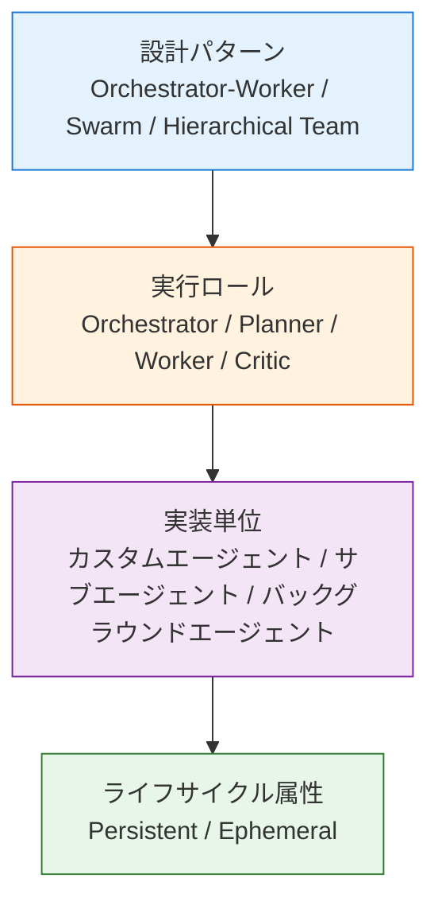
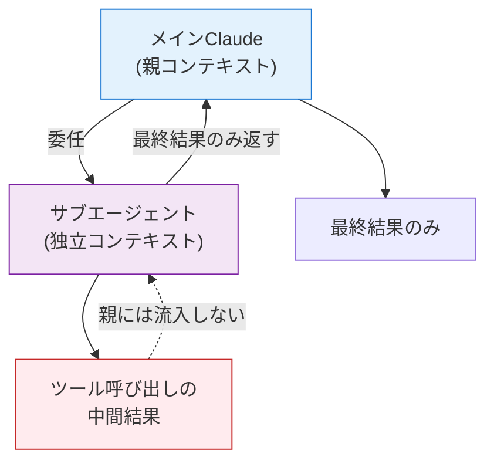

# エージェント概念の分類

> マルチエージェントシステムの用語を、抽象レベルで整理する

## このドキュメントについて

LLMベースのマルチエージェントシステムには、**カスタムエージェント**、**サブエージェント**、**メタエージェント**、**オーケストレーター**、**Swarm** など、フレームワークごとに微妙に意味の異なる用語が氾濫している。本ドキュメントでは、これらを**抽象レベル**で4層に分けて整理し、用語間の重なりと独立性を明示する。

具体的な Claude Code 実装は [what-is-subagent.md](./what-is-subagent.md)、エージェント間通信プロトコルは [what-is-a2a.md](./what-is-a2a.md) を参照。

## なぜ用語整理が必要か

### よくある誤解

エージェント用語は、フレームワークの宣伝文や記事ごとに**同じ語が違う意味**で使われることが多い。

- 「メタエージェント」が、ある記事では設計パターン、別の記事では特定の製品機能を指す
- 「カスタムエージェント」と「サブエージェント」が並列に語られるが、実際には包含関係にある
- 「Swarm」がフレームワーク名なのか、設計パターンなのか混在する

これらの混乱は、**異なる抽象レベルの用語を平坦に並べて比較してしまう**ことに起因する。

### 抽象レベルの違いを明示する

下表のように、4つのレイヤーに分けて整理すると見通しが良くなる。

| 抽象レベル             | 用語の例                                                             | 性質                       |
| ---------------------- | -------------------------------------------------------------------- | -------------------------- |
| **設計パターン**       | Orchestrator-Worker、Swarm、Hierarchical Team、メタエージェント      | アーキテクチャ・パターン名 |
| **実行ロール**         | Orchestrator / Supervisor、Planner、Worker、Critic                   | パターン内の位置・責務     |
| **実装単位**           | カスタムエージェント、サブエージェント、バックグラウンドエージェント | 具体的な実装形態           |
| **ライフサイクル属性** | Persistent / Ephemeral、Spawned / Forked                             | 実装単位を修飾する形容詞   |

つまり、**「カスタムエージェント」と「サブエージェント」は並列ではない**。サブエージェントは多くの場合、ユーザーが Markdown 等で定義したカスタムエージェントとして実装される。「メタエージェント」も特定の製品機能ではなく、Orchestrator が動的にサブエージェントを生成するパターン全般を指す概念用語である。

### 概念マップ

## 各レイヤーの定義

### 1. 設計パターン

エージェントの組み合わせ方を示すアーキテクチャ・パターン。

| パターン                | 定義                                                                             | 代表例                                                   |
| ----------------------- | -------------------------------------------------------------------------------- | -------------------------------------------------------- |
| **Orchestrator-Worker** | 統括役（Orchestrator）が複数のサブエージェント（Worker）にタスクを委任する階層型 | Anthropic Multi-Agent Research System、Claude Code       |
| **Hierarchical Team**   | 階層を明示した複数エージェントのチーム。役割（Role）が固定                       | CrewAI、AutoGen                                          |
| **Swarm**               | 階層を最小化し、エージェント同士がハンドオフで協調する自律分散型                 | OpenAI Swarm（実験的・後継は Agents SDK）                |
| **メタエージェント**    | エージェントを動的に生成・管理するエージェント、という設計コンセプト             | 製品機能名ではなく、Orchestrator が spawn する形態の総称 |

「メタエージェント」を製品機能名のように扱う記事も見かけるが、現時点で「Meta Agent」という名称の確立した製品機能は存在しない。**概念用語として使うのが安全**である。

### 2. 実行ロール

設計パターンの内側で、各エージェントが担う責務。

| ロール                                     | 責務                                     |
| ------------------------------------------ | ---------------------------------------- |
| **Orchestrator / Supervisor / Lead Agent** | タスク分解、委任判断、結果集約、動的調整 |
| **Planner**                                | 計画立案、ステップ分解                   |
| **Worker / Specialist**                    | 個別の専門タスクを実行                   |
| **Critic / Reviewer / Evaluator**          | 出力の検証、採点、再実行判断             |

Anthropic の Multi-Agent Research System では、Orchestrator にあたるエージェントを **"lead agent"** と呼んでいる。同じ責務を持つロールでも、フレームワークによって呼称が異なる点に注意。

### 3. 実装単位

実際にコード／設定ファイルとして存在するエージェントの実装形態。

| 実装単位                         | 定義                                                                                                                                         | 代表的な仕組み                                                      |
| -------------------------------- | -------------------------------------------------------------------------------------------------------------------------------------------- | ------------------------------------------------------------------- |
| **カスタムエージェント**         | ユーザーが宣言的に定義したエージェント（プロンプト、使用可能ツール、権限、モデル）。サブエージェントを含む上位概念                           | Claude Code の `.claude/agents/*.md`、GitHub Copilot の `.agent.md` |
| **サブエージェント**             | 親エージェントから委任され、**独立した[コンテキストウィンドウ](../glossary#context-window)**で実行される子エージェント。中間ツール呼び出しは親に流入せず、最終結果のみ返す | Claude Code Subagents、Claude Agent SDK Subagents                   |
| **バックグラウンドエージェント** | 非同期・長時間実行されるエージェント。[セッション](../glossary#session)を跨いで状態を保持できる                                                                     | GitHub Copilot Cloud Agents                                         |

Claude Code における具体的な定義方法は [what-is-subagent.md](./what-is-subagent.md) を参照。

### 4. ライフサイクル属性

実装単位を「どのように生成・破棄するか」で修飾する性質。

| 属性                 | 意味                                                                               |
| -------------------- | ---------------------------------------------------------------------------------- |
| **Persistent**       | セッションを跨いで状態を保持。バックグラウンドエージェントが典型                   |
| **Ephemeral**        | タスク完了時に破棄。サブエージェントの一般的な振る舞い。コンテキスト汚染防止に寄与 |
| **Spawned / Forked** | 親から動的に生成される。Ephemeral と組み合わさることが多い                         |

## なぜ独立コンテキストが重要か

サブエージェントの最大の利点は、**親セッションのコンテキストウィンドウを保護する**ことにある。

独立[コンテキスト](../glossary#context)により、以下が実現される。

- **[トークン](../glossary#token)効率**: 探索的なツール呼び出しの中間結果が親のコンテキストを圧迫しない
- **エラー隔離**: サブエージェントの失敗が親に伝播しにくい
- **並列性**: 複数サブエージェントを同時実行可能（Anthropic の Multi-Agent Research System では lead が 3〜5 個のサブエージェントを並列起動）

## フレームワーク横断対応表

### 実装と独立コンテキスト

| フレームワーク               | 実装単位の定義場所              | 独立コンテキストでのサブ実行 |
| ---------------------------- | ------------------------------- | ---------------------------- |
| **Claude Code**              | `.claude/agents/*.md`           | ✅ Subagents                 |
| **GitHub Copilot / VS Code** | `.github/agents/*.agent.md`     | ✅ Custom Agents             |
| **OpenAI Agents SDK**        | Python コード（`Agent` クラス） | ✅ Handoff                   |
| **CrewAI**                   | Python コード（`Agent`）        | ✅ Task delegation           |
| **LangGraph**                | グラフノード                    | ✅ Sub-graphs                |

### 設計パターンと拡張機能

| フレームワーク               | 階層パターン             | エージェント間通信 | バックグラウンド実行 |
| ---------------------------- | ------------------------ | ------------------ | -------------------- |
| **Claude Code**              | Orchestrator + Subagents | A2A 対応検討中     | △（タスク扱い）      |
| **GitHub Copilot / VS Code** | Coordinator + Worker     | —                  | ✅ Cloud Agents      |
| **OpenAI Agents SDK**        | Triage + Specialist      | —                  | △                    |
| **CrewAI**                   | Crew (Manager + Workers) | —                  | —                    |
| **LangGraph**                | State Machine            | —                  | △                    |

`.agent.md` と `AGENTS.md` は別物である点に注意：

- **`.agent.md`**: GitHub Copilot / VS Code の**個別カスタムエージェント定義**ファイル（旧 Custom Chat Modes）
- **`AGENTS.md`**: リポジトリルートに置く**コーディングエージェント向け README**。2025年12月に OpenAI と Anthropic が Linux Foundation（Agentic AI Foundation）へ寄贈し、業界標準化された

## 使い分けの指針

| シーン                                                 | 推奨パターン        | 実装単位                                   |
| ------------------------------------------------------ | ------------------- | ------------------------------------------ |
| 単純な単一タスク                                       | 単一エージェント    | カスタムエージェント                       |
| コンテキスト保護が必要（探索的調査、コードベース横断） | Orchestrator-Worker | サブエージェント（Ephemeral）              |
| 複雑な統括・タスク分解                                 | Hierarchical Team   | Orchestrator + 複数 Worker                 |
| 長時間非同期処理                                       | Background Job      | バックグラウンドエージェント（Persistent） |
| 創発的・柔軟な協調                                     | Swarm               | ハンドオフベース                           |

### トレードオフ

階層化・並列化により頑健性と精度が向上する一方で、**トークンコストとレイテンシは増大**する。Anthropic の Multi-Agent Research System の報告では、Claude Opus 4 を lead、Claude Sonnet 4 を subagents とする構成が、単一 Opus 4 を社内 research eval で **90.2% 上回った**。一方で **token 消費が性能差の 80% を説明する**とも報告されており、コストとのトレードオフが大きい。

「常に多エージェント構成が良い」わけではなく、**タスク特性とコスト制約に応じた選択**が必要である。

## 関連プロトコル

エージェント周辺には複数のプロトコルが存在し、混同しやすいため整理する。

| プロトコル                         | 提唱元                                         | 目的                                                                                                                                |
| ---------------------------------- | ---------------------------------------------- | ----------------------------------------------------------------------------------------------------------------------------------- |
| **MCP（Model Context Protocol）**  | Anthropic                                      | LLM が外部ツール／データソースに接続するための標準。**エージェント内部のツール接続**。詳細: [what-is-mcp.md](../mcp/what-is-mcp.md) |
| **A2A（Agent-to-Agent Protocol）** | Google → Linux Foundation                      | **エージェント間**の対等な通信。詳細: [what-is-a2a.md](./what-is-a2a.md)                                                            |
| **AGENTS.md**                      | OpenAI / Anthropic 他（Linux Foundation 寄贈） | リポジトリルートに置く、コーディングエージェント向け README                                                                         |

**MCP と A2A は補完関係**である。MCP がエージェントとツールを結ぶ「縦」の接続なら、A2A はエージェント同士を結ぶ「横」の接続にあたる。

## 出典

### 一次情報

- [Anthropic — How we built our multi-agent research system](https://www.anthropic.com/engineering/multi-agent-research-system)（90.2% の数値、Orchestrator-Worker パターン）
- [Claude Code Docs — Create custom subagents](https://code.claude.com/docs/en/sub-agents)
- [Claude Agent SDK — Subagents in the SDK](https://platform.claude.com/docs/en/agent-sdk/subagents)
- [VS Code Docs — Custom agents in VS Code](https://code.visualstudio.com/docs/copilot/customization/custom-agents)
- [GitHub Docs — About custom agents (Copilot cloud agent)](https://docs.github.com/en/copilot/concepts/agents/cloud-agent/about-custom-agents)
- [AGENTS.md 公式サイト](https://agents.md/)
- [OpenAI — Agentic AI Foundation 発足のお知らせ](https://openai.com/index/agentic-ai-foundation/)
- [OpenAI Swarm リポジトリ（実験的・Agents SDK へリダイレクト）](https://github.com/openai/swarm)

### 二次情報（解説記事・補足）

- [Simon Willison — Anthropic: How we built our multi-agent research system](https://simonwillison.net/2025/Jun/14/multi-agent-research-system/)

## 次に読むべきドキュメント

| 目的                                       | ドキュメント                                         |
| ------------------------------------------ | ---------------------------------------------------- |
| Claude Code の具体的なサブエージェント実装 | [what-is-subagent.md](./what-is-subagent.md)         |
| Skill とサブエージェントの選択判断          | [サブエージェント vs Skills](./subagent-vs-skill)    |
| 品質ゲート (Validator型) の実践            | [サブエージェントを品質ゲートとして使う](./subagent-quality-gate) |
| Agent/Sub-agent/Skill/MCP の 4者比較       | [FAQ: 4者の違い](../faq/agent-vs-subagent-vs-skill) |
| エージェント間通信プロトコル               | [what-is-a2a.md](./what-is-a2a.md)                   |
| MCP の詳細                                 | [what-is-mcp.md](../mcp/what-is-mcp.md)              |
| 三層アーキテクチャ（Agent / Skills / MCP） | [03-architecture.md](../concepts/03-architecture.md) |
| 実装パターン集                             | [patterns.md](../workflows/patterns.md)              |
