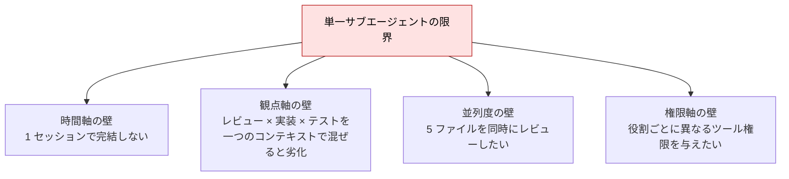
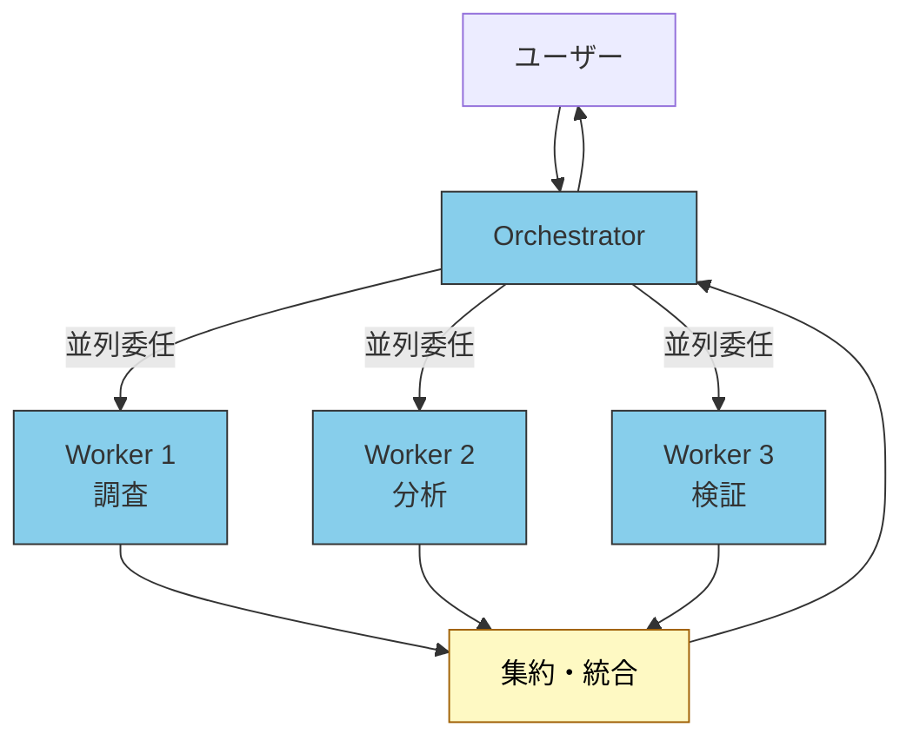
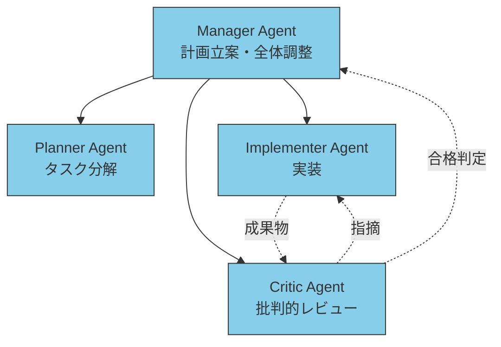
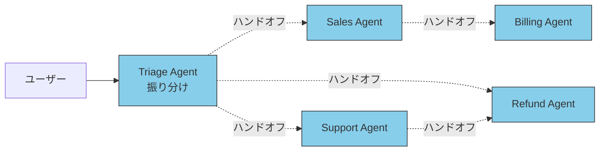
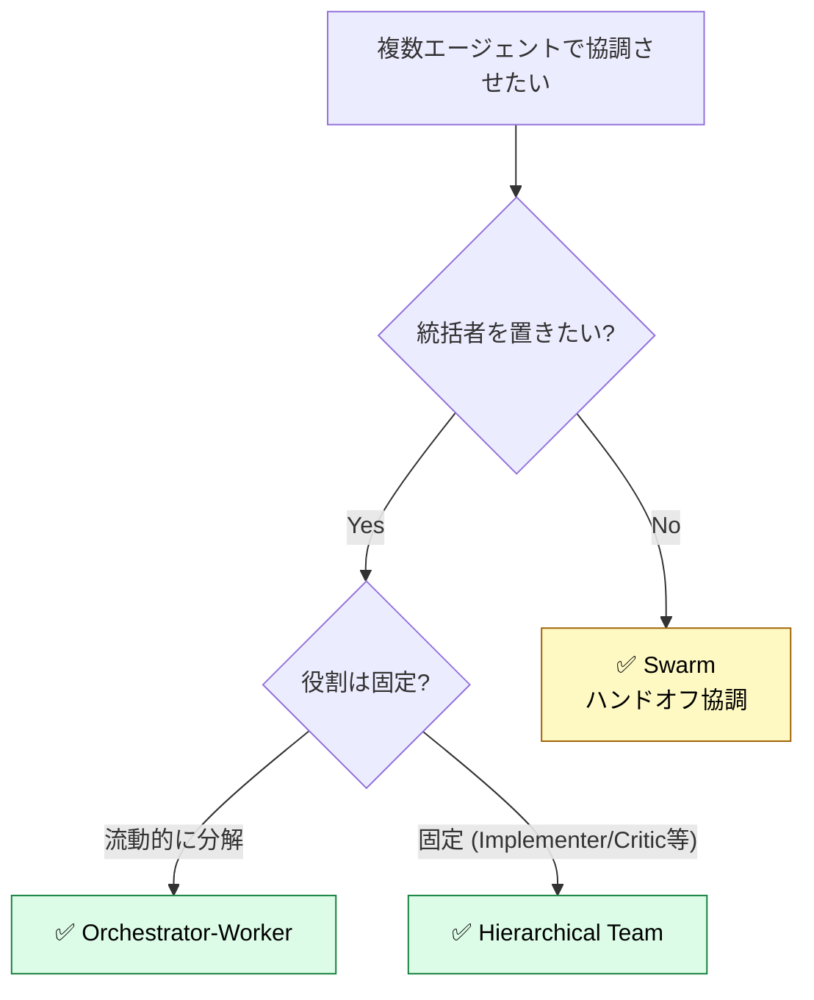
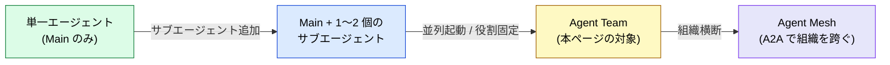
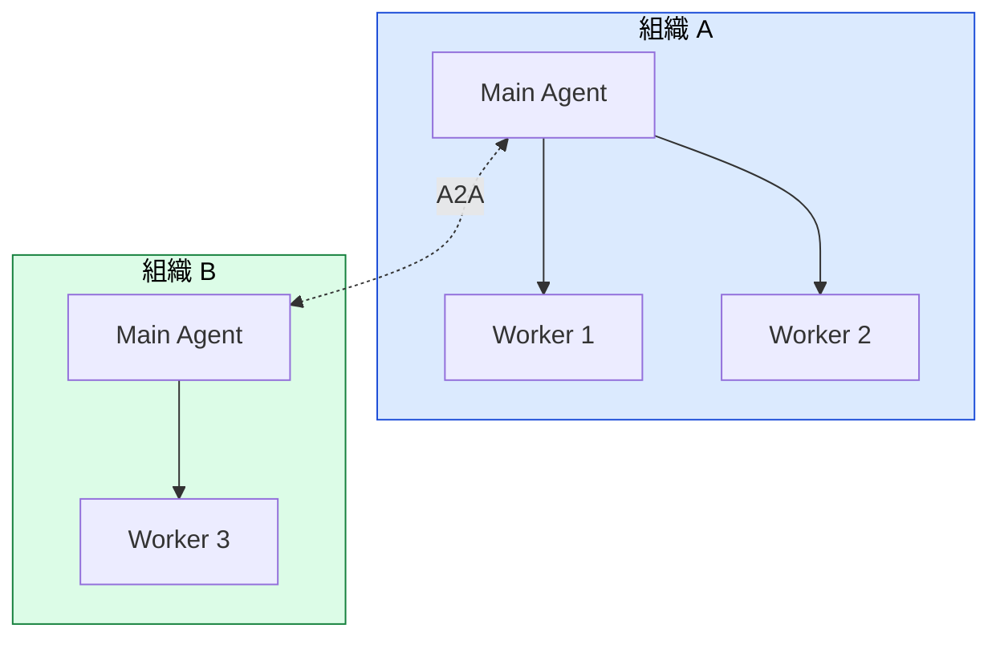

# マルチエージェント / Agent Teams — 単一エージェントを超えるスケール

> サブエージェントを 1〜2 個並べても解けない問題に直面したとき、エージェントを「**チーム**」として組織化する。Orchestrator-Worker、Hierarchical Team、Swarm — 3 つの基本パターンと、その実装視点での選び方。

## このドキュメントについて

サブエージェントの基本は [カスタムサブエージェント](./what-is-subagent) で扱った。本ページでは **複数のエージェントを協調させる設計** に焦点を当てる。Anthropic Multi-Agent Research System や OpenAI Agents SDK の実装パターンを踏まえ、現実に「いつ Agent Team が必要になるか」を判断するためのガイド。

> [!TIP] 3 行で答える
> - **単一サブエージェントで処理時間が爆発したり、観点が混じり合うとき** に Agent Team を検討する
> - 3 つの基本パターン: **Orchestrator-Worker** (統括者あり) / **Hierarchical Team** (役割固定) / **Swarm** (ハンドオフ協調)
> - **コストは並列度・トークン消費の両面で線形以上に増える**。導入は「単純化を試した後」が原則

関連: [エージェント概念の分類](./agent-taxonomy) / [カスタムサブエージェント](./what-is-subagent) / [サブエージェント vs Skills](./subagent-vs-skill) / [A2Aとは](./what-is-a2a)

## なぜ「単一サブエージェント」では足りなくなるか

サブエージェントは独立コンテキストで動くが、それでも以下の壁にぶつかる。



これらに対する構造的な答えが **複数エージェントの組織化** = Agent Teams。

> [!IMPORTANT]
> Agent Teams は「**サブエージェントの上位互換**」ではない。**サブエージェントで足りるならサブエージェントで止める**。導入判断のシグナルは後述する。

## 3 つの基本パターン

エージェント概念の分類 ([agent-taxonomy](./agent-taxonomy)) で挙げた設計パターンを、**実装視点** で整理する。

### パターン 1: Orchestrator-Worker

統括役 (Orchestrator / Lead) が複数の Worker サブエージェントにタスクを委任し、結果を集約する階層型。**最も標準的** で、Anthropic Multi-Agent Research System もこの構成。



| 特徴 | 内容 |
| --- | --- |
| 統括の所在 | 中央集権 (Orchestrator が全タスク分解と集約を担う) |
| Worker 間通信 | 原則なし (Orchestrator 経由) |
| 並列性 | 高 (Orchestrator が同時に複数 Worker を起動) |
| 適するタスク | 探索的調査、コードベース横断分析、複数ソースからの情報統合 |
| Claude Code での実装 | Main agent が `Agent(subagent_type=...)` を複数回呼ぶ |

> [!NOTE]
> Anthropic の報告では、Claude Opus 4 を lead、Claude Sonnet 4 を subagents とする構成が単一 Opus 4 を社内 research eval で **90.2% 上回った** 一方、**token 消費が性能差の 80% を説明する**。性能改善は大きいがコストも比例して大きい。

### パターン 2: Hierarchical Team

固定された役割 (Role) を持つエージェントが階層的に組織化される。CrewAI や AutoGen が代表例。Orchestrator-Worker よりも **役割の固定度が高い** のが違い。



| 特徴 | 内容 |
| --- | --- |
| 統括の所在 | Manager が階層トップだが、メンバー間にも一定のやり取り |
| エージェント間通信 | あり (Implementer ↔ Critic の往復) |
| 並列性 | 中 (役割固定なので並列度は限定的) |
| 適するタスク | 反復的な改善ループ、要件→設計→実装→レビューの一連 |
| Claude Code での実装 | カスタムサブエージェントを役割ごとに用意し、Main が指揮 |

### パターン 3: Swarm

階層を最小化し、エージェント同士が **ハンドオフ** で次の担当者にタスクを渡す自律分散型。OpenAI Swarm (実験的、現在は Agents SDK) が代表例。



| 特徴 | 内容 |
| --- | --- |
| 統括の所在 | なし (ハンドオフで動的に主導権が移る) |
| エージェント間通信 | ハンドオフ (ペイロード + コンテキストを次のエージェントに渡す) |
| 並列性 | 低〜中 (基本は直列的なフロー) |
| 適するタスク | カスタマーサポート、ワークフロー型業務 (申請 → 承認 → 通知) |
| Claude Code での実装 | 現状の Claude Code サブエージェントには直接マッピングしにくい (A2A 対応待ち) |

> [!CAUTION]
> Swarm はパターン名であり、フレームワーク名 (OpenAI Swarm) とは区別する。Claude Code 環境では、Swarm 的な動作を実現するには A2A の本格対応か、独自のメッセージング基盤が必要になる。

## 3 パターンの選び方



| 判断基準 | 推奨パターン |
| --- | --- |
| 探索的・タスク分解が動的 | Orchestrator-Worker |
| 反復的な改善ループ (実装 → レビュー) | Hierarchical Team |
| ワークフロー型 (申請 → 承認 → 通知) | Swarm (将来) / 当面は Orchestrator で代用 |
| とにかく速くしたい (並列重視) | Orchestrator-Worker (並列起動) |
| コスト重視 | まず単一サブエージェントを試す |

## 導入判断 — いつ Agent Team にするか

> [!IMPORTANT]
> Agent Team は **コストが線形以上に増える**。Anthropic の報告で「**性能差の 80% を token 消費が説明する**」とされる通り、安易な多エージェント化は ROI が悪い。

### 導入シグナル ✅

- 単一サブエージェントで **1 セッションが 10 分以上** かかる
- 5 ファイル以上を **同時並列でレビュー / 分析** したい
- 「**実装者と批判者を分けたい**」品質要件がある
- 役割ごとに **異なるツール権限** を与えたい (例: Implementer に Write、Reviewer に Read のみ)
- 単一エージェントだと **観点が混じり合い** 精度が劣化している

### 導入を見送るシグナル ❌

- タスクが 1 つで、並列化する旨味がない
- コスト制約が厳しい (token 予算が限られる)
- まだ単一エージェントを十分に磨いていない
- デバッグ・観測性の準備ができていない (Agent Team は失敗の原因特定が難しい)

## サブエージェントとの境界 — どこから "Team" か

「サブエージェント 1 個 = Agent Team か?」という素朴な疑問への答え:



| 段階 | 構成 | 主たる関心事 |
| --- | --- | --- |
| **単一エージェント** | Main のみ | プロンプト設計 |
| **+ サブエージェント** | Main + 1〜2 個の Specialist | コンテキスト保護、独立性 |
| **Agent Team** | Orchestrator + 並列 Worker / 役割固定 | 並列度、役割境界、コスト管理 |
| **Agent Mesh** | 組織を跨ぐエージェント連携 | A2A プロトコル、AgentID、信頼境界 |

本ページは **Agent Team** の段階を扱う。組織横断 (Agent Mesh) は [A2Aとは](./what-is-a2a) と [エージェント ID](./agent-identity) を参照。

## Claude Code での実装パターン

Claude Code 環境で Agent Team を実装するときの具体パターン。

### 並列 Worker 起動 (Orchestrator-Worker)

```markdown
<!-- CLAUDE.md または プロジェクト指示 -->

## 複数ファイルレビュー時の指示

3 ファイル以上のレビュー依頼があった場合、以下の手順で並列実行する。

1. ファイルリストを Worker サブエージェントに分配する
2. `Agent(subagent_type="code-reviewer", description=..., prompt=...)` を **同一メッセージで複数並列起動**
3. 全 Worker の結果を統合して、観点ごとに集約したレビューコメントを返す
```

> [!TIP]
> 並列起動は **同一メッセージ内で複数の `Agent(...)` ツール呼び出し** を実行することで実現される。逐次起動すると Orchestrator-Worker の利点が失われる。

### Implementer + Critic ループ (Hierarchical Team)

```markdown
<!-- CLAUDE.md -->

## コード生成 → レビュー → 修正のループ

1. Main が `Agent(subagent_type="implementer", ...)` で実装
2. Main が `Agent(subagent_type="critic", ...)` で批判的レビュー
3. Critic が「不合格」を返した場合、指摘事項を Implementer に渡して再実装
4. 最大 3 ループまで。それを超えたら Main がエスカレーション
```

実装パターンの応用例は [サブエージェントを品質ゲートとして使う](./subagent-quality-gate) も参照。

### サブエージェントの制約 — Team 化で詰むパターン

> [!WARNING]
> Claude Code の現行仕様では、**サブエージェントが他のサブエージェントを起動できない**。これは Agent Team の組み方に影響する:
> - **OK**: Main → 複数 Worker (1 階層)
> - **NG**: Main → Worker → Sub-Worker (2 階層)
> - **回避策**: Main が全 Worker を直接起動し、結果を統合する (Orchestrator が全責任を持つ)

長期実行・週跨ぎのタスクで階層が必要な場合は、サブエージェントではなく **Agent Teams (別プロセス / Agent SDK / A2A)** に移行する。詳細は姉妹サイトの [understanding-llm / Part 10: マルチセッション協調](https://shuji-bonji.github.io/understanding-llm-through-claude-code/ja/10-multi-session/) を参照。

## アンチパターン

### ❌ 「とりあえず Multi-Agent」

- 単一エージェントで十分なタスクを Team 化してコスト爆発
- 対策: 「単一で 3 回試して頭打ち」が確認できてから Team 化を検討

### ❌ 役割の重複

- "Reviewer A" と "Reviewer B" が同じ観点でレビューする
- 結果: コスト 2 倍で精度は変わらない
- 対策: 役割ごとに **観点を直交させる** (Security / Performance / Style 等)

### ❌ Critic が常に "合格"

- Implementer + Critic ループで Critic が機能していない
- 対策: Critic 専用の合格基準を [品質ゲートとしての活用](./subagent-quality-gate) の規範ラダーで明示

### ❌ 観測性なしで本番投入

- どの Worker が失敗したか追跡できない
- 対策: 各サブエージェント呼び出しに correlation ID を付与し、ログを集約する

## A2A 時代との接続

組織を跨ぐエージェント協調が本格化すると、Agent Team は **Agent Mesh** へと拡張される。



組織内では Orchestrator-Worker (本ページ)、組織間では A2A プロトコル ([what-is-a2a](./what-is-a2a))、識別と委任は [エージェント ID](./agent-identity) という三段ロケットになる。

## 関連ドキュメント

- [エージェント概念の分類](./agent-taxonomy) — Orchestrator-Worker / Hierarchical Team / Swarm の用語整理
- [カスタムサブエージェント](./what-is-subagent) — Team を構成する個別エージェントの定義方法
- [サブエージェント vs Skills](./subagent-vs-skill) — そもそも Skills で足りないか確認する
- [品質ゲートとしての活用](./subagent-quality-gate) — Critic 役割の実装例
- [A2Aとは](./what-is-a2a) — 組織横断 Agent Mesh への入口
- [エージェント ID](./agent-identity) — Team を構成するエージェントの識別と委任

## 🔗 さらに深く: なぜ単一エージェントでは届かないか

本ページは **Agent Team の実装視点 (What/How)** を扱った。「**なぜ** 単一エージェントが Context Rot で頭打ちになり、複数セッション協調が必要になるのか」を LLM の構造から理解したい場合は、姉妹サイトを参照。

- [understanding-llm / Part 10: マルチセッション協調](https://shuji-bonji.github.io/understanding-llm-through-claude-code/ja/10-multi-session/) — 単一エージェントを超えるスケールの根本原理
- [understanding-llm / Subagent vs Team](https://shuji-bonji.github.io/understanding-llm-through-claude-code/ja/10-multi-session/subagent-vs-team) — サブエージェントと Team の境界
- [understanding-llm / Session Boundary Design](https://shuji-bonji.github.io/understanding-llm-through-claude-code/ja/10-multi-session/session-boundary-design) — セッション境界の設計原則

## 出典

- [Anthropic — How we built our multi-agent research system](https://www.anthropic.com/engineering/multi-agent-research-system) — Orchestrator-Worker パターン、性能 90.2%、token コスト
- [Claude Agent SDK — Subagents in the SDK](https://platform.claude.com/docs/en/agent-sdk/subagents)
- [OpenAI Agents SDK](https://github.com/openai/openai-agents-python) — Swarm の後継
- [CrewAI Documentation](https://docs.crewai.com/) — Hierarchical Team の代表実装

---

> **前へ**: [サブエージェントを品質ゲートとして使う](./subagent-quality-gate)

> **次へ**: [A2Aとは (Agent-to-Agent Protocol)](./what-is-a2a)
