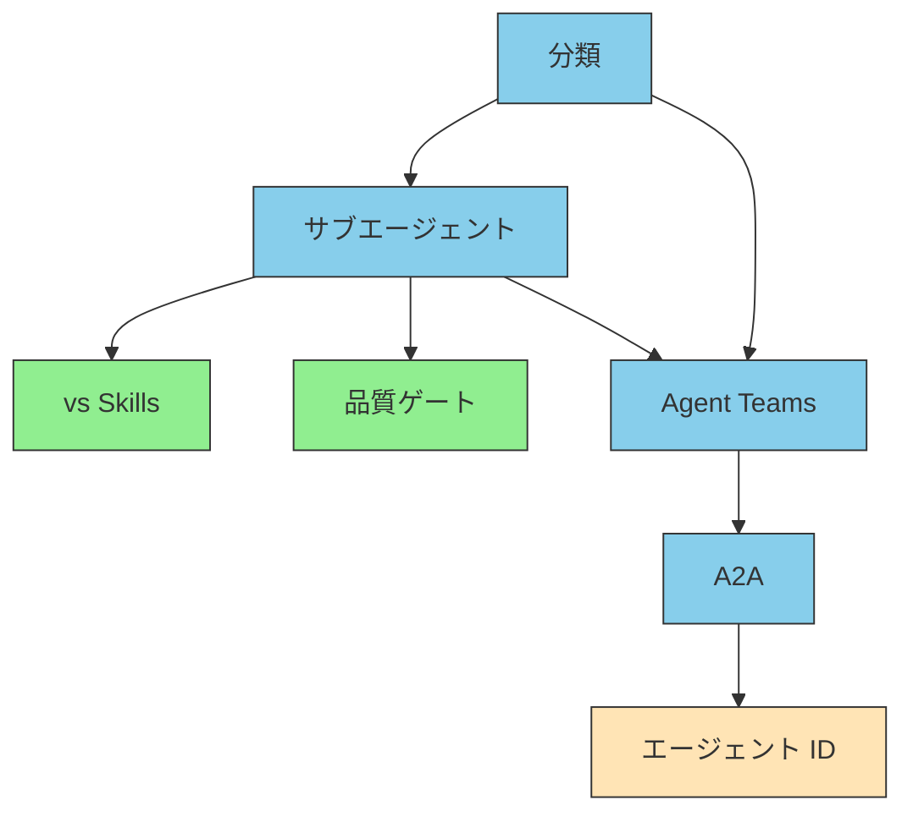

# III.5 Agent

> [!NOTE] 本章の位置づけ
> Agent は、依頼を受け、Doctrine の線の内側で、Skills・Memory・MCP を組み合わせる層である。分類、サブエージェント、A2A、識別の各論は、このセクションに残してある。製品の操作手順は、各ホストの文書を見る。

## 5.1 何を担当するか

ユーザーの一文は、作業の全部ではない。何を守るか、どの手順か、前回はどうだったか、いまの原文は何か、を組み合わせて初めて進む。その組み合わせが Agent の担当である。

サブエージェントは、その中で役割を分けた単位である。翻訳する人と、品質を見る人を分ける、が典型である。MCP の代わりではない。仕事の分け方である。切り分けは [サブエージェント vs Skills](./subagent-vs-skill) を見る。

できたかどうかは、自分で「できた」と言わせない。別の役割か、機械のテストで見る。品質ゲートの型は [品質ゲートとしての活用](./subagent-quality-gate) にある。

## 5.2 中の役割と、外の相手

同じプロセスの中で役割を分けるのが、カスタムサブエージェントである。ネットワークの向こうの相手と話すのが A2A（Agent-to-Agent Protocol）である。社内の専門部署と、社外の取引先、と捉えると分かりやすい。両方要ることがある。片方で足りる、ではない。

用語の整理は [エージェント概念の分類](./agent-taxonomy) から入る。複数で組む話は [マルチエージェント / Agent Teams](./agent-teams) を見る。A2A そのものは [A2Aとは](./what-is-a2a) を見る。

## 5.3 誰の代理か

本番で動かすと、「誰が」「誰の代理として」が問われる。人ではない主体の識別である。標準はまだ動いている。いま確定していることと、まだ決まっていないことを分けて書く。詳細は [エージェント ID](./agent-identity) である。

権限の細目と、市場のような登録の仕組みは、これから足す。入口は識別のページから入る。

## 5.4 読み方

| 目的 | 順 |
| --- | --- |
| 初めて | [分類](./agent-taxonomy) → [サブエージェント](./what-is-subagent) → [vs Skills](./subagent-vs-skill) |
| 品質を上げる | [サブエージェント](./what-is-subagent) → [品質ゲート](./subagent-quality-gate) |
| 人数を増やす | [Agent Teams](./agent-teams) → [A2A](./what-is-a2a) → [エージェント ID](./agent-identity) |
| 本番の識別 | [分類](./agent-taxonomy) → [エージェント ID](./agent-identity) → [A2A](./what-is-a2a) |

## 5.5 要約

Agent は、作業を理解し、他の層を組み合わせる。サブエージェントは役割の分け方であり、MCP の別名ではない。外のエージェントとは A2A で話す。本番では、誰の代理かを別に設計する。

## 関連ドキュメント

- [II.1 五層](../part-2/layers)
- [III.3 Doctrine](../part-3/doctrine) / [III.4 Memory](../part-3/memory)
- [FAQ: 4 者比較](../faq/agent-vs-subagent-vs-skill)
- [understanding-llm / Part 5: オンデマンドコンテキスト](https://shuji-bonji.github.io/understanding-llm-through-claude-code/ja/05-on-demand-context/)

---

> **前へ**: [III.4 Memory](../part-3/memory)
>
> **次へ**: [生成AIの設計パターン](../concepts/04-ai-design-patterns)
