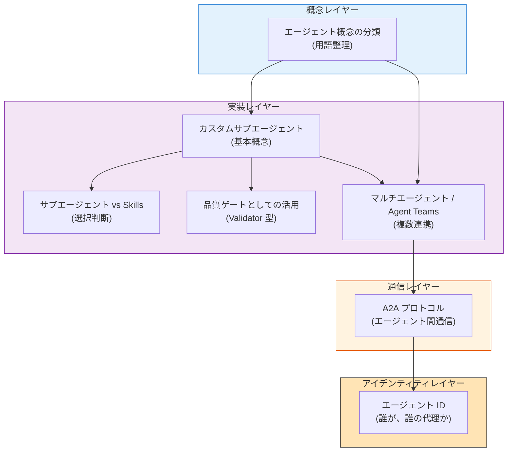
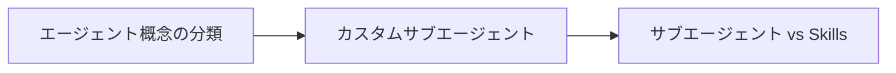
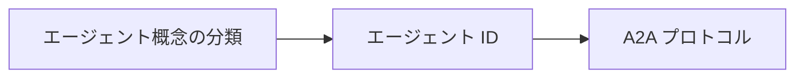
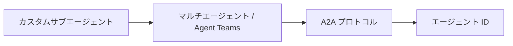
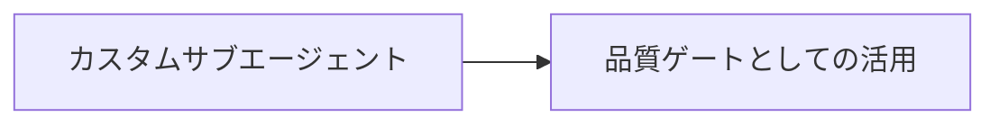

# エージェント — 分類・通信・アイデンティティ

> 「**誰が、何を、誰の代理として、どう連携するか**」を扱うセクション。三層モデル ([03-architecture](../concepts/03-architecture)) の Agent 層を深掘りする。

## このセクションの位置づけ

エージェントセクションは、Agent ID 時代に向けて段階的に成長させているセクションです。**用語の整理 → 実装単位 → 通信プロトコル → アイデンティティ** の順に体系化しています。

## 各ページの概要

### 概念レイヤー — まず用語を整理する

| ページ | 中心テーマ | 推奨対象 |
| --- | --- | --- |
| [エージェント概念の分類](./agent-taxonomy) | カスタム/サブ/メタエージェント、Orchestrator-Worker、Swarm 等の用語を 4 つの抽象レベルで整理 | フレームワーク横断で用語を理解したい人 |

### 実装レイヤー — 何をどう作るか

| ページ | 中心テーマ | 推奨対象 |
| --- | --- | --- |
| [カスタムサブエージェント](./what-is-subagent) | Claude Code でのサブエージェント定義・配置・利用 | 実装に踏み出す前の基礎理解 |
| [サブエージェント vs Skills](./subagent-vs-skill) | Skill と Sub-agent のどちらで実装すべきか、組み合わせパターン | 設計判断に迷ったとき |
| [品質ゲートとしての活用](./subagent-quality-gate) | Validator 型サブエージェントの実装、CI/CD 統合、合格基準設計 | 自己レビューの甘さに困っている人 |
| [マルチエージェント / Agent Teams](./agent-teams) | サブエージェント単体を超えるスケール — Orchestrator-Worker、Hierarchical、Swarm パターン | 単一エージェントで頭打ちになった人 |

### 通信レイヤー — エージェント間で対話する

| ページ | 中心テーマ | 推奨対象 |
| --- | --- | --- |
| [A2Aとは (Agent-to-Agent Protocol)](./what-is-a2a) | A2A v1.0 の概要、Linux Foundation 配下での標準化、MCP との補完関係 | 組織を跨ぐエージェント連携を検討する人 |

### アイデンティティレイヤー — 誰の代理として動くか

| ページ | 中心テーマ | 推奨対象 |
| --- | --- | --- |
| [エージェント ID](./agent-identity) | Non-Human Identity の新カテゴリ、OpenID Foundation の 4 アーキテクチャ思想、商用実装の現状 | エージェントを本番運用する組織の担当者 |

## Agent ID 時代に向けた執筆ロードマップ

このサイトは **2025〜2026 年にかけての Agent ID 標準化** に追従して成長させています。現在の状況と今後の予定を率直に示します。

| トピック | 状況 |
| --- | --- |
| エージェント概念の分類 | ✅ 公開済み |
| カスタムサブエージェント (Claude Code) | ✅ 公開済み |
| サブエージェント vs Skills | ✅ 公開済み |
| 品質ゲートとしての活用 | ✅ 公開済み |
| マルチエージェント / Agent Teams | ✅ 公開済み |
| A2A プロトコル | ✅ 公開済み |
| エージェント ID (識別と委任) | ✅ 公開済み |
| **権限管理 (RBAC / ABAC / JIT)** | 🚧 執筆予定 — agent-identity から誘導 |
| **エージェントガバナンス** | 🚧 執筆予定 |
| **A2A 実装パターン** (Web Bot Auth、Macaroons 等) | 🚧 執筆予定 |
| **Agent Marketplace / Registry** | 🚧 検討中 |

> [!IMPORTANT]
> Agent ID 領域は **2025 年 10 月 OpenID Foundation ホワイトペーパー v1.1、2026 年 4 月 Microsoft Entra Agent ID GA、Okta for AI Agents GA、Linux Foundation 配下 A2A v1.0** と、急速に本番運用フェーズへ移行しています。仕様は流動的なので、本サイトは「**今この時点で確定している部分**」と「**未解決のままの部分**」を区別して記述します。

## 推奨読み順

目的別に推奨ルートを示します。

### ルート 1: 初めて触れる場合 (基礎理解)

### ルート 2: 本番運用を検討する場合 (アイデンティティ重視)

### ルート 3: スケール時 (複数エージェント協調)

### ルート 4: 品質を上げたい場合 (実装テクニック)

## 関連セクション

| セクション | 関連 |
| --- | --- |
| [Concepts / 03-architecture](../concepts/03-architecture) | Agent 層を含む三層モデルの全体像 |
| [Concepts / 07-doctrine-and-intent](../concepts/07-doctrine-and-intent) | エージェントに与える「制約と目的」の設計 |
| [Concepts / 08-memory-and-knowledge](../concepts/08-memory-and-knowledge) | エージェントが参照する記憶層 |
| [Skills](../skills/what-is-skills) | エージェントが参照する静的知識 |
| [MCP](../mcp/what-is-mcp) | エージェントが外部世界と接続する手段 |
| [FAQ / Agent vs Sub-agent vs Skill vs MCP](../faq/agent-vs-subagent-vs-skill) | 4 者の 3 行回答 |

## 🔗 さらに深く: コンテキスト管理の観点から

エージェントの本質的な制約 — なぜ独立コンテキストが必要なのか、なぜ Multi-Session 協調が要るのか — を LLM の構造から理解したい場合は姉妹サイトを参照。

- [understanding-llm / Part 5: オンデマンドコンテキスト (Skills & Agents)](https://shuji-bonji.github.io/understanding-llm-through-claude-code/ja/05-on-demand-context/) — Agents が要求された時だけ展開される設計
- [understanding-llm / Part 10: マルチセッション協調 (Agent Teams)](https://shuji-bonji.github.io/understanding-llm-through-claude-code/ja/10-multi-session/) — 単一エージェントを超えるスケール対策
