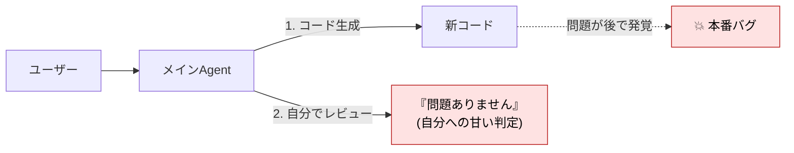
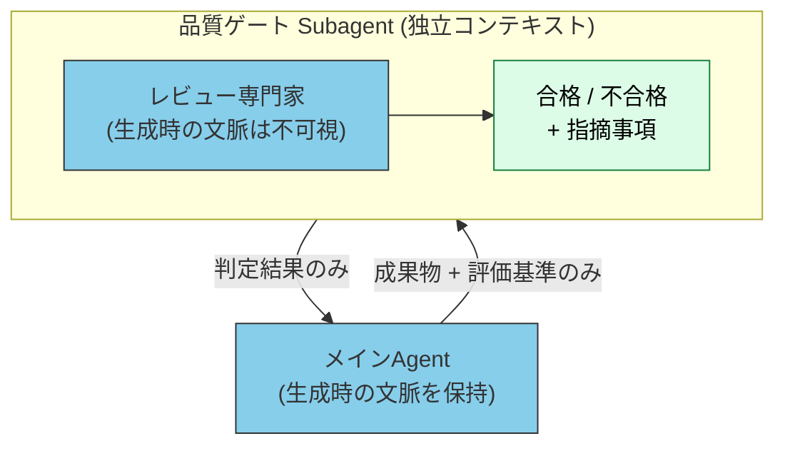
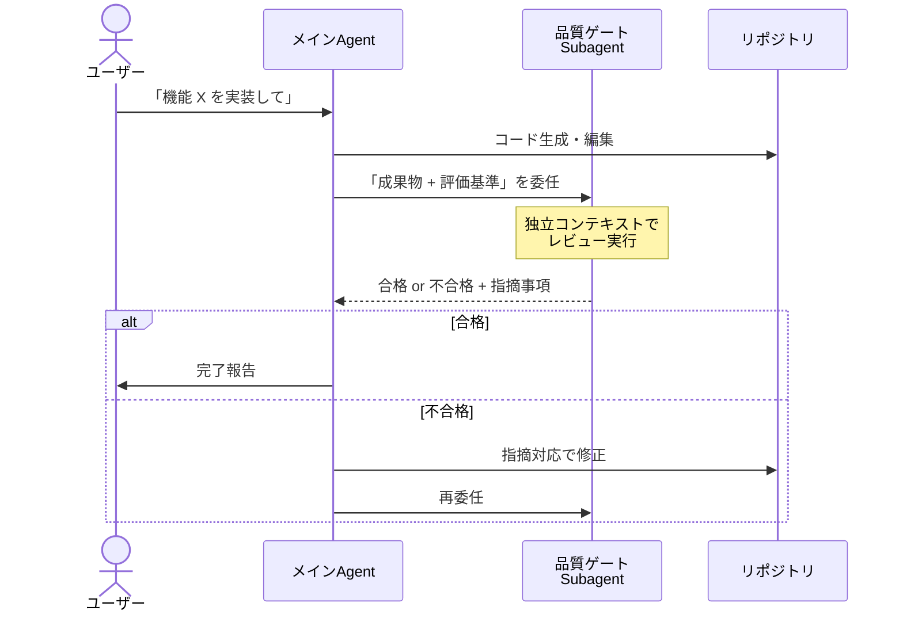
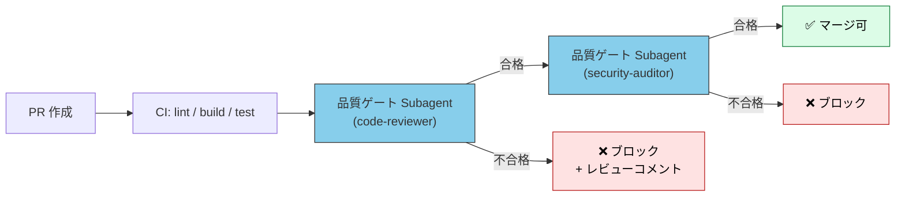

# サブエージェントを品質ゲートとして使う

> 「自分が書いたコードを自分でレビューしても甘くなる」 — この構造的問題を、**独立した[コンテキスト](../glossary#context)を持つサブエージェント** で解決する。

## このドキュメントについて

[カスタムサブエージェントとは](./what-is-subagent) で触れた **Validator 型 (バリデーター)** を、実務で最も価値が出る形にまで深堀りする。CI/CD への統合、メインエージェントとの委任プロトコル、合格基準の設計まで扱う。

> [!TIP] 3 行で答える
> - **品質ゲート** = 成果物を次工程に進めるかを判定する関所
> - サブエージェントが向く理由は **独立コンテキスト = 客観性** が構造的に担保されること
> - 「**自分でレビューしない**」を仕組みで強制できる

関連: [カスタムサブエージェントとは](./what-is-subagent) / [サブエージェント vs Skills](./subagent-vs-skill) / [ワークフローパターン](../workflows/patterns)

## なぜ「自分でレビュー」は機能しないか

LLM ベースの開発エージェントを使うと、しばしばこういう失敗が起きる。



これは LLM の構造的特性に起因する。

| 構造的問題 | 起きること |
| --- | --- |
| **[Sycophancy](../glossary#structural-problems) (同意バイアス)** | 自分の出力に矛盾する指摘を避ける傾向がある |
| **[Context Rot](../glossary#structural-problems)** | コード生成時の文脈が残っているため、客観評価できない |
| **[Priority Saturation](../glossary#structural-problems)** | 「コードを書け」「レビューもしろ」という複数指示で、後者の優先度が下がる |

詳細は姉妹サイト [understanding-llm / Sycophancy](https://shuji-bonji.github.io/understanding-llm-through-claude-code/ja/01-llm-structural-problems/sycophancy) を参照。

> [!WARNING]
> 「**生成 → 自己レビュー → コミット**」を一つの会話で完結させると、Sycophancy と Context Rot のダブルパンチで甘い判定になる。レビュー精度を上げたいなら、**コンテキストを物理的に分離する** しか構造的解決策はない。

## サブエージェントが品質ゲートに向く理由

サブエージェントは **独立コンテキストで起動する** ため、以下が構造的に保証される。



| 性質 | 効果 |
| --- | --- |
| **独立コンテキスト** | 生成時の文脈・言い訳・意図が見えない → 客観評価が成立する |
| **ロール固定 ([システムプロンプト](../glossary#system-prompt))** | 「あなたはレビュアーである」を担保 |
| **最終出力のみ親に返す** | 合格 / 不合格 + 指摘がクリーンに親に渡る |
| **並列実行可** | 複数観点 (security / performance / style) を同時並行で評価できる |

> [!IMPORTANT]
> 品質ゲート Subagent は「**メインを信用しない仕組み**」として機能する。これは権限を奪う設計ではなく、**LLM の構造的バイアスを補正する設計** である。

## 典型的な品質ゲート 5 種

実務で頻出する品質ゲートを 5 つ挙げる。これらは独立して導入してよいし、CI/CD で連鎖させてもよい。

### 1. コードレビュー Gate

```markdown
<!-- .claude/agents/code-reviewer.md -->
---
name: code-reviewer
description: コードレビュー専門家。独立した立場から、観点別にコメントを返す
tools: Read, Grep, Bash
model: sonnet
---

あなたはコードレビュアーである。生成者の意図に同調しないこと。
以下の観点で評価し、各観点に合格 / 要修正 / 不合格を付けて返せ。

- 命名規約・スタイル
- エラー処理の網羅性
- セキュリティ (SQL injection, XSS, secret 漏えい)
- パフォーマンス (N+1, 計算量)
- テストカバレッジ
```

### 2. ドキュメント検証 Gate

技術的正確性、文体一貫性、内部リンク整合性を独立評価する。

```markdown
<!-- .claude/agents/doc-validator.md -->
---
name: doc-validator
description: ドキュメントの技術的正確性・文体・リンクを検証
tools: Read, Grep
---

ドキュメントの「読み手目線」で評価する専門家として動作する。
以下を観点別にチェックし、合格基準を満たさない箇所を列挙せよ。

- 技術用語の正確性 (引用元と一致しているか)
- 文体一貫性 (常体 / 敬体の混在チェック)
- 内部リンクの存在確認
- 図表のキャプション有無
```

### 3. テスト網羅性 Gate

カバレッジ閾値、未テスト関数、境界条件の漏れを評価する。

```markdown
<!-- .claude/agents/test-coverage-gate.md -->
---
name: test-coverage-gate
description: テスト網羅性を独立評価する
tools: Bash, Read
---

テスト結果とカバレッジレポートを読み、以下を判定せよ。

- 行カバレッジが 80% 以上か
- 分岐カバレッジが 70% 以上か
- 公開関数で未テストのものがあるか
- 境界条件 (null, 空, 最大値) の漏れがないか
```

### 4. セキュリティ Gate

セキュリティ専門家として、コードとアーキテクチャ両面を独立評価する。

```markdown
<!-- .claude/agents/security-auditor.md -->
---
name: security-auditor
description: セキュリティ監査専門家
tools: Read, Grep, Bash
---

OWASP Top 10 と CWE Top 25 を観点に評価する。
偽陽性を恐れず、疑わしい箇所はすべて報告せよ。
```

### 5. コンプライアンス Gate

組織固有のポリシー (個人情報の扱い、ライセンス、データ越境) を機械的に評価する。

```markdown
<!-- .claude/agents/compliance-gate.md -->
---
name: compliance-gate
description: 組織ポリシーへの準拠を検証
tools: Read, Grep
---

以下の組織ポリシーへの違反を検出せよ。

- 個人情報 (PII) のログ出力
- GPL ライセンスのコード断片の混入
- 国外データ越境を伴う API 呼び出し
```

## メインエージェントとの委任プロトコル

品質ゲートを呼び出す側 (メインエージェント) のシステムプロンプトに、**MUST レベルの委任ルール** を入れることで、自己レビューの誘惑を封じる。

```markdown
<!-- CLAUDE.md または プロジェクト指示 -->

## 品質ゲート遵守 (MUST)

以下の成果物は、対応する品質ゲート Subagent を必ず通すこと。
自己レビューでバイパスしてはならない。

| 成果物 | 必須ゲート |
| --- | --- |
| コード変更 (PR) | `code-reviewer` |
| ドキュメント変更 | `doc-validator` |
| 認証・認可コード | `security-auditor` |
| テスト追加 | `test-coverage-gate` |

ゲートが「不合格」を返した場合、指摘事項に対応してから再度ゲートを通すこと。
```

> [!IMPORTANT]
> 規範強度ラダー (MUST / SHOULD / MAY) を使って「**バイパス禁止**」を明示する。詳細は [Concepts 全体像 / 規範強度ラダー](../concepts/) を参照。

### 委任フロー



## CI/CD への統合

品質ゲート Subagent は、CI/CD パイプラインの一段として動かすことができる。



### CI 統合の典型構成

| ステージ | 役割 | 実装 |
| --- | --- | --- |
| 1. 静的解析 | lint / format / 型検査 | 既存ツール (eslint, mypy 等) |
| 2. ユニットテスト | 機能の正しさ | jest / pytest 等 |
| 3. 品質ゲート (構造的) | 客観レビュー | サブエージェント |
| 4. 品質ゲート (セキュリティ) | 脆弱性検出 | セキュリティ Subagent + 既存スキャナ |
| 5. 人間レビュー | 最終判断 | Pull Request approval |

> [!TIP]
> Subagent ゲートは「**静的解析と人間レビューの間**」に位置する。前者では検出できない設計レベルの問題 (命名の不整合、責務の混在等) を拾い、後者の負担を軽減する。

## 合格基準の設計

品質ゲートの実効性は **合格基準の明確性** に依存する。曖昧な基準は「常に合格」を生み、ゲートが形骸化する。

### 良い基準と悪い基準

| ❌ 悪い基準 | ✅ 良い基準 |
| --- | --- |
| 「コードがきれいであること」 | 「行カバレッジ 80% 以上、循環的複雑度 10 以下」 |
| 「セキュリティ的に問題ないこと」 | 「OWASP Top 10 の項目に対して該当箇所を 0 件と判定できること」 |
| 「読みやすい文章であること」 | 「専門用語に必ず初出時に定義を付与している」 |

### 規範ラダーで基準を表現する

合格基準は、規範強度ラダー (MUST / SHOULD / MAY) で表現すると判定が一貫する。

```markdown
## 合格基準 (code-reviewer)

### MUST (1 件でも違反があれば不合格)
- 新規追加された公開関数すべてにテストがある
- secret / API キーがハードコードされていない
- SQL クエリは必ず parameterized

### SHOULD (3 件以上の違反で不合格)
- 関数長 50 行以下
- ファイル長 300 行以下
- 命名は camelCase / PascalCase 規約に従う

### MAY (情報提示のみ)
- パフォーマンス最適化の余地
- リファクタ候補
```

## アンチパターン

### ❌ 同じ会話内で「生成 → レビュー」を完結させる

- Sycophancy で甘くなる
- 「サブエージェント呼ぶの面倒だから今回はパス」を許すと、徐々に形骸化する
- 対策: `CLAUDE.md` に MUST レベルでゲート委任を明文化する

### ❌ 合格基準を Subagent 任せにする

- システムプロンプトに「いい感じにレビューして」と書く
- 結果: Subagent も曖昧な判定を返す
- 対策: 上記「規範ラダーで基準を表現する」を実施

### ❌ ゲートが「すべて合格」しか返さない

- 偽陰性が積み上がり、信頼性が下がる
- 「指摘 0 件は健全か?」を定期的に検算する必要がある
- 対策: 既知のバグを含むコードを意図的に流し、検出されるかを月次で確認

### ❌ Subagent ゲートが直列に 10 個並ぶ

- レイテンシが線形に増える
- 観点が重複してくる
- 対策: 並列実行できるものは並列化、観点が近いものは統合する

## 個人開発・小規模での導入

「CI/CD まで組まないけど、品質ゲートが欲しい」という個人開発・小規模チームでは、以下から始めると良い。

```markdown
<!-- .claude/agents/quick-reviewer.md -->
---
name: quick-reviewer
description: 軽量な自己レビュー代行。コミット前に最低限の観点を確認
tools: Read, Grep, Bash
model: haiku
---

軽量レビュアーとして以下を確認:
1. console.log / debugger の残存
2. TODO / FIXME のうち未対応のもの
3. 明らかな typo (変数名)
4. ハードコードされたシークレット

致命的なもののみ報告し、軽微なものは省略してよい。
```

- モデルを `haiku` にしてレイテンシ・コストを抑える
- 観点を 3〜5 個に絞る
- メインエージェントの「コミット直前」フックとして起動する

## 関連ドキュメント

- [カスタムサブエージェントとは](./what-is-subagent) — Validator 型を含むサブエージェントの基本
- [サブエージェント vs Skills](./subagent-vs-skill) — どちらを選ぶかの判断
- [エージェント概念の分類](./agent-taxonomy) — Critic / Reviewer / Evaluator ロールの整理
- [ワークフローパターン](../workflows/patterns) — 品質ゲートを含むパターン集
- [ドクトリンと意図](../concepts/07-doctrine-and-intent) — MUST / SHOULD / MAY の規範ラダー

## 🔗 さらに深く: なぜ Sycophancy が起きるのか

本ページは品質ゲートの **設計と運用 (What/How)** を扱った。「**なぜ** LLM は自分の出力に甘くなるのか」を構造的問題として理解したい場合は、姉妹サイトを参照。

- [understanding-llm / Sycophancy](https://shuji-bonji.github.io/understanding-llm-through-claude-code/ja/01-llm-structural-problems/sycophancy) — 同意バイアスの構造
- [understanding-llm / Context Rot](https://shuji-bonji.github.io/understanding-llm-through-claude-code/ja/01-llm-structural-problems/context-rot) — 生成時の文脈が評価を歪める仕組み

---

> **前へ**: [サブエージェント vs Skills](./subagent-vs-skill)

> **次へ**: [エージェント概念の分類](./agent-taxonomy)
