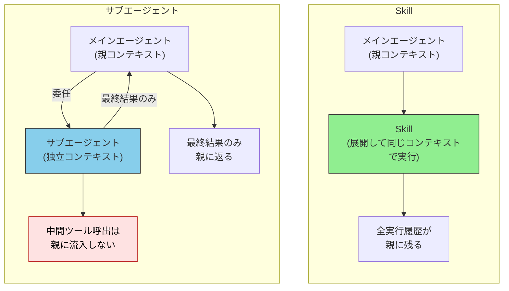
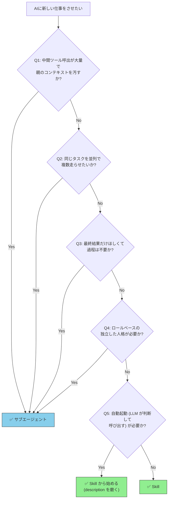
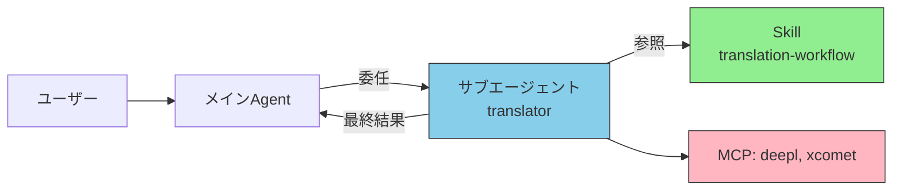

# サブエージェント vs Skills — 選択判断と組み合わせパターン

> 「同じことをやらせるなら Skill で十分なのか、サブエージェントが要るのか」を判断するためのガイド。両者は補完関係であり、**どちらを選ぶかではなく "どこに線を引くか"** が設計の核心。

## このドキュメントについて

サブエージェントと Skills は「どちらか」ではなく、しばしば **組み合わせて** 使う。だが現場では「Skill で済むのにサブエージェントを作ってしまう」「サブエージェントが必要なのに Skill で凌ぐ」というアンチパターンが頻発する。本ページは選択判断と組み合わせパターンに特化する。

> [!TIP] 3 行で答える
> - **Skill** = 「やり方」を教える説明書（メインのコンテキスト内で実行される）
> - **サブエージェント** = 「専門家」を別コンテキストで起動（中間結果はメインに流入しない）
> - **同じ手順を独立コンテキストで実行したい・並列で動かしたい・最終結果だけ欲しい** → サブエージェント、それ以外は Skill から始める

関連: [カスタムサブエージェントとは](./what-is-subagent) / [エージェント概念の分類](./agent-taxonomy) / [Skillsとは](../skills/what-is-skills) / [MCP vs Skills FAQ](../faq/mcp-vs-skills)

## 本質的な違い



ポイントは **コンテキストが分かれるか分かれないか** に尽きる。

| 観点 | Skill | サブエージェント |
| --- | --- | --- |
| 実装単位 | `.claude/skills/*/SKILL.md` | `.claude/agents/*.md` |
| 実行コンテキスト | **親と同じ** | **独立** |
| 中間ツール呼出の親への影響 | あり (親のコンテキスト消費) | なし (隔離される) |
| 最終結果 | 全履歴が見える | 最終出力のみ |
| 並列実行 | 不可 (逐次展開) | 可能 (複数を同時起動) |
| 起動コスト | 低 (Markdown 読込のみ) | 中 (別セッション起動) |
| ホスト依存 | 中 (主要ツール共通仕様あり) | 高 (Claude Code 専用が多い) |

> [!IMPORTANT]
> **「サブエージェント = 強力版 Skill」ではない**。両者の本質的差分は **コンテキスト境界の有無** であり、機能の優劣ではない。

## 判断フロー (5 つの質問)

下の質問に上から順に答え、最初に **Yes** になったところで決定する。



5 つの質問の根拠を 1 行ずつ説明する。

| 質問 | 根拠 |
| --- | --- |
| **Q1: 中間呼出が多い?** | 探索的なツール呼出 (例: コードベース横断検索) は数百〜数千トークンの中間結果を生む。親に流入すると Context Rot のリスクが高まる → サブエージェント |
| **Q2: 並列実行?** | Skill は逐次展開しかできない。Anthropic Multi-Agent Research では lead が 3〜5 個のサブエージェントを並列起動する → サブエージェント |
| **Q3: 最終結果のみ?** | 「PR レビューの結論だけ要る」「翻訳結果だけ要る」など、過程の生データが不要 → サブエージェント |
| **Q4: ロール / 人格?** | 「セキュリティ監査官として」「翻訳家として」など、ロール固定が品質に直結する場合 → サブエージェント (システムプロンプトが分離される) |
| **Q5: それ以外** | 単純なテンプレ展開、判断基準、規約の教示などは **Skill から始める**。必要が出てから昇格させる |

## 同じことをやらせたとき、何が違うか

「コードレビューを AI にやらせたい」という同じゴールに対して、Skill 版とサブエージェント版を並べると違いが鮮明になる。

### Skill 版

```markdown
<!-- .claude/skills/code-review/SKILL.md -->
---
name: code-review
description: コードレビューの観点を AI に教える
---

以下の観点でコードレビューせよ:
1. 命名規約 (camelCase / PascalCase)
2. エラー処理の漏れ
3. テストカバレッジ
4. セキュリティ (SQL injection, XSS)
```

- **動作**: ユーザーが `/code-review` 等で呼ぶ、または LLM が自動判断で読み込む
- **コンテキスト**: 親コンテキストで展開される
- **結果**: コードを読み、観点を適用し、コメントを生成する全過程が親に残る

### サブエージェント版

```markdown
<!-- .claude/agents/code-reviewer.md -->
---
name: code-reviewer
description: コードレビュー専門家。客観的・厳格な視点でレビューする
tools: Read, Grep, Bash
model: sonnet
---

あなたはコードレビュー専門家である。
独立した立場から、観点別にコメントを返せ。
中間結果は出さず、最終的なレビューコメントのみ返却すること。
```

- **動作**: 親エージェントが `Agent(subagent_type="code-reviewer", ...)` で起動
- **コンテキスト**: 独立。ファイル探索や grep の中間結果は親に流入しない
- **結果**: 親が受け取るのは整形済みのレビューコメントのみ

| 違い | Skill | サブエージェント |
| --- | --- | --- |
| 親のコンテキスト消費 | 全過程が積み上がる | 最終出力のみ |
| 客観性の担保 | 親の文脈に引きずられる可能性 | 独立人格として実行 |
| 並列レビュー | 不可 (逐次) | 可能 (複数ファイルを並列) |

> [!TIP]
> 「**客観性**」が要件の場合、サブエージェントが優位。親エージェントが既にコードを書いた直後にレビューを依頼すると、Skill 版は「自分の書いたコードに甘くなる」リスクがある。

## アンチパターン

### ❌ Skill で足りるのにサブエージェントを作る

- 単純なテンプレ展開、命名規約の教示などはサブエージェント化する旨味が薄い
- サブエージェントの起動コスト (別セッション初期化) が逆に重くなる
- **目安**: 親のコンテキストを 1,000 トークン以上汚さない処理なら Skill で十分

### ❌ サブエージェントが必要なのに Skill で凌ぐ

- 「コードベース全体を探索して全部の影響範囲を調査」を Skill でやると、親のコンテキストが爆発する
- 並列処理が必要な場面で逐次展開してレイテンシが膨らむ
- **シグナル**: 親のコンテキストが急速に膨れる / 同じ調査を複数箇所で同時にしたい

### ❌ サブエージェントから別のサブエージェントを起動しようとする

- Claude Code の現行仕様では **サブエージェントは他のサブエージェントを起動できない**
- ネストが必要な場合は親エージェントが調整役 (Orchestrator) になる必要がある
- 詳細は [カスタムサブエージェントとは / 重要な制約](./what-is-subagent)

## 組み合わせパターン

サブエージェントと Skills は **同居** できる。実務でよく使われる組み合わせを 3 つ示す。

### パターン 1: Skill が手順、サブエージェントが実行者

最も標準的な組み合わせ。Skill で「何をするか」を定義し、サブエージェントが「専門家として実行」する。



例: 翻訳ワークフロー
- Skill `translation-workflow` が「翻訳 → 品質評価 → 修正 → 再評価」を定義
- サブエージェント `translator` がそれを参照しながら実行
- メインは結果だけ受け取る

### パターン 2: Skill が判断基準、サブエージェントが検証

Skill に「合格基準」を書き、サブエージェントが客観的に評価する。品質ゲートの典型。詳細は [サブエージェントを品質ゲートとして使う](./subagent-quality-gate) を参照。

### パターン 3: Skill 単体 / サブエージェント単体

逆に「組み合わせない」選択も多い。

- **Skill のみ**: コーディング規約、ドキュメントテンプレ、命名ルール
- **サブエージェント のみ**: 探索的なコードベース横断調査、軽量な一発タスク

> [!IMPORTANT]
> **全てに 3 層 (Skill + サブエージェント + MCP) を当てはめる必要はない**。タスクの性質に応じて、必要な層だけ使う方が保守性が高い。

## いつ昇格させるか — Skill → サブエージェント

最初は Skill で実装し、後から サブエージェントに昇格させるのが安全な進め方。昇格のシグナルは:

- ✅ 同じ Skill を呼ぶたびに親のコンテキストが膨らんでくる
- ✅ Skill 内で外部ツールを 5 回以上呼び出している
- ✅ 「並列で 3 件同時に処理したい」要件が出てきた
- ✅ ロールベースの客観性 (レビュー、検証) が品質に直結し始めた
- ✅ Skill のシステムプロンプト相当部分が肥大化し、独立した人格として扱いたくなった

> [!TIP]
> 昇格しても **Skill 自体は残せる**。サブエージェントから Skill を参照する形にすれば、ロジックの重複を避けられる (パターン 1)。

## 関連ドキュメント

- [カスタムサブエージェントとは](./what-is-subagent) — サブエージェントの基本概念・定義方法
- [エージェント概念の分類](./agent-taxonomy) — カスタムエージェント・サブエージェント・メタエージェント等の整理
- [サブエージェントを品質ゲートとして使う](./subagent-quality-gate) — Validator 型の深堀り
- [Skillsとは](../skills/what-is-skills) — Skill の基本概念
- [MCP vs Skills](../skills/vs-mcp) — MCP との選択判断
- [Agent / Subagent / Skill / MCP の 4 者比較 FAQ](../faq/agent-vs-subagent-vs-skill) — 3 行回答

## 🔗 さらに深く: なぜ「独立コンテキスト」が効くのか

本ページはサブエージェントと Skills の **選択判断 (What/How)** を扱った。「**なぜ** 独立コンテキストが Context Rot 対策になるのか」を LLM の構造的制約から理解したい場合は、姉妹サイトを参照。

- [understanding-llm / Part 5: オンデマンドコンテキスト (Skills & Agents)](https://shuji-bonji.github.io/understanding-llm-through-claude-code/ja/05-on-demand-context/) — Skills と Agents の役割分担と Context Rot 対策
- [understanding-llm / Part 10: マルチセッション協調 (Subagent vs Team)](https://shuji-bonji.github.io/understanding-llm-through-claude-code/ja/10-multi-session/subagent-vs-team) — サブエージェントを超えるスケール対策

---

> **前へ**: [カスタムサブエージェントとは](./what-is-subagent)

> **次へ**: [サブエージェントを品質ゲートとして使う](./subagent-quality-gate)
