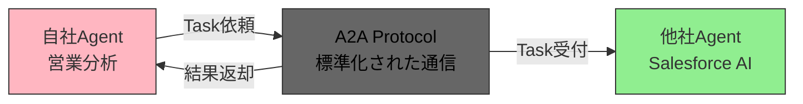
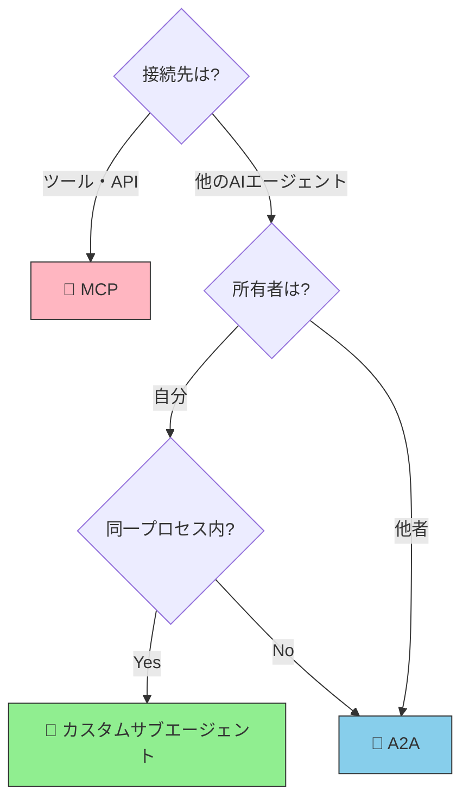

# A2A（Agent-to-Agent Protocol）とは何か

> エージェント同士がネットワーク越しに協調・委譲するための通信プロトコル

## このドキュメントについて

A2Aの基本概念、MCPとの違い、メリット・デメリット、将来展望を解説する。サブエージェントとの違いは [what-is-subagent.md](./what-is-subagent.md) も参照する。

エージェント用語の全体像（設計パターン／実行ロール／実装単位）の整理は [agent-taxonomy.md](./agent-taxonomy.md) を参照。

## A2Aとは何か

**A2A（Agent-to-Agent Protocol）** は、異なるAIエージェント同士がネットワーク越しに対等な関係で通信・協調するためのオープン標準プロトコルである。

### 背景と主導者

A2Aの誕生と標準化の経緯を以下にまとめる。

- **Google が主導** して 2025年4月に発表
- 2025年6月に **Linux Foundation の Agent2Agent プロジェクト** へ寄贈され、ベンダーニュートラルな運営へ移る
- 2026年4月時点で **A2A プロトコルプロジェクトへの参加組織は 150 を超える** (AWS、Cisco、Google、IBM、Microsoft、Salesforce、SAP、ServiceNow ほか)
- **A2A v1.0** が安定版となり、複数のクラウドプラットフォームで利用が進む
- 2026年8月前後には、MCP などと同じ **Agentic AI Foundation（AAIF）** 側へ寄せる動きが報じられている（ガバナンスの詳細は時点で確認する）
- MCP と同様、エージェント間連携の基盤プロトコルの一つとして位置づけられている

> [!IMPORTANT]
> A2A は仕様検討だけの段階を超え、v1.0 とクラウド実装が進んでいる。ただし「導入すれば足りる」わけではない。認証・委任は [エージェント ID](./agent-identity) と組み合わせて設計するのがよい。

### A2A の本質

A2Aの最大の特徴は、**エージェント ↔ エージェント** の対等な通信を実現することである。

- **MCP**: AIエージェント ↔ **ツール/API** の接続（エージェントがツールを呼ぶ）
- **A2A**: AIエージェント ↔ **AIエージェント** の接続（双方が依頼し合える）

### 一言で言うと

「異なるAIエージェントが互いに仕事を依頼し合うためのプロトコル」

### アーキテクチャモデル

エージェント開発の三層構造:

- **Build with ADK**: エージェント自体を構築
- **Equip with MCP**: ツール・APIを接続
- **Communicate with A2A**: 他のエージェントと通信

## なぜA2Aが必要か

### 現状の課題

AIエージェント技術が急速に進化する中で、各企業・組織は独自のエージェントを開発・運用している。しかし、これらのエージェント間には標準的な通信手段がない。

#### サイロ化の問題

- 自社の営業分析エージェント → Salesforceの AI Agent に問い合わせたい
- しかし、標準的な通信プロトコルがない
- MCP では「エージェント ↔ ツール」の接続は可能だが、「エージェント ↔ エージェント」は想定されていない
- 結果として、**エージェント同士が孤立**し、企業間の連携が困難

### A2A登場前後での変化

#### A2A以前

- エージェント間通信は各社が独自実装（API連携等）
- 標準がないため、連携ごとに仕様調整が必要
- スケーラブルでない

#### A2A以後

- 標準化されたプロトコルでエージェント間通信が可能
- 認証・認可・信頼モデルが統一される
- 異なる組織のエージェント同士でも連携可能

### 通信フロー図

異なる組織のエージェント同士がA2Aプロトコルを介して通信する基本的なフローを以下に示す。

## MCPとの根本的な違い

A2AとMCPは両方とも「接続」を実現するプロトコルだが、**接続先が根本的に異なる**。以下の比較表で違いを整理する。

### 機能比較表

MCPとA2Aの違いを以下の表で整理する。

| 項目                 | MCP                            | A2A                                |
| -------------------- | ------------------------------ | ---------------------------------- |
| **主導者**           | Anthropic                      | Google → Linux Foundation          |
| **目的**             | エージェント ↔ **ツール**      | エージェント ↔ **エージェント**    |
| **接続先**           | MCPサーバー（自分が管理）      | 他のエージェント（**他者含む**）   |
| **通信モデル**       | クライアント主導（エージェントがツールを呼ぶ） | **対等**（双方が依頼可能）         |
| **コンテキスト共有** | 親エージェントと共有可能       | **完全分離**（不透明な相手を想定） |
| **所有者**           | 自分                           | 自分 or **他者**                   |
| **信頼モデル**       | 暗黙的信頼                     | **認証・認可が必須**               |

### 選択の手順

MCP・A2A・カスタムサブエージェントの3つから適切な選択肢を判断するためのフローチャートを以下に示す。

## A2Aの主要概念

A2A で重要な概念は3つである。

### 1. Agent Card（エージェントカード）

エージェントの「自己紹介カード」である。他のエージェントや発見システムが、あるエージェントが何をできるのかを理解するための情報を提供する。

**形式**: JSON形式

**含まれる情報**:

- エージェント名・説明
- 提供できるCapabilities（機能）
- 認証方法
- サポートするA2Aバージョン
- エンドポイント

**配置**: `/.well-known/agent.json` に配置され、ディスカバリーが可能

### 2. Task（タスク）

エージェント間で依頼する「作業単位」である。一度のやり取りで完結しない長時間のタスクにも対応する。

**ライフサイクル**:

- `submitted`: タスク受け取り直後
- `working`: 処理中
- `input-required`: 追加情報が必要
- `completed`: 成功
- `failed`: 失敗

**特徴**:

- 非同期実行
- 長時間タスク対応
- ポーリングまたはコールバック機構

### 3. Artifact（成果物）

Taskの実行結果として生成されるデータである。テキストに限らず、ファイルや構造化データも含む。

**対応フォーマット**:

- テキスト（plain text、markdown等）
- ファイル（PDF、画像、など）
- 構造化データ（JSON、XML等）
- マルチモーダル（画像、音声も想定）

## A2Aのメリット

A2Aを採用することで、以下のメリットが得られる。

- ✅ **組織間連携の標準化**  
  異なる組織のエージェント同士が、標準的なプロトコルで通信できる。これまでの「企業ごとのカスタム連携」から「標準ベースの連携」へシフトする。
- ✅ **エージェント専門化と協業**  
  各エージェントが得意分野に特化し、複雑なタスクは複数エージェントの協力で処理する。
  例えば、
  - 営業Agent ← 市場分析Agentから予測データを取得
  - 営業Agent ← CRMAgentから顧客情報を取得
- ✅ **マルチモーダル対応**  
  テキストだけでなく、画像・音声・ファイルなど多様なフォーマットでの情報受け渡しが可能である。
- ✅ **非同期処理対応**  
  レポート生成のような長時間タスクをバックグラウンドで実行し、結果を後から取得できる。
- ✅ **ベンダー非依存性**  
  Linux Foundationによるオープン標準なので、特定のベンダーに依存しない。

## A2Aのデメリット・課題

一方で、A2Aにはまだ克服すべき課題もある。

- ❌ **実装複雑性**  
  認証・認可・暗号化の実装が必須である。MCPより要件が厳しくなる。
- ❌ **ネットワーク依存**  
  ネットワーク遅延、接続断等の問題に対応する必要がある。タイムアウト設定やリトライロジックの実装も必須である。
- ❌ **デバッグが困難**  
  エージェント間の通信トレースが複雑になり、問題の切り分けが難しくなる。ロギング戦略が重要である。
- ❌ **成熟度がまだ低い**  
  MCP（2024年11月リリース）と比べても、A2Aはさらに新しい仕様である。実装パターンや運用ノウハウがまだ少ない。
- ❌ **エコシステムが発展途上**  
  対応するエージェントやツールが限定的である。多くのエージェントがA2Aに対応するまで時間がかかると予想される。
- ❌ **信頼の問題**  
  他者が所有するエージェントの品質・セキュリティを完全に保証できない。不正なエージェントによる悪用のリスク等も考慮が必要である。

## サブエージェントとの使い分け

自分が管理するエージェント同士の連携には「カスタムサブエージェント」、他組織含む外部エージェントとの連携には「A2A」を使い分ける。

### 比較表

カスタムサブエージェントとA2Aエージェントの違いを以下に整理する。

| 観点               | カスタムサブエージェント | A2Aエージェント  |
| ------------------ | ------------------------ | ---------------- |
| **所在**           | 同一プロセス内           | ネットワーク越し |
| **所有者**         | 自分                     | 自分 or 他者     |
| **信頼関係**       | 完全信頼                 | 認証・認可が必要 |
| **コンテキスト**   | 親と一部共有             | 完全分離         |
| **ライフサイクル** | セッション限り           | 永続的サービス   |

### 比喩で理解する

- **サブエージェント** = 「社内の専門部署」
  - 同じ建物（プロセス）内にいる
  - 上司（親エージェント）の監督下
  - 完全に信頼できる

- **A2Aエージェント** = 「外注先・パートナー企業」
  - 別の拠点（別プロセス）にいる
  - ネットワークで通信
  - 契約（認証・認可）に基づく関係

### 代替関係ではなく補完関係

サブエージェントとA2Aエージェントは競合ではなく、補完関係である。多くのシステムでは、両方を組み合わせて使う。

- 社内タスク分解 → **カスタムサブエージェント**
- 社外リソース活用 → **A2Aエージェント**

## 現状の成熟度と将来展望

### タイムライン（おおよそ 2026年8月時点）

MCPとA2Aの登場から現在に至るまでの主要な出来事を時系列で整理する。日付は公表・報道に依る。ガバナンス名は時点で確認する。

- **2024年11月**: Anthropic が **MCP** をリリース
- **2025年4月**: Google が **A2A** を発表
- **2025年6月**: A2A が **Linux Foundation の Agent2Agent プロジェクト** へ寄贈される
- **2025年10月**: OpenID Foundation が **「Agentic AI のためのアイデンティティ管理」v1.1** を公表 (Agent ID の体系化)
- **2025年12月**: **AGENTS.md** などが Linux Foundation 系の枠組みへ寄贈される動き
- **2026年3〜4月**: **A2A v1.0**、参加組織 150 超の公表、主要クラウドでの実装が進む。**Microsoft Entra Agent ID** や **Okta for AI Agents** などの製品発表が続く
- **2026年8月前後**: A2A を **Agentic AI Foundation（AAIF）** 側へ寄せる動きが報じられる
- **設計上の組み合わせ**: MCP（ツール接続）+ A2A（エージェント間）+ Agent ID（識別・委任）は、本番でよく並ぶスタックの一例である。五層モデルの別名ではない

### 現時点での位置づけ

A2A は仕様検討だけの段階を超え、安定版と実装が進んでいる。本書では以下の関連ページで A2A を支える要素を扱う。

- [エージェント ID](./agent-identity) — A2A 通信における識別と委任の基礎
- [マルチエージェント / Agent Teams](./agent-teams) — 組織内 Agent Team から組織横断 Agent Mesh への発展
- [II.1 五層](../part-2/layers) — 五層における A2A の位置

### 推奨アーキテクチャ

**Build with ADK, equip with MCP, communicate with A2A, identify with Agent ID**

オリジナルの三層モデル (Build / Equip / Communicate) に **Identify** を足した形が、2026 年時点でよく語られる到達点である。**A2A 単体では信頼境界を扱えない**。組織をまたぐ通信では、Agent ID と組み合わせて設計するのがよい。

### 残された課題

A2A は GA を迎えたが、エコシステムレベルでは未解決領域が残る。

- **クロスベンダー相互運用性** — 各社の Agent ID 実装間の相互運用が未確立 (OIDC-A、IPSIE、AuthZEN の標準化が進行中)
- **再帰的委任のスコープ減衰** — A2A 越しのサブエージェント連鎖で権限が肥大化しないための設計が必要 (OAuth Token Exchange、Macaroons 等)
- **失効伝播** — 一箇所で取り消した権限が末端まで届く仕組み (Shared Signals Framework 等)
- **ブラウザ操作型エージェントの認証** — Web Bot Auth ドラフトが進行中

これらの詳細は [エージェント ID / 残された課題](./agent-identity) を参照。

## 次に読むべきドキュメント

A2Aをより深く理解するために、以下のドキュメントを参照する。

| 目的                   | ドキュメント                                         |
| ---------------------- | ---------------------------------------------------- |
| A2A 通信時の識別と委任 | [エージェント ID](./agent-identity)                  |
| 組織内 Agent Team との関係 | [マルチエージェント / Agent Teams](./agent-teams) |
| サブエージェントの詳細 | [what-is-subagent.md](./what-is-subagent.md)         |
| エージェント用語の整理 | [エージェント概念の分類](./agent-taxonomy)            |
| MCPの詳細              | [what-is-mcp.md](../mcp/what-is-mcp.md)              |
| 全体アーキテクチャ     | [II.1 五層](../part-2/layers)          |
| Skillsについて         | [what-is-skills.md](../skills/what-is-skills.md)     |

## 出典

- [A2A Protocol Surpasses 150 Organizations (Linux Foundation, 2026年4月)](https://www.linuxfoundation.org/press/a2a-protocol-surpasses-150-organizations-lands-in-major-cloud-platforms-and-sees-enterprise-production-use-in-first-year) — 150 組織参加・本番運用入り
- [OpenID Foundation — Identity Management for Agentic AI v1.1](https://openid.net/) — Agent ID の体系化
- [AGENTS.md 公式サイト](https://agents.md/) — Linux Foundation 標準

**最終更新**: 2026年8月
**ステータス**: ガバナンス表記の修正、表現の弱め、五層との区別を反映
