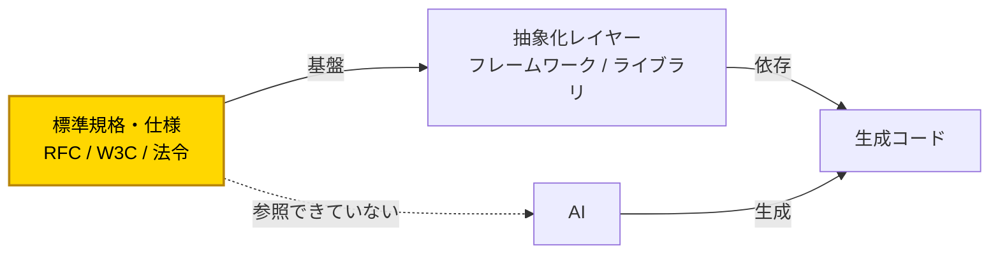
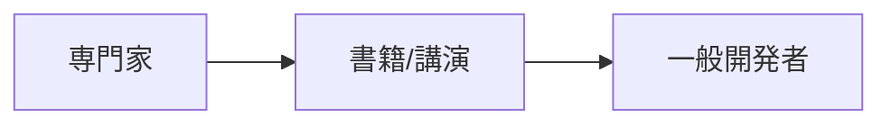
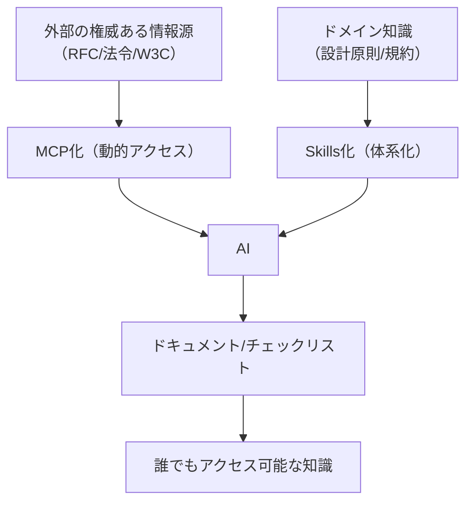
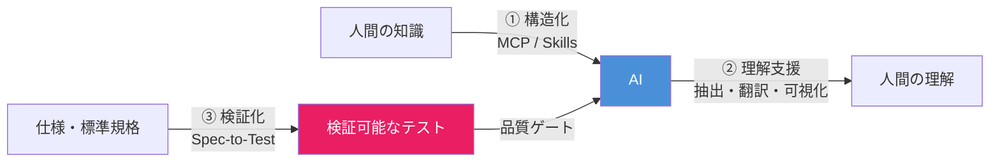
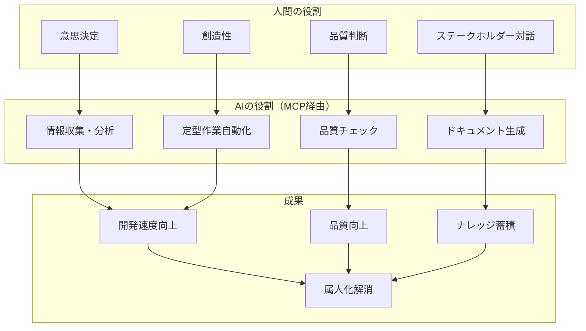
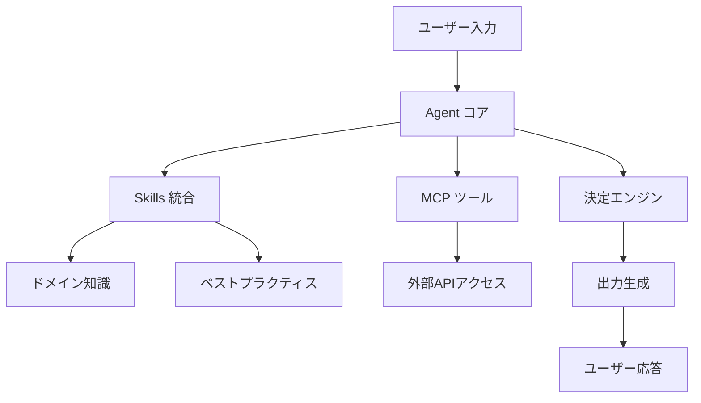
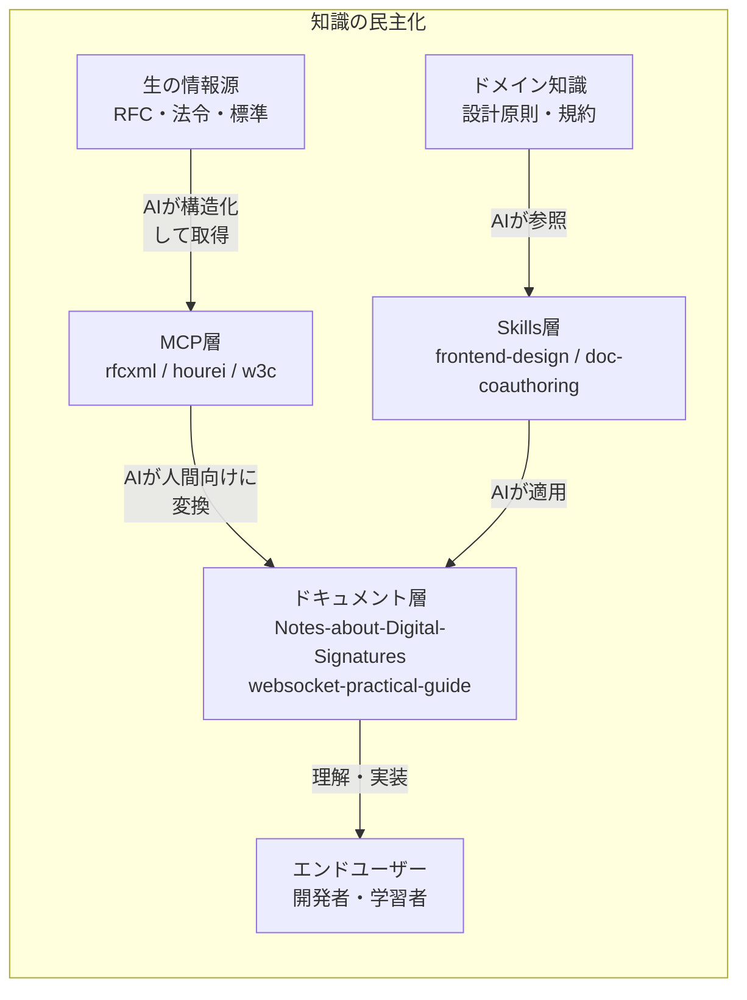

# AI駆動開発のビジョン

このドキュメントでは、AIエージェント構成（MCP・Skills・Agent統合）の根底にある思想と、AI駆動開発に対する基本的な考え方を整理する。

> **対象読者**: AIを活用した開発に関心のあるエンジニア全般。MCP/Skillsの導入を検討している実践者にも、チームへの導入判断をする立場の方にも役立つ内容を目指している。

::: warning このページの位置づけ
👉 **本ページ（WHY — なぜブレない参照先が必要か）**

- [02-reference-sources](./02-reference-sources)（**WHAT** — 何を参照先とするか）
- [03-architecture](./03-architecture)（**HOW** — どう構成するか）
- [04-ai-design-patterns](./04-ai-design-patterns)（**WHICH** — どのパターンをいつ選ぶか）
- [05-solving-ai-limitations](./05-solving-ai-limitations)（**REALITY** — 現実の制約にどう向き合うか）
- [06-physical-ai](./06-physical-ai)（**EXTENSION** — 三層モデルを物理世界へ拡張する）
- [07-doctrine-and-intent](./07-doctrine-and-intent)（**DOCTRINE** — AIは何を基準に判断し行動すべきか）
  :::

::: details メタ情報

|                          |                                                                                            |
| ------------------------ | ------------------------------------------------------------------------------------------ |
| **この章で固定するもの** | AIの4つの根本的制約（正確性・最新性・権威性・責任性）と「ブレない参照先」の必要性          |
| **扱わないこと**         | 具体的な参照先の選定（→02）、アーキテクチャ設計（→03）、実装手法（→04）                    |
| **依存**                 | なし（Conceptsセクションの起点）                                                           |
| **誤用ポイント**         | 「AIは使えない」という結論に至ること。本章の主張は「制約を認識した上で、構造的に補完せよ」 |

:::

## 核心的な認識

### AIは「万能ではない」

AIの能力が急速に向上している一方で、その限界を正しく認識することが重要である。AIを過信せず、適切に活用するためには、以下の制約を理解する必要がある。

AIは学習データから確率的に出力を生成するが、以下を保証できない。

| AIの限界   | 説明                                                 |
| ---------- | ---------------------------------------------------- |
| **正確性** | Hallucination問題 - 事実と異なる情報を生成する可能性 |
| **最新性** | 学習データのカットオフ以降の情報を持たない           |
| **権威性** | 仕様の正式な解釈を保証できない                       |
| **責任性** | 法的・倫理的判断の根拠を示せない                     |

**だから、信頼できるソースに接続する必要がある。**

## AI駆動開発の本質

```
AI駆動開発 ≠ AIにコードを書かせること
AI駆動開発 = 全工程でAIを活用し、人間は判断・創造に集中
```

::: info 「全工程」とは何か
コーディングにとどまらない。プロジェクト管理・プロダクト管理・SRE・セキュリティ・データ管理など、[ソフトウェア開発に関わる幅広い管理領域](https://github.com/shuji-bonji/Management-of-software-systems-and-services)を指す。
:::

ただし、この理想を実現するには前提がある。AIが「全工程で活用できる」状態になるには、AIが正しく判断できる環境を整える必要があるからだ。

### 過渡期における現実

AIがすべての工程を自律的に完結させる時代は、まだ来ていない。現在のAIは「もっともらしい出力を生成する」ことは得意だが、**それが正しいかどうかの判断基準を自身では持てない**。

一方、今日のソフトウェア開発において、AIが生成するコードはフレームワークやライブラリといった抽象化レイヤーに依存しており、その根底には人類が積み上げてきた**標準規格・仕様**がある。


```mermaid
graph LR
    Standards["標準規格・仕様<br>RFC / W3C / 法令"]
    Layer["抽象化レイヤー<br>フレームワーク / ライブラリ"]
    Code["生成コード"]
    AI["AI"]

    Standards -->|"基盤"| Layer
    Layer -->|"依存"| Code
    AI -->|"生成"| Code
    Standards -.->|"参照できていない"| AI

    style Standards fill:#ffd700,color:#000,stroke:#b8860b,stroke-width:2px
```

AIが生成したコードはこの標準規格の上に成り立っているにもかかわらず、AIはその標準規格を直接参照できていない（破線）。これが現在の問題である。

**AIが正確に機能するには、コードが依拠する標準規格・仕様をAI自身も参照できる状態にする**必要がある。これが「ブレない参照先」が必要な理由である。

## 「ブレない参照先」の重要性

### なぜ参照先が必要か

AIの抱える課題に対して、「ブレない参照先」がどのように解決に寄与するかを以下の表に整理する。

| AIの課題             | 参照先が解決すること           |
| -------------------- | ------------------------------ |
| 学習データの時点固定 | 権威ある最新情報源へのアクセス |
| ハルシネーション     | 検証可能な根拠の提供           |
| 文脈による解釈のブレ | 一貫した判断基準               |
| 最新情報の欠如       | 最新仕様の取得                 |

### 「ブレない参照先」を実現する2つの手段

AIに「ブレない参照先」を与える手段として、**MCP**と**Skills**がある。

| 手段                                                | 役割                                     | 例                                       |
| --------------------------------------------------- | ---------------------------------------- | ---------------------------------------- |
| **[MCP](https://modelcontextprotocol.io/)**         | 外部の権威ある情報源への動的アクセス     | RFC、法令、W3C標準                       |
| **[Skills](https://github.com/vercel-labs/skills)** | ドメイン知識・ベストプラクティスの体系化 | 設計原則、ワークフロー、コーディング規約 |

::: tip 「Skills」の用語について
本ドキュメントにおける「Skills」は、[vercel-labs/skills](https://github.com/vercel-labs/skills) で定義されるフォーマットに基づく**ドメイン知識のMarkdown体系化**を指す。OpenAI の「Actions」やLangChain の「Tools」とは異なり、実行可能なコードではなく、AIが参照する知識・判断基準を構造化したものである。
:::

::: info 「ブレない参照先」の本質的な定義

「ブレない参照先」とは、**LLMの推測ではなく、検証可能な情報源から取得した事実**のことである。

この定義に基づくと、参照先は2種類に分類できる。

| 種類         | 特徴                           | 例                                | 検証方法                       |
| ------------ | ------------------------------ | --------------------------------- | ------------------------------ |
| **静的参照** | 内容が固定・不変               | RFC、法令、W3C仕様                | バージョン・セクション番号     |
| **動的参照** | 値は変動するが、取得時点の事実 | センサー、API、リアルタイムデータ | タイムスタンプ＋データソースID |

どちらも「LLMが推測で生成したものではない」という点で共通する。動的参照ではデータソース自体の真正性検証が別途必要になるが、MCP経由で取得した時点で出典が明確になるという利点がある。

:::

### 参照先MCP/Skillsの価値

MCPとSkillsを導入して参照先を確立することで、以下の価値が得られる。

1. **AIの判断が検証可能になる** - 出力の根拠を示せる
2. **一貫性のある品質が担保される** - 標準に準拠した出力
3. **ベンダーロックインを回避できる** - オープン標準に基づく
4. **知識へのアクセスが民主化される** - 専門家でなくても正確な情報に到達
5. **ドメイン知識が再利用可能になる** - チームのノウハウをSkillsとして形式知化

## 知識の民主化

### 従来の問題点


```mermaid
flowchart LR
    専門家 --> 書籍/講演 --> 一般開発者
```

- 高コスト
- 一方通行
- 言語障壁

### MCP/Skillsが実現する世界


```mermaid
flowchart TB
  A[外部の権威ある情報源<br>（RFC/法令/W3C）]
  B[ドメイン知識<br>（設計原則/規約）]
  M[MCP化（動的アクセス）]
  S[Skills化（体系化）]

  A --> M
  B --> S
  M --> AI
  S --> AI
  AI --> ドキュメント/チェックリスト --> 誰でもアクセス可能な知識
```

高額なコンサルや専門家に頼らなくても、**正確な情報に基づいた開発ができるようになる**。

> **MCPとSkillsの使い分け**については [skills/vs-mcp.md](../skills/vs-mcp.md) を参照。

## 知識変換の三つの軸

AI駆動開発における知識変換は、一方通行ではない。本アーキテクチャでは以下の三つの変換軸を定義する。


```mermaid
flowchart LR
    Human["人間の知識"]
    AI["AI"]
    Understanding["人間の理解"]
    Spec["仕様・標準規格"]
    Test["検証可能なテスト"]

    Human -->|"① 構造化<br>MCP / Skills"| AI
    AI -->|"② 理解支援<br>抽出・翻訳・可視化"| Understanding
    Spec -->|"③ 検証化<br>Spec-to-Test"| Test
    Test -->|"品質ゲート"| AI

    style AI fill:#4a90d9,color:#fff
    style Test fill:#e91e63,color:#fff
```

| 変換軸         | 方向          | 内容                               | 例                          |
| -------------- | ------------- | ---------------------------------- | --------------------------- |
| **① 構造化**   | 人間 → AI     | 権威ある情報源をAIが参照できる形に | RFC → rfcxml-mcp            |
| **② 理解支援** | AI → 人間     | 複雑な情報を理解可能な形に         | RFC 3161 → チェックリスト   |
| **③ 検証化**   | 仕様 → テスト | 仕様を検証可能な基準に変換         | EPUB 3.3要件 → JSON化テスト |

③の「検証化」は、①②と異なり品質の**閉ループ**を形成する。仕様を渡すだけではAIの出力は検証不能だが、仕様をテストに変換することで「駆動」が成立する。

## 人間 → AI（構造化）の知識変換

AIが「揺らがない参照元」にアクセスできるようにする。

### MCPによる外部情報源の構造化

外部の権威ある情報源をMCPとして構造化することで、AIが直接参照できるようになる。

| 人間の知識 | 構造化形式 | AIが使える形   |
| ---------- | ---------- | -------------- |
| 法律の条文 | e-Gov API  | hourei-mcp     |
| 技術仕様   | RFC XML    | rfcxml-mcp     |
| Web標準    | W3C/WHATWG | w3c-mcp        |
| 翻訳ルール | 用語集     | DeepL Glossary |

### Skillsによるドメイン知識の体系化

チーム内のドメイン知識をSkillsとして体系化することで、AIが組織固有の判断基準を参照できるようになる。

| チームの知識     | 形式     | AIが使える形           |
| ---------------- | -------- | ---------------------- |
| 設計原則         | Markdown | frontend-design skill  |
| コーディング規約 | Markdown | coding-standards skill |
| ワークフロー     | Markdown | doc-coauthoring skill  |

## AI → 人間（理解支援）の知識変換

人間が専門家でなくても正確な知識にアクセスできるようにする。

以下は、複雑な情報源をAIが処理し、人間が理解しやすい形式に変換する具体例である。

| 複雑な情報源        | AI処理     | 人間が理解できる形 |
| ------------------- | ---------- | ------------------ |
| RFC 3161（135要件） | 抽出・分類 | チェックリスト     |
| 電子署名法 + RFC    | 対応付け   | マッピング表       |
| 技術仕様            | 可視化     | Mermaid図          |
| 英語RFC             | 翻訳       | 日本語解説         |

## 人間とAIの役割分担

AI駆動開発では、人間とAIの役割を明確に分けることが重要である。

### 責任のシフトモデル

抽象度が上がっても、正確性・信頼性・判断の責任は消えない。**担い手が変わるだけ**である。

| 責任フェーズ   | 担い手       | 責任の内容                             | 検証メカニズム                       |
| -------------- | ------------ | -------------------------------------- | ------------------------------------ |
| **設計時**     | 人間         | 参照先の選定・構造設計・判断基準の定義 | 仕様→テスト変換（Spec-to-Test）      |
| **実行時**     | エージェント | 参照先に基づく推論・タスク実行         | 評価パイプライン（確率的品質ゲート） |
| **構造的制約** | システム     | 参照先の一貫性・アクセス制御・監査証跡 | ガードレール（不可侵制約）           |

この三者の責任境界を曖昧にしたまま抽象度を上げると、「誰も責任を取らない」状態が生まれる。本アーキテクチャはこの境界を設計レベルで明示し、以下の二層で検証可能性を担保する。

| 検証の層             | 性質                 | 判断基準の例                            | 役割                         |
| -------------------- | -------------------- | --------------------------------------- | ---------------------------- |
| **ガードレール**     | 不可侵（境界ベース） | ESLintエラー = 0、型チェック通過        | 「越えてはならない線」を定義 |
| **評価パイプライン** | 確率的（閾値ベース） | xCOMET >= 0.85、テストカバレッジ >= 80% | 「許容範囲」を定義           |

> 従来のTDD（Red-Green-Refactor）がそのまま適用できるわけではないが、**テストファースト思考**——すなわち「仕様を検証可能な形に変換してから実装する」——はAI駆動開発においても本質的に有効である。

### 相互補完の構造

以下の図は、それぞれが得意とする領域と、協働による成果を示している。


```mermaid
graph TB
    subgraph 人間の役割
        A[意思決定]
        B[創造性]
        C[品質判断]
        D[ステークホルダー対話]
    end

    subgraph "AIの役割（MCP経由）"
        E[情報収集・分析]
        F[定型作業自動化]
        G[品質チェック]
        H[ドキュメント生成]
    end

    subgraph 成果
        I[開発速度向上]
        J[品質向上]
        K[ナレッジ蓄積]
        L[属人化解消]
    end

    A --> E
    B --> F
    C --> G
    D --> H
    E --> I
    F --> I
    G --> J
    H --> K
    I --> L
    J --> L
    K --> L
```

## MCP、Skills、Agentの基本的なフロー

ユーザーのリクエストがMCP・Skills・Agentの各コンポーネントを経由して処理される基本的な流れを以下に示す。なお、これらの層全体を統治する判断基準・制約・目的については、[ドクトリン層](./07-doctrine-and-intent)で詳述している。


```mermaid
graph TB
    A[ユーザー入力] --> B[Agent コア]
    B --> C[Skills 統合]
    C --> D[ドメイン知識]
    C --> E[ベストプラクティス]
    B --> F[MCP ツール]
    F --> G[外部APIアクセス]
    B --> H[決定エンジン]
    H --> I[出力生成]
    I --> J[ユーザー応答]
```

## このリポジトリの位置づけ

このリポジトリが「知識の民主化」の中でどのような役割を果たすかを以下の図で示す。


```mermaid
graph BT
    subgraph 知識の民主化
        RAW[生の情報源<br/>RFC・法令・標準]
        DOMAIN[ドメイン知識<br/>設計原則・規約]
        MCP[MCP層<br/>rfcxml / hourei / w3c]
        SKILLS[Skills層<br/>frontend-design / doc-coauthoring]
        DOC[ドキュメント層<br/>Notes-about-Digital-Signatures<br/>websocket-practical-guide]
        USER[エンドユーザー<br/>開発者・学習者]

        RAW -->|"AIが構造化<br/>して取得"| MCP
        DOMAIN -->|"AIが参照"| SKILLS
        MCP -->|"AIが人間向けに<br/>変換"| DOC
        SKILLS -->|"AIが適用"| DOC
        DOC -->|"理解・実装"| USER
    end
```

このリポジトリは、AIエージェント構成（MCP・Skills・Agent統合）の設計思想・アーキテクチャ・実践ノウハウを整理し、**AI駆動開発の基盤となる「ブレない参照先」の構築戦略**を記録する場所である。

## このドキュメントが保証しないこと（Non-goals）

本ドキュメントの射程を明確にするため、以下を明示する。

| 主張すること                                           | 保証しないこと                         | 代わりに提供するもの                                                       |
| ------------------------------------------------------ | -------------------------------------- | -------------------------------------------------------------------------- |
| AIに検証可能な参照先を与えることで判断の質を向上させる | AIの出力の事実的正確性を完全に保証する | 仕様→テスト変換による検証パイプライン                                      |
| MCP/Skillsが構造的な制約を提供する                     | 人間のレビューが不要になる             | ガードレール（不可侵制約）と評価パイプライン（確率的品質ゲート）の二層構造 |
| 責任の所在を明確にする設計を目指す                     | 法的・倫理的責任をシステムが引き受ける | 責任境界の設計時定義 + 実行時の監査証跡                                    |

> **読者との契約**: 本ドキュメントは「AIをどう信頼可能な環境に置くか」の設計思想を示すものであり、特定の品質水準や安全性を約束するものではない。ただし、検証不能な状態を放置するのではなく、**仕様を検証可能なテストに変換し、ガードレールと評価パイプラインの二層で品質を担保する**アプローチを採る。最終的な判断と責任は、常に人間の側にある。

## 核心メッセージ

このドキュメントの核心メッセージを以下にまとめる。

1. **AI駆動開発はコード生成だけではない** - 全工程でAIを活用
2. **AIには判断の指針が必要** - ブレない参照先の重要性
3. **人間のエンジニアリング知識を体系化** - MCP/Skillsとして形式知化
4. **標準規格MCPが基盤** - RFC, W3C, 法令等へのアクセス民主化
5. **ドメイン知識はSkillsで共有** - チームのノウハウを再利用可能に
6. **双方向の知識変換** - 人間→AI（構造化）、AI→人間（理解支援）
7. **判断基準の明示化** - [ドクトリン層](./07-doctrine-and-intent)で制約・目的・判断基準を定義し、AIの自律的判断を担保
