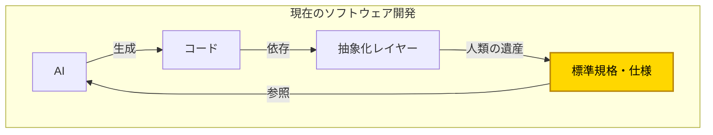
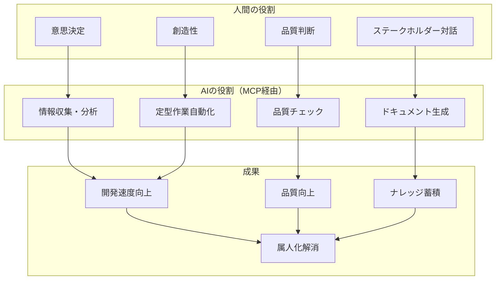
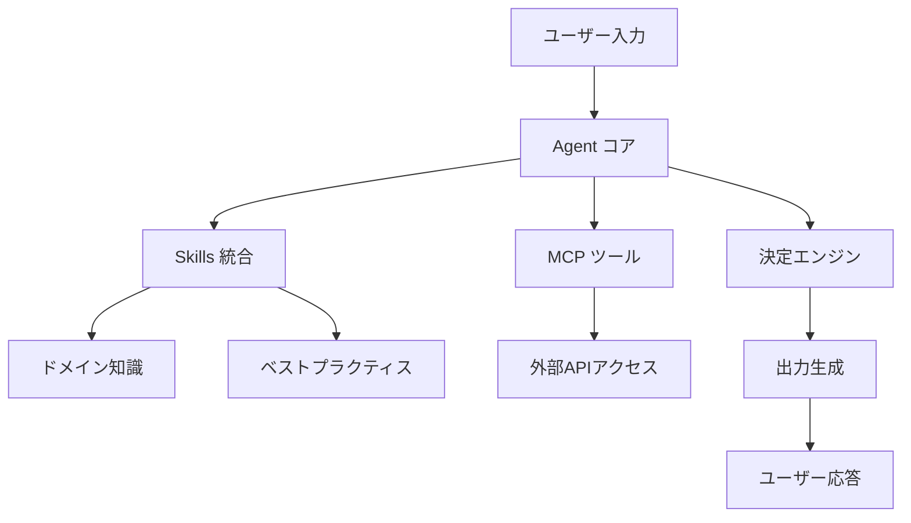
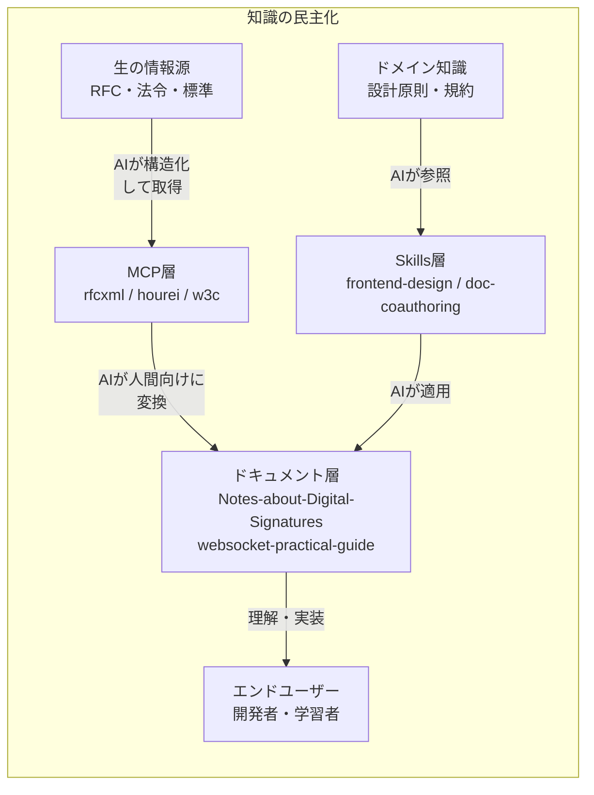

# AI駆動開発のビジョン

このドキュメントでは、AIエージェント構成（MCP・Skills・Agent統合）の根底にある思想と、AI駆動開発に対する基本的な考え方を整理する。

> AI駆動開発の本質は、コード生成だけでなく、**全工程でAIを「知的アシスタント」として活用**し、人間はより高次の判断・創造に集中できる環境を作ることである。

## 核心的な認識

### AIは「万能ではない」

AIの能力が急速に向上している一方で、その限界を正しく認識することが重要である。AIを過信せず、適切に活用するためには、以下の制約を理解する必要がある。

AIは学習データから確率的に出力を生成するが、以下を保証できない。

| AIの限界   | 説明                                                 |
| ---------- | ---------------------------------------------------- |
| **正確性** | Hallucination問題 - 事実と異なる情報を生成する可能性 |
| **最新性** | 学習データのカットオフ以降の情報を持たない           |
| **権威性** | 仕様の正式な解釈を保証できない                       |
| **責任性** | 法的・倫理的判断の根拠を示せない                     |

**だから、信頼できるソースに接続する必要がある。**

## AI駆動開発の本質

```
AI駆動開発 ≠ AIにコードを書かせること
AI駆動開発 = 全工程でAIを活用し、人間は判断・創造に集中
```

### 過渡期における現実

現在、AIがCI/CDを含め、いきなりバイナリを出力して実装できるような未来が来るまで、**これまでの人々が培ってきたエンジニアリングの導入は不可欠**である。

その必要なものとな何か？

つまり、「AIは最もらしい生成は行なってくれるが、**判断するための指針が必要**」ということです。

そのために**ブレない参照先**が必要になる。



## 「ブレない参照先」の重要性

### なぜ参照先が必要か

AIの抱える課題に対して、「ブレない参照先」がどのように解決に寄与するかを以下の表に整理する。

| AIの課題             | 参照先が解決すること           |
| -------------------- | ------------------------------ |
| 学習データの時点固定 | 権威ある最新情報源へのアクセス |
| ハルシネーション     | 検証可能な根拠の提供           |
| 文脈による解釈のブレ | 一貫した判断基準               |
| 最新情報の欠如       | 最新仕様の取得                 |

### 「ブレない参照先」を実現する2つの手段

AIに「ブレない参照先」を与える手段として、**MCP**と**Skills**がある。

| 手段                                                | 役割                                     | 例                                       |
| --------------------------------------------------- | ---------------------------------------- | ---------------------------------------- |
| **[MCP](https://modelcontextprotocol.io/)**         | 外部の権威ある情報源への動的アクセス     | RFC、法令、W3C標準                       |
| **[Skills](https://github.com/vercel-labs/skills)** | ドメイン知識・ベストプラクティスの体系化 | 設計原則、ワークフロー、コーディング規約 |

### 参照先MCP/Skillsの価値

MCPとSkillsを導入して参照先を確立することで、以下の価値が得られる。

1. **AIの判断が検証可能になる** - 出力の根拠を示せる
2. **一貫性のある品質が担保される** - 標準に準拠した出力
3. **ベンダーロックインを回避できる** - オープン標準に基づく
4. **知識へのアクセスが民主化される** - 専門家でなくても正確な情報に到達
5. **ドメイン知識が再利用可能になる** - チームのノウハウをSkillsとして形式知化

## 知識の民主化

### 従来の問題点

```Mermaid
flowchart LR
    専門家 --> 書籍/講演 --> 一般開発者
```

- 高コスト
- 一方通行
- 言語障壁

### MCP/Skillsが実現する世界

```Mermaid
flowchart TB
  A[外部の権威ある情報源<br>（RFC/法令/W3C）]
  B[ドメイン知識<br>（設計原則/規約）]
  M[MCP化（動的アクセス）]
  S[Skills化（体系化）]

  A --> M
  B --> S
  M --> AI
  S --> AI
  AI --> ドキュメント/チェックリスト --> 誰でもアクセス可能な知識
```

高額なコンサルや専門家に頼らなくても、**正確な情報に基づいた開発ができるようになる**。

> **MCPとSkillsの使い分け**については [skills/vs-mcp.md](../skills/vs-mcp.md) を参照。

## 人間 → AI（構造化）の知識変換

AIが「揺らがない参照元」にアクセスできるようにする。

### MCPによる外部情報源の構造化

外部の権威ある情報源をMCPとして構造化することで、AIが直接参照できるようになる。

| 人間の知識 | 構造化形式 | AIが使える形   |
| ---------- | ---------- | -------------- |
| 法律の条文 | e-Gov API  | hourei-mcp     |
| 技術仕様   | RFC XML    | rfcxml-mcp     |
| Web標準    | W3C/WHATWG | w3c-mcp        |
| 翻訳ルール | 用語集     | DeepL Glossary |

### Skillsによるドメイン知識の体系化

チーム内のドメイン知識をSkillsとして体系化することで、AIが組織固有の判断基準を参照できるようになる。

| チームの知識     | 形式     | AIが使える形           |
| ---------------- | -------- | ---------------------- |
| 設計原則         | Markdown | frontend-design skill  |
| コーディング規約 | Markdown | coding-standards skill |
| ワークフロー     | Markdown | doc-coauthoring skill  |

## AI → 人間（理解支援）の知識変換

人間が専門家でなくても正確な知識にアクセスできるようにする。

以下は、複雑な情報源をAIが処理し、人間が理解しやすい形式に変換する具体例である。

| 複雑な情報源        | AI処理     | 人間が理解できる形 |
| ------------------- | ---------- | ------------------ |
| RFC 3161（135要件） | 抽出・分類 | チェックリスト     |
| 電子署名法 + RFC    | 対応付け   | マッピング表       |
| 技術仕様            | 可視化     | Mermaid図          |
| 英語RFC             | 翻訳       | 日本語解説         |

## 人間とAIの役割分担

AI駆動開発では、人間とAIの役割を明確に分けることが重要である。以下の図は、それぞれが得意とする領域と、協働による成果を示している。



## MCP、Skills、Agentの基本的なフロー

ユーザーのリクエストがMCP・Skills・Agentの各コンポーネントを経由して処理される基本的な流れを以下に示す。



## このリポジトリの位置づけ

このリポジトリが「知識の民主化」の中でどのような役割を果たすかを以下の図で示す。



このリポジトリは、AIエージェント構成（MCP・Skills・Agent統合）の設計思想・アーキテクチャ・実践ノウハウを整理し、**AI駆動開発の基盤となる「ブレない参照先」の構築戦略**を記録する場所である。

## 核心メッセージ

このドキュメントの核心メッセージを以下にまとめる。

1. **AI駆動開発はコード生成だけではない** - 全工程でAIを活用
2. **AIには判断の指針が必要** - ブレない参照先の重要性
3. **人間のエンジニアリング知識を体系化** - MCP/Skillsとして形式知化
4. **標準規格MCPが基盤** - RFC, W3C, 法令等へのアクセス民主化
5. **ドメイン知識はSkillsで共有** - チームのノウハウを再利用可能に
6. **双方向の知識変換** - 人間→AI（構造化）、AI→人間（理解支援）
