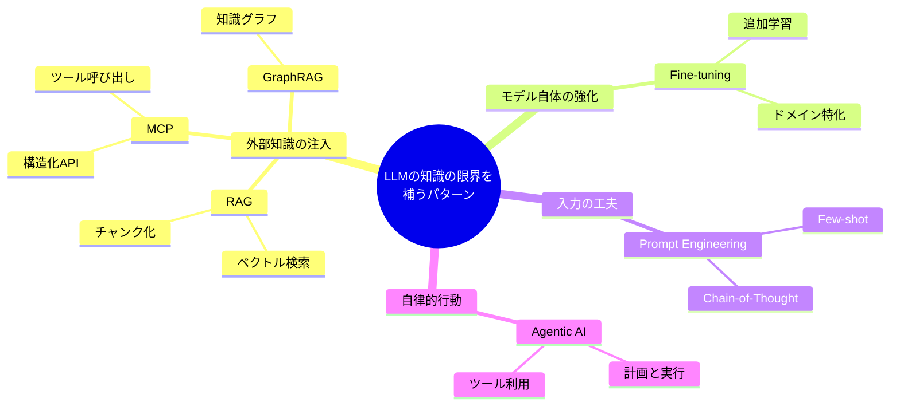
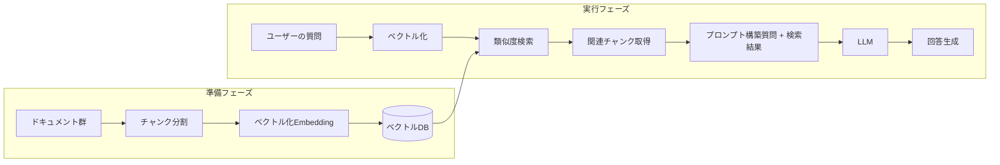
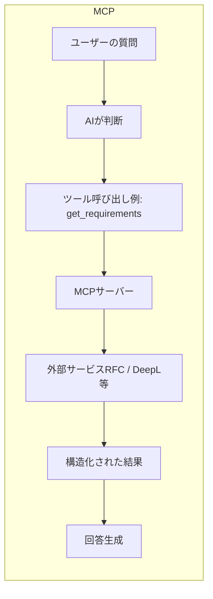
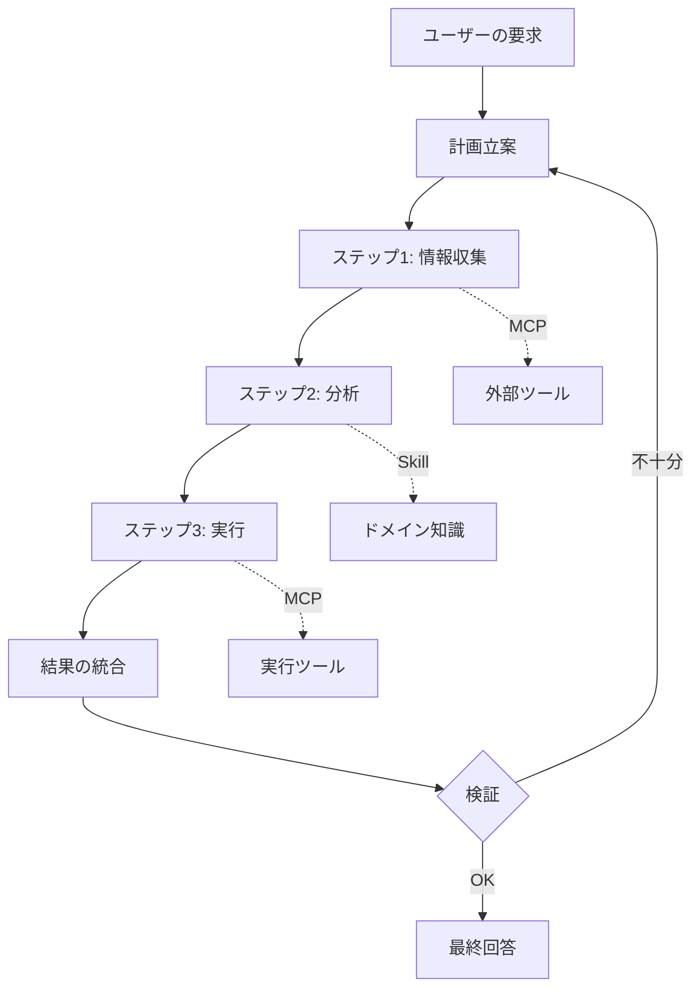
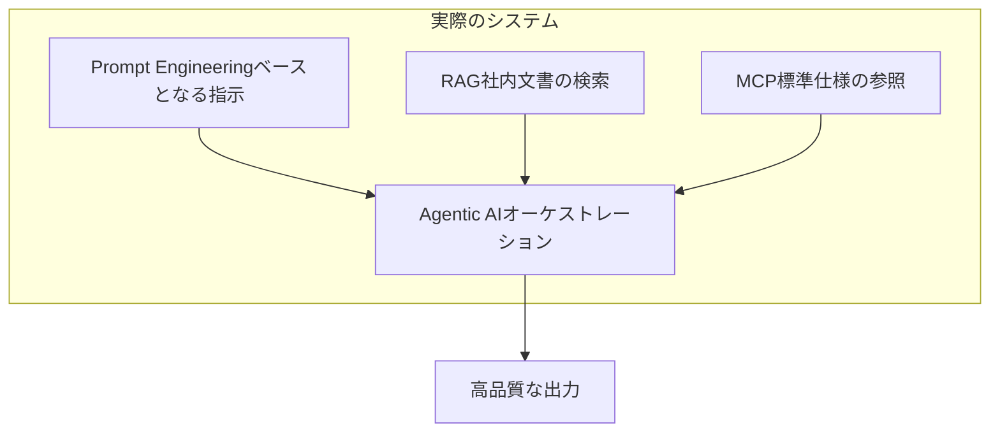
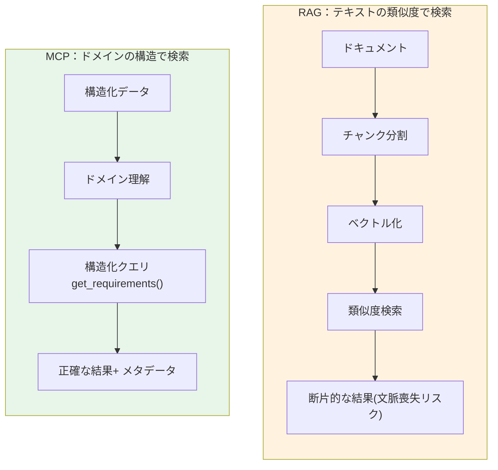
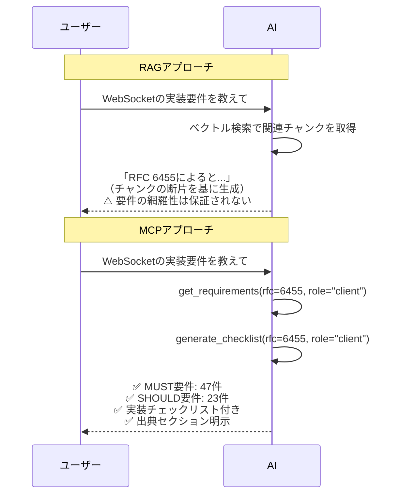
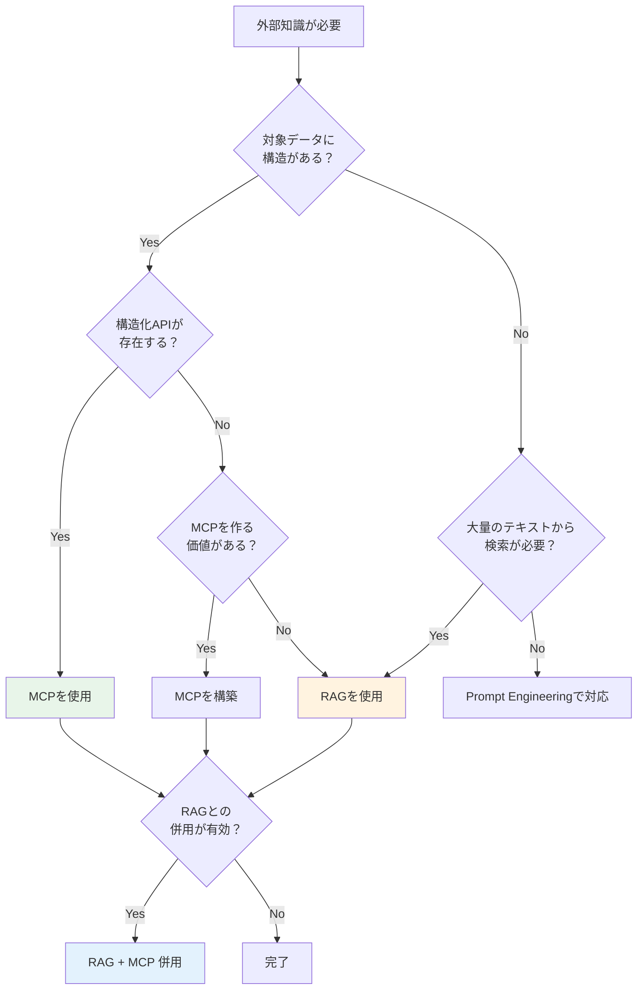
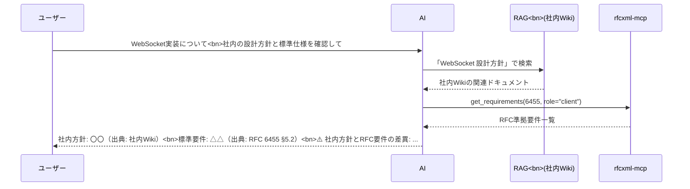
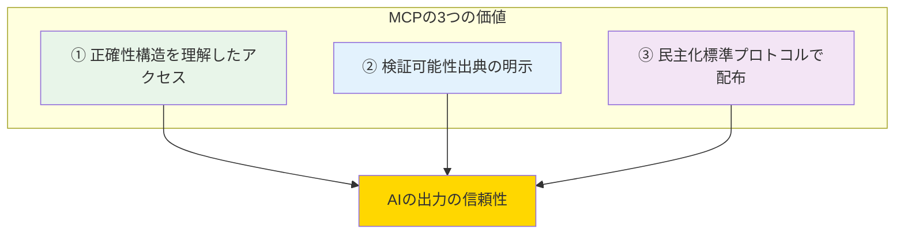

# 生成AIの設計パターンとMCPの位置づけ

> LLMの「知識の限界」に対して、業界はどのようなアプローチを取ってきたか。その中でMCPはどこに位置し、何が違うのか。

## このドキュメントについて

生成AI（LLM）を実用的なシステムに組み込むためには、モデル単体の能力だけでは不十分である。AIの知識には限界があり（[01-vision.md](./01-vision) 参照）、それを補うためにさまざまな設計パターンが生まれてきた。

このドキュメントでは、代表的な設計パターンを俯瞰し、特にRAG（Retrieval-Augmented Generation）とMCPの違いを丁寧に解説する。「RAGとMCPは何が違うのか？」「なぜこのプロジェクトはMCPを選んでいるのか？」という疑問に答えることが目的である。

## 第1章：LLMの「知識の限界」— なぜ外部知識が必要なのか

LLMは大量のテキストデータから学習した確率的な生成モデルである。非常に幅広い知識を持つが、以下の限界がある（詳細は [02-reference-sources.md](./02-reference-sources) 第1章を参照）。

```
LLMの知識
┌─────────────────────────────────────────┐
│  ✅ 学習済みの知識（膨大だが固定）        │
│     - 一般知識、プログラミング、言語       │
│     - 学習時点までの情報                   │
├─────────────────────────────────────────┤
│  ❌ 持っていない知識                      │
│     - 学習カットオフ以降の情報              │
│     - 社内ドキュメント・独自データ          │
│     - 稀な専門知識（マイナーなRFCの詳細等） │
│     - リアルタイム情報                     │
└─────────────────────────────────────────┘
```

この「持っていない知識」を補うために、さまざまな設計パターンが考案されてきた。

## 第2章：生成AIの主な設計パターン

### 2.1 パターンの全体像

LLMの限界を補うための主要な設計パターンを以下に整理する。



### 2.2 各パターンの概要

#### RAG（Retrieval-Augmented Generation：検索拡張生成）

外部のドキュメントを検索し、関連する情報をLLMのプロンプトに注入する手法。LLM自体を変更せず、「検索 + 生成」を組み合わせる。



**ポイント**: RAGの核心は「ベクトル類似度」で情報を検索すること。ドキュメントを小さな断片（チャンク）に分割し、質問と意味的に近い断片を取り出してLLMに渡す。

| 特性         | 説明                                              |
| ------------ | ------------------------------------------------- |
| **対象**     | 非構造化テキスト（ドキュメント、FAQ、社内Wiki等） |
| **検索方式** | ベクトル類似度検索（セマンティック検索）          |
| **前処理**   | ドキュメントのチャンク化 → ベクトル化 → DB格納    |
| **強み**     | 大量の文書から関連情報を見つけられる              |
| **弱み**     | チャンク分割で文脈が失われる、構造を理解しない    |

#### MCP（Model Context Protocol）

AIモデルと外部ツール・サービスを接続するための標準プロトコル。Anthropicが策定。AIが構造化されたAPIを通じて外部データにアクセスし、アクションを実行できるようにする。



**ポイント**: MCPの核心は「構造化されたAPI」で情報にアクセスすること。ドメインの構造（セクション、要件レベル、相互参照等）を理解した上でデータを取得する。

| 特性             | 説明                                  |
| ---------------- | ------------------------------------- |
| **対象**         | 構造化されたデータ・API・外部サービス |
| **アクセス方式** | 構造化API呼び出し（JSON-RPC）         |
| **前処理**       | 不要（MCPサーバーが構造を理解）       |
| **強み**         | 正確なデータ取得、検証可能、配布可能  |
| **弱み**         | MCPサーバーの開発が必要               |

> **MCPの詳細**: [mcp/what-is-mcp.md](../mcp/what-is-mcp) を参照。

#### Fine-tuning（ファインチューニング）

LLMのパラメータ自体を、特定ドメインのデータで追加学習させる手法。モデルの「内部知識」を書き換える。

```
ベースモデル（GPT-4, Claude等）
    ↓ + 特定ドメインのデータで追加学習
カスタマイズされたモデル
    ↓
ドメイン固有の知識で回答可能
```

| 特性         | 説明                                           |
| ------------ | ---------------------------------------------- |
| **対象**     | ドメイン固有の知識・スタイル                   |
| **変更箇所** | モデルのパラメータ自体                         |
| **コスト**   | 高い（学習データ準備 + 計算資源）              |
| **強み**     | モデルに深く知識を埋め込める                   |
| **弱み**     | 更新が困難、ハルシネーションの完全排除は不可能 |

#### Prompt Engineering（プロンプトエンジニアリング）

モデルのパラメータを変えず、入力プロンプトの工夫だけで出力品質を制御する手法。

```
主な技法:
- Zero-shot:     指示のみ
- Few-shot:      例を数個添える
- Chain-of-Thought: 「ステップバイステップで考えて」
- System Prompt: 役割や制約を事前に定義
```

| 特性         | 説明                           |
| ------------ | ------------------------------ |
| **対象**     | あらゆるタスク                 |
| **変更箇所** | 入力プロンプトのみ             |
| **コスト**   | 最も低い                       |
| **強み**     | すぐに試せる、モデル変更不要   |
| **弱み**     | モデルが知らない知識は補えない |

#### Agentic AI（エージェント型AI）

LLMが自律的に計画を立て、ツールを呼び出し、複数ステップで問題を解決するパターン。MCPはこのパターンを支える基盤技術の一つ。



| 特性     | 説明                                  |
| -------- | ------------------------------------- |
| **対象** | 複合的・多段階のタスク                |
| **動作** | 自律的な計画 → 実行 → 検証のループ    |
| **依存** | MCP（ツール接続）、Skills（知識参照） |
| **強み** | 複雑なタスクを自動化できる            |
| **弱み** | 予測困難、制御が難しい場合がある      |

> **エージェントの詳細**: [03-architecture.md](./03-architecture) を参照。

#### GraphRAG

通常のRAGにナレッジグラフ（知識グラフ）を組み合わせ、エンティティ間の関係性を活用する手法。

```
通常のRAG:  ドキュメント → チャンク → ベクトル検索
GraphRAG:   ドキュメント → エンティティ抽出 → 関係グラフ構築 → グラフ検索
```

| 特性     | 説明                                 |
| -------- | ------------------------------------ |
| **対象** | エンティティ間の関係性が重要なデータ |
| **強み** | 「AはBにどう関係するか」に強い       |
| **弱み** | グラフ構築コストが高い               |

### 2.3 パターンの比較一覧

| パターン               | 解決する問題                 | 変更箇所            | コスト | リアルタイム性                |
| ---------------------- | ---------------------------- | ------------------- | ------ | ----------------------------- |
| **RAG**                | 知識の補完                   | プロンプト          | 中     | △（インデックス更新頻度依存） |
| **MCP**                | ツール接続・正確なデータ取得 | プロンプト          | 中〜高 | ◎（リアルタイム）             |
| **Fine-tuning**        | ドメイン特化                 | モデルパラメータ    | 高     | ✗（再学習が必要）             |
| **Prompt Engineering** | 出力品質制御                 | プロンプト          | 低     | -                             |
| **Agentic AI**         | 複合タスク自動化             | アーキテクチャ      | 高     | ◎                             |
| **GraphRAG**           | 関係性理解                   | プロンプト + グラフ | 高     | △                             |

### 2.4 パターンは排他ではない

これらのパターンは**互いに排他的ではなく、組み合わせて使う**ものである。



例えば、Agentic AIがPrompt Engineeringで適切に指示を受け、必要に応じてRAGで社内文書を検索し、MCPで標準仕様を確認する、というシステムは十分にありえる。

## 第3章：RAGを深く理解する

### 3.1 RAGの仕組み

RAGは2020年にMeta（旧Facebook）の研究チームが発表した手法で、LLMに外部知識を与える最も普及したパターンである。

#### ステップ1: インデックス構築（オフライン）

```
元ドキュメント
  「RFC 6455はWebSocketプロトコルを定義する。
   Section 5.5.1ではClose frameの形式を規定し、
   Section 7.4.1ではステータスコードを定義する。
   1006は異常クロージャを示し、Close frameに
   含めてはならない（MUST NOT）。」

    ↓ チャンク分割

チャンク1: 「RFC 6455はWebSocketプロトコルを定義する。
           Section 5.5.1ではClose frameの形式を規定し」
チャンク2: 「Section 7.4.1ではステータスコードを定義する。
           1006は異常クロージャを示し」
チャンク3: 「Close frameに含めてはならない（MUST NOT）。」

    ↓ ベクトル化（Embedding）

チャンク1 → [0.12, -0.34, 0.56, ...]  ← 数百〜数千次元の数値ベクトル
チャンク2 → [0.23, -0.11, 0.78, ...]
チャンク3 → [0.45, -0.67, 0.12, ...]

    ↓ ベクトルDBに格納
```

#### ステップ2: 検索と生成（オンライン）

```
ユーザーの質問: 「WebSocketのステータスコード1006とは？」

    ↓ 質問もベクトル化

質問ベクトル → [0.21, -0.15, 0.72, ...]

    ↓ 類似度検索（コサイン類似度等）

最も近いチャンク → チャンク2:
  「Section 7.4.1ではステータスコードを定義する。
   1006は異常クロージャを示し」

    ↓ プロンプトに注入

「以下の情報を参考に質問に回答してください。
 ---
 Section 7.4.1ではステータスコードを定義する。
 1006は異常クロージャを示し
 ---
 質問: WebSocketのステータスコード1006とは？」

    ↓ LLMが回答生成
```

### 3.2 RAGの強みと典型的なユースケース

RAGが特に有効な場面を以下に整理する。

| ユースケース           | 説明                                 | 例                             |
| ---------------------- | ------------------------------------ | ------------------------------ |
| **社内文書検索**       | 大量の内部ドキュメントからの情報取得 | 社内Wiki、マニュアル、FAQ      |
| **カスタマーサポート** | 製品知識ベースからの回答生成         | ヘルプセンター、チャットボット |
| **学術研究**           | 論文データベースからの関連情報抽出   | 文献レビュー支援               |
| **法務支援**           | 契約書・判例の類似検索               | 類似条項の発見                 |

**RAGが得意なこと**: 大量の非構造化テキストから「意味的に近い」情報を見つけること。

### 3.3 RAGの限界

一方で、RAGには構造的な限界がある。

#### チャンク分割による文脈の喪失

```
元の文脈:
  「1006は異常クロージャを示し、Close frameに
   含めてはならない（MUST NOT）。」

チャンク分割後:
  チャンク A: 「1006は異常クロージャを示し」    ← 検索で取得
  チャンク B: 「Close frameに含めてはならない」  ← 取得されない可能性

→ MUST NOT という重要な要件が欠落するリスク
```

#### 構造の理解不足

```
RAGが返すもの:
  「1006は異常クロージャを示す」（テキスト断片）

RAGが返せないもの:
  - これが Section 7.4.1 に定義されていること
  - MUST NOT レベルの要件であること
  - Section 5.5.1 の Close frame 形式との関係
  - RFC 6455 全体での位置づけ
```

#### 検索精度の限界

ベクトル類似度検索は「意味的に近い」ものを返すが、「正確に一致する」ものを返すとは限らない。

```
質問: 「RFC 6455のステータスコード1002の意味は？」

返される可能性のあるチャンク:
  ✅ 「1002はプロトコルエラーを示す」（正しい）
  ❌ 「1006は異常クロージャを示す」（意味的に近いが、聞いてないもの）
  ❌ 「1000は正常なクロージャを示す」（同カテゴリだが別のコード）
```

## 第4章：RAGとMCPの本質的な違い

### 4.1 アプローチの根本的な違い

RAGとMCPはどちらも「LLMに外部知識を与える」が、そのアプローチは根本的に異なる。



| 観点             | RAG                                    | MCP                               |
| ---------------- | -------------------------------------- | --------------------------------- |
| **検索の原理**   | テキストの意味的類似度                 | ドメイン構造に基づく正確なクエリ  |
| **前提**         | ドキュメントをチャンク化できる         | ドメインの構造を理解したAPIがある |
| **結果の性質**   | 「おそらく関連する」テキスト断片       | 「確実に該当する」構造化データ    |
| **出典の明確さ** | 曖昧（どのチャンクから来たか追跡困難） | 明確（RFC 6455 Section 7.4.1 等） |

### 4.2 「ブレない参照先」の5特性による比較

[02-reference-sources.md](./02-reference-sources) で定義した「ブレない参照先」の5つの特性で比較すると、違いがさらに明確になる。

| 特性               | RAG | MCP（参照先MCP） | 説明                                                                   |
| ------------------ | --- | ---------------- | ---------------------------------------------------------------------- |
| **権威性**         | △   | ◎                | RAGはチャンクの出典が曖昧。MCPは原典に直接アクセス                     |
| **不変性・版管理** | △   | ◎                | RAGはインデックス更新タイミングに依存。MCPは原典の版管理を反映         |
| **構造化**         | ✗   | ◎                | RAGはチャンク分割で構造が失われる。MCPはセクション・要件レベルを保持   |
| **検証可能性**     | △   | ◎                | RAGは「どのチャンクから生成したか」の追跡が困難。MCPは正確な出典を明示 |
| **アクセス可能性** | ○   | ◎                | どちらもプログラムでアクセス可能だが、MCPは標準プロトコル              |

### 4.3 具体例で比較する

#### 例：「RFC 6455のClose codeで1006の意味は？」

**RAGの場合:**

```
1. RFC 6455の全文をチャンク化してベクトルDBに格納（事前準備）
2. 質問をベクトル化し、類似チャンクを検索
3. 返されたチャンク:
   「1006 is a reserved value and MUST NOT be set as a status code
    in a Close control frame by an endpoint.」

問題点:
- このチャンクが Section 7.4.1 から来たことが不明確
- MUST NOT の要件レベルがメタデータとして付与されない
- 前後の文脈（なぜMUST NOTなのか）が欠落する可能性
- 別のチャンク（1002の説明等）が返る可能性もある
```

**rfcxml-mcp の場合:**

```
1. get_requirements(rfc=6455, section="7.4.1") を呼び出し
2. 返される結果:
   {
     section: "7.4.1",
     requirement: "1006 is a reserved value and MUST NOT be set
                   as a status code in a Close control frame
                   by an endpoint.",
     level: "MUST NOT",
     context: "It is designated for use in applications
               expecting a status code to indicate that
               the connection was closed abnormally"
   }

利点:
- セクション番号が明確（Section 7.4.1）
- 要件レベルが構造化（MUST NOT）
- 前後の文脈が保持
- validate_statement() で実装の適合性まで検証可能
```

#### 例：「電子署名法第2条の要件は？」

**RAGの場合:**

```
法令全文をチャンク化 → 「第2条」関連のチャンクを検索
→ 法令の「条・項・号」の構造が失われる
→ 改正前と改正後の版が混在するリスク
```

**hourei-mcp（e-gov-law MCP）の場合:**

```
find_law_article(law_name="電子署名法", article_number="2") を呼び出し
→ 条文の構造（項・号）がそのまま取得できる
→ 最新の法令データを取得（e-Gov APIからリアルタイム）
```

### 4.4 配布可能性の違い

MCPには「標準プロトコルとして配布できる」という決定的な優位性がある。

```
RAGパイプラインの共有:
  1. ドキュメントの準備
  2. チャンク分割ロジックの実装
  3. Embedding モデルの選定
  4. ベクトルDBの構築・運用
  5. 検索パラメータの調整
  → 各組織が個別に構築する必要がある

MCPサーバーの共有:
  npx @shuji-bonji/rfcxml-mcp
  → これだけで、構造化されたRFCアクセスを誰でも得られる
```

| 観点             | RAG                               | MCP                        |
| ---------------- | --------------------------------- | -------------------------- |
| **配布方法**     | 独自構築が前提                    | npm パッケージ等で配布可能 |
| **導入コスト**   | ベクトルDB構築 + インデックス作成 | 設定ファイル1つ            |
| **品質の均一性** | 構築者のスキルに依存              | サーバー開発者が品質保証   |
| **メンテナンス** | 各組織が個別に対応                | サーバー開発者が一括更新   |

## 第5章：このプロジェクトのMCPサーバーとRAGの比較

### 5.1 「一見RAGと同じでは？」という疑問

このプロジェクトの関連MCPサーバー（rfcxml-mcp、w3c-mcp、pdf-spec-mcp、epsg-mcp等）を見ると、「外部の仕様書を検索してLLMに渡す」という点でRAGと同じことをしているように見えるかもしれない。

しかし、根本的な違いがある。

### 5.2 「テキスト検索」vs「ドメイン知識のコード化」

各MCPサーバーは、対象ドメインの**構造と意味を理解したAPI**を提供している。これは単なるテキスト検索ではなく、**ドメイン知識のコード化**である。

| MCPサーバー        | 理解している構造                                                          | RAGでは失われるもの                            |
| ------------------ | ------------------------------------------------------------------------- | ---------------------------------------------- |
| **rfcxml-mcp**     | セクション階層、MUST/SHOULD/MAY分類、RFC間の相互参照（obsoletes/updates） | 要件レベルの区別、セクション間の関係           |
| **w3c-mcp**        | WebIDL定義、CSS仕様構造、HTML要素の属性とコンテンツモデル                 | インターフェースの型情報、プロパティの継承関係 |
| **pdf-spec-mcp**   | ISO 32000の章構造、要件テーブル、用語定義                                 | テーブル構造、仕様バージョン間の差分           |
| **epsg-mcp**       | 座標参照系の用途推奨、変換パス、精度特性                                  | 空間的な適用範囲、変換の精度情報               |
| **pdf-reader-mcp** | PDFの内部オブジェクト構造、タグ階層、フォント情報                         | バイナリ構造の解釈、オブジェクト間の参照関係   |

### 5.3 実用上の差異



## 第6章：RAGとMCPの使い分け

### 6.1 判断フロー



### 6.2 使い分けガイド

| シナリオ                | 推奨                 | 理由                             |
| ----------------------- | -------------------- | -------------------------------- |
| RFC/W3C等の仕様準拠確認 | **MCP**              | 構造化された要件抽出が必要       |
| 社内ドキュメントの検索  | **RAG**              | 非構造化テキストの大量検索       |
| 法令の条文取得          | **MCP**              | 条・項・号の構造を保持する必要   |
| カスタマーサポートFAQ   | **RAG**              | 多様な質問への柔軟な対応         |
| 翻訳の品質評価          | **MCP**              | 構造化されたスコアとエラー検出   |
| 研究論文の要約          | **RAG**              | 大量の非構造化テキストの処理     |
| PDF仕様の要件チェック   | **MCP**              | テーブルと要件レベルの正確な取得 |
| チーム内ナレッジ共有    | **RAG** or **Skill** | 状況に応じて選択                 |

### 6.3 併用パターン

RAGとMCPは排他的ではない。以下のような併用パターンが考えられる。

**パターン：RAGで概要把握 → MCPで正確性確認**



## 第7章：このプロジェクトがMCPを選ぶ理由

### 7.1 プロジェクトの思想との整合

このプロジェクトの核心思想は「ブレない参照先」である（[01-vision.md](./01-vision) 参照）。

```
RAGは「おそらく関連する情報」を返す    → ブレる可能性がある
MCPは「確実に該当する情報」を返す      → ブレない
```

AIの出力に**検証可能な根拠**を持たせるためには、出典が明確で、構造化されたデータアクセスが不可欠である。これがこのプロジェクトがMCPを中心に据えている根本的な理由である。

### 7.2 MCPの3つの価値

このプロジェクトの文脈で、MCPが提供する価値を3つにまとめる。



1. **正確性**: ドメインの構造を理解したAPIで、正確な情報を取得できる
2. **検証可能性**: 出典（RFC番号、セクション番号等）が常に明示される
3. **民主化**: npmパッケージとして配布でき、誰でも同じ品質のアクセスを得られる

### 7.3 RAGを否定しているわけではない

重要な注意点として、このプロジェクトはRAGを否定しているわけではない。RAGは「大量の非構造化テキストから関連情報を見つける」という目的において、非常に強力な手法である。

ただし、**AIの判断に「ブレない参照先」を与える**という目的においては、MCPのアプローチがより適切である。それぞれのパターンには適切な用途がある。

```
RAGの適切な用途:  「たくさんの文書から関連しそうなものを見つけたい」
MCPの適切な用途:  「特定の仕様・規格から正確な情報を取得したい」

→ 目的が違うので、優劣ではなく使い分け
```

## まとめ

### 核心メッセージ

1. **生成AIにはさまざまな設計パターンがある** — RAG、MCP、Fine-tuning、Agentic AI等、それぞれ異なる問題を解決する
2. **RAGは「テキストの類似度」で検索する** — 大量の非構造化テキストから関連情報を見つけるのに強い
3. **MCPは「ドメインの構造」で検索する** — 構造化されたAPIで正確な情報を取得する
4. **「ブレない参照先」にはMCPが適する** — 権威性・構造化・検証可能性・配布可能性でMCPが優位
5. **RAGとMCPは排他ではない** — それぞれ適切な用途があり、併用も可能
6. **各MCPサーバーはドメイン知識をコード化したもの** — 単なるテキスト検索ではなく、構造の理解を提供する

### 関連ドキュメント

- [01-vision.md](./01-vision) — AIの限界と「ブレない参照先」の必要性
- [02-reference-sources.md](./02-reference-sources) — 5つの特性による参照先の体系
- [03-architecture.md](./03-architecture) — MCP/Skills/Agentの構成論
- [mcp/what-is-mcp.md](../mcp/what-is-mcp) — MCPの詳細
- [skills/vs-mcp.md](../skills/vs-mcp) — MCPとSkillsの使い分け
