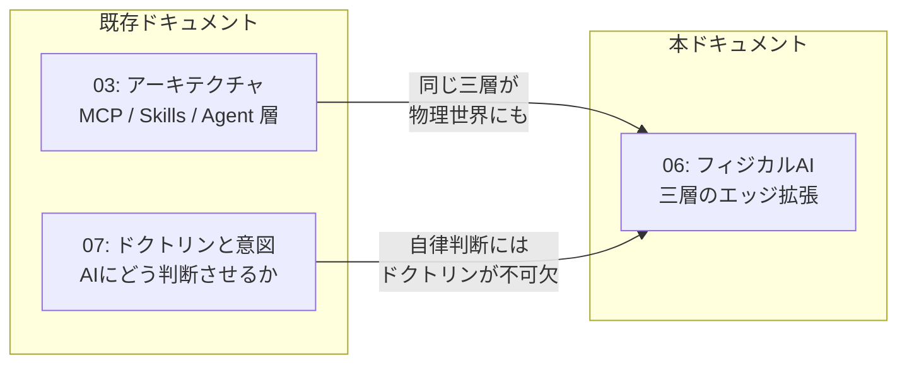
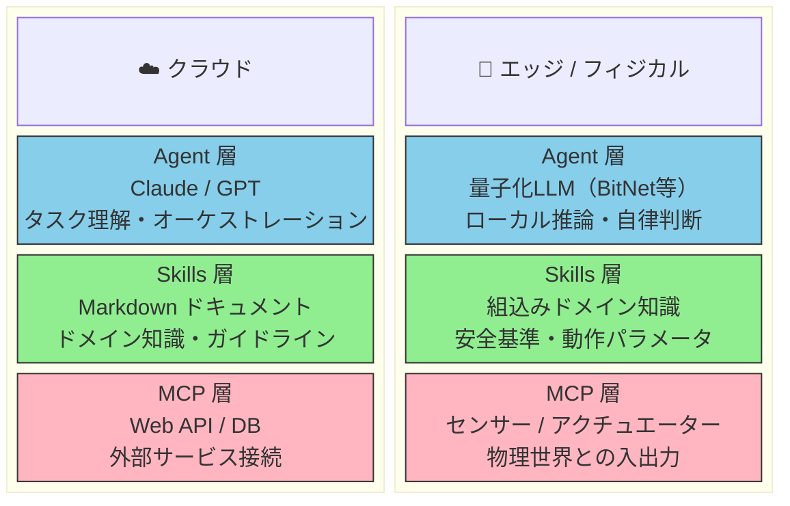
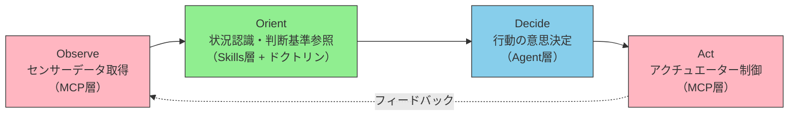
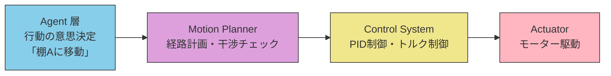
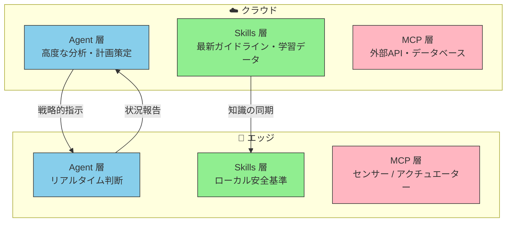

# フィジカルAI — 三層アーキテクチャのエッジ拡張

クラウドで確立された Agent / Skills / MCP の三層モデルは、エッジデバイスやロボティクスの世界でも構造的一貫性を保つ。

::: info
クラウド環境で機能する Agent / Skills / MCP の三層モデルは、物理世界のエッジデバイスでも成り立つのか？

> 答えは「成り立つ」——しかも、**構造を変えずに**成り立つ。

:::

**対象読者**: AIエージェントアーキテクチャをソフトウェアの枠を超えて理解したいエンジニア、エッジAI・IoT・ロボティクスとの接点を設計するチームにも有用です。

::: warning このページの位置づけ
[01-vision](./01-vision)（**WHY** — なぜブレない参照先が必要か）  \
→ [02-reference-sources](./02-reference-sources)（**WHAT** — 何を参照先とするか）  \
→ [03-architecture](./03-architecture)（**HOW** — どう構成するか）  \
→ [04-ai-design-patterns](./04-ai-design-patterns)（**WHICH** — どのパターンをいつ選ぶか）  \
→ [05-solving-ai-limitations](./05-solving-ai-limitations)（**REALITY** — 現実の制約にどう向き合うか）  \
→ **本ページ（EXTENSION — 三層モデルを物理世界へ拡張する）**
:::

## ドキュメントシリーズにおける位置づけ



## フィジカルAIとは

フィジカルAI（Physical AI）とは、AIが物理世界を認識し、判断し、直接作用する技術領域である。自動運転、産業用ロボット、ドローン、ヒューマノイドなどが典型的な応用分野にあたる。

::: tip Embodied AI との関係
学術的には **Embodied AI**（身体性AI）という用語が広く使われる。Embodied AI は「身体を持ち、環境と相互作用しながら学習する」ことに焦点を当てた概念であり、フィジカルAIはその実装形態の一つと位置づけられる。本ドキュメントでは、三層アーキテクチャのエッジ拡張という文脈に合わせて「フィジカルAI」の呼称を用いる。
:::

### ワールドモデルの重要性

フィジカルAIが情報空間のAIと決定的に異なるのは、**ワールドモデル**（World Model）——物理世界の法則に関する内部表現——を必要とする点である。重力、摩擦、衝突、慣性といった物理法則を理解していなければ、ロボットは安全に動作できない。

```
情報空間のAI : テキスト・データの処理 → 物理法則は無関係
フィジカルAI : 実世界での行動 → 重力・摩擦・衝突の理解が不可欠
```

ワールドモデルは Skills 層に組み込まれるドメイン知識の一部として機能し、Agent 層の判断に物理的な妥当性を与える。

従来、フィジカルAIはソフトウェアAIとは別の世界として語られてきた。しかし、以下の技術的進展がこの境界を解消しつつある。

- **BitNet（1.58bit量子化LLM）** — 大規模言語モデルをエッジデバイスで推論可能にする
- **MCP（Model Context Protocol）** — ツールとの接続を標準化する
- **エッジコンピューティングの進化** — デバイス上でのリアルタイム処理能力の向上

## BitNet b1.58 — エッジ推論を現実にする技術

フィジカルAIのAgent層を成立させる鍵が、Microsoft Researchが発表した **BitNet b1.58** である。

### なぜ「1.58bit」なのか

従来のLLMは16bit（FP16）や32bit（FP32）の浮動小数点で重みを保持する。BitNet b1.58 はこれを **{-1, 0, 1} の3値**にまで極限的に圧縮する。「1.58」という数字は、3つの等確率な値を符号化するのに必要な情報量 log₂(3) ≈ 1.58 に由来する。

```
従来のLLM :  重み = 任意の浮動小数点値（FP16: 65,536通り）
BitNet b1.58: 重み = {-1, 0, 1} の3値のみ
```

### 従来の量子化手法との違い

GPTQ、AWQ、QLoRAなどの既存手法は、学習済みモデルを**事後的に**圧縮する。精度と圧縮率のトレードオフが常に付きまとう。一方、BitNet b1.58はTransformerの線形層を **BitLinear** に置き換え、**最初から1.58bitで学習する**。これにより、事後圧縮では避けられない品質劣化を構造的に回避している。

```
既存の量子化: 学習（FP16）→ 事後圧縮 → 品質劣化が不可避
BitNet b1.58: 最初から1.58bitで学習 → 構造的に最適化済み
```

### 具体的な性能

BitNet b1.58 の70Bパラメータモデルは、同規模のLLaMA（FP16）と比較して以下の成果を示している。

| 指標                          | BitNet b1.58 vs LLaMA（FP16） |
| ----------------------------- | ----------------------------- |
| **推論速度**                  | 4.1倍高速                     |
| **バッチ容量**                | 11倍                          |
| **スループット**              | 8.9倍                         |
| **行列演算エネルギー効率**    | 71.4倍                        |
| **ARM CPUでの高速化**         | 1.37〜5.07倍                  |
| **x86 CPUでの高速化**         | 2.37〜6.17倍                  |
| **x86 CPUでのエネルギー削減** | 71.9〜82.2%                   |

特筆すべきは、100Bパラメータモデルを**単一CPU上**で実行し、人間の読書速度（毎秒5〜7トークン）に相当する処理速度を達成していることである。

### 特別なマシンは必要ない

BitNet b1.58 の最大の意義は、**特別なハードウェアを必要としない**ことにある。

推論フレームワーク [BitNet.cpp](https://github.com/microsoft/BitNet) は llama.cpp をベースに構築されており、以下のアーキテクチャで動作確認済みである。

| アーキテクチャ     | 検証済みハードウェア例                | 用途                      |
| ------------------ | ------------------------------------- | ------------------------- |
| **x86-64（AVX2）** | Intel i7-13800H（ノートPC）、AMD EPYC | デスクトップ / サーバー   |
| **ARM（NEON）**    | Apple M2、Cobalt 100                  | ノートPC / タブレット     |
| **ARM（DOTPROD）** | ARM v8.2以降                          | モバイル / エッジデバイス |

ノートPCの CPU で LLM が実用的な速度で動く——これは「エッジAI」が研究室の話ではなく、**今手元にあるハードウェアで始められる**ことを意味している。

最新の並列カーネル最適化（2026年1月）では、タイリングの構成を調整可能にし、さらに **1.15〜2.1倍の追加高速化** を達成している。Embedding層の量子化（Q6_K形式）にも対応し、精度をほぼ維持しつつメモリ使用量と推論速度を改善している。

::: tip GPUの役割は変わるが、なくなるわけではない
BitNet b1.58 は推論時のGPU依存を大幅に削減するが、モデルの学習にはGPUが依然として必要である。「GPUが不要になる」のではなく、**「推論がCPUで実用的になる」**というのが正確な理解である。また、llama.cpp ベースで構築されているため、既存の推論パイプラインとの統合も容易である。
:::

::: warning BitNet b1.58 の現時点での制約
BitNet は有望な技術だが、以下の制約を認識しておく必要がある。

- **学習済みモデルの選択肢が限定的** — 従来のFP16モデルのように豊富な事前学習済みモデルが存在しない
- **テキスト生成品質** — 高精度な自然言語生成タスクにはFP16モデルが依然として優位
- **エコシステムの成熟度** — ツールチェーンやコミュニティがまだ発展途上
- **Fine-tuning手法の未確立** — 1.58bit モデルのドメイン適応手法はまだ研究段階

フィジカルAIの制御タスク（離散的判断、二値分類）には十分な精度を持つが、**万能ではない**。適用領域の見極めが重要である。
:::

::: details BitNet 以外のエッジ推論アプローチ
本ドキュメントでは BitNet b1.58 を代表例として取り上げているが、エッジ推論を実現する技術は他にも存在する。

| アプローチ | 特徴 | 成熟度 |
| --- | --- | --- |
| **GGUF量子化（llama.cpp）** | Q4_K_M / Q5_K_M 等の事後量子化。モデル選択肢が最も豊富 | 高 |
| **Apple MLX** | Apple Silicon 最適化の推論フレームワーク | 中〜高 |
| **TinyLlama / Phi-3-mini** | 小規模設計モデル。量子化なしでもエッジ動作可能 | 中 |
| **MediaPipe LLM Inference** | Google のモバイル / エッジ向け推論 API | 中 |

三層モデルの構造的主張（責務分離がエッジでも成り立つ）は、Agent 層の推論エンジンが何であっても変わらない。BitNet はその中でも「事後圧縮ではなく構造的に最適化されている」点で、本ドキュメントの設計思想と親和性が高い。
:::

### フィジカルAIとの親和性

この効率性は、フィジカルAIの文脈で特に意味を持つ。ロボットやドローンは**バッテリー駆動**が基本であり、エネルギー効率71.4倍という数値は「エッジで動かせる」だけでなく「**バッテリーで長時間自律動作できる**」ことを意味する。

さらに、物理世界の制御タスクは言語生成ほどの精度を必要としない場面が多い。

```
テキスト生成     : 微妙なニュアンスの表現 → 高精度が必要
コード生成       : 構文の正確性 → 高精度が必要
──────────────────────────────────────────
ロボット制御     : 「右に30度回転」→ 離散的な判断で十分
異常検知         : 「正常 / 異常」 → 二値分類に近い
経路選択         : 「A / B / Cのどれか」→ 限定的な選択肢
```

1.58bitの重み精度は、テキスト生成には不十分でも、物理制御には**十分に実用的**である。これが、量子化モデルとフィジカルAIの組み合わせを成立させている。

## クラウドとエッジの三層対応

### 構造の対称性

クラウドで確立された三層モデルが、エッジでもそのまま対応する。



### 各層の対応関係

| 層         | クラウド                            | エッジ / フィジカル                                 |
| ---------- | ----------------------------------- | --------------------------------------------------- |
| **Agent**  | Claude, GPT 等のLLM                 | 量子化LLM（BitNet等）によるローカル推論             |
| **Skills** | Markdown ドキュメント、ガイドライン | 組込みドメイン知識、安全基準、物理パラメータ        |
| **MCP**    | Web API、DB、外部サービス           | センサー入力、アクチュエーター制御、物理デバイスI/O |

## なぜ「構造を変えずに」成り立つのか

三層モデルの本質は技術実装ではなく、**責務の分離**にある。

```
Agent  = 「何をすべきか判断する」
Skills = 「判断に必要な知識を持つ」
MCP    = 「外部と接続して実行する」
```

この責務の分離は、接続先がWeb APIであろうとセンサーであろうと変わらない。変わるのは各層の**実装**であり、**構造**ではない。

### 実装の違い

| 観点               | クラウド                               | エッジ                           |
| ------------------ | -------------------------------------- | -------------------------------- |
| **推論モデル**     | フルサイズLLM（数十〜数百Bパラメータ） | 量子化モデル（1.58bit、数B以下） |
| **知識の格納**     | ファイルシステム / API                 | 組込みROM / ローカルストレージ   |
| **ツール接続**     | HTTP / JSON-RPC                        | GPIO / CAN / シリアル通信        |
| **レイテンシ要件** | 秒〜分単位                             | ミリ秒〜秒単位                   |
| **接続性**         | 常時接続前提                           | オフライン動作が必須             |
| **エネルギー制約** | データセンター電源                     | バッテリー駆動（効率が生存条件） |

## ドクトリン層の不可欠性

物理世界で自律的に動作するAIにとって、[ドクトリン層](./07-doctrine-and-intent)の重要性はクラウド以上に高い。

```
クラウド: 判断ミス → データの誤処理、ユーザー体験の低下
エッジ : 判断ミス → 物理的な事故、人的被害の可能性
```

フィジカルAIのドクトリンには、ソフトウェアにはない要素が加わる。

- **安全制約**（Safety Constraints） — 物理的な被害を防ぐためのハードリミット
- **フェイルセーフ**（Fail-safe） — 通信断絶時・異常時の退避行動
- **倫理的制約**（Ethical Constraints） — 人間の安全を最優先とする不可侵ルール
- **リアルタイム制約**（Real-time Constraints） — 判断の遅延が許容される限界

::: warning 不可逆性 — 物理世界での自律判断
ソフトウェアの世界では判断ミスは「やり直し」が可能だが、物理世界では**不可逆な結果**をもたらし得る。フィジカルAIの設計において最も重要な原則は、この不可逆性の認識である。

- **レイテンシ制約**: ロボットの緊急停止判断は **100ms以下** で完結する必要がある。クラウドへの往復は許容されず、エッジでの即時判断が必須となる
- **安全マージン**: 判断ミスのコストが桁違いに大きいため、ドクトリン層による制約は**安全装置（セーフガード）**として機能する
- **フェイルセーフの義務化**: 通信断絶・センサー異常時の退避行動は、オプションではなく**設計要件**である

判断の性質は変わらないが、**結果の重大性が上がる**——これがフィジカルAIの本質的な設計課題である。
:::

## OODAサイクルとの対応

フィジカルAIは、OODAサイクルのもっとも直感的な実装例でもある。



| OODAフェーズ | 三層モデルの対応      | フィジカルAIでの具体例                        |
| ------------ | --------------------- | --------------------------------------------- |
| **Observe**  | MCP層（入力）         | カメラ、LiDAR、温度センサー等からのデータ取得 |
| **Orient**   | Skills層 + ドクトリン | 安全基準の参照、状況の分類、優先度の判定      |
| **Decide**   | Agent層               | 「停止」「回避」「継続」等の行動選択          |
| **Act**      | MCP層（出力）         | モーター制御、アラート発報、通信送信          |

## Agent から Robot へ — 制御の流れ

Agent 層の判断がロボットの物理動作に変換されるまでには、制御システムとモーションプランナーを経由する。



Agent 層は**高レベルな意図**を出力し、その間の制御ループは従来のロボティクス技術が担う。三層モデルは制御システムを置き換えるのではなく、その上位で**判断と知識の層**を提供する。

## クラウド × エッジの連携パターン

実際のフィジカルAIシステムでは、エッジ単独ではなく、クラウドとの連携が前提となる。



### 連携パターン

| パターン       | 説明                                           | 例                                         |
| -------------- | ---------------------------------------------- | ------------------------------------------ |
| **知識の同期** | クラウドのSkillsをエッジに反映                 | 安全基準の更新、新しい動作パラメータの配布 |
| **判断の分担** | リアルタイム判断はエッジ、高度な分析はクラウド | 緊急停止はローカル、経路最適化はクラウド   |
| **状況の報告** | エッジのセンサーデータをクラウドに集約         | 異常検知ログの送信、遠隔モニタリング       |

### マルチエージェントとA2A

フィジカルAIの現場では、複数のロボットやドローンが協調して作業する**マルチエージェント**構成が一般的になりつつある。Agent-to-Agent（A2A）プロトコルによるエージェント間通信は、倉庫ロボットの群制御やドローン編隊飛行などで実用化が進んでいる。

### デジタルツインとMCP

物理デバイスの**デジタルツイン**（仮想的な複製）をMCPサーバーとして公開することで、クラウド側のAgentが物理デバイスの状態を参照・制御できる。これはMCPの「外部ツール接続の標準化」というコンセプトの自然な延長であり、物理世界とソフトウェアの境界をさらに曖昧にする。

## ソフトウェアエンジニアにとっての意味

フィジカルAIは「別世界の話」ではない。三層モデルの理解があれば、ソフトウェアエンジニアでもアーキテクチャの設計に参加できる。

```
あなたが今設計しているMCPサーバーの接続先が、
Web APIからセンサーに変わっただけ。

あなたが今書いているSkillのドメイン知識が、
翻訳ガイドラインから安全基準に変わっただけ。

あなたが今構成しているAgentの判断ロジックが、
テキスト処理からモーター制御に変わっただけ。
```

三層の**構造**は同じ。変わるのは**実装の詳細**だけである。

## まとめ

フィジカルAIは、三層アーキテクチャの「特殊なケース」ではなく、**最も直接的な拡張**である。

| 観点 | 核心メッセージ |
| --- | --- |
| **構造の一貫性** | Agent / Skills / MCP の責務分離は、物理世界でもそのまま成り立つ |
| **エッジ推論の実現** | BitNet b1.58 により、エッジデバイスでのローカル推論が現実的になった（LLaMA比71.4倍のエネルギー効率） |
| **不可逆性への対応** | ドクトリン層の重要性は、不可逆な結果をもたらし得る物理世界でこそ際立つ |
| **設計フレームワーク** | OODAサイクルは、フィジカルAIの自然な設計フレームワークとして機能する |
| **本質的な違い** | 判断の性質は変わらない——変わるのは**結果の重大性**と**レイテンシ制約**だけである |

```
クラウドで学んだアーキテクチャは、物理世界への橋渡しになる。
構造を理解している者は、実装先が変わっても適応できる。
```

## 参考文献

- [BitNet.cpp — Microsoft Research](https://github.com/microsoft/BitNet) — 1-bit LLM推論フレームワーク公式リポジトリ
- [BitNet CPU Inference Optimization](https://github.com/microsoft/BitNet/blob/main/src/README.md) — 並列カーネル実装の技術詳細、対応アーキテクチャ、ベンチマーク結果
- [BitNet: LLM の課題を解決する1-bit モデル](https://note.com/shimmyo_lab/n/n78197cb4936f) — BitNet の背景と既存量子化手法との比較
- [BitNet b1.58 の仕組みと意義](https://qiita.com/tech-Mira/items/67dec9c5a5f025d2727a) — b1.58 の命名理由、性能データ、エッジデバイスでの実用性

## 関連ドキュメント

- [03-architecture](./03-architecture) — **HOW**: 三層モデルの構造定義（本ページのエッジ拡張の基盤）
- [04-ai-design-patterns](./04-ai-design-patterns) — **WHICH**: パターンの選択指針（エッジ環境でのパターン適用に関連）
- [05-solving-ai-limitations](./05-solving-ai-limitations) — **REALITY**: AI の制約と対策（物理世界ではレイテンシ・安全制約がさらに厳しくなる）
- [07-doctrine-and-intent](./07-doctrine-and-intent) — **DOCTRINE**: ドクトリンと意図の設計（物理世界での自律判断に不可欠）
