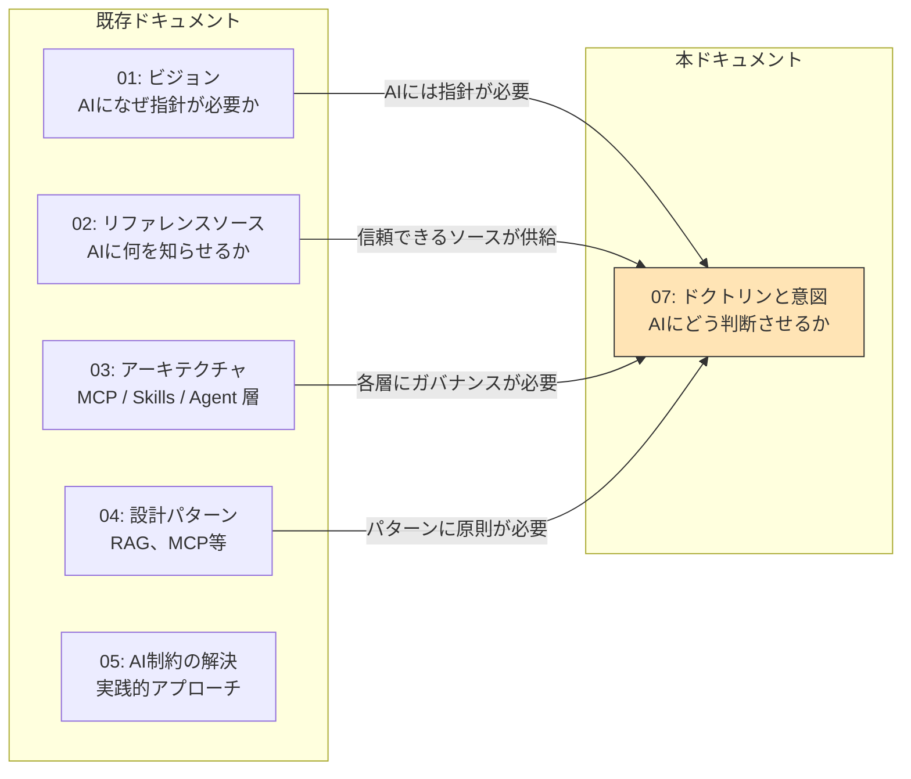
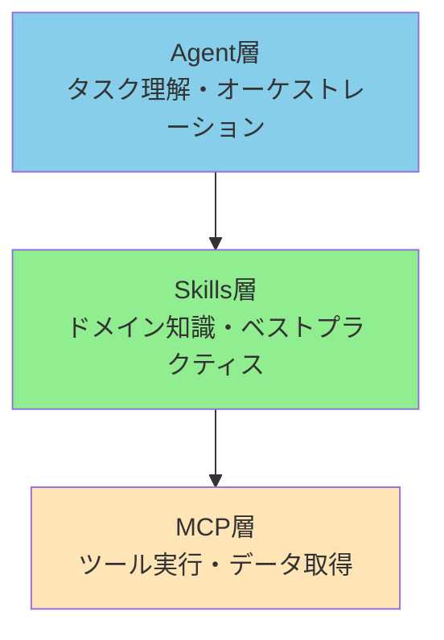
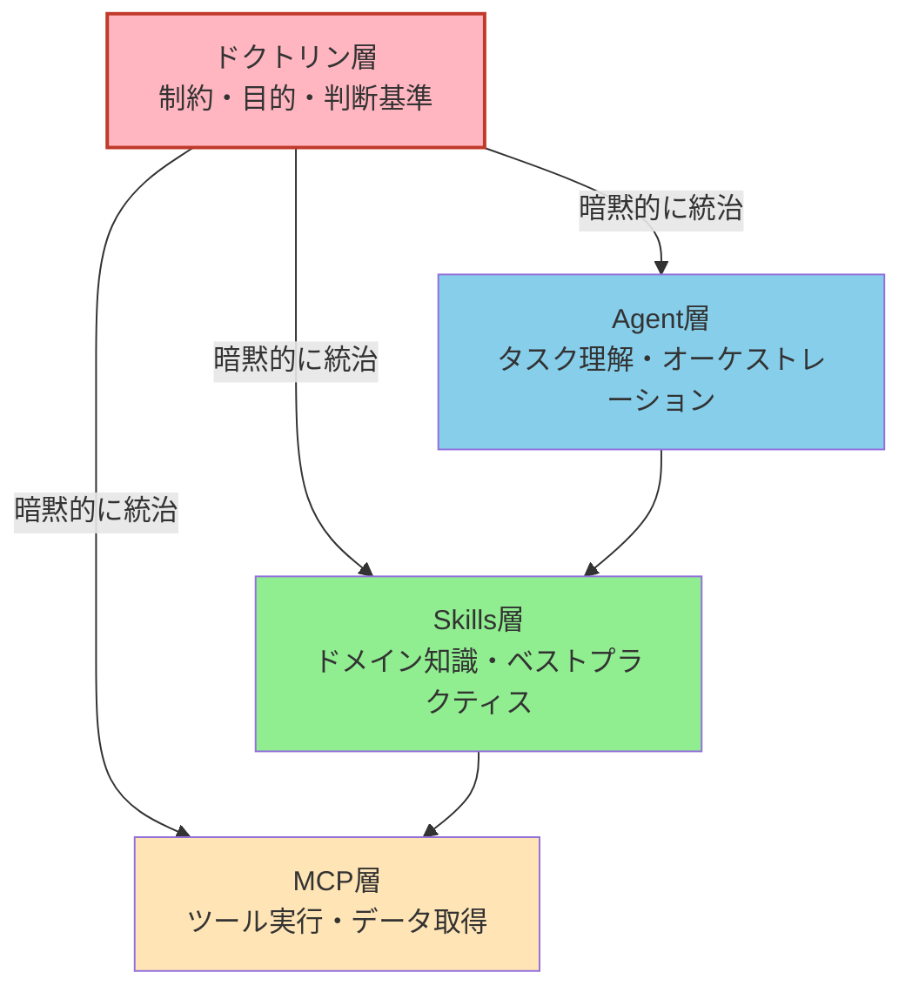
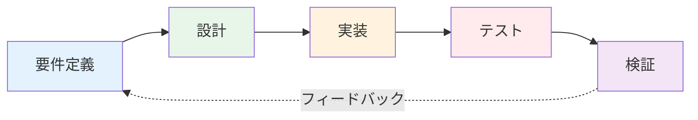
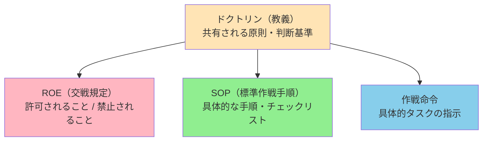
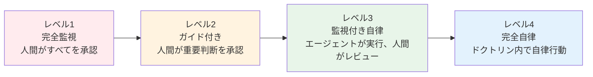
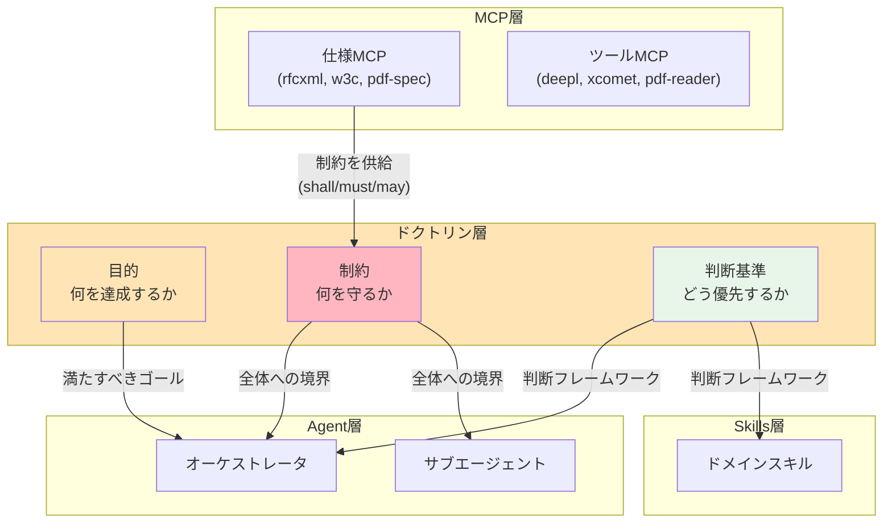
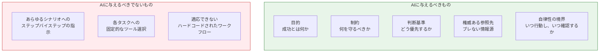

# ドクトリン層 — AIに与えるべきは「制約と目的」であり「手順」ではない

> AIに「こう動け」と指示するのではなく、**「この条件を満たせ、このリソース内で、この信頼性で」**と伝える。

## このドキュメントについて

本ドキュメントは、以下の2つのオープンイシューを同時に解決する：

- [#28: 判断と行動の自律性](https://github.com/shuji-bonji/ai-agent-architecture/issues/28) — 「AIにどう判断させるか」
- [#30: ドクトリン層を取り入れる](https://github.com/shuji-bonji/ai-agent-architecture/issues/30) — 「すべてのエージェントが共有すべき原則とは何か」

これらを結びつける核心的な設計原則がある：

```
AIへの入力を「命令的な手順」から「宣言的な意図」へ転換する。
— 制約と目的を与えれば、実現方法はAIが選択する。
```

> **対象読者**: ステップバイステップのプロンプティングから脱却し、原則に基づいた制約駆動型のAIガバナンスを構築したいエンジニア。複数エージェント間で共有ガイドラインを確立するチームリーダーにも有用。

## ドキュメントシリーズにおける位置づけ



| ドキュメント | 中心的な問い |
|-------------|-------------|
| 01-vision | **なぜ** AIに指針が必要か？ |
| 02-reference-sources | **何を** AIに知らせるべきか？ |
| 03-architecture | コンポーネントは**どこに**配置するか？ |
| 04-design-patterns | **どの**パターンを使うか？ |
| 05-solving-limitations | AI制約を**どう**軽減するか？ |
| **07-doctrine-and-intent** | AIは**何を基準に**判断し行動すべきか？ |

## 欠けていた層

既存の三層アーキテクチャ（[03-architecture](./03-architecture)）は、Agent層・Skills層・MCP層を定義し、AIが何を知り、何ができるかをカバーしている。しかし、決定的な問いが残されている：**AIは何を基準に判断し、決定するのか？**

### 現在の三層モデル

既存アーキテクチャは「AIが何を知っているか」「AIが何をできるか」をカバーしている：



### 欠けているもの：判断の根拠

OODAループへのマッピング（[#28](https://github.com/shuji-bonji/ai-agent-architecture/issues/28) で指摘）：

| OODAフェーズ | 役割 | 現在のカバー状況 |
|-------------|------|----------------|
| **Observe（観察）** | コンテキスト収集 | MCP層（✅ カバー済み） |
| **Orient（方向付け）** | 判断基準の適用 | ❌ **明示的に未定義** |
| **Decide（決定）** | 優先順位付け、トレードオフ解決 | ❌ **明示的に未定義** |
| **Act（実行）** | ツール経由の実行 | MCP層（✅ カバー済み） |

**Orient** と **Decide** — 判断基準と意思決定原則が存在する場所 — には、現在のアーキテクチャに専用の場所がない。ここに**ドクトリン層**が位置する。

### ドクトリンを含む四層モデル



## 核心原則：「手順」ではなく「制約と目的」を与える

四層モデルが確立されたところで、ドクトリン層を駆動する核心的な設計原則を明確にする：**AIにステップバイステップの手順ではなく、制約と目的を与えよ。** この原則は、ソフトウェア抽象化の広い流れに沿ったものである。

### ソフトウェア抽象化の歴史

ソフトウェア開発の各世代は、人間が提供するものの抽象度を引き上げてきた：

| 時代 | 人間が提供するもの | 機械が担うこと |
|------|------------------|---------------|
| アセンブラ | レジスタ操作 | 命令エンコーディング |
| C | ロジック記述 | メモリ管理 |
| Python | コードでの意図 | 型処理、GC |
| AI（現在） | 自然言語での意図 | コード生成 |
| AI（次段階） | **制約 + 目的** | 実装上の判断 |

核心的な洞察：**抽象度が上がるにつれ、人間の入力は「どう（How）」から「何を（What）」へ、そして最終的に「なぜ（Why）」と「どの範囲で（Within what bounds）」へシフトする。**

### 命令 vs 意図

| アプローチ | 例 | 問題点 |
|-----------|---|--------|
| **命令的**（手順指示） | 「仕様書で'digital signature'を検索し、Section 12.8を抽出し、shall要件を列挙せよ」 | 脆い — 仕様構造が変われば壊れる |
| **宣言的**（意図提示） | 「PDF 2.0における電子署名の全規範要件に、我々の実装が準拠しているか検証せよ」 | 堅牢 — AIが適切なツールと経路を選択する |

宣言的アプローチには、AIが以下を持つことが必要となる：
1. **目的（Objectives）** — 成功とは何か
2. **制約（Constraints）** — 何を尊重すべきか
3. **判断基準（Judgment Criteria）** — トレードオフをどう評価するか

この3要素が**ドクトリン**を形成する。

### なぜ開発プロセスにとって重要か

AI駆動であろうと人間駆動であろうと、本質的な開発プロセスは同じである：



このサイクルは、コードが手書きでも、AIが生成しても、将来のコンパイル技術が生み出しても変わらない。変わるのは抽象化レベルであり、**「要件定義したか？設計したか？テストしたか？検証したか？」**は普遍である。

ドクトリン層は、このプロセスのガバナンスをAIエージェント向けに形式化するものである。

## ドクトリン層の構造

ドクトリン層の構造的なインスピレーション源は軍事ドクトリンにある。軍事ドクトリンは、不確実性の下で自律的な意思決定を可能にするために確立されたフレームワークである。核心的な洞察は、軍事組織がAIエージェントで直面している問題を遥か昔から解決してきたということである：**直接のコミュニケーションが不可能な状況で、いかに一貫した判断を担保するか？**

### 軍事ドクトリンとの対応

[#30](https://github.com/shuji-bonji/ai-agent-architecture/issues/30) で分析した通り、軍事ドクトリンの階層はAIエージェント設定に直接対応する：



| 軍事概念 | 役割 | Claude Code での定義場所 | AIアーキテクチャ層 |
|---------|------|------------------------|-------------------|
| **ドクトリン** | 全軍共通の原則 | `CLAUDE.md`（ルート） | **ドクトリン層** |
| **ROE** | 許可/禁止の規定 | `.claude/rules/` | **ドクトリン層** |
| **SOP** | 標準化された手順 | `.claude/skills/` | **Skills層** |
| **作戦命令** | 具体的任務指示 | `.claude/commands/` | **Agent層** |
| **部隊編成** | 専門能力の定義 | `.claude/agents/` | **Agent層** |

### ドクトリンの三要素

#### 1. 目的（Objectives）— 成功とは何か

「どう」ではなく「なぜ」を定義する：

```markdown
## 目的
- すべての公開APIエンドポイントはRFC 7231（HTTP Semantics）に準拠しなければならない（MUST）
- 翻訳出力はxCOMETスコア 0.85以上を達成しなければならない（MUST）
- コードカバレッジは80%を下回ってはならない（MUST NOT）
```

#### 2. 制約（Constraints）— 守るべき境界

どのエージェントも超えてはならない境界を定義する：

```markdown
## 制約
- テストに合格していないコードをコミットしてはならない（MUST NOT）
- セキュリティレビューなしに外部APIを呼び出してはならない（MUST NOT）
- 準拠を主張する前に、権威ある仕様に対して検証しなければならない（MUST）
- 破壊的操作には人間の承認を求めなければならない（MUST）
```

#### 3. 判断基準（Judgment Criteria）— トレードオフの評価方法

目的が競合する場合の優先順位を定義する：

```markdown
## 判断基準
- セキュリティ > パフォーマンス > 利便性
- 仕様準拠 > 実装速度
- 不確実な場合は、仮定せずユーザーに確認する
- 仕様ドキュメントの検索には、類似度検索より構造的アクセスを優先する
```

最後の基準 — 「仕様ドキュメントの検索には類似度検索より構造的アクセスを優先する」 — は、アーキテクチャ上の判断（ISO仕様書にRAGではなくMCPを選択する理由）がドクトリンとなる例である。

## 自律性レベル

ドクトリン層の重要な機能は、**各エージェントにどの程度の自由度を与えるか**を定義することである。フォーマットエージェントと本番デプロイエージェントでは、必要な監視レベルが大きく異なる。ドクトリン層は、各エージェントがこのスペクトラム上のどこに位置するかを定義すべきである：



| レベル | 使用場面 | 例 |
|-------|---------|---|
| レベル1 | 高リスク操作（本番デプロイ） | データベースマイグレーションエージェント |
| レベル2 | 中リスク（コード変更） | コードレビューエージェント |
| レベル3 | 低リスク・高ボリューム（翻訳） | 翻訳ワークフローエージェント |
| レベル4 | 明確な制約のあるルーチン作業 | フォーマット、リントエージェント |

ドクトリンは**デフォルトの自律性レベル**と**エスカレーションの条件**を定義する。

## 既存アーキテクチャとの統合

ドクトリン層は既存の三層を置き換えるのではなく、それらを**統治**する。各既存層はこれまで通り機能するが、その振る舞いを導く明示的な原則が加わる。以下の図は、ドクトリンの三要素（目的・制約・判断基準）が各層にどのように流れ込むかを示している。

### ドクトリンが各層に供給するもの



注目すべき点：**仕様MCPがドクトリン層に制約を供給する**。`pdf-spec-mcp` の `get_requirements` は規範要件（shall/must/may）を抽出し、それがドクトリンの制約となる。これが、仕様書へのアクセスにRAGベースの類似度検索よりも構造的アクセスが重要である理由のアーキテクチャ上の根拠である — ドクトリンには**正確で権威ある制約**が必要であり、「似たように聞こえる文章」ではない。

### 開発フェーズとの接続

各開発フェーズ（[development-phases.md](../workflows/development-phases)）がドクトリン要素にマッピングされる：

| 開発フェーズ | ドクトリン要素 | MCPサポート |
|------------|-------------|------------|
| 要件定義 | 目的 + 制約 | rfcxml-mcp, w3c-mcp, hourei-mcp |
| 設計 | 判断基準 | Skills（設計パターン） |
| 実装 | 制約（コーディング規約） | rxjs-mcp, リントツール |
| テスト | 目的（カバレッジ目標） | xcomet-mcp, テストフレームワーク |
| 検証 | 三要素すべて | pdf-spec-mcp (`get_requirements`) |

## 実践例：翻訳ワークフローのドクトリン

概念を具体化するために、翻訳ワークフローの完全なドクトリン定義を示す。この例は、ドクトリンの三要素（目的・制約・判断基準）と自律性レベルが連携して、エージェントが品質と一貫性を維持しながら独立して運用できることを示している。

```markdown
# 翻訳ワークフロー ドクトリン

## 目的
- 技術仕様書の日本語翻訳を、用語の一貫性と
  技術的正確性を保って作成する
- xCOMET品質スコア 0.85以上を達成する

## 制約
- ドメイン用語には登録済みグロッサリーを使用しなければならない（MUST）
- PDF仕様書のキーワード（shall, object, stream）を
  セクション間で異なる訳にしてはならない（MUST NOT）
- セクション番号と相互参照を保持しなければならない（MUST）
- 単一仕様書の翻訳は1セッション内で完了すべきである（SHOULD）

## 判断基準
- 用語の一貫性 > 自然な日本語表現
- 複数の有効な訳がある場合、グロッサリーのエントリを優先する
- xCOMETスコアが0.80未満の場合、次に進む前にセグメントを再翻訳する
- 2回の試行後も品質が改善しない場合、人間のレビューにフラグを立てる

## 自律性レベル
- レベル3（監視付き自律）: エージェントが翻訳と評価を行い、
  人間が最終出力をレビューする
```

このドクトリンにより、翻訳エージェントはあらゆる状況に対する明示的な指示なしに判断できるようになる — まさに軍事ドクトリンが設計された目的：「通信が途絶しても、すべての部隊が同じ判断をする」。

## AIに与えるべきもの：まとめ

以下の図は、ドクトリン層の哲学全体を一枚のビジュアルに集約している：AIエージェントに与えるべきものと、与えるべきでないもの。ドクトリンベースのアプローチを導入するチームのクイックリファレンスとして活用できる。



ドクトリン層は、この原則を運用可能にする場所である — `CLAUDE.md`、`.claude/rules/`、そしてすべてのエージェント活動を取り巻くガバナンス構造にエンコードされる。

## 関連ドキュメント

- [01-vision.md](./01-vision) — AIになぜ指針が必要か（問題定義）
- [02-reference-sources.md](./02-reference-sources) — ブレない参照先（何を知らせるか）
- [03-architecture.md](./03-architecture) — MCP/Skills/Agent 層構造
- [05-solving-ai-limitations.md](./05-solving-ai-limitations) — AI制約への実践的アプローチ
- [開発フェーズ](../workflows/development-phases) — 開発フェーズごとのMCP統合
- [スキル設計ガイド](../skills/creating-skills) — MUST/SHOULD/MUST NOT 制約パターン
- [Discussion #29](https://github.com/shuji-bonji/ai-agent-architecture/discussions/29) — ドクトリン議論の原点
