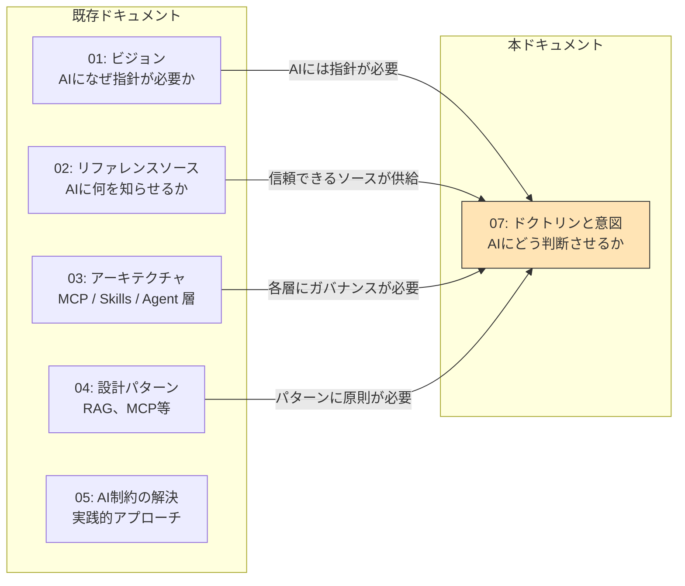
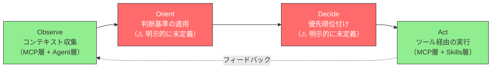
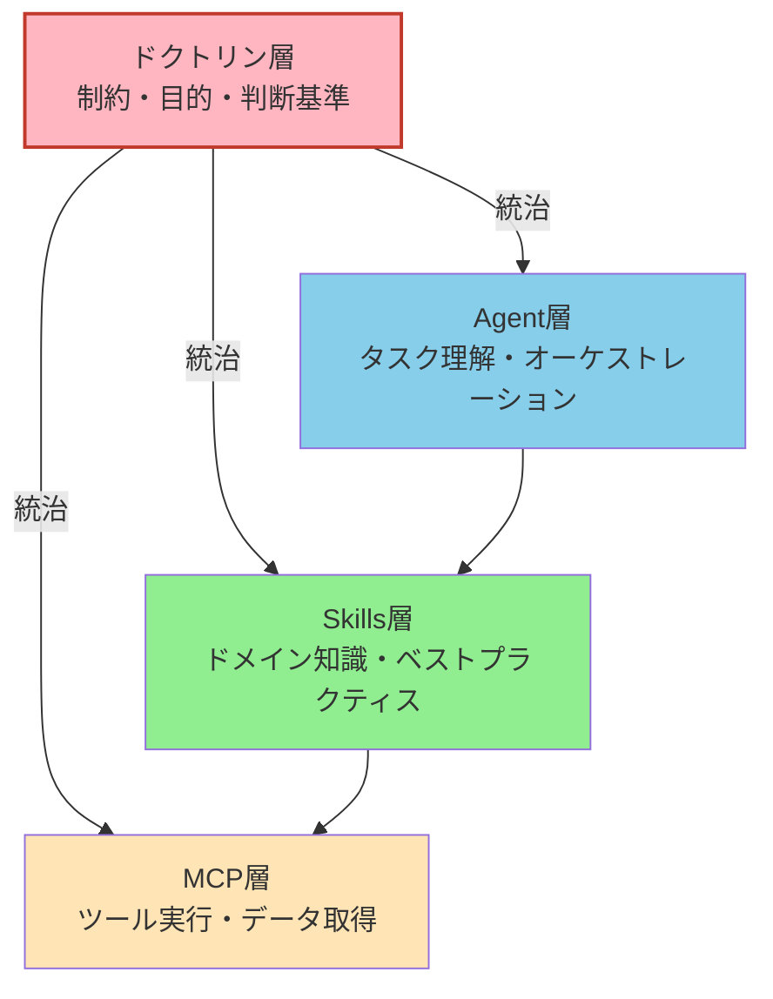
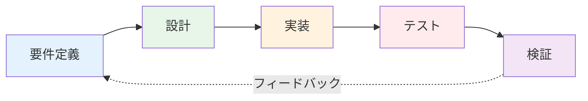
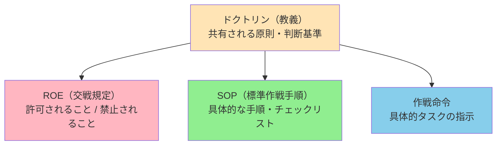
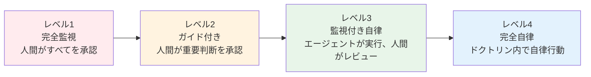
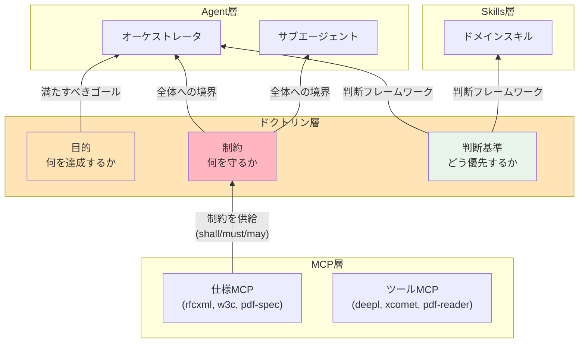
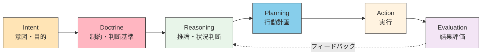
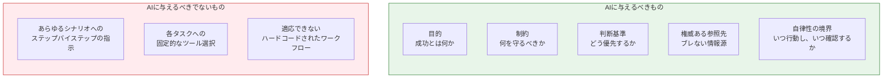

# ドクトリン層 — AIに与えるべきは「制約と目的」であり「手順」ではない

> AIに「こう動け」と指示するのではなく、**「この条件を満たせ、このリソース内で、この信頼性で」** と伝える。

## このドキュメントについて

本ドキュメントは、以下の2つのオープンイシューを同時に解決する。

- [#28: 判断と行動の自律性](https://github.com/shuji-bonji/ai-agent-architecture/issues/28) — 「AIにどう判断させるか」
- [#30: ドクトリン層を取り入れる](https://github.com/shuji-bonji/ai-agent-architecture/issues/30) — 「すべてのエージェントが共有すべき原則とは何か」

これらを結びつける核心的な設計原則がある。

```
AIへの入力を「命令的な手順」から「宣言的な意図」へ転換する。
— 制約と目的を与えれば、実現方法はAIが選択する。
```

> **対象読者**: ステップバイステップのプロンプティングから脱却し、原則に基づいた制約駆動型のAIガバナンスを構築したいエンジニア。複数エージェント間で共有ガイドラインを確立するチームリーダーにも有用。

::: warning このページの位置づけ
[01-vision](./01-vision)（**WHY** — なぜブレない参照先が必要か） \
→ [02-reference-sources](./02-reference-sources)（**WHAT** — 何を参照先とするか） \
→ [03-architecture](./03-architecture)（**HOW** — どう構成するか） \
→ [04-ai-design-patterns](./04-ai-design-patterns)（**WHICH** — どのパターンをいつ選ぶか） \
→ [05-solving-ai-limitations](./05-solving-ai-limitations)（**REALITY** — 現実の制約にどう向き合うか） \
→ [06-physical-ai](./06-physical-ai)（**EXTENSION** — 三層モデルを物理世界へ拡張する） \
→ **本ページ（DOCTRINE — AIは何を基準に判断し行動すべきか）**
:::

::: details メタ情報

|                          |                                                                                                                          |
| ------------------------ | ------------------------------------------------------------------------------------------------------------------------ |
| **この章で固定するもの** | ドクトリンの三要素（目的・制約・判断基準）、自律性レベル、Agent 実行ループ                                               |
| **扱わないこと**         | Evaluation/Evals の詳細設計（将来の拡張候補）、具体的なエージェント実装                                                  |
| **依存**                 | [03-architecture](./03-architecture)（統治対象の三層）、[06-physical-ai](./06-physical-ai)（物理世界でのドクトリン適用） |
| **誤用ポイント**         | ドクトリンを「厳格なルールブック」と見なすこと。ドクトリンは制約であると同時に、自律的判断を可能にする「姿勢の定義」     |

:::

## ドキュメントシリーズにおける位置づけ



| ドキュメント               | 中心的な問い                           |
| -------------------------- | -------------------------------------- |
| 01-vision                  | **なぜ** AIに指針が必要か？            |
| 02-reference-sources       | **何を** AIに知らせるべきか？          |
| 03-architecture            | コンポーネントは**どこに**配置するか？ |
| 04-design-patterns         | **どの**パターンを使うか？             |
| 05-solving-limitations     | AI制約を**どう**軽減するか？           |
| **07-doctrine-and-intent** | AIは**何を基準に**判断し行動すべきか？ |

## 欠けていた層

既存の三層アーキテクチャ（[03-architecture](./03-architecture)）は、Agent層・Skills層・MCP層を定義し、AIが何を知り、何ができるかをカバーしている。しかし、決定的な問いが残されています。

::: info
**AIは何を基準に判断し、決定するのか？**
:::

### 欠けているもの：判断の根拠

OODAループへのマッピング（[#28](https://github.com/shuji-bonji/ai-agent-architecture/issues/28) で指摘）で、三層モデルのギャップが明確になる。



Orient と Decide（赤）が三層モデルのギャップである。ドクトリン層の追加により、このギャップがどう埋まるかを以下の比較表で示す。

| OODAフェーズ           | 役割                           | 三層モデル（従来）                                    | 四層モデル（ドクトリン追加後）                                     |
| ---------------------- | ------------------------------ | ----------------------------------------------------- | ------------------------------------------------------------------ |
| **Observe（観察）**    | コンテキスト収集               | MCP層 + Agent層（✅ カバー）                          | MCP層 + Agent層（✅ 変更なし）                                     |
| **Orient（方向付け）** | 判断基準の適用                 | Skills層が暗黙的に寄与（⚠️ **明示的には未定義**）     | **ドクトリン層**が判断基準を明示的に供給 + Skills層（✅ カバー）   |
| **Decide（決定）**     | 優先順位付け、トレードオフ解決 | Agent層が暗黙的に実行（⚠️ **明示的には未定義**）      | **ドクトリン層**が優先順位を明示的に定義 + Agent層（✅ カバー）    |
| **Act（実行）**        | ツール経由の実行               | MCP層 + Skills層（✅ カバー）                         | MCP層 + Skills層（✅ 変更なし）                                    |

**Orient** と **Decide** — 判断基準と意思決定原則が存在する場所 — は、Skills層やAgent層が暗黙的に担っているが、現在のアーキテクチャにはこれらを**明示的に定義する専用の場所**がない。ドクトリン層は Observe や Act を直接担うのではなく、**Orient と Decide を明示的に定義する**ことで、既存層の暗黙的な判断を「原則に基づく意思決定」へ昇格させる。

### ドクトリンを含む四層モデル



### 理論的根拠：BDIモデルとの対応

ドクトリン層の設計は、エージェント研究の古典的フレームワークである **BDI（Belief-Desire-Intention）モデル** と構造的に対応する。

| BDI要素               | 意味                                     | 本アーキテクチャでの対応                         |
| --------------------- | ---------------------------------------- | ------------------------------------------------ |
| **Belief**（信念）    | エージェントが世界について知っていること | Skills層のドメイン知識 + MCP層からのコンテキスト |
| **Desire**（欲求）    | エージェントが達成したいこと             | ドクトリンの **目的（Objectives）**              |
| **Intention**（意図） | エージェントが採用した行動計画           | Agent層のタスク計画（ドクトリンの制約内で選択）  |

BDIモデルにおいて Desire は「何を達成したいか」であり、Intention は「そのためにどう行動するか」である。ドクトリン層はこの Desire を**明示的に宣言し、制約と判断基準で囲む**ことで、Intention の質を担保する。

::: tip Intent = Goal/Objective
本ドキュメントにおける「Intent（意図）」は、AI研究文献における「Goal」や「Objective」と同義である。「どこへ向かうか」の **方向** を定義するものであり、具体的な到達手順は含まない。
:::

## 核心原則：「手順」ではなく「制約と目的」を与える

四層モデルが確立されたところで、ドクトリン層を駆動する核心的な設計原則を明確にする：**AIにステップバイステップの手順ではなく、制約と目的を与えよ。** この原則は、ソフトウェア抽象化の広い流れに沿ったものである。

### ソフトウェア抽象化の歴史

ソフトウェア開発の各世代は、人間が提供するものの抽象度を引き上げてきた。

| 時代         | 人間が提供するもの | 機械が担うこと       |
| ------------ | ------------------ | -------------------- |
| アセンブラ   | レジスタ操作       | 命令エンコーディング |
| C            | ロジック記述       | メモリ管理           |
| Python       | コードでの意図     | 型処理、GC           |
| AI（現在）   | 自然言語での意図   | コード生成           |
| AI（次段階） | **制約 + 目的**    | 実装上の判断         |

核心的な洞察：**抽象度が上がるにつれ、人間の入力は「どう（How）」から「何を（What）」へ、そして最終的に「なぜ（Why）」と「どの範囲で（Within what bounds）」へシフトする。**

### 命令 vs 意図

| アプローチ             | 例                                                                                 | 問題点                                  |
| ---------------------- | ---------------------------------------------------------------------------------- | --------------------------------------- |
| **命令的**（手順指示） | 「仕様書で'digital signature'を検索し、Section 12.8を抽出し、shall要件を列挙せよ」 | 脆い — 仕様構造が変われば壊れる         |
| **宣言的**（意図提示） | 「PDF 2.0における電子署名の全規範要件に、我々の実装が準拠しているか検証せよ」      | 堅牢 — AIが適切なツールと経路を選択する |

宣言的アプローチには、AIが以下を持つことが必要となる。

1. **目的（Objectives）** — 成功とは何か
2. **制約（Constraints）** — 何を尊重すべきか
3. **判断基準（Judgment Criteria）** — トレードオフをどう評価するか

この3要素が**ドクトリン**を形成する。

### なぜ開発プロセスにとって重要か

AI駆動であろうと人間駆動であろうと、本質的な開発プロセスは同じである。



このサイクルは、コードが手書きでも、AIが生成しても、将来のコンパイル技術が生み出しても変わらない。変わるのは抽象化レベルであり、**「要件定義したか？設計したか？テストしたか？検証したか？」**は普遍である。

ドクトリン層は、このプロセスのガバナンスをAIエージェント向けに形式化するものである。

## ドクトリン層の構造

ドクトリン層の構造的なインスピレーション源は軍事ドクトリンにある。軍事ドクトリンは、不確実性の下で自律的な意思決定を可能にするために確立されたフレームワークである。核心的な洞察は、軍事組織がAIエージェントで直面している問題を遥か昔から解決してきたということである：**直接のコミュニケーションが不可能な状況で、いかに一貫した判断を担保するか？**

### 軍事ドクトリンとの対応

[#30](https://github.com/shuji-bonji/ai-agent-architecture/issues/30) で分析した通り、軍事ドクトリンの階層はAIエージェント設定に直接対応する。



::: tip 軍事ドクトリン → Claude Code：驚くほど正確な対応

| 軍事概念       | 役割             | Claude Code での定義場所 | AIアーキテクチャ層 |
| -------------- | ---------------- | ------------------------ | ------------------ |
| **ドクトリン** | 全軍共通の原則   | `CLAUDE.md`（ルート）    | **ドクトリン層**   |
| **ROE**        | 許可/禁止の規定  | `.claude/rules/`         | **ドクトリン層**   |
| **SOP**        | 標準化された手順 | `.claude/skills/`        | **Skills層**       |
| **作戦命令**   | 具体的任務指示   | `.claude/commands/`      | **Agent層**        |
| **部隊編成**   | 専門能力の定義   | `.claude/agents/`        | **Agent層**        |

Claude Code のディレクトリ構造は、軍事ドクトリンの「抽象（原則）→ 具体（任務）」の階層と構造的に一致する。特に `CLAUDE.md` と `.claude/rules/` が共にドクトリン層に対応する点は、軍事における「ドクトリン（原則）」と「ROE（交戦規定）」の関係 — 同じ統治レイヤーで粒度が異なる — と同型である。
:::

### 物理世界でのドクトリン：分散合意の基盤

ドクトリンの重要性は、[フィジカルAI](./06-physical-ai) の文脈でこそ際立つ。マルチエージェントロボティクスでは、通信断絶によりエージェント間の直接的な協調が不可能になるケースがある。このとき、**共有されたドクトリンが分散合意の基盤**として機能する。

```
通信あり: 指揮官（クラウド） → 部隊（エッジ） 「棚3を回避せよ」
通信なし: 各部隊が共有ドクトリンに基づき独立判断
          → 「衝突回避が最優先」「不明な障害物は停止」
```

これは軍事ドクトリンの原型そのものであり、ドクトリン層が「制約」から**「通信なしでも一貫した行動を保証する仕組み」**へ昇格する場面である。物理世界では判断ミスが不可逆な結果をもたらし得るため、ドクトリンは安全装置（セーフガード）としても機能する。

### ドクトリンの三要素

#### 1. 目的（Objectives）— 成功とは何か

「どう」ではなく「なぜ」を定義する。

```markdown
## 目的

- すべての公開APIエンドポイントはRFC 7231（HTTP Semantics）に準拠しなければならない（MUST）
- 翻訳出力はxCOMETスコア 0.85以上を達成しなければならない（MUST）
- コードカバレッジは80%を下回ってはならない（MUST NOT）
```

#### 2. 制約（Constraints）— 守るべき境界

どのエージェントも超えてはならない境界を定義する。

```markdown
## 制約

- テストに合格していないコードをコミットしてはならない（MUST NOT）
- セキュリティレビューなしに外部APIを呼び出してはならない（MUST NOT）
- 準拠を主張する前に、権威ある仕様に対して検証しなければならない（MUST）
- 破壊的操作には人間の承認を求めなければならない（MUST）
```

#### 3. 判断基準（Judgment Criteria）— トレードオフの評価方法

目的が競合する場合の優先順位を定義する。

```markdown
## 判断基準

- セキュリティ > パフォーマンス > 利便性
- 仕様準拠 > 実装速度
- 不確実な場合は、仮定せずユーザーに確認する
- 仕様ドキュメントの検索には、類似度検索より構造的アクセスを優先する
```

最後の基準 — 「仕様ドキュメントの検索には類似度検索より構造的アクセスを優先する」 — は、アーキテクチャ上の判断（ISO仕様書にRAGではなくMCPを選択する理由）がドクトリンとなる例である。

## 自律性レベル

ドクトリン層の重要な機能は、**各エージェントにどの程度の自由度を与えるか**を定義することである。フォーマットエージェントと本番デプロイエージェントでは、必要な監視レベルが大きく異なる。ドクトリン層は、各エージェントがこのスペクトラム上のどこに位置するかを定義すべきである。



| レベル  | 使用場面                       | 例                                       |
| ------- | ------------------------------ | ---------------------------------------- |
| レベル1 | 高リスク操作（本番デプロイ）   | データベースマイグレーションエージェント |
| レベル2 | 中リスク（コード変更）         | コードレビューエージェント               |
| レベル3 | 低リスク・高ボリューム（翻訳） | 翻訳ワークフローエージェント             |
| レベル4 | 明確な制約のあるルーチン作業   | フォーマット、リントエージェント         |

ドクトリンは**デフォルトの自律性レベル**と**エスカレーションの条件**を定義する。

## 既存アーキテクチャとの統合

ドクトリン層は既存の三層を置き換えるのではなく、それらを**統治**する。各既存層はこれまで通り機能するが、その振る舞いを導く明示的な原則が加わる。以下の図は、ドクトリンの三要素（目的・制約・判断基準）が各層にどのように流れ込むかを示している。

### ドクトリンが各層に供給するもの



注目すべき点：**仕様MCPがドクトリン層に制約を供給する**。`pdf-spec-mcp` の `get_requirements` は規範要件（shall/must/may）を抽出し、それがドクトリンの制約となる。これが、仕様書へのアクセスにRAGベースの類似度検索よりも構造的アクセスが重要である理由のアーキテクチャ上の根拠である — ドクトリンには**正確で権威ある制約**が必要であり、「似たように聞こえる文章」ではない。

### Agent実行ループとドクトリン

ドクトリンがエージェントの実行サイクルにどう作用するかを示す。



| フェーズ       | 役割                           | ドクトリンとの関係                     |
| -------------- | ------------------------------ | -------------------------------------- |
| **Intent**     | 達成すべき目的を定義           | ドクトリンの「目的」が供給             |
| **Doctrine**   | 制約と判断基準を適用           | **ここがドクトリン層の直接的な作用点** |
| **Reasoning**  | 状況を分析し選択肢を評価       | 判断基準に基づいてトレードオフを解決   |
| **Planning**   | 行動計画を策定                 | 制約の範囲内で最適な手順を選択         |
| **Action**     | ツール経由で実行               | 制約に違反しないことを保証             |
| **Evaluation** | 結果を目的・制約に照らして評価 | 目的達成度と制約遵守を検証             |

::: details 動的制約注入（Dynamic Constraint Injection）
仕様MCPから抽出された規範要件（shall/must/may）は、静的なドクトリンではなく**実行時にドクトリンへ注入される動的制約**として機能する。例えば、`pdf-spec-mcp` の `get_requirements` が返す要件は、翻訳・実装・検証の各フェーズでドクトリンの制約セットを動的に拡張する。

これにより、ドクトリンは「事前に書かれた固定ルール」に留まらず、**仕様が更新されるたびに自動的に進化する生きた制約体系**となる。
:::

### 開発フェーズとの接続

各開発フェーズ（[development-phases.md](../workflows/development-phases)）がドクトリン要素にマッピングされる。

| 開発フェーズ | ドクトリン要素           | MCPサポート                       |
| ------------ | ------------------------ | --------------------------------- |
| 要件定義     | 目的 + 制約              | rfcxml-mcp, w3c-mcp, hourei-mcp   |
| 設計         | 判断基準                 | Skills（設計パターン）            |
| 実装         | 制約（コーディング規約） | rxjs-mcp, リントツール            |
| テスト       | 目的（カバレッジ目標）   | xcomet-mcp, テストフレームワーク  |
| 検証         | 三要素すべて             | pdf-spec-mcp (`get_requirements`) |

## 実践例：翻訳ワークフローのドクトリン

概念を具体化するために、翻訳ワークフローの完全なドクトリン定義を示す。この例は、ドクトリンの三要素（目的・制約・判断基準）と自律性レベルが連携して、エージェントが品質と一貫性を維持しながら独立して運用できることを示している。

```markdown
# 翻訳ワークフロー ドクトリン

## 目的

- 技術仕様書の日本語翻訳を、用語の一貫性と
  技術的正確性を保って作成する
- xCOMET品質スコア 0.85以上を達成する

## 制約

- ドメイン用語には登録済みグロッサリーを使用しなければならない（MUST）
- PDF仕様書のキーワード（shall, object, stream）を
  セクション間で異なる訳にしてはならない（MUST NOT）
- セクション番号と相互参照を保持しなければならない（MUST）
- 単一仕様書の翻訳は1セッション内で完了すべきである（SHOULD）

## 判断基準

- 用語の一貫性 > 自然な日本語表現
- 複数の有効な訳がある場合、グロッサリーのエントリを優先する
- xCOMETスコアが0.80未満の場合、次に進む前にセグメントを再翻訳する
- 2回の試行後も品質が改善しない場合、人間のレビューにフラグを立てる

## 自律性レベル

- レベル3（監視付き自律）: エージェントが翻訳と評価を行い、
  人間が最終出力をレビューする
```

このドクトリンにより、翻訳エージェントはあらゆる状況に対する明示的な指示なしに判断できるようになる — まさに軍事ドクトリンが設計された目的：「通信が途絶しても、すべての部隊が同じ判断をする」。

## AIに与えるべきもの：まとめ

以下の図は、ドクトリン層の哲学全体を一枚のビジュアルに集約している：AIエージェントに与えるべきものと、与えるべきでないもの。ドクトリンベースのアプローチを導入するチームのクイックリファレンスとして活用できる。



ドクトリン層は、この原則を運用可能にする場所である — `CLAUDE.md`、`.claude/rules/`、そしてすべてのエージェント活動を取り巻くガバナンス構造にエンコードされる。

::: tip 核心メッセージ

| 原則                         | 要約                                                                   |
| ---------------------------- | ---------------------------------------------------------------------- |
| **手順ではなく制約を与える** | AIへの入力を命令的手順から宣言的意図へ転換する                         |
| **ドクトリンは三要素**       | 目的（何を達成するか）+ 制約（何を守るか）+ 判断基準（どう優先するか） |
| **自律性はスペクトラム**     | レベル1（完全監視）〜レベル4（完全自律）を明示的に定義する             |
| **分散合意の基盤**           | 通信断絶時にも一貫した判断を保証する（軍事ドクトリンの原型）           |
| **動的制約注入**             | 仕様MCPからの規範要件がドクトリンを実行時に拡張する                    |

:::

## 関連ドキュメント

- [01-vision](./01-vision) — **WHY**: AIになぜ指針が必要か（問題定義）
- [02-reference-sources](./02-reference-sources) — **WHAT**: ブレない参照先（何を知らせるか）
- [03-architecture](./03-architecture) — **HOW**: MCP/Skills/Agent 層構造（ドクトリンが統治する対象）
- [05-solving-ai-limitations](./05-solving-ai-limitations) — **REALITY**: AI制約への実践的アプローチ
- [06-physical-ai](./06-physical-ai) — **EXTENSION**: 物理世界でのドクトリンの安全装置としての役割
- [開発フェーズ](../workflows/development-phases) — 開発フェーズごとのMCP統合
- [スキル設計ガイド](../skills/creating-skills) — MUST/SHOULD/MUST NOT 制約パターン
- [Discussion #29](https://github.com/shuji-bonji/ai-agent-architecture/discussions/29) — ドクトリン議論の原点
