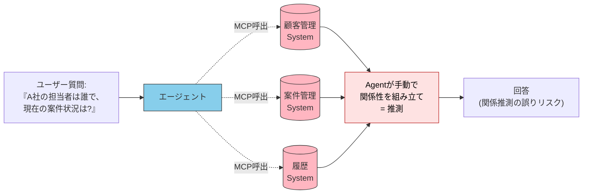
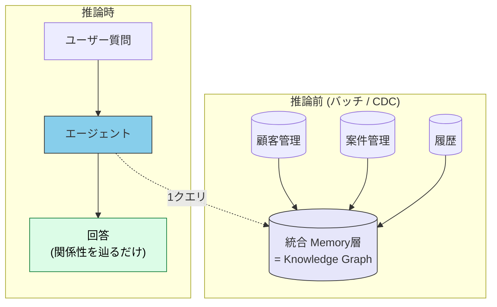
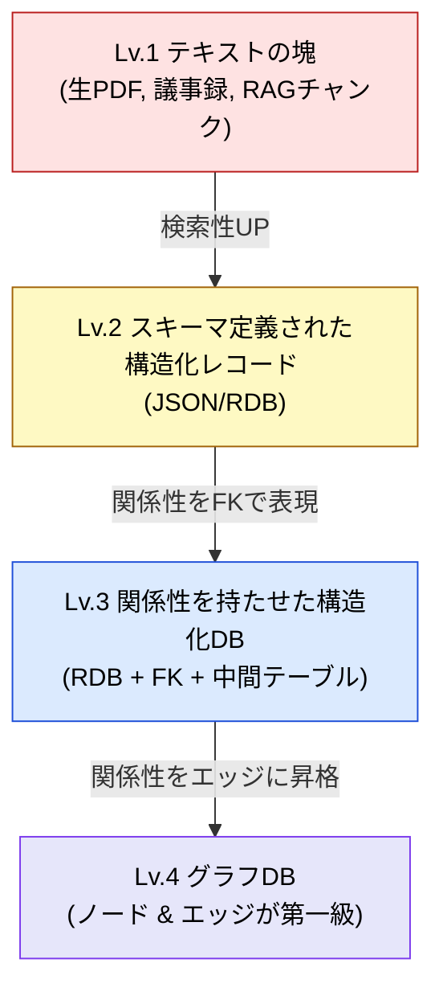
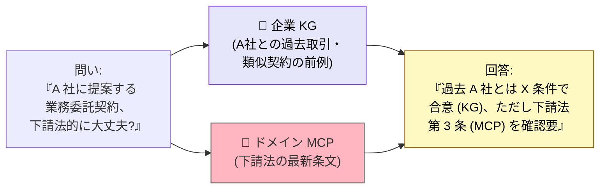
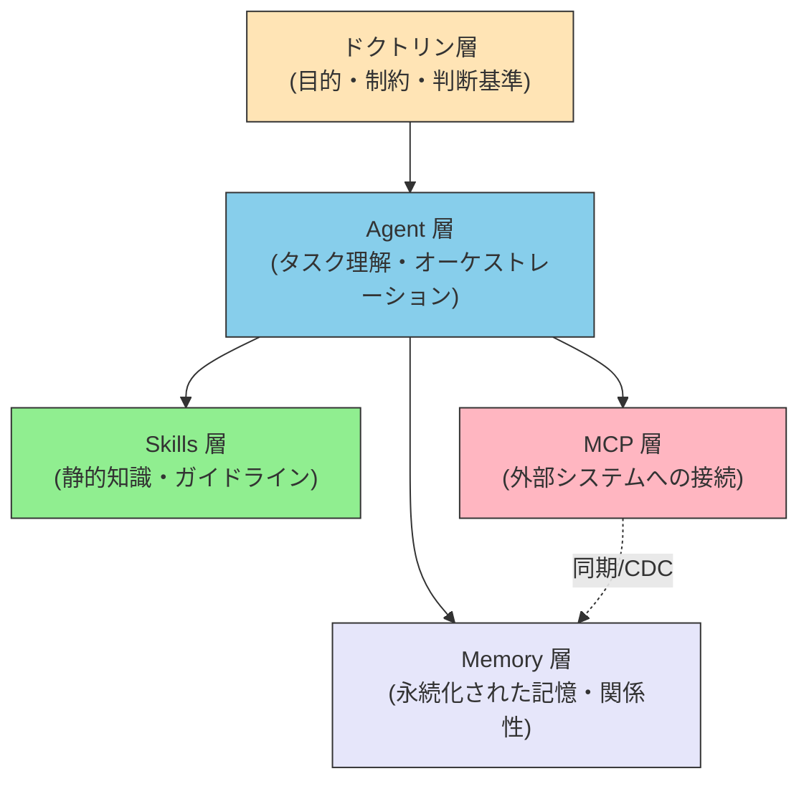
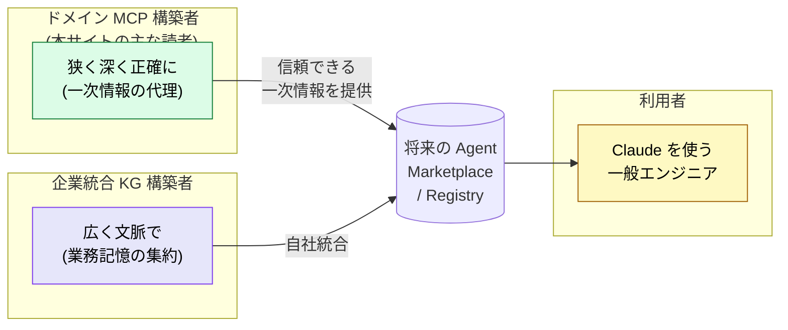
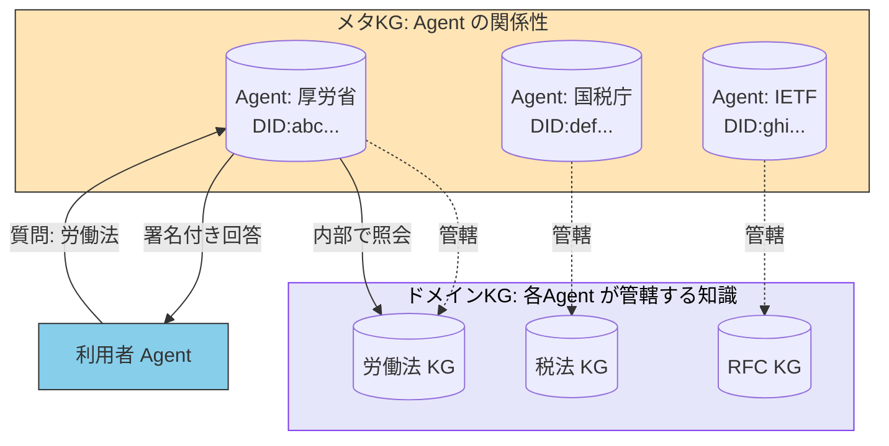

# 記憶と知識統合 — Memory層とナレッジグラフ

> エージェントが「**前回の続き**」「**他のシステムの関連**」を答えるには、**推論前に**統合された記憶層が要る。MCP は接続を提供するが、記憶はそれだけでは生まれない。

## このドキュメントについて

本ドキュメントは、三層モデル ([03-architecture](./03-architecture)) と参照先体系 ([02-reference-sources](./02-reference-sources)) を前提に、**第四の構造的論点** を扱う。

```
推論時にデータを毎回集めにいく設計（scatter-gather）には構造的限界がある。
— レイテンシ、トークン消費、関係性の喪失。
— 推論前に統合された "記憶" を持つことで、これらは設計レベルで解決できる。
```

> **対象読者**: 単一の MCP だけでは扱いきれない「複数システムをまたぐ推論」「過去の文脈に依拠した判断」を実装する必要があるエンジニア。ドメイン MCP 構築者にとっては、自分の MCP がどう「より大きな記憶層」に組み込まれるかを理解するための章。

::: warning このページの位置づけ
[01-vision](./01-vision)（**WHY** — なぜブレない参照先が必要か） \
→ [02-reference-sources](./02-reference-sources)（**WHAT** — 何を参照先とするか） \
→ [03-architecture](./03-architecture)（**HOW** — どう構成するか） \
→ [04-ai-design-patterns](./04-ai-design-patterns)（**WHICH** — どのパターンをいつ選ぶか） \
→ [05-solving-ai-limitations](./05-solving-ai-limitations)（**REALITY** — 現実の制約にどう向き合うか） \
→ [06-physical-ai](./06-physical-ai)（**EXTENSION** — 三層モデルを物理世界へ拡張する） \
→ [07-doctrine-and-intent](./07-doctrine-and-intent)（**DOCTRINE** — AIは何を基準に判断し行動すべきか） \
→ **本ページ（MEMORY — エージェントは何を記憶し、どう接続するか）**
:::

::: details メタ情報

|                          |                                                                                                                                                                                            |
| ------------------------ | ------------------------------------------------------------------------------------------------------------------------------------------------------------------------------------------ |
| **この章で固定するもの** | Memory 層の位置づけ、scatter-gather 問題、Memory-first 設計、ドメイン MCP（一次情報の代理）と企業統合 KG（業務記憶の集約）の住み分け                                                       |
| **扱わないこと**         | 特定 KG プロダクトの実装詳細（Neo4j / RDF Triple Store 等の選定基準）、Entity Resolution アルゴリズムの内部実装、AgentID 標準の認証フロー（→ [agents/agent-identity](../agents/agent-identity)） |
| **依存**                 | [03-architecture](./03-architecture)（統合される三層）、[02-reference-sources](./02-reference-sources)（一次情報の体系）、[agents/agent-identity](../agents/agent-identity)（識別子と委任） |
| **誤用ポイント**         | Memory 層を「速いキャッシュ」と捉えること。Memory 層の本質は **関係性の永続化** であり、単なる高速化ではない                                                                               |

:::

## ドキュメントシリーズにおける位置づけ

```mermaid
flowchart LR
    subgraph EXISTING["既存ドキュメント"]
        V["01: ビジョン"]
        R["02: リファレンスソース"]
        A["03: アーキテクチャ<br/>MCP / Skills / Agent"]
        D["04: 設計パターン"]
        S["05: AI制約の解決"]
        P["06: フィジカルAI"]
        DOC["07: ドクトリンと意図"]
    end

    subgraph THIS["本ドキュメント"]
        M["08: 記憶と知識統合<br/>Memory & KG"]
    end

    A -->|"三層は推論能力を定義<br/>しかし"記憶"は別途必要"| M
    R -->|"参照先はリアルタイム取得<br/>→ 関係性は誰が持つ?"| M
    DOC -->|"判断には文脈が要る<br/>→ 文脈はどこに蓄積?"| M

    style M fill:#E6E6FA,color:#333,stroke:#333
```

| ドキュメント                  | 中心的な問い                                       |
| ----------------------------- | -------------------------------------------------- |
| 02-reference-sources          | **何を** 参照先とするか？                          |
| 03-architecture               | コンポーネントを **どこに** 配置するか？           |
| 07-doctrine-and-intent        | AIは **何を基準に** 判断するか？                   |
| **08-memory-and-knowledge**   | エージェントは **何を記憶し、どう接続するか？**    |

## 問題の所在 — なぜ Memory 層が必要か

### LLM はコンテキスト内でしか考えられない

LLM の推論は **コンテキストウィンドウ内に展開された情報** のみに基づく。これは構造的制約であり、回避できない。詳細な構造的理由は姉妹サイト [understanding-llm / Part 2: コンテキストウィンドウ](https://shuji-bonji.github.io/understanding-llm-through-claude-code/ja/02-context-window/) を参照。

ここから導かれる帰結は明確である。

- セッション境界を越える知識は **どこか外部に永続化** する必要がある
- 複数システムにまたがる関係性は **推論時にゼロから再構築** すると劣化する
- 「前回どうしたか」「他の案件との関連は何か」は **記憶として持っておく** べきである

### scatter-gather 問題

三層モデルだけで「複数システム横断の質問」に答えようとすると、エージェントは推論ループの中で複数の MCP を順に叩く必要が生じる。これを **scatter-gather** (バラバラに散らばったシステムから情報を寄せ集める) パターンと呼ぶ。



scatter-gather には構造上、3 つのコストが必ず発生する。

| コスト | 内容 |
| --- | --- |
| **レイテンシ** | 最も遅い MCP 呼び出しが全体の応答速度を律速する |
| **トークン消費** | 毎回コンテキストをゼロから再構築するため、入力が積み上がる |
| **精度劣化** | システムをまたいだ「関係性」は LLM がその場で推論せざるを得ず、ハルシネーションの温床になる |

> [!WARNING]
> ドメイン MCP の数を増やすほど scatter-gather のコストは線形以上に増える。**「ツールを増やせばエージェントが賢くなる」は誤り**であり、関係性の統合層がなければ複雑な質問への精度は伸びない。

### Memory-first 設計

scatter-gather への構造的回答が **Memory-first 設計** である。推論が始まる **前** に、必要なデータが関係性込みで統合済みの状態にしておく。



エージェントは推論時にデータを集めるのではなく、**統合済みの記憶層に問い合わせる** だけになる。関係性の組み立て (= 推測) が不要なので、ハルシネーションが構造的に減る。

## Memory 層の本質 — なぜ RDB ではなくナレッジグラフか

> [!NOTE]
> 「事前に統合するなら RDB や Redis でよいのでは?」という問いは自然である。だが、Memory 層の本質は **関係性の永続化** であり、ここで RDB は段階的に限界を迎える。

データの保持方式は、表現できる関係性の深さによって 4 段階に分けられる。



| 段階 | 強み | 限界 |
| --- | --- | --- |
| Lv.1 テキスト塊 | 元データそのまま、検索は可能 | 関係性が表現できない、RAG だけでは関係推論が劣化 |
| Lv.2 構造化レコード | 単一レコードの取得は高速 | 関係性は別途設計が必要 |
| Lv.3 RDB + JOIN | 2 段までは普通、設計確立 | 3〜4 段の関係走査でクエリが破綻、スキーマ変更コスト大 |
| Lv.4 グラフDB | 多段の関係走査が均一、Entity Resolution と相性が良い | 学習コスト、ツール選定 |

scatter-gather 問題の本質は「各システムのデータを集めること」ではなく **「データ間の関係を推論に使うこと」** である。3 段以上の関係走査を頻繁に行う場合、Lv.4 (グラフ DB) が設計的に有利になる。

### 「正解」の所在による分類

ここが Memory 層を設計するうえで最も重要な分岐である。**何を記憶として持つか** は、その知識の **出所** によって性質がまったく異なる。

| 観点 | ドメイン MCP の世界 | 企業統合 KG の世界 |
| --- | --- | --- |
| 知識の出所 | **外部の公的ソース** (法令、RFC、IFC仕様等) | **自社の業務履歴** (顧客対応、案件、契約) |
| 求められるもの | 原文の **再現性** | 過去文脈の **連続性** |
| 失敗のリスク | 法令を誤って引く → 信頼崩壊 | 顧客対応の文脈喪失 → UX 劣化 |
| 「正解」の所在 | 公式が定めた唯一解 | 自社が積み上げた文脈の総体 |
| 必要な深さ | ドメイン専門家レベルの厳密さ | 「前回どうだったか」を辿れる程度 |

両者はしばしば同じシステム内で共存する。



実務では「**我々が何を約束したか (企業 KG)**」と「**外の世界の絶対基準 (ドメイン MCP)**」の両方を行き来して答える場面が多い。

## 三層モデルへの Memory 層の追加

[03-architecture](./03-architecture) の三層モデル (Agent / Skills / MCP) は **推論能力** を定義していた。本章で追加する Memory 層は、**推論を支える記憶** を定義する。



各層の責務境界を整理する。

| 層 | 提供するもの | 例 |
| --- | --- | --- |
| **Agent** | タスク理解・オーケストレーション・最終応答 | Claude 本体、サブエージェント |
| **Skills** | 静的なガイドライン・テンプレート・判断基準 | `.claude/skills/` の SKILL.md |
| **Memory** | 永続化された事実・関係性・過去文脈 | Knowledge Graph、業務メモリ、永続キャッシュ |
| **MCP** | 外部システムへのリアルタイム接続 | DB クライアント、API、ファイルシステム |

> [!IMPORTANT]
> Memory 層と MCP 層は **しばしば双方向につながる**。MCP が外部システムから取得したデータを Memory 層に同期 (CDC) し、推論時には Memory 層を読む。これにより「リアルタイム性が必要なときだけ MCP を叩く」「定常的な参照は Memory 層で完結する」設計が可能になる。

## 実装パターン (規模別)

Memory 層は **規模と用途に応じて段階的に強化する** ものであり、最初から KG を構築する必要はない。

### Stage 1: 個人プロジェクト (ファイル + Markdown)

Claude Code の `CLAUDE.md` や memory システム、各エディタのプロジェクトファイルが該当する。

- 形式: Markdown / プレーンテキスト
- 関係性: ファイル間のリンク (`[[name]]` 等)
- 規模目安: 数十〜数百エントリ
- 例: 個人の業務メモ、プロジェクト固有のコンテキスト

### Stage 2: 中規模 (SQLite + 関係テーブル)

小〜中規模のチーム / プロジェクトで、構造化された永続化が必要になった段階。

- 形式: SQLite / Postgres + FK
- 関係性: 2 段の JOIN まで
- 規模目安: 数千〜数万エンティティ
- 例: チーム共有の案件 DB、顧客マスタ + 履歴

### Stage 3: 大規模 (Property Graph DB)

複数システム横断、3 段以上の関係走査が頻発する段階。

- 形式: Neo4j / Amazon Neptune / RDF Triple Store
- 関係性: 任意段数のエッジ走査、Entity Resolution
- 規模目安: 数十万〜数千万エンティティ
- 例: 社内全システムの統合 KG、製品 - 顧客 - 障害 - パッチの関係網

### Stage 4: 企業統合 (CDC + KG + Entity Resolution)

複数 SaaS / 内部システムをリアルタイムで KG に統合し、本番エージェントの記憶基盤として運用する段階。

- 形式: CDC ベース双方向同期 + Property Graph DB + ER エンジン
- 関係性: クロスシステム名寄せ、権限グラフ含む
- 規模目安: 数十システム / 数百万〜数億エンティティ
- 例: DevRev Computer + AirSync、Salesforce/Zendesk/Jira を統合

> [!TIP]
> いきなり Stage 4 を目指す必要はない。**「scatter-gather の痛みを実際に感じてから」次の Stage に進む** のが原則である。Stage 1〜2 で十分なユースケースは想像以上に多い。

## ドメイン MCP 構築者の立ち位置 (本サイトの読者向け)

本サイトの読者の多くは、**個別ドメインの MCP を構築する側** である。Memory 層の議論において、自分の MCP がどう位置づくかを整理しておく。



ドメイン MCP 構築者は、**自分の MCP の内部に「ミニ KG」を持っている** と捉え直すと見通しが良い。

- 法令 MCP のノード: 法令、条文、通達、政省令、判例
- IFC MCP のノード: エンティティ、プロパティセット、継承関係
- RFC MCP のノード: RFC、依存 RFC、参照標準

これらは **小さなドメイン KG をリモートから読める形に公開した実体** とも言える。将来 AgentID 時代が成熟すれば、こうした MCP は **「公的ドメインの代理 Agent」** として企業統合 KG から参照される側に立つ (詳細は次節)。

## AgentID 時代との合流

[agents/agent-identity](../agents/agent-identity) で扱う AgentID は、本章の Memory 層と構造的に重なる。

ナレッジグラフは「**識別可能なエンティティ + その関係**」の世界であり、エージェント世界は「**識別可能なアクター + その能力**」の世界である。両者は構造がそっくりで、自然に重なり合う。



- **メタ KG**: 「どの Agent が何の専門で、誰を信頼しているか」のグラフ
- **ドメイン KG**: 各 Agent が内部で持っている専門知識のグラフ

ドメイン MCP は **「ドメイン KG を備えた専門 Agent」** へと進化するポテンシャルを持つ。AgentID の標準化 (DID、Agent Card、A2A Protocol) が成熟した時点で、現在の MCP は「**自前ラッパー → 公式 Agent への代理クライアント**」へと役割が移行する可能性が高い。

## 設計上の判断 — いつ Memory 層を導入するか

> [!IMPORTANT]
> Memory 層の導入は **設計判断であり、技術判断ではない**。「KG を使いたいから KG を入れる」のではなく、「scatter-gather のコストが業務要件を満たせなくなった」ときに次の Stage へ進む。

導入判断のシグナル:

- ✅ 同じデータを複数の MCP から繰り返し取得している
- ✅ LLM が「A 社」と「Acme Corp」を別物と誤認するなど、Entity Resolution の問題が顕在化している
- ✅ 3 段以上の関係性 (例: 「顧客 → 案件 → 担当者 → 過去案件」) を含む質問が頻発する
- ✅ レイテンシ要件が scatter-gather では満たせない
- ✅ 「過去の決定」「前回の続き」を答える業務要件がある

逆に **導入しなくてよい** シグナル:

- ❌ ドメインが単一で、関係性が 1〜2 段で済む
- ❌ 一次情報の正確な取得が主目的で、過去文脈の蓄積は要件外
- ❌ ユーザー / プロジェクト数が少なく、永続化コストが見合わない
- ❌ MCP のキャッシュ層で十分なレイテンシが出る

## Concepts → 実装への接続

| 知りたいこと | 次に読むページ |
| --- | --- |
| 三層モデルの構造 | [03-architecture](./03-architecture) |
| エージェントの識別と委任 | [agents/agent-identity](../agents/agent-identity) |
| 参照先選定の判断基準 | [reference-selection-checklist](../reference-selection-checklist) |
| Skills と MCP の選択 | [skills/vs-mcp](../skills/vs-mcp) / [FAQ](../faq/mcp-vs-skills) |
| 開発フェーズへの落とし込み | [workflows/development-phases](../workflows/development-phases) |

## 🔗 さらに深く: Memory が必要になる LLM 側の理由

本ページは Memory 層の **構造 (What/How)** を扱った。「**なぜ** LLM がそもそも記憶層を必要とするのか」を Context Window の仕組みやセッション管理の観点から理解したい場合は、姉妹サイトを参照すると根本理由が腹落ちする。

- [understanding-llm / Part 2: コンテキストウィンドウ](https://shuji-bonji.github.io/understanding-llm-through-claude-code/ja/02-context-window/) — LLM の「思考空間」の構造
- [understanding-llm / Part 8: セッション管理と記憶の永続化](https://shuji-bonji.github.io/understanding-llm-through-claude-code/ja/08-session-management/) — 会話の寿命と記憶の運用
- [understanding-llm / Part 10: マルチセッション協調](https://shuji-bonji.github.io/understanding-llm-through-claude-code/ja/10-multi-session/) — 複数セッションを跨ぐ記憶のスケール対策

## 関連ドキュメント

- [02-reference-sources](./02-reference-sources) — **WHAT**: 何を Memory 層に統合するかの源泉
- [03-architecture](./03-architecture) — **HOW**: Memory 層と既存三層の責務境界
- [07-doctrine-and-intent](./07-doctrine-and-intent) — **DOCTRINE**: 記憶された文脈に基づく判断
- [agents/agent-identity](../agents/agent-identity) — Memory 層が「誰の記憶か」を識別する仕組み
- [skills/vs-mcp](../skills/vs-mcp) — Skills と MCP の役割分担 (Memory 層との関係)

### 参考文献

- takanorisuzuki (2026). "AIエージェントが毎回データを取りに行く設計の限界." Zenn. [zenn.dev/knowledge_graph](https://zenn.dev/knowledge_graph/articles/kg-agent-memory-first-design) — scatter-gather 問題と Memory-first 設計
- takanorisuzuki (2025). "ナレッジグラフ入門." Zenn. [zenn.dev/knowledge_graph](https://zenn.dev/knowledge_graph/articles/knowledge-graph-intro) — KG の基礎概念
- Berners-Lee, T., Hendler, J., & Lassila, O. (2001). "The Semantic Web." Scientific American. [scientificamerican.com](https://www.scientificamerican.com/article/the-semantic-web/) — KG の思想的源流

---

> **前へ**: [07-doctrine-and-intent](./07-doctrine-and-intent)

> **次へ**: [Concepts 全体像](./)
