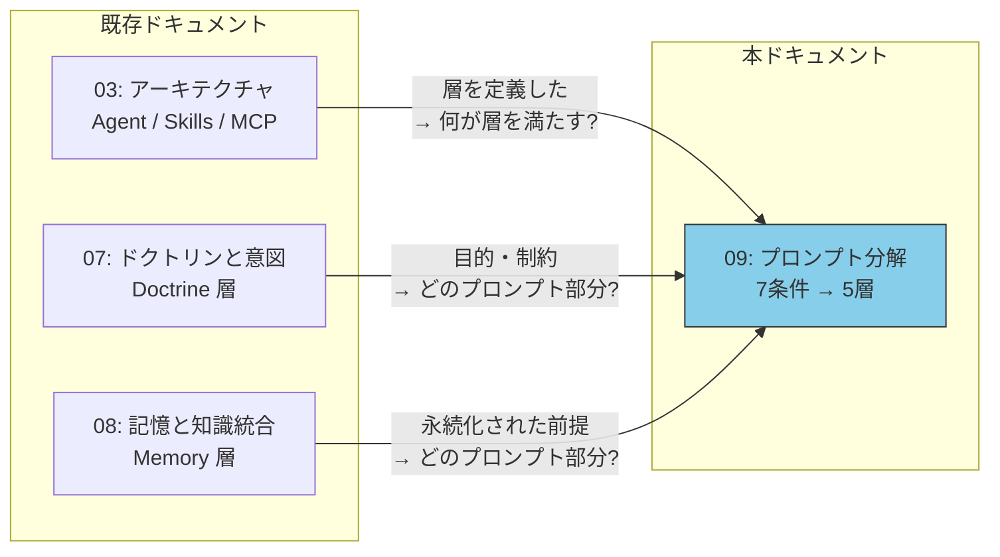
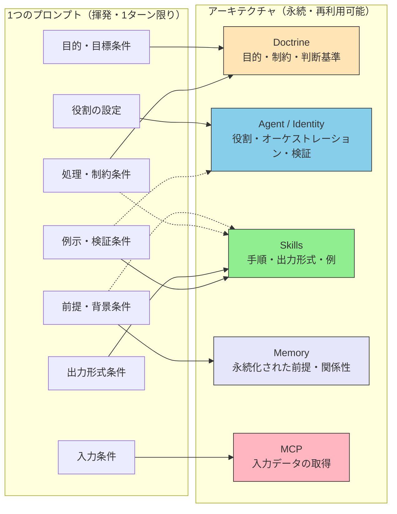
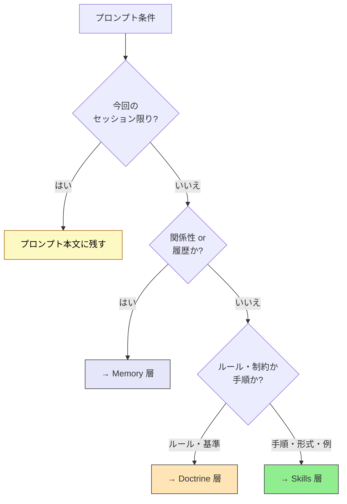

# プロンプト分解 — 平坦なスナップショットを層構造へ

> プロンプトは全条件を1つのコンテキストに同居させる。アーキテクチャは各条件を、それを最もよく **永続化** できる層へ分配する。良いプロンプトが持つ7つの条件は、5層が保持するために設計された7つの関心事と同じものである。

## このドキュメントについて

本ドキュメントは、三層モデル ([03-architecture](./03-architecture))、Doctrine 層 ([07-doctrine-and-intent](./07-doctrine-and-intent))、Memory 層 ([08-memory-and-knowledge](./08-memory-and-knowledge)) を前提に、それらを束ねる問いを扱う。**毎回手で書くのをやめたとき、プロンプトの各部分は実際どこに棲むのか？**

```
良いプロンプトには論理構造がある — 役割、前提、目的、入力、処理、出力形式、例示。
良いシステムは同じ構造を持つが、各部分は「最もよく永続化・再利用できる層」へ外部化されている。
設計・Skills・MCP・設定は、プロンプトの代替ではない — それらは、プロンプトの条件が永続的に棲みつく「住所」である。
```

> **対象読者**: 同種のプロンプトを繰り返し書いていて、**何を** プロンプトから抜き出して `CLAUDE.md` / Skill / MCP / サブエージェントに移すべきか、そして **どの層** に各部分が属するかを判断したいエンジニア。

::: warning このページの位置づけ
[01-vision](./01-vision)（**WHY** — なぜブレない参照先が必要か） \
→ [02-reference-sources](./02-reference-sources)（**WHAT** — 何を参照先とするか） \
→ [03-architecture](./03-architecture)（**HOW** — どう構成するか） \
→ [04-ai-design-patterns](./04-ai-design-patterns)（**WHICH** — どのパターンをいつ選ぶか） \
→ [05-solving-ai-limitations](./05-solving-ai-limitations)（**REALITY** — 現実の制約にどう向き合うか） \
→ [06-physical-ai](./06-physical-ai)（**EXTENSION** — 三層モデルを物理世界へ拡張する） \
→ [07-doctrine-and-intent](./07-doctrine-and-intent)（**DOCTRINE** — AIは何を基準に判断し行動すべきか） \
→ [08-memory-and-knowledge](./08-memory-and-knowledge)（**MEMORY** — エージェントは何を記憶し、どう接続するか） \
→ **本ページ（DECOMPOSITION — プロンプトは層へどう分解されるか）**
:::

::: details メタ情報

|                          |                                                                                                                                                                                            |
| ------------------------ | ------------------------------------------------------------------------------------------------------------------------------------------------------------------------------------------ |
| **この章で固定するもの** | プロンプトの7つの論理条件から5層への対応、条件の住所を決める2つの軸（種類と揮発性）、毎回すべてをプロンプトに書き直すアンチパターン                                                        |
| **扱わないこと**         | プロンプトエンジニアリングの技法そのもの（言い回し、Few-shot 構成）、平坦なプロンプトが劣化する内部的理由（→ 姉妹サイト [なぜ](#deeper-why-a-flat-prompt-degrades)）                       |
| **依存**                 | [03-architecture](./03-architecture)（対象となる層）、[07-doctrine-and-intent](./07-doctrine-and-intent)（Doctrine 層）、[08-memory-and-knowledge](./08-memory-and-knowledge)（Memory 層） |
| **誤用ポイント**         | 「設計 vs プロンプト」を二者択一と捉えること。層はプロンプトの **代替** ではなく、各条件を **永続化** して書き直さずに済ませるための住所である                                             |

:::

## ドキュメントシリーズにおける位置づけ



| ドキュメント                | 中心的な問い                                    |
| --------------------------- | ----------------------------------------------- |
| 03-architecture             | コンポーネントを **どこに** 配置するか？        |
| 07-doctrine-and-intent      | AIは **何を基準に** 判断するか？                |
| 08-memory-and-knowledge     | エージェントは **何を記憶し、どう接続するか？** |
| **09-prompt-decomposition** | プロンプトの構造は **層へどう分解されるか？**   |

## プロンプトの7条件

良いプロンプトは単一の指示ではなく、複数の独立した論理条件の束である。1つの段落として書かれていても、そこには分離可能な7つの関心事が含まれている。

| #   | 条件               | 何を規定するか                 |
| --- | ------------------ | ------------------------------ |
| 1   | **役割の設定**     | AIのアイデンティティと視点     |
| 2   | **前提・背景条件** | 共有知識と状況の基盤           |
| 3   | **目的・目標条件** | 達成すべき明確な成果           |
| 4   | **入力条件**       | 処理対象のデータ・状態         |
| 5   | **処理・制約条件** | 推論ステップとルール           |
| 6   | **出力形式条件**   | 生成される結果の構造とデータ型 |
| 7   | **例示・検証条件** | 期待される結果の例と検証方法   |

## 核心テーゼ — プロンプトは平坦なスナップショット

単発のプロンプトでは、7つの条件すべてが **1つのコンテキストウィンドウに同居** している。1ターンには便利だが、すべての条件が揮発性を帯びる。セッションが終われば消え、次回また書き直すことになる。

システム設計はその逆をする。各条件を取り出し、**それを最もよく永続化・再利用できる層へ外部化** する。プロンプトは消えるのではなく、痩せる。安定した部分が別の場所に棲むようになるからだ。



> [!IMPORTANT]
> 「設計 vs プロンプト」は誤った二者択一である。5層はプロンプトを書くことの代替ではなく、プロンプトの条件を **再利用のために収める住所** である。本サイトのすべての層は、あるプロンプト条件を毎ターン述べ直さずに済むようにするために存在している。

## 対応関係 — 7条件から5層へ

| プロンプト条件     | 本質                   | 主な住所（層）                                              | 具体物                                                                                     |
| ------------------ | ---------------------- | ----------------------------------------------------------- | ------------------------------------------------------------------------------------------ |
| **役割の設定**     | アイデンティティ・視点 | **Agent / Identity**                                        | system prompt の人格規定、`CLAUDE.md` の冒頭、`.claude/agents/*.md`、Agent ID / DID        |
| **前提・背景条件** | 共有知識の基盤         | **Memory + Skills**                                         | `CLAUDE.md`（プロジェクト恒久）、`SKILL.md`（ドメイン）、memory files / KG（関係性・履歴） |
| **目的・目標条件** | 達成すべき成果         | **Doctrine**                                                | ミッション・意図の記述、判断基準                                                           |
| **入力条件**       | 処理対象データ・状態   | **MCP**                                                     | MCP server tools、ファイル / API / DB の取得                                               |
| **処理・制約条件** | 推論ステップとルール   | **Doctrine**（制約） + **Skills**（手順）                   | RFC 2119 ラダー（MUST / SHOULD）、`SKILL.md` の手順、ガードレール                          |
| **出力形式条件**   | 結果の構造・型         | **Skills**                                                  | docx / pptx / xlsx の format skill、スキーマ、テンプレート                                 |
| **例示・検証条件** | 期待結果と検証         | **Skills**（例） + **Doctrine**（基準） + **Agent**（検証） | `SKILL.md` の例、合格基準、サブエージェント品質ゲート                                      |

対応は厳密な1対1ではない点に注意。**処理・制約条件** は Doctrine（_制約_ = 何が起きてはならないか）と Skills（_手順_ = どう実行するか）に割れる。**前提・背景条件** は Memory（関係性・履歴の文脈）と Skills（安定したドメイン知識）に割れる。1つのプロンプト条件が複数の層へ分散しうる — ここから第二の軸が導かれる。

## 第二の軸 — 揮発性が住所を決める

第一の軸は _種類_（上の表）。第二の軸は **その条件をどれだけ長く持続させたいか** である。同じ条件でも、寿命によって着地点が変わる。

| 寿命                       | 棲む場所                        | 例                                                       |
| -------------------------- | ------------------------------- | -------------------------------------------------------- |
| **セッション限り**（揮発） | プロンプト本文そのまま          | 「今回のこのファイル、今日の特定の依頼」                 |
| **プロジェクト恒久**       | `CLAUDE.md` / Skills / Doctrine | コーディング規約、標準の出力形式、エージェントの役割     |
| **横断・関係性**           | Memory（KG、memory files）      | 「前回どう決めたか」、システムをまたぐエンティティの関係 |

「前提」に単一の住所がない理由はここにある。今回のセッションだけ真の前提はプロンプトに残る。プロジェクト全体で真の前提は `CLAUDE.md` へ。過去の作業への _関係性_ が本質の前提は Memory へ。判断するのは「前提はどの層か」ではなく、「**この前提はどれだけ持続するか**」である。



## 7条件を1つずつ辿る

**役割の設定 → Agent / Identity。** プロンプトごとに1回述べる役割（「あなたは慎重なレビュアーである」）は、システムレベルでは system prompt の人格、`CLAUDE.md` の冒頭、または `.claude/agents/` のサブエージェント定義になる。AgentID 時代には検証可能な識別子（DID）になる。役割は「一文」をやめ、_エージェントが既定で何者か_ になる。

**前提・背景条件 → Memory + Skills。** プロジェクトで安定した共有事実は `CLAUDE.md` や Skill に、過去の作業への _関係性_ が本質の事実は Memory に棲む（[08](./08-memory-and-knowledge) 参照）。見分け方: 前提が「何が真か」なら Skills 寄り、「何が起きたか」なら Memory 寄り。

**目的・目標条件 → Doctrine。** 達成すべき成果と「十分良い」の基準は、まさに Doctrine 層が保持するもの（[07](./07-doctrine-and-intent) 参照）。毎プロンプトで目的を繰り返しているなら、それはプロジェクトの意図が Doctrine に固定されていないサインである。

**入力条件 → MCP。** プロンプト内の「これがデータです」は、システムレベルではデータと状態をオンデマンドで _取得する_ MCP ツールになる（[03](./03-architecture) 参照）。入力をプロンプトに貼るのは平坦化された形であり、MCP 境界がその永続的な形である。

**処理・制約条件 → Doctrine + Skills。** この条件は割れる。_制約_（何が決して起きてはならないか、境界）は Doctrine に棲み、RFC 2119 の強度ラダー（MUST / SHOULD / MAY）で読まれる。_手順_（段階的なレシピ）は Skill の `SKILL.md` に棲む。

**出力形式条件 → Skills。** 「この列でテーブルを返せ」「`.docx` を生成せよ」「このスキーマに合わせよ」は、まさに format skill が符号化するもの（docx / pptx / xlsx skill が典型例）。形式は「記述される」ことをやめ、再利用可能なテンプレートになる。

**例示・検証条件 → Skills + Doctrine + Agent。** 具体例は `SKILL.md` に棲む。_合格基準_ は Doctrine であり、RFC 2119 ラダーで表現される。_検証する行為そのもの_ は Agent 層の責務 — 検証ステップやサブエージェント品質ゲートである。

## アンチパターン — 毎回すべてを書き直す

本章が防ごうとする失敗様式は、7条件すべてを永遠にプロンプトに残すこと — 役割・規約・形式・例を毎リクエストに貼り直すことである。

> [!WARNING]
> 平坦なプロンプトのコストは入力の手間だけではない。プロンプトが肥大すると LLM の _構造的_ 挙動が劣化する。安定した指示が今回の依頼と注意を奪い合い、中盤の内容が失われ、先頭のルールが減衰する。処方箋は「より長いプロンプト」ではなく、**各安定条件をその層へ移すこと** であり、これにより今回のプロンプトは「本当に今回新しいもの」だけを運ぶ。

条件を外部化すべきサインは単純だ。**2回以上タイプした** こと。毎セッション述べ直す役割は `CLAUDE.md` へ。毎回記述する形式は Skill へ。繰り返す制約は Doctrine へ。過去の作業についての前提は Memory へ。

## 設計判断 — いつ条件を外部化するか

> [!IMPORTANT]
> プロンプト条件の外部化は **設計判断であり、反射ではない**。条件の寿命がセッションを超え、かつ繰り返しのコストが層で維持するコストを上回ったときに、その条件を層へ移す。

外部化すべきシグナル:

- ✅ 同じ役割・制約・形式を多数のプロンプトで述べ直している
- ✅ その条件が自分だけでなくチーム全員に同一に当てはまるべきである
- ✅ 述べ忘れると結果が静かに変わってしまう
- ✅ その前提が本質的に過去の決定への _関係性_ である（→ Memory）

プロンプトに残すべきシグナル:

- ❌ 今回の1リクエストでのみ真である
- ❌ 毎回変わる（実際のタスク、今日の特定の入力）
- ❌ 層に固定すると、将来の異なる作業を過剰に縛ってしまう

## 関連ドキュメント

- [03-architecture](./03-architecture) — **HOW**: 各条件が収まる層
- [07-doctrine-and-intent](./07-doctrine-and-intent) — **DOCTRINE**: 目的と制約の住所
- [08-memory-and-knowledge](./08-memory-and-knowledge) — **MEMORY**: 関係性を持つ前提の住所
- [skills/vs-mcp](../skills/vs-mcp) — 出力形式・手順（Skills） vs 入力（MCP）
- [faq/agent-vs-subagent-vs-skill](../faq/agent-vs-subagent-vs-skill) — 役割と検証の収め先

## 🔗 さらに深く: なぜ平坦なプロンプトは劣化するのか {#deeper-why-a-flat-prompt-degrades}

本ページは分解の **構造 (What/How)** — どの条件がどの層に行くか — を扱った。「**なぜ** LLM がこの分解を強いるのか」「なぜすべてを1つのプロンプトに残せないのか」を理解したい場合は、姉妹サイトがコンテキストウィンドウのロード階層の仕組みから説明している。

- [understanding-llm / Part 1: LLM の構造的問題](https://shuji-bonji.github.io/understanding-llm-through-claude-code/ja/01-llm-structural-problems/) — Context Rot、Priority Saturation、Instruction Decay: 長く平坦なプロンプトが忠実度を失う理由
- [understanding-llm / Part 3: 常時ロードされるコンテキスト](https://shuji-bonji.github.io/understanding-llm-through-claude-code/ja/03-always-loaded-context/) — 役割と安定した前提を「常時ロード階層」（`CLAUDE.md`）として持つ
- [understanding-llm / Part 4–5: 条件付き・オンデマンドのコンテキスト](https://shuji-bonji.github.io/understanding-llm-through-claude-code/ja/04-conditional-context/) — 関連するときだけロードされる Skills
- [understanding-llm / Part 6: ツールコンテキスト](https://shuji-bonji.github.io/understanding-llm-through-claude-code/ja/06-tool-context/) — 入力を貼るのではなくツール / MCP 経由で取得する

---

> **前へ**: [08-memory-and-knowledge](./08-memory-and-knowledge)

> **次へ**: [Concepts 全体像](./)
