# Concepts — 設計思想の全体像

> 7つの章が描く「AIエージェントアーキテクチャの設計思想」を俯瞰する。

## ドキュメントチェーン

```mermaid
flowchart LR
    V["01: Vision<br/>WHY"]
    R["02: Reference Sources<br/>WHAT"]
    A["03: Architecture<br/>HOW"]
    D["04: Design Patterns<br/>WHICH"]
    S["05: Solving Limitations<br/>REALITY"]
    P["06: Physical AI<br/>EXTENSION"]
    DOC["07: Doctrine & Intent<br/>DOCTRINE"]

    V --> R --> A --> D --> S --> P --> DOC

    style V fill:#FFE4B5,color:#333,stroke:#333
    style R fill:#FFE4B5,color:#333,stroke:#333
    style A fill:#87CEEB,color:#333,stroke:#333
    style D fill:#90EE90,color:#333,stroke:#333
    style S fill:#FFB6C1,color:#333,stroke:#333
    style P fill:#DDA0DD,color:#333,stroke:#333
    style DOC fill:#F0E68C,color:#333,stroke:#333
```

## 各章の概要

| 章 | ラベル | 中心的な問い | リンク |
| --- | --- | --- | --- |
| **01** | **WHY** | AIになぜ指針が必要か？ | [01-vision](./01-vision) |
| **02** | **WHAT** | 何を参照先とするか？ | [02-reference-sources](./02-reference-sources) |
| **03** | **HOW** | どう構成するか？ | [03-architecture](./03-architecture) |
| **04** | **WHICH** | どのパターンをいつ選ぶか？ | [04-ai-design-patterns](./04-ai-design-patterns) |
| **05** | **REALITY** | 現実の制約にどう向き合うか？ | [05-solving-ai-limitations](./05-solving-ai-limitations) |
| **06** | **EXTENSION** | 三層モデルは物理世界でも成り立つか？ | [06-physical-ai](./06-physical-ai) |
| **07** | **DOCTRINE** | AIは何を基準に判断し行動すべきか？ | [07-doctrine-and-intent](./07-doctrine-and-intent) |

## レイヤー × 関心事の横断マトリクス

各章がどのレイヤーのどの関心事をカバーしているかを示す。

| 関心事 | Agent 層 | Skills 層 | MCP 層 | Doctrine 層 |
| --- | --- | --- | --- | --- |
| **構造定義** | 03 | 03 | 03 | 07 |
| **設計パターン** | 04 | 04 | 04 | — |
| **制約と対策** | 05 | 05 | 05 | 05 |
| **エッジ拡張** | 06 | 06 | 06 | 06 |
| **判断基準** | 07 | 07 | — | 07 |
| **参照先の体系** | — | 02 | 02 | — |
| **設計思想（WHY）** | 01 | 01 | 01 | 01 |

## Mermaid 図の色調凡例

全章を通じて、以下のカラーコードでレイヤーを表現する。

| レイヤー | カラー | Mermaid `fill` |
| --- | --- | --- |
| **Agent 層** | 水色 | `#87CEEB` |
| **Skills 層** | 薄緑 | `#90EE90` |
| **MCP 層** | ピンク | `#FFB6C1` |
| **Doctrine 層** | 薄橙 | `#FFE4B5` |

## 規範強度ラダー（shall / should / may）

本サイトのドキュメントでは、RFC 2119 に準拠した規範キーワードを使用する。

| キーワード | 日本語 | 強度 | 意味 |
| --- | --- | --- | --- |
| **MUST** / **SHALL** | しなければならない | 必須 | 絶対的な要件。違反は設計上の欠陥 |
| **MUST NOT** / **SHALL NOT** | してはならない | 禁止 | 絶対的な禁止事項 |
| **SHOULD** | すべきである | 推奨 | 正当な理由がある場合のみ逸脱可能 |
| **SHOULD NOT** | すべきでない | 非推奨 | 正当な理由がある場合のみ採用可能 |
| **MAY** | してもよい | 任意 | 完全に選択的 |

ドクトリン内の制約（[07-doctrine-and-intent](./07-doctrine-and-intent)）や、仕様MCPから抽出される規範要件は、この強度ラダーに沿って解釈される。

## Concepts → 実装への出口チェックリスト

Concepts セクションの理解が実装フェーズへ進むのに十分かを確認するためのチェックリスト。

### 最低限の準備条件

- [ ] **Reference Sources の最小カタログ** — プロジェクトが参照する権威ある情報源を特定し、MCP 化の優先順位を決定したか？（02 参照）
- [ ] **三層分離の理解** — Agent / Skills / MCP の責務境界を説明でき、アンチパターン（層の混同）を認識しているか？（03 参照）
- [ ] **パターン選択の根拠** — RAG / MCP / Fine-tuning のどれを採用するか、その根拠を示せるか？（04 参照）
- [ ] **制約の境界認識** — 技術で解決できる制約（知識制約）と、技術だけでは解決できない制約（制度的制約）を区別できるか？（05 参照）
- [ ] **ヒト介入点の合意** — エージェントの自律性レベルと、人間にエスカレーションする条件をチームで合意したか？（07 参照）
- [ ] **証拠トレイルの最低要件** — AIの判断根拠を事後的に検証できる仕組み（検証ステータス、出典記録）を設計に含めているか？（05 参照）

### これらが揃ったら

→ [開発フェーズ](../workflows/development-phases) に進み、各フェーズでのMCP統合を実装する
→ [スキル設計ガイド](../skills/creating-skills) を参照し、ドメイン知識をSkillsとして形式化する

## AI 研究との対応

本サイトの概念体系は、AIエージェント研究の標準的な構造と以下のように対応する。

| AI 研究の標準構造 | 本サイトの対応 | 該当章 |
| --- | --- | --- |
| **Goal** | Intent（意図） | 07 |
| **Policy** | Doctrine（ドクトリン） | 07 |
| **Reasoning** | Agent 層（推論・判断） | 03 |
| **Tools / Skills** | Skills 層 + MCP 層 | 03 |
| **Execution** | MCP 経由のツール実行 | 03, 04 |
| **Physical Action** | フィジカルAI | 06 |
