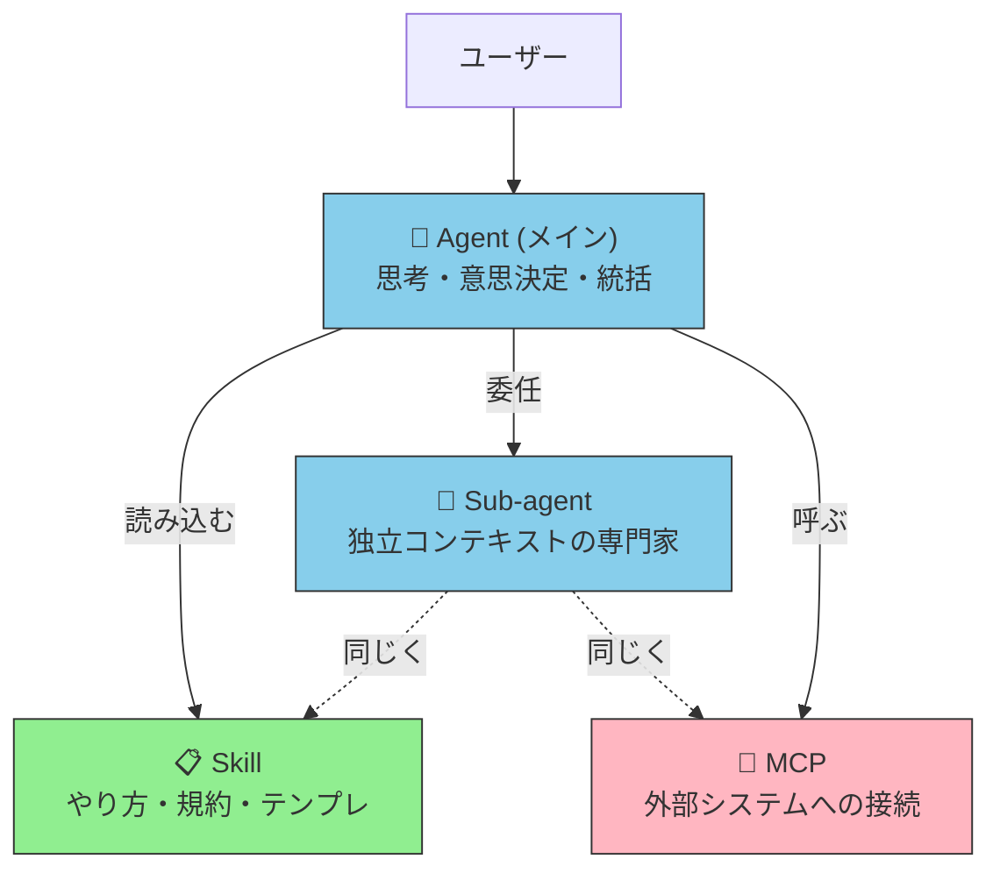
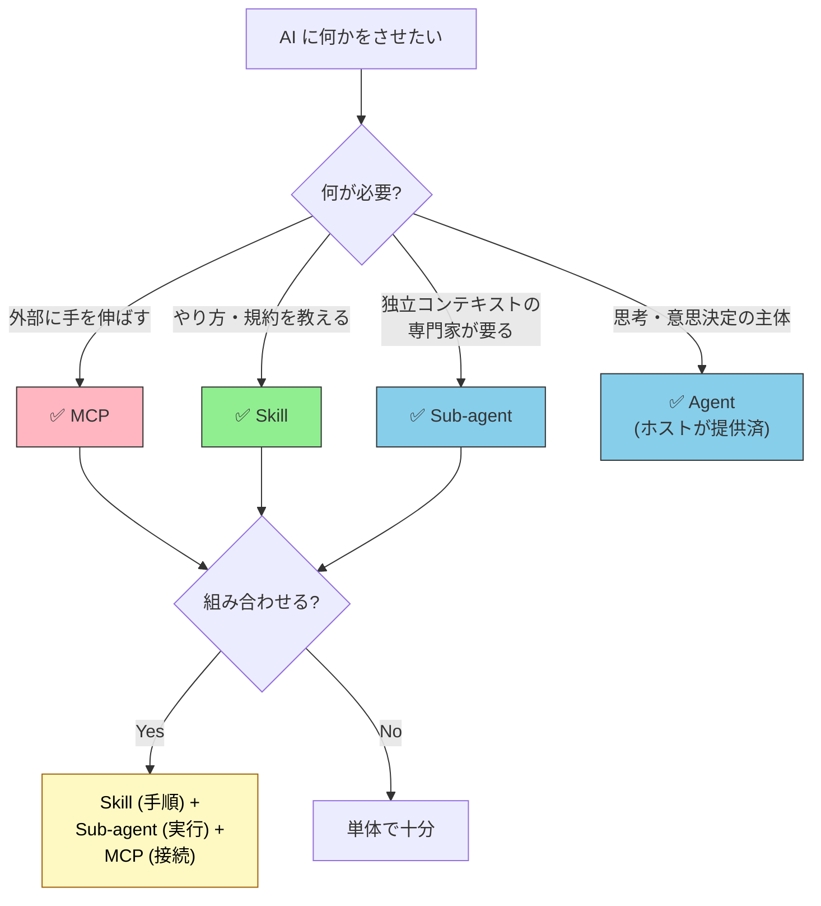

# Agent / Sub-agent / Skill / MCP — 4 者を 3 行で見分ける

> [!IMPORTANT] 3 行で答える
> 1. **Agent** = 思考し意思決定する「人」、**Sub-agent** = Agent の中の専門家チーム
> 2. **Skill** = 仕事の「やり方」を書いた説明書、**MCP** = 外部システムへの「接続」
> 3. 同じものではない。**「誰が・何を知り・何でつながるか」** の 4 軸で別物。

## 一目でわかる対応表

| やりたいこと | Agent | Sub-agent | Skill | MCP |
| --- | :---: | :---: | :---: | :---: |
| ユーザーと対話してタスクを理解する | ✅ | ❌ | ❌ | ❌ |
| 仕事全体を統括 (オーケストレーション) | ✅ | ❌ | ❌ | ❌ |
| 専門領域に独立[コンテキスト](../glossary#context)で取り組む | ❌ | ✅ | ❌ | ❌ |
| 客観的な品質ゲート (レビュー、検証) | ❌ | ✅ | ❌ | ❌ |
| 「PR を作るときの手順」を教える | ❌ | ❌ | ✅ | ❌ |
| コーディング規約・ドメイン知識を渡す | ❌ | ❌ | ✅ | ❌ |
| 外部 API を叩く | ❌ | ❌ | ❌ | ✅ |
| 社内 DB を検索する | ❌ | ❌ | ❌ | ✅ |
| ファイルシステムにアクセスする | ❌ | ❌ | ❌ | ✅ |

## 4 者の関係を 1 枚で

- **Agent / Sub-agent** = アクター (主体)
- **Skill** = アクターが参照する知識・手順
- **MCP** = アクターが世界に手を伸ばす接続点

## よく検索される質問への 3 行回答

### Q: Skill と Sub-agent の違いを 1 行で

**A**: **Skill は親と同じコンテキストで展開され、Sub-agent は独立コンテキストで起動する**。中間ツール呼出が親に流入するかが分岐点。詳細は [サブエージェント vs Skills](../agents/subagent-vs-skill) を参照。

### Q: MCP と Sub-agent は何が違う?

**A**: **MCP は「接続」、Sub-agent は「専門家」**。MCP はサーバプロセス (外部システムへの口) で、Sub-agent は Claude Code の内部で動く別人格。Sub-agent は内部で MCP を使う側。

### Q: 4 つのうちどれから作るべき?

**A**: **Skill から**。Markdown 1 ファイルで完結し、即効性が高い。次が MCP (外部接続が必要なら)、最後が Sub-agent (独立コンテキストが要件になってから)。Agent (メイン) は Claude Code 等のホストが既に提供している。

### Q: Agent と Sub-agent の関係は?

**A**: **Sub-agent は Agent の一形態**。具体的には「**親 Agent から委任されて独立コンテキストで実行される子 Agent**」。一般的な「Agent」「カスタムエージェント」を、ライフサイクル属性 (Ephemeral / Spawned) で限定したのが Sub-agent。詳細は [エージェント概念の分類](../agents/agent-taxonomy) を参照。

### Q: 4 つ全部使わないといけない?

**A**: **No**。タスクの性質に応じて、必要なものだけ使えばいい。例: 「コーディング規約を教える」だけなら Skill のみ、「外部 API を叩いて結果を表示」なら MCP のみ、「探索的なコードベース調査」なら Sub-agent のみ、で問題ない。

### Q: 一緒に使うときの典型パターンは?

**A**: 「**Skill で手順、Sub-agent で実行、MCP で接続**」の 3 層構成。例: 翻訳ワークフロー → Skill `translation-workflow` が手順、Sub-agent `translator` が専門家として実行、MCP `deepl-mcp` で翻訳 API を叩く。

### Q: メタエージェント、Orchestrator、Swarm はどこに位置する?

**A**: これらは **設計パターン** であって、実装単位ではない。Agent / Sub-agent / Skill / MCP は実装単位、Orchestrator-Worker や Swarm はそれらを組み合わせるアーキテクチャ・パターン。詳細は [エージェント概念の分類](../agents/agent-taxonomy)。

### Q: 同じことを Skill と Sub-agent の両方で実装できる場合はどっち?

**A**: **デフォルトで Skill**。理由: 起動コストが軽く、ホスト依存が少ない。**昇格条件 (Skill → Sub-agent)** が出たら移行する。昇格シグナルは「親コンテキストが膨らむ」「並列化が必要」「客観性が必要」など。詳細は [サブエージェント vs Skills / いつ昇格させるか](../agents/subagent-vs-skill)。

## 判断フロー (15 秒で決める)

## さらに詳しく

| 知りたいこと | ページ |
| --- | --- |
| MCP vs Skills の 3 行回答 | [MCP vs Skills FAQ](./mcp-vs-skills) |
| Skill と Sub-agent の選択判断詳細 | [サブエージェント vs Skills](../agents/subagent-vs-skill) |
| Sub-agent を品質ゲートとして使う | [サブエージェントを品質ゲートとして使う](../agents/subagent-quality-gate) |
| Agent 用語の整理 (Orchestrator, Swarm 等) | [エージェント概念の分類](../agents/agent-taxonomy) |
| Sub-agent の基本概念 | [カスタムサブエージェントとは](../agents/what-is-subagent) |
| MCP の基本概念 | [MCPとは](../mcp/what-is-mcp) |
| Skill の基本概念 | [Skillsとは](../skills/what-is-skills) |
| アーキテクチャ全体像 | [03-architecture](../concepts/03-architecture) |
| Memory 層との関係 | [08-memory-and-knowledge](../concepts/08-memory-and-knowledge) |

---

> **次へ**: [MCP vs Skills FAQ](./mcp-vs-skills)
