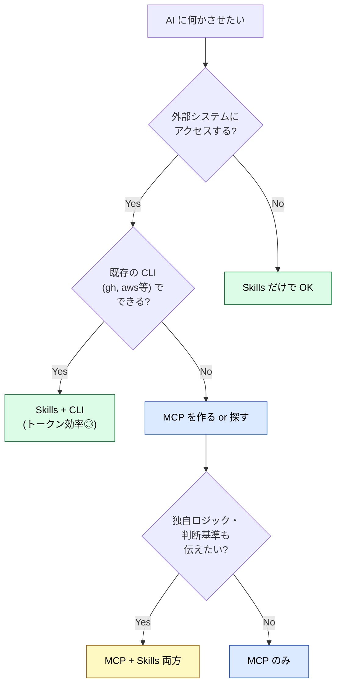

# MCP vs Skills — 3行でわかる違いと使い分け

> [!IMPORTANT] 3行で答える
> 1. **MCP** = 外部システムにアクセスする **接続** (API / DB / CLI / ファイルシステム等への口)
> 2. **Skills** = エージェント内に常備する **知識・手順書** (ルール / テンプレート / ベストプラクティス)
> 3. **両方とも必要なら両方使う** — 排他選択ではなく、**接続が必要なら MCP、知識を教えたいなら Skills**。

## 一目でわかる対応表

| やりたいこと | MCP | Skills |
| --- | :---: | :---: |
| 外部 API を叩く | ✅ | ❌ |
| 社内 DB を検索する | ✅ | ❌ |
| ファイルシステムにアクセスする | ✅ | ❌ |
| プロジェクトのコーディング規約を伝える | ❌ | ✅ |
| 「PR を作るときの手順」を教える | ❌ | ✅ |
| ドメイン専門知識(法令、業界用語等)を渡す | ❌ | ✅ |
| Markdown テンプレートを与える | ❌ | ✅ |
| CLI (`gh`, `aws`等) の使い方を教える | ❌ | ✅ |

## よく検索される質問への 3 行回答

### Q: MCP と Skills、どっちを先に作ればいい？

**A**: **Skills が先**。Skills は Markdown 1 ファイルから始められて、即効性が高い。MCP は実装・運用コストが大きいので、「**外部システムへの接続が必要**」と確信してから着手する。

### Q: skill.md って何？

**A**: AI エージェントに **ドメイン知識を教える Markdown ファイル**。`SKILL.md` という名前で配置すると、エージェントが必要時に自動で読み込む。中身は普通の Markdown で、frontmatter (name, description) と本文 (指示・手順) で構成される。

### Q: MCP の方が高機能じゃない？ Skills は MCP の劣化版？

**A**: いいえ。**MCP と Skills は責務が違う**。MCP は「**何にアクセスできるか**」を提供し、Skills は「**何を知っているか・どう判断するか**」を提供する。CLI が既にあるなら MCP を作るより `gh` CLI + Skills の方が[トークン](../glossary#token)効率が良いケースも多い。

### Q: cline / Cursor / Vercel の Skills は同じもの？

**A**: 仕様基盤は共通 ([Agent Skills Specification](https://agentskills.io))。**SKILL.md** のフォーマットは同じだが、**配置パスが違う**。Claude Code は `.claude/skills/`、Cursor は `.cursor/rules/`、Cline は `.pi/skills/`、Vercel は `npx skills` で管理。詳細は [Skillsとは](../skills/what-is-skills) を参照。

### Q: MCP は重い (トークン消費が大きい) と聞いた

**A**: 事実。MCP はサーバーごとに **ツール定義そのものがコンテキストを消費**する。10 個の MCP を繋ぐと数万トークン消費することもある。対策は (1) 不要な MCP を切る、(2) Tool Search / Deferred Loading を使う、(3) CLI で済むものは Skills + CLI に置き換える。構造的な理由は [understanding-llm / MCP のコンテキストコスト](https://shuji-bonji.github.io/understanding-llm-through-claude-code/ja/06-tool-context/mcp-context-cost) を参照。

### Q: サブエージェントとは別物？

**A**: 別物。**Skills は知識、サブエージェントは別プロセス**。Skills は「やり方を教える説明書」、サブエージェントは「専門スタッフ」のイメージ。サブエージェントは自分専用の Skills と MCP を持てる。詳細は [サブエージェント](../agents/what-is-subagent) を参照。

### Q: 両方使うときの典型パターンは？

**A**: 「**MCP で接続、Skills で振る舞いを定義**」が最頻パターン。例:
- MCP `github-mcp` で PR データを取得 → Skills `pr-review` でレビュー観点を適用
- MCP `postgres-mcp` で DB を読む → Skills `db-conventions` で命名規則を守る
- MCP `slack-mcp` でメッセージ投稿 → Skills `notification-style` で文体を統一

## 判断フロー (10 秒で決める)

## さらに詳しく

| 知りたいこと | ページ |
| --- | --- |
| MCP vs Skills の詳細な選択判断 | [MCP vs Skills (詳細版)](../skills/vs-mcp) |
| Skills の構造とフォーマット | [Skillsとは](../skills/what-is-skills) |
| MCP の構造とプロトコル | [MCPとは](../mcp/what-is-mcp) |
| Skill の作り方 | [スキル作成ガイド](../skills/how-to-create-skills) |
| MCP の作り方 | [MCP Development](../mcp/development) |
| **なぜ** Skills という分離が必要なのか | [understanding-llm / Part 5](https://shuji-bonji.github.io/understanding-llm-through-claude-code/ja/05-on-demand-context/skills) |
| **なぜ** MCP がコンテキストコストになるのか | [understanding-llm / Part 6](https://shuji-bonji.github.io/understanding-llm-through-claude-code/ja/06-tool-context/mcp-context-cost) |

---

> **次へ**: [MCP vs Skills (詳細版)](../skills/vs-mcp)
