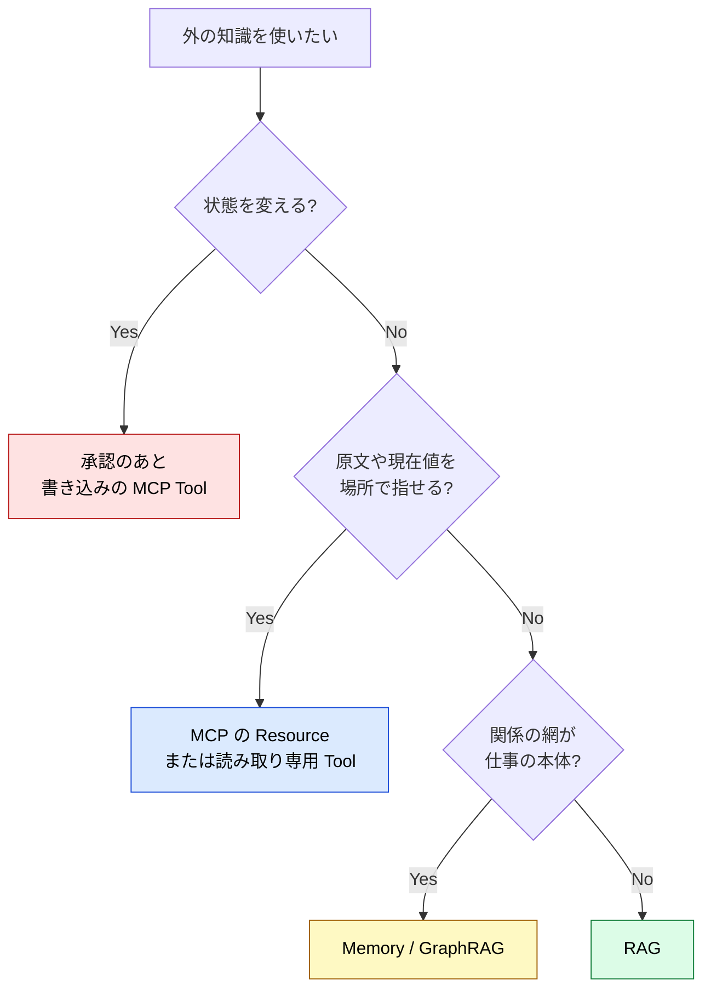

# RAG vs MCP — 3行でわかる違いと使い分け

> [!IMPORTANT] 3行で答える
> 1. **RAG** = 文書を切って似た文を探し、生成のそばに置く **型**
> 2. **MCP** = ホストとサーバーが能力と文脈をやり取りする **プロトコル**。読み取りにも実行にも使う
> 3. **軸が 2 つある** — 知識の取り方（切れ端の検索か、場所を指すか）と、副作用の有無（読むだけか、状態を変えるか）。後者の軸では、RAG と MCP は対にならない

## 一目でわかる対応表

| やりたいこと | RAG | MCP |
| --- | :---: | :---: |
| 社内 Wiki の説明文を探す | ✅ | ❌ |
| 過去の書き方・言い回しを拾う | ✅ | ❌ |
| 大量の非構造テキストから当たりを付ける | ✅ | ❌ |
| 法令の条を、条番号を指して取る | ❌ | ✅ |
| RFC の節を、出典付きで取る | ❌ | ✅ |
| いまのレプリカ数を確認する | ❌ | ✅ |
| 索引を更新せずに最新の値を返す | ❌ | ✅ |
| 設定を変更する・チケットを作る | ❌ | ✅ |

❌ は「できない」ではなく「その仕事に向かない」である。MCP サーバーの中で検索を動かすことはできるが、中身は切れ端の検索のままである。

## よく検索される質問への 3 行回答

### Q: MCP は RAG の代わりになる？

**A**: ならない。**層が違う**。RAG は検索と生成を組んだ型、MCP はホストとサーバーの間のプロトコルである。RAG を MCP サーバーの中に入れても、検索が検索でなくなるわけではない。

### Q: どっちが新しい？ RAG はもう古い？

**A**: 古くない。向く仕事が違う。構造のある原文（法令の条、RFC の節、API の応答）は場所を指して取る方が確実で、構造の弱い説明文は検索の方が早い。構造のある原文を、切れ端の検索だけで済ませない方がよい（**SHOULD** / するのがよい）。

### Q: 両方使うときの典型パターンは？

**A**: 「**説明文は RAG、原文と現在値は MCP**」が最頻パターン。例:
- 障害時の考え方は RAG → 手順の現物は `resources/read`
- 用語の説明は RAG → 条文は法令の MCP で条番号を指す
- 設計の意図は RAG → いまの設定値は読み取り専用の Tool

### Q: RAG には元の文書の権限が付いてくる？

**A**: 付いてこない。人事部だけが読める文書を索引に入れると、**検索の側には権限の区別が残らない**。誰が何を読めるかは、索引を作る時点で設計する（**SHOULD** / するのがよい）。

### Q: RAG が返した手順のとおりに実行させてよい？

**A**: よくない。参照の結果は、実行の許可ではない。文書が古ければ、古い手順のまま実システムが変わる。さらに、本文に命令文が含まれていれば、参照の結果がそのまま実行の引き金になる（OWASP MCP Top 10 の MCP06）。参照の結果を、指示として読んではならない（**MUST NOT** / してはならない）。

### Q: GraphRAG はどちら側？

**A**: 関係をたどって**知る**型である。関係の網が仕事の本体なら、切れ端の検索より向く。ただし、する側にはならない。

### Q: Vector DB を入れれば RAG になる？

**A**: Vector DB は置き場であって、型そのものではない。切り方と、探した結果を生成にどう渡すかで品質が決まる。チャンクの切り方が悪ければ、条や表は切れ端になってずれる。

## 判断フロー (10 秒で決める)

書き込みだけ色を変えてある。ここだけは、判断と承認を通してから入る。

## さらに詳しく

| 知りたいこと | ページ |
| --- | --- |
| 知識の取り方としての対比 | [IV.1 パターン](../part-4/patterns) |
| 読むだけで済むか、状態を変えるかの境界 | [知る経路と、する経路](../strategy/read-and-write-paths) |
| MCP の構造とプロトコル | [MCPとは](../mcp/what-is-mcp) |
| MCP と Skills の違い | [MCP vs Skills](./mcp-vs-skills) |
| 鮮度・判断の量・データの状態で選ぶ | [全体地図](../information/architecture-map) |
| 何を MCP にして、何をプログラムに残すか | [II.2 配置基準](../part-2/placement) |
| 注釈の扱いと OWASP MCP Top 10 | [MCP セキュリティ](../mcp/security) |

---

> **前へ**: [MCP vs Skills](./mcp-vs-skills)
>
> **次へ**: [知る経路と、する経路](../strategy/read-and-write-paths)
