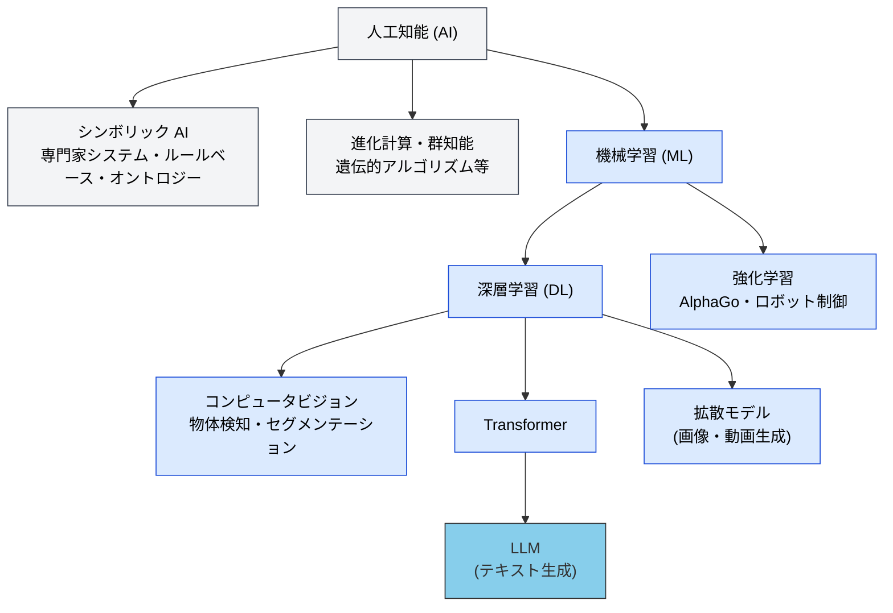
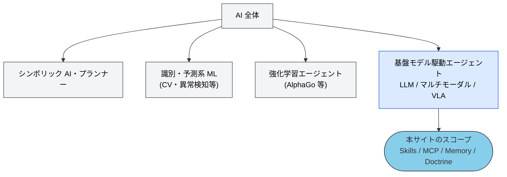
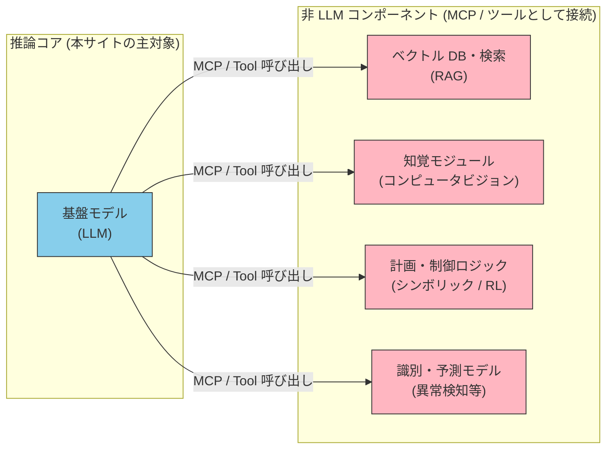

# 「AIエージェント」は LLM だけを指すのか — 本サイトのスコープ

> [!IMPORTANT] 3 行で答える
> 1. 学術的には **AIエージェント ⊋ LLMエージェント**。強化学習エージェント (AlphaGo)、シンボリック AI、ロボット制御もエージェントである。
> 2. 本サイトの「AIエージェント」は **基盤モデル (主に LLM) を推論コアとするエージェント** を指す。2026 年現在の業界用法 (Anthropic / OpenAI / Google) と同じ。
> 3. 絞る理由: Skills / MCP / Memory / Doctrine という本サイトの主題は、**LLM の構造的制約への応答**としてのみ意味を持つから。AlphaGo に `SKILL.md` は要らない。

## AI 全体の中での LLM の位置

LLM は「AI」という広大な分野の一部に過ぎない。技術的な階層で見ると、LLM は深層学習 (DL) の中の Transformer ベースの一例である。

分類軸を変えれば、さらに多様な領域が見える。

| 分類軸 | 主な区分・例 |
| --- | --- |
| **能力範囲** | 特化型 AI (ANI — 現在実用化されているほぼ全て、LLM 含む) / 汎用型 AI (AGI — 研究段階) |
| **機能・出力** | 生成系 (LLM・拡散モデル・音声合成) / 識別・予測系 (スパム検知・医療画像診断・需要予測) |
| **学習パラダイム** | 教師あり / 教師なし / **強化学習** / 自己教師あり |
| **技術アプローチ** | シンボリック / 統計・コネクショニスト (ML・DL) / 進化計算 / ニューロシンボリック (ハイブリッド) |
| **応用領域** | コンピュータビジョン / ロボティクス・Embodied AI / 音声処理 (ASR・TTS) / レコメンデーション / AlphaFold 等のドメイン特化モデル |

そして「エージェント」という概念自体も LLM より古い。Russell & Norvig 以来の合理的エージェントの枠組みには、ルールベースの反射エージェント、BDI アーキテクチャ、強化学習エージェント、ロボット制御が含まれる。

## それでも本サイトが基盤モデル駆動に絞る理由

本サイトの主題である Skills / MCP / Memory / Doctrine は、汎用的なエージェント理論ではない。**LLM の構造的制約があるからこそ必要になる設計**である。

| 本サイトの構成要素 | 応答している LLM の構造的制約 |
| --- | --- |
| **Skills** | 知識の境界 — ドメイン固有の手順・規約を重みに持たない |
| **MCP** | 正確性・最新性 — Hallucination と学習データのカットオフ |
| **Memory** | ステートレス性 — セッションを跨いで何も覚えない |
| **Doctrine** | 判断基準の不在 — 目的・制約・優先順位を自前で持たない |
| **Agent (オーケストレーション)** | コンテキスト有限性 — 一度にすべてを見られない |
| **Information (情報基盤)** | 知識の境界・正確性 — 外部知識の品質と鮮度は LLM 自身では担保できない |

> [!NOTE] Information は「応答」と「前提条件」の二層
> [情報基盤 (Information)](../information/) のうち RAG・データ整備は上記と同様に構造的制約への**応答**だが、情報ガバナンス (オーナー・アクセス権・品質) は LLM がなくても成立する話であり、応答ではなく LLM を組織の情報に接続するための**前提条件**にあたる。

> [!TIP] 開発者向けアナロジー
> AlphaGo に `SKILL.md` は要らない。判断基準は重みの中に焼き込まれ、ツールを自然言語の説明文から発見する必要もないからだ。逆に言えば、本サイトのアーキテクチャは「自然言語で指示を受け、自然言語でツールを発見する」基盤モデルにのみ成立する。

> [!NOTE] 正確には「LLM」より少し広い
> [06-physical-ai](../concepts/06-physical-ai) で VLA (Vision-Language-Action) モデルを扱っている時点で、本サイトのスコープは純粋なテキスト LLM の外に出ている。正確なスコープは「**基盤モデル (Foundation Model) を推論コアとするエージェント**」である。本文では慣用に従い LLM と表記することが多い。

## 非 LLM の AI 技術は無関係なのか

無関係ではない。現実のエージェントシステムは、LLM を推論コアとしつつ**非 LLM コンポーネントと組み合わせるハイブリッド構成**が一般的である。本サイトの 5 層モデルでは、これらは推論コアではなく **MCP の接続先・ツールの側**に現れる。

LLM は解釈性・決定論的保証・低レイテンシ・ドメイン精度の面で他の AI 技術に劣る場面があり、実運用では適材適所の統合が重要になる。ただし、その統合を**誰が判断しオーケストレーションするか**——そこが基盤モデルの役割であり、本サイトが扱う領域である。

なお、この図の「接続先」の設計——どの情報を文書として持ち、どの情報を構造化データとして持ち、どの経路 (RAG / DB / API) で取得させるか——は [情報基盤 (Information)](../information/architecture-map.md) で扱う。本ページの「非 LLM コンポーネント / ツールの側」と、全体地図の「アクセス層」は同じものを指す。

## さらに詳しく

| 知りたいこと | ページ |
| --- | --- |
| なぜブレない参照先が必要か (Concepts の起点) | [01-vision](../concepts/01-vision) |
| 5 層モデルの全体像 | [03-architecture](../concepts/03-architecture) |
| 物理世界への拡張 (VLA・Embodied AI) | [06-physical-ai](../concepts/06-physical-ai) |
| エージェント概念の分類 (LLM ベースの用語整理) | [エージェントの分類](../agents/agent-taxonomy) |

## 🔗 さらに深く: なぜ LLM には構造的制約があるのか

本ページは AI 全体の中での **LLM エージェントの位置づけ (What)** を扱った。「**なぜ** LLM はステートレスで、コンテキストが有限で、Hallucination するのか」を構造から理解したい場合は、姉妹サイトを参照。

- [understanding-llm / Part 1: LLM の構造的問題](https://shuji-bonji.github.io/understanding-llm-through-claude-code/ja/01-llm-structural-problems/) — 本サイトの各層が応答している 8 つの構造的問題の解説

---

> **次へ**: [MCP vs Skills FAQ](./mcp-vs-skills)
