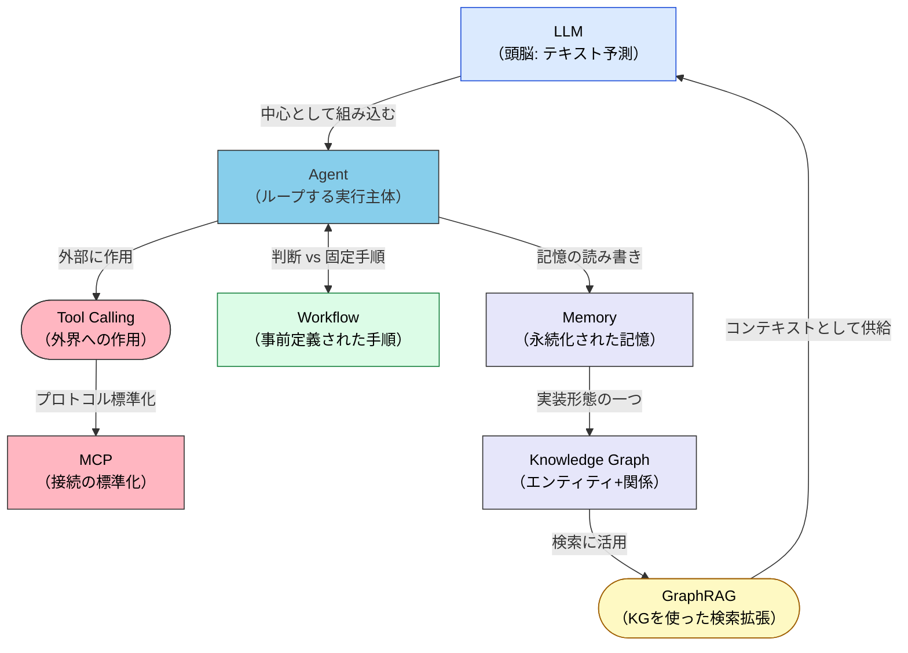
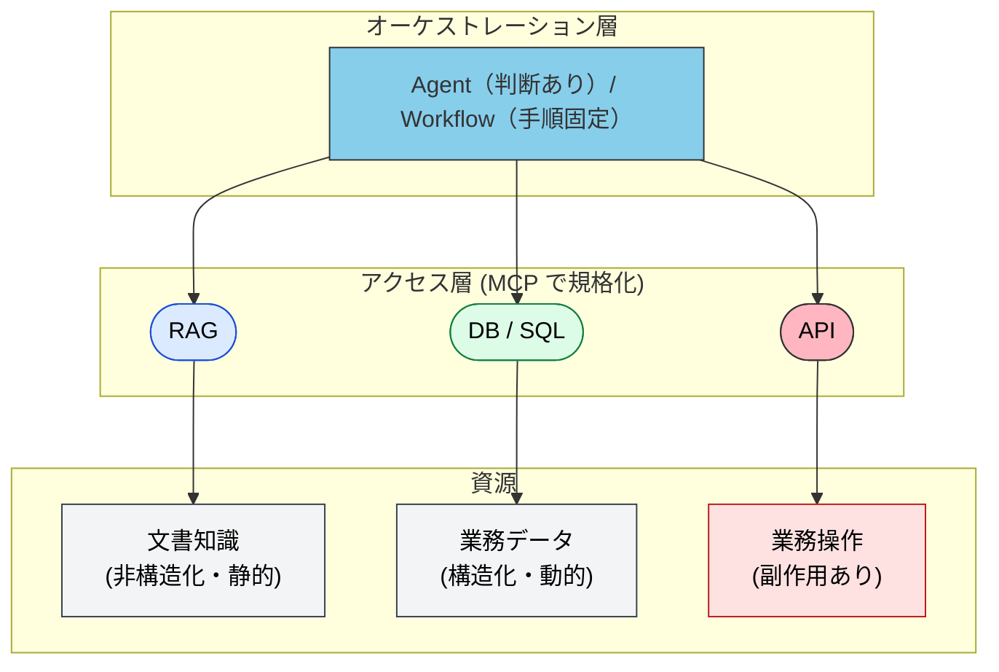
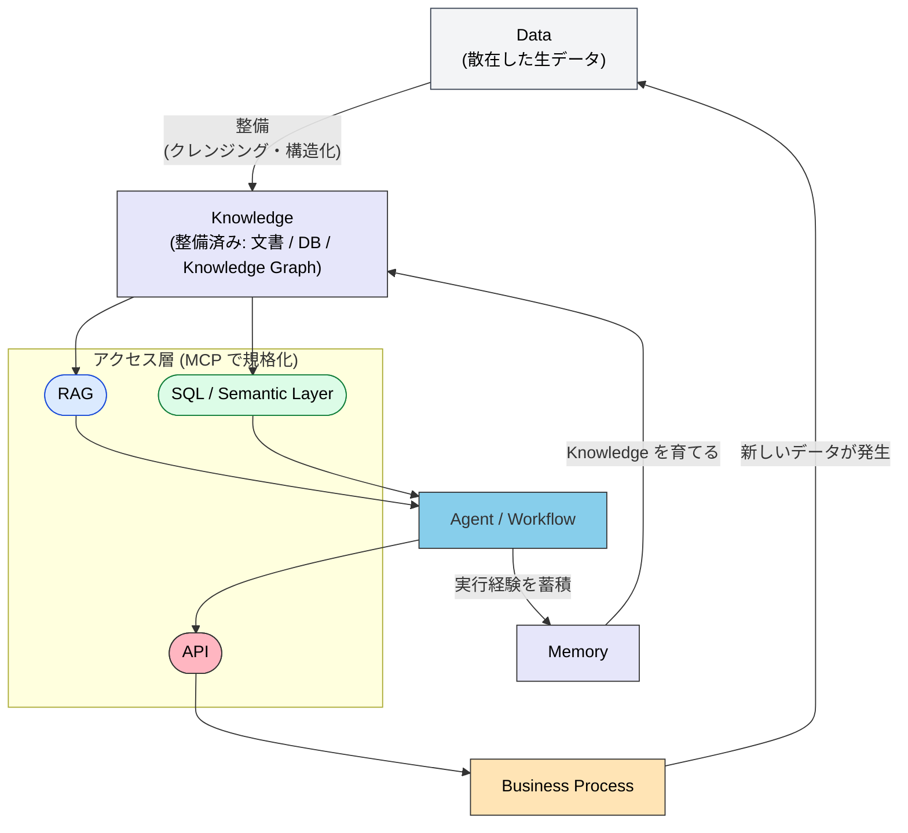

# 全体地図 — キーワードの位置と役割を 1 枚で見通す

> LLM・Agent・Tool Calling・MCP・Skills・Workflow・Memory・Knowledge Graph・GraphRAG・RAG は、同格の並列概念ではない。それぞれに持ち場がある。

## このドキュメントについて

企業への AI 導入では、多数のキーワードが同じレベルの「選択肢」として並べられがちである。しかし実際には、これらは**役割の異なる部品**であり、階層と依存関係を持つ。本ページはその見取り図を提供し、各キーワードが本サイトのどのセクションで扱われるかへの案内板を兼ねる。

> **対象読者**: 本サイトを初めて読む人、AI 導入の全体像を掴みたい開発者・アーキテクト

## 1. 用語の関係図

| 用語 | 一言で | 対になる概念 |
| --- | --- | --- |
| LLM | 予測する関数 | Agent（ループする主体） |
| Agent | 自律判断ループ | Workflow（固定手順） |
| Tool Calling | 呼び出しの仕組み | MCP（その標準規格） |
| Memory | 何を覚えるか | Context Window（揮発的） |
| Knowledge Graph | 関係の構造化 | ベクトル DB（類似度） |
| GraphRAG | 関係を辿る検索 | 通常の RAG（断片検索） |

## 2. 資源の種類 × アクセス手段

キーワードの多くは「**どの資源に、どの手段でアクセスするか**」の対応として整理できる。Agent は他と同列ではなく、それらを束ねる上位層に位置する。

| 資源の種類 | 性質 | アクセス手段 | 補足 |
| --- | --- | --- | --- |
| 文書知識 | 非構造化・静的 | **RAG** | 「意味で探す」読み取り専用。文書横断は GraphRAG へ拡張 |
| 業務データ | 構造化・動的 | **DB**（SQL / Semantic Layer） | 「正確な値を取る」読み取り。LLM はクエリを生成するだけ |
| 業務操作 | 副作用あり | **API** | **書き込み・実行**。「取り消せない操作」を含むため権限設計が必須 |
| 関係知識 | グラフ構造 | **Knowledge Graph / Memory** | 「誰が何を担当し、何がどこに依存するか」。GraphRAG で検索する |
| 複数処理の実行 | 上記の組み合わせ | **Agent / Workflow** | 資源を跨ぐオーケストレーション層。手順固定なら Workflow、判断が要るなら Agent |

> [!IMPORTANT]
> この分類の価値は「**読むか、書くか**」が自然に分離される点にある。RAG と DB は参照（安全・冪等）、API は操作（副作用・要権限）。Agent に権限を渡す設計では、この境界がそのままリスク境界になる。詳細は [Permission と Authority](../strategy/permission-vs-authority.md) を参照。

> [!NOTE]
> MCP はこの図で独立した行にならず、**RAG / DB / API すべてのアクセス手段を統一する接続規格**として横串に入る。Skills は Agent 層が参照する**静的知識・手順書**であり、アクセス手段ではなく「Agent の振る舞いの定義」に属する。

## 3. データフロー — 一方通行ではなく循環

2 本の還流が要点である。Business Process からは**新しい Data が生まれ**、Agent の実行経験は Memory に蓄積されて Knowledge を育てる。この還流を欠くと「毎回ゼロから調べ直す」scatter-gather 問題に陥る。

> [!WARNING]
> **根本的にデータが散在している場合、AI は解決策にならない。** RAG も Agent も「散在した汚いデータ」の上に載せると散在を高速に再生産するだけである。まずデータ整備（Knowledge Graph による関係の一元化、Semantic Layer による指標定義の一元化）が先行する。

## 4. キーワード → 本サイトの担当セクション

| キーワード | 担当 | 位置づけ |
| --- | --- | --- |
| LLM（構造的制約） | [姉妹サイト understanding-llm](https://shuji-bonji.github.io/understanding-llm-through-claude-code/ja/) | Why の本棚 |
| Agent / Sub-agent / A2A | [Agents](../agents/index.md) | 実行主体の分類と設計 |
| Tool Calling / MCP | [MCP](../mcp/what-is-mcp.md) | 接続の実装メカニズム |
| Skills | [Skills](../skills/what-is-skills.md) | 静的知識・手順書の実装メカニズム |
| Workflow | [Workflows](../workflows/development-phases.md) | 固定手順のパターン集 |
| Memory / Knowledge Graph | [III.4 Memory](../part-3/memory) | 記憶と知識統合の概念 |
| RAG / GraphRAG | 本セクション（ページ準備中） | 文書知識のアクセス設計 |
| Semantic Layer | [MCP / Semantic Layer](../mcp/semantic-layer.md) | 構造化データアクセスの設計規律 |
| Doctrine（判断基準） | [III.3 Doctrine](../part-3/doctrine) | 制約・目的・判断基準 |
| Permission / Authority | [Strategy](../strategy/permission-vs-authority.md) | 権限と権威の分離 |

> [!TIP]
> 手段選択に迷ったら 3 つの軸で判定できる: **鮮度**（静的なら RAG、動的なら DB/API）、**判断の量**（ゼロなら Workflow、多いなら Agent）、**データの状態**（汚いならまず整備 — AI は最後）。

## 関連ドキュメント

- [概要 (情報基盤)](index.md) — 本セクションの位置づけと構成
- [II.1 五層](../part-2/layers) — 五層の詳細
- [IV.1 パターン](../part-4/patterns) — どのパターンをいつ選ぶか

## さらに深く: なぜ LLM には外部の情報基盤が必要なのか

本ページは情報アーキテクチャの **構造 (What/How)** を扱った。「**なぜ** LLM 単体では足りないのか」を LLM の構造的制約から理解したい場合は、姉妹サイトを参照。

- [understanding-llm (日本語トップ)](https://shuji-bonji.github.io/understanding-llm-through-claude-code/ja/) — Context Rot・Knowledge Boundary 等、外部参照が必要になる 8 つの構造的制約

---

> **前へ**: [概要 (情報基盤)](index.md)

**最終更新**: 2026年8月
