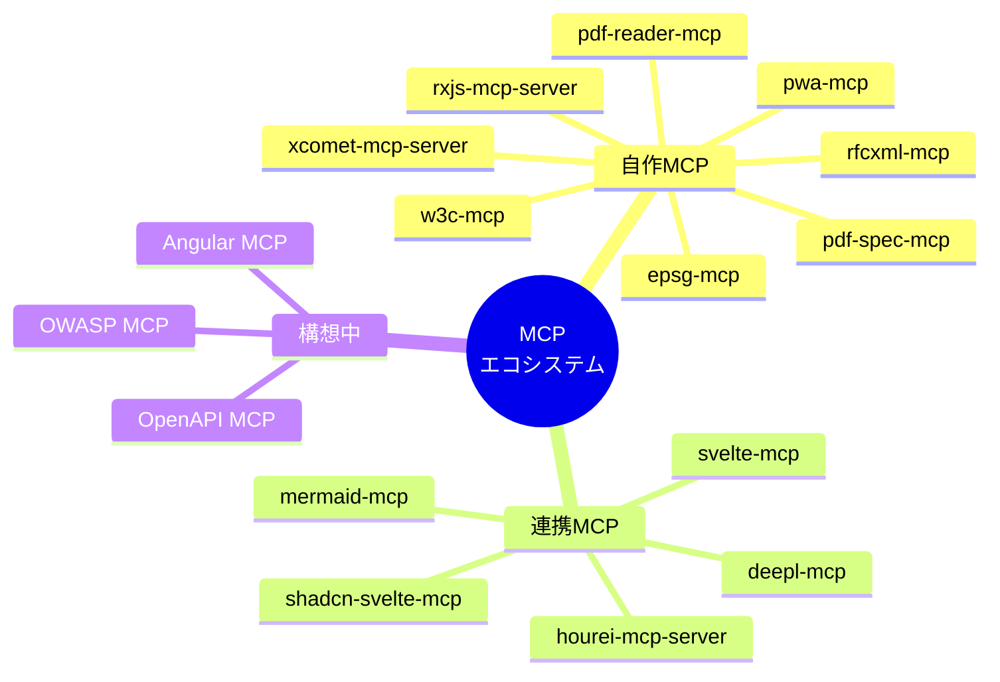
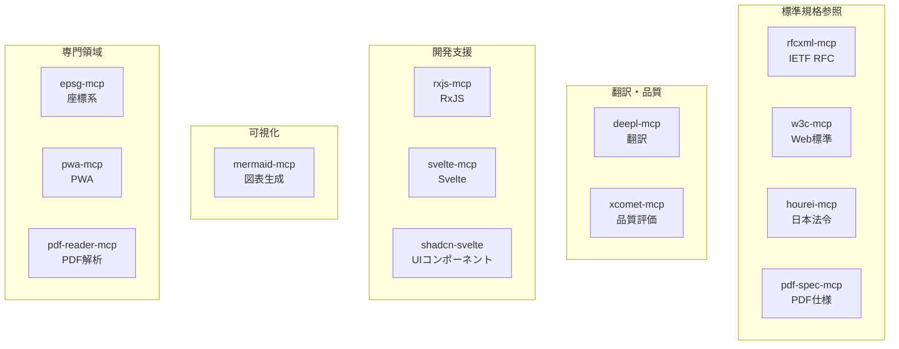
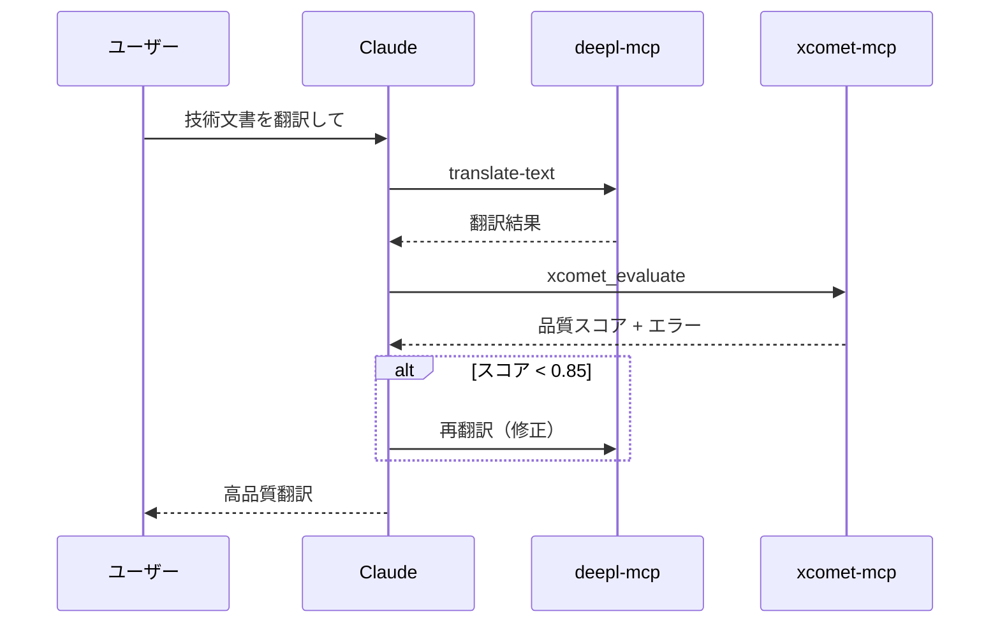
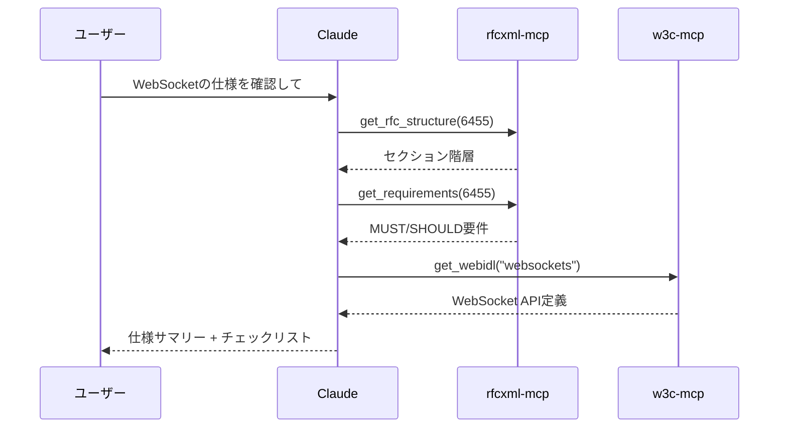
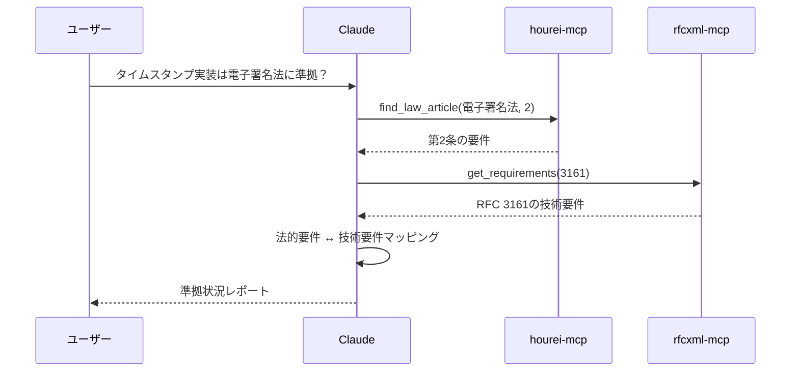

# 構築済みMCPカタログ

> 構築・利用しているMCPサーバーの一覧と、それぞれの機能・用途・成果を整理する。

## このドキュメントについて

このドキュメントは、現在構築済み・利用中のMCPサーバーを一覧化したカタログである。各MCPの機能、提供ツール、実際の活用事例を記載している。

新しいMCPの開発を検討する際の参考として、また既存MCPの活用方法を確認する際のリファレンスとして使用する。MCPは単独でも価値があるが、複数を組み合わせることでより強力なワークフローが実現できる。そのヒントもここから得られる。

## 全体マップ

構築・連携しているMCPの全体像を以下のマインドマップで示す。

## 自作MCPサーバー

### rfcxml-mcp

IETF RFCドキュメントの構造化参照を提供。

| 項目           | 内容                                                                |
| -------------- | ------------------------------------------------------------------- |
| **リポジトリ** | [shuji-bonji/rfcxml-mcp](https://github.com/shuji-bonji/rfcxml-mcp) |
| **npm**        | `@shuji-bonji/rfcxml-mcp`                                           |
| **目的**       | RFC仕様の検索・解析・要件抽出                                       |
| **状態**       | ✅ 公開済み                                                         |

#### 主要ツール

rfcxml-mcpが提供する主要ツールは以下の通りである。

| ツール                 | 機能                                  |
| ---------------------- | ------------------------------------- |
| `get_rfc_structure`    | RFCのセクション階層・メタデータ取得   |
| `get_requirements`     | MUST/SHOULD/MAY要件の構造化抽出       |
| `get_definitions`      | 用語定義の取得                        |
| `get_rfc_dependencies` | 参照関係（normative/informative）取得 |
| `get_related_sections` | 関連セクションの取得                  |
| `generate_checklist`   | 実装チェックリストのMarkdown生成      |
| `validate_statement`   | 実装が仕様に準拠しているか検証        |

#### 成果

rfcxml-mcpの主な活用実績は以下の通りである。

- RFC 6455（WebSocket）の日本語翻訳に活用
- 電子署名法 × RFC 3161 のマッピングに活用
- 75個のMUST要件、23個のSHOULD要件を自動抽出

### w3c-mcp

W3C/WHATWG/IETF Web標準仕様へのアクセスを提供。

| 項目           | 内容                                                          |
| -------------- | ------------------------------------------------------------- |
| **リポジトリ** | [shuji-bonji/w3c-mcp](https://github.com/shuji-bonji/w3c-mcp) |
| **npm**        | `@shuji-bonji/w3c-mcp`                                        |
| **目的**       | Web標準仕様の検索・WebIDL・CSS・HTML要素                      |
| **状態**       | ✅ 公開済み（npm v0.1.7）                                     |

#### 主要ツール

w3c-mcpが提供する主要ツールは以下の通りである。

| ツール                  | 機能                                           |
| ----------------------- | ---------------------------------------------- |
| `list_w3c_specs`        | 仕様一覧（組織・カテゴリ・キーワードフィルタ） |
| `get_w3c_spec`          | 仕様の詳細情報                                 |
| `search_w3c_specs`      | 仕様の検索                                     |
| `get_webidl`            | WebIDLインターフェース定義                     |
| `get_css_properties`    | CSSプロパティ定義                              |
| `get_html_elements`     | HTML要素定義                                   |
| `get_pwa_specs`         | PWA関連仕様一覧                                |
| `get_spec_dependencies` | 仕様の依存関係                                 |

### xcomet-mcp-server

xCOMETモデルによる翻訳品質評価を提供。

| 項目           | 内容                                                                              |
| -------------- | --------------------------------------------------------------------------------- |
| **リポジトリ** | [shuji-bonji/xcomet-mcp-server](https://github.com/shuji-bonji/xcomet-mcp-server) |
| **npm**        | `@shuji-bonji/xcomet-mcp-server`                                                  |
| **目的**       | 翻訳品質の定量評価・エラー検出                                                    |
| **状態**       | ✅ 公開済み（★1、Fork 1）                                                         |

#### 主要ツール

xcomet-mcp-serverが提供する主要ツールは以下の通りである。

| ツール                  | 機能                                               |
| ----------------------- | -------------------------------------------------- |
| `xcomet_evaluate`       | 翻訳品質スコア（0-1）とエラースパン検出            |
| `xcomet_detect_errors`  | エラーの詳細検出（severity: minor/major/critical） |
| `xcomet_batch_evaluate` | 複数翻訳ペアの一括評価                             |

#### 特徴

xcomet-mcp-serverの主な特徴は以下の通りである。

- モデル永続ロード（初期化後の高速推論）
- GPU対応
- バッチ処理対応

#### 成果

xcomet-mcp-serverの主な実績は以下の通りである。

- 180ページ技術文書（150万文字）を1日で翻訳・品質評価
- 約$12のコスト（従来比1/100以下）

### rxjs-mcp-server

RxJSストリームの実行・可視化・分析を提供。

| 項目           | 内容                                                                          |
| -------------- | ----------------------------------------------------------------------------- |
| **リポジトリ** | [shuji-bonji/rxjs-mcp-server](https://github.com/shuji-bonji/rxjs-mcp-server) |
| **目的**       | RxJSコードの実行・マーブルダイアグラム生成・分析                              |
| **状態**       | ✅ 公開済み                                                                   |

#### 主要ツール

rxjs-mcp-serverが提供する主要ツールは以下の通りである。

| ツール               | 機能                                     |
| -------------------- | ---------------------------------------- |
| `execute_stream`     | RxJSコードの実行と結果キャプチャ         |
| `generate_marble`    | ASCIIマーブルダイアグラム生成            |
| `analyze_operators`  | オペレーター分析・パフォーマンスチェック |
| `detect_memory_leak` | メモリリーク検出                         |
| `suggest_pattern`    | ユースケースに応じたパターン提案         |

### epsg-mcp

EPSG座標参照系データベースへのアクセスを提供。

| 項目           | 内容                                                            |
| -------------- | --------------------------------------------------------------- |
| **リポジトリ** | [shuji-bonji/epsg-mcp](https://github.com/shuji-bonji/epsg-mcp) |
| **npm**        | `@shuji-bonji/epsg-mcp`                                         |
| **目的**       | 座標参照系（CRS）の知識ベースMCP（グローバル対応）              |
| **状態**       | ✅ 公開済み（npm v0.9.8）                                       |

#### 主要ツール

epsg-mcpが提供する主要ツールは以下の通りである。

| ツール                    | 機能                                   |
| ------------------------- | -------------------------------------- |
| `search_crs`              | EPSG CRSのキーワード検索              |
| `get_crs_detail`          | 特定EPSGコードの詳細情報              |
| `list_crs_by_region`      | 地域別CRS一覧と推奨                   |
| `recommend_crs`           | 用途・場所に応じた最適CRS推奨         |
| `validate_crs_usage`      | CRS使用の妥当性検証                   |
| `suggest_transformation`  | CRS間の変換パス提案                   |
| `compare_crs`             | 2つのCRSの比較                        |
| `get_best_practices`      | CRSベストプラクティス                 |
| `troubleshoot`            | CRS関連トラブルシューティング         |

#### 特徴

epsg-mcpの主な特徴は以下の通りである。

- 日本の平面直角座標系（I〜XIX系）に完全対応
- グローバル対応（WGS84、UTMゾーン等）
- オフライン動作（ローカルDB内蔵）
- 地域パック（日本、米国、英国）

### pdf-spec-mcp

PDF仕様（ISO 32000）への構造化アクセスを提供。

| 項目           | 内容                                                                    |
| -------------- | ----------------------------------------------------------------------- |
| **リポジトリ** | [shuji-bonji/pdf-spec-mcp](https://github.com/shuji-bonji/pdf-spec-mcp) |
| **npm**        | `@shuji-bonji/pdf-spec-mcp`                                             |
| **目的**       | PDF仕様（ISO 32000-1/2）の構造化参照・要件抽出                          |
| **状態**       | ✅ 公開済み（npm v0.2.2）                                               |

#### 主要ツール

pdf-spec-mcpが提供する主要ツールは以下の通りである。

| ツール              | 機能                                    |
| ------------------- | --------------------------------------- |
| `list_specs`        | 利用可能なPDF仕様ドキュメント一覧      |
| `get_structure`     | PDF仕様のセクション階層取得            |
| `get_section`       | 特定セクションの内容取得               |
| `search_spec`       | PDF仕様の全文検索                      |
| `get_requirements`  | 規範的要件（shall/must/may）の抽出     |
| `get_definitions`   | 用語定義の取得                         |
| `get_tables`        | テーブル構造の抽出                     |
| `compare_versions`  | PDF 1.7とPDF 2.0のセクション比較       |

### pdf-reader-mcp

PDF内部構造の解読と分析を提供。

| 項目           | 内容                                                                        |
| -------------- | --------------------------------------------------------------------------- |
| **リポジトリ** | [shuji-bonji/pdf-reader-mcp](https://github.com/shuji-bonji/pdf-reader-mcp) |
| **npm**        | `@shuji-bonji/pdf-reader-mcp`                                               |
| **目的**       | PDFの読取・構造解析・アクセシビリティ検証                                   |
| **状態**       | ✅ 公開済み（npm v0.2.0）                                                   |

#### 主要ツール

pdf-reader-mcpが提供する主要ツールは以下の通りである。

| ツール                 | 機能                                |
| ---------------------- | ----------------------------------- |
| `read_text`            | テキスト抽出（読み順保持）          |
| `read_images`          | 画像抽出                            |
| `search_text`          | PDF内テキスト検索                   |
| `get_metadata`         | メタデータ抽出                      |
| `inspect_structure`    | 内部オブジェクト構造の検査          |
| `inspect_tags`         | Tagged PDF構造の分析                |
| `inspect_fonts`        | フォント情報の一覧                  |
| `inspect_annotations`  | アノテーション一覧                  |
| `inspect_signatures`   | 電子署名フィールドの検査            |
| `validate_tagged`      | PDF/UAタグ構造の検証                |
| `validate_metadata`    | メタデータ適合性の検証              |
| `compare_structure`    | 2つのPDFの構造比較                  |
| `read_url`             | URLからPDFを取得して読取            |
| `summarize`            | PDFの概要レポート生成               |

#### 特徴

pdf-reader-mcpの主な特徴は以下の通りである。

- 3層構成（基本操作 / 構造検査 / 検証・分析）の15ツール
- PDF/UAアクセシビリティ検証対応
- E2Eテスト185件（うちE2E 146件）

### pwa-mcp

PWA（Progressive Web App）関連の支援を提供。

| 項目           | 内容                |
| -------------- | ------------------- |
| **リポジトリ** | shuji-bonji/pwa-mcp |
| **目的**       | PWA開発支援         |
| **状態**       | 🔒 Private          |

## 連携MCPサーバー

自作ではないが、ワークフローで連携しているMCP。

### deepl-mcp

| 項目       | 内容                                            |
| ---------- | ----------------------------------------------- |
| **提供元** | DeepL公式                                       |
| **用途**   | 高品質翻訳、用語集対応                          |
| **連携**   | xcomet-mcp-serverと組み合わせて翻訳ワークフロー |

#### 主要ツール

deepl-mcpの主要な機能は以下の通りである。

- `translate-text` - テキスト翻訳
- `translate-document` - ドキュメント翻訳
- `rephrase-text` - 言い換え
- 用語集（Glossary）対応

### hourei-mcp-server（e-gov-law-mcp）

| 項目       | 内容                                                            |
| ---------- | --------------------------------------------------------------- |
| **提供元** | [ryoooo/e-gov-law-mcp](https://github.com/ryoooo/e-gov-law-mcp) |
| **用途**   | 日本法令の検索・条文取得                                        |
| **連携**   | rfcxml-mcpと組み合わせて法令×技術仕様のマッピング               |

#### 主要ツール

hourei-mcp-serverの主要な機能は以下の通りである。

- `search_law` - 法令検索
- `get_law_data` - 法令詳細取得
- `find_law_article` - 条文検索
- `get_law_revision` - 改正履歴

#### 成果

hourei-mcp-serverの主な活用実績は以下の通りである。

- 電子署名法 × RFC 3161 の対応表作成

### mermaid-mcp

| 項目     | 内容                                    |
| -------- | --------------------------------------- |
| **用途** | Mermaidダイアグラムの生成・レンダリング |
| **連携** | ドキュメント生成ワークフロー            |

### svelte-mcp / shadcn-svelte-mcp

| 項目     | 内容                                       |
| -------- | ------------------------------------------ |
| **用途** | Svelte/SvelteKit開発支援、UIコンポーネント |
| **連携** | フロントエンド開発                         |

## MCPカテゴリ別整理

構築・連携しているMCPを用途別に分類すると、以下のようになる。

## ワークフロー別MCP組み合わせ

### 技術文書翻訳ワークフロー

DeepLとxCOMETを組み合わせた翻訳ワークフローの流れを以下に示す。

### RFC仕様確認ワークフロー

rfcxml-mcpとw3c-mcpを組み合わせたRFC仕様確認の流れを以下に示す。

### 法令×技術仕様マッピングワークフロー

hourei-mcpとrfcxml-mcpを組み合わせた法令×技術仕様マッピングの流れを以下に示す。

## 構想中のMCP

今後の構築候補として検討しているMCPを以下にまとめる。

| MCP              | 対象          | 優先度 | 備考                 |
| ---------------- | ------------- | ------ | -------------------- |
| **OpenAPI MCP**  | OpenAPI Spec  | 高     | API設計支援          |
| **OWASP MCP**    | OWASP Top 10  | 高     | セキュリティチェック |
| **Angular MCP**  | Angular       | 中     | 専門領域活用         |
| **NgRx MCP**     | NgRx          | 中     | 状態管理パターン     |
| **ISO MCP**      | ISO規格       | 中     | 国際標準参照         |
| ~~**PDF Spec MCP**~~ | ~~ISO 32000~~ | ~~低~~ | ✅ **公開済み** `@shuji-bonji/pdf-spec-mcp` |
| **BIM/IFC MCP**  | buildingSMART | 低     | 建築情報モデル       |
| **HL7 FHIR MCP** | HL7 FHIR      | 低     | 医療情報交換         |

## npm公開状況

npmに公開済みのMCPパッケージの一覧は以下の通りである。

| パッケージ                        | バージョン | 説明                          |
| --------------------------------- | ---------- | ----------------------------- |
| `@shuji-bonji/rfcxml-mcp`         | v0.4.5     | IETF RFC構造化参照            |
| `xcomet-mcp-server`               | v0.3.6     | 翻訳品質評価                  |
| `@shuji-bonji/w3c-mcp`            | v0.1.7     | W3C Web標準仕様               |
| `@shuji-bonji/epsg-mcp`           | v0.9.8     | EPSG座標参照系                |
| `@shuji-bonji/pdf-spec-mcp`       | v0.2.2     | PDF仕様（ISO 32000）          |
| `@shuji-bonji/pdf-reader-mcp`     | v0.2.0     | PDF内部構造解読               |

## 参考リンク

関連する外部リンクを以下に示す。

- [npm: @shuji-bonji](https://www.npmjs.com/~shuji-bonji)
- [GitHub: shuji-bonji](https://github.com/shuji-bonji)
