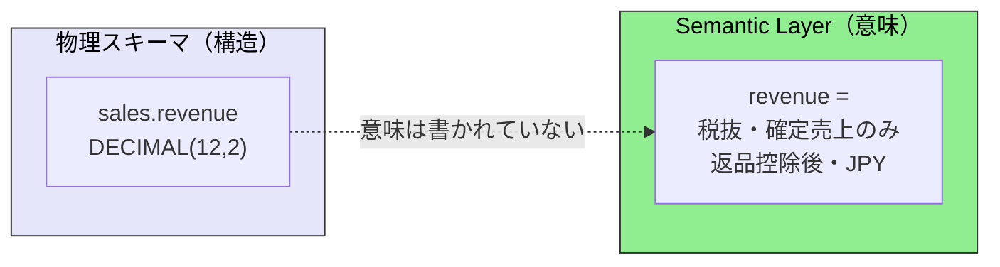
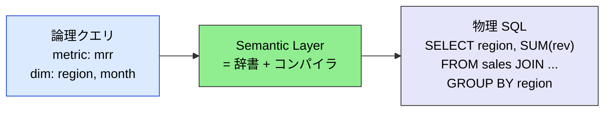
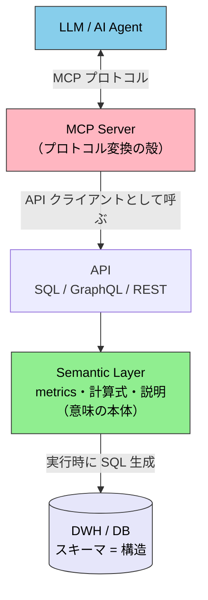
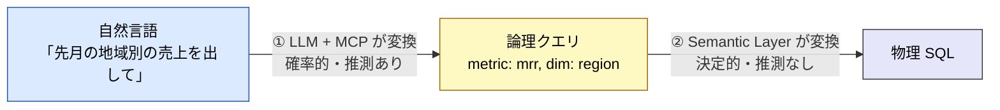
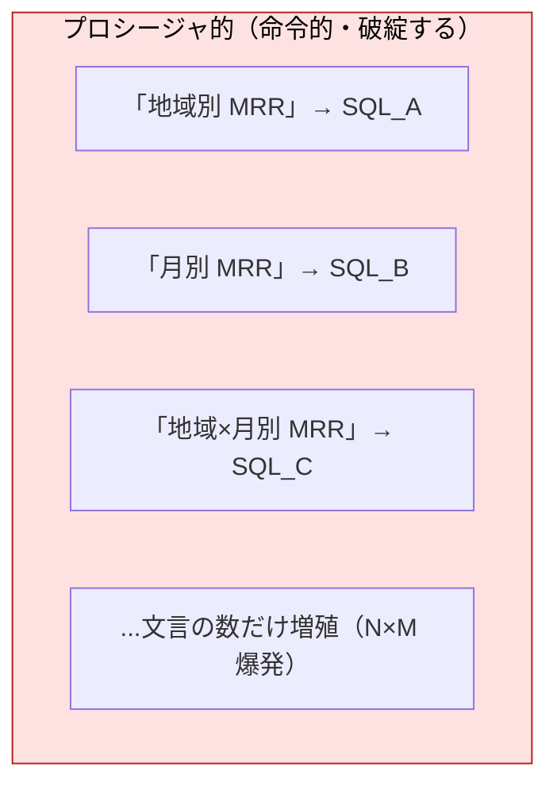
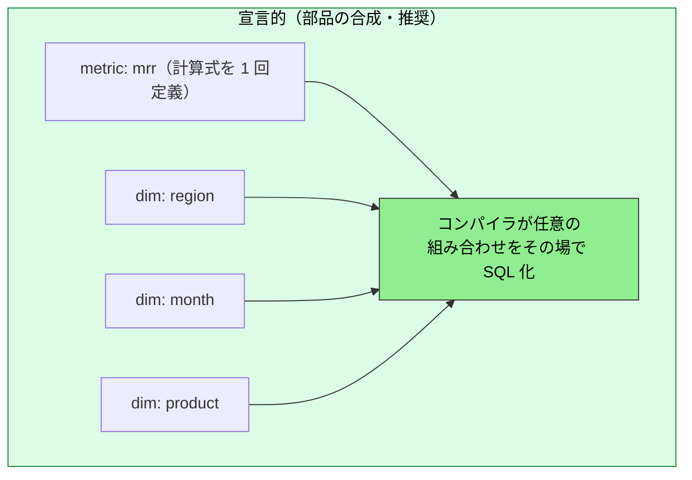
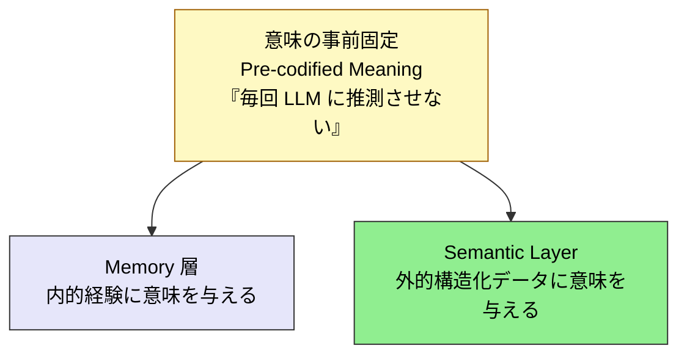

# Semantic Layer — 構造化データの意味を誰が保証するか

> 「接続した先のデータが何を意味するか」を、推測ではなく定義から保証する層

> [!NOTE]
> 本ページは [`mcp/what-is-mcp`](./what-is-mcp) と [`mcp/security`](./security) の延長として、**MCP が外部 DB / DWH に「接続」した先で、そのデータの意味（ビジネス上の定義）を誰がどう保証するか**を整理する。
>
> Semantic Layer は 5 層モデルの新しい層ではなく、**MCP 層と外部データソースの境界に差し込む設計規律**として位置づける。

## このページの位置づけ

- **固定するもの**: 構造化データに対する「ビジネス定義（メトリクス・ディメンション・結合）」の正本（Single Source of Truth）
- **扱わないこと**: 非構造化データ（PDF・文書）の検索（それは [`mcp/what-is-mcp`](./what-is-mcp) の Reference 系 MCP が扱う）
- **依存**: スキーマ（物理構造）の存在を前提とする。Semantic Layer はその上に「意味の地図」を貼る
- **誤用ポイント**: 「文言ごとの SQL を登録する手続き集」だと誤解すること（後述「宣言的合成」参照）

## 問題の所在

[`mcp/what-is-mcp`](./what-is-mcp) では、MCP を「**AIエージェントが外部ツール・データに安全にアクセスするための共通プロトコル**」と定義した。しかし「アクセスできる」ことと「**意味を理解して正しく問い合わせられる**」ことは別の問題である。

MCP が DB / DWH に生で接続した場合、AI に渡されるのは **物理スキーマ（テーブルと型）** だけである。



スキーマを見ても答えられない問いの例:

- `revenue` は**税込か税抜か**、返品は控除済みか
- 「アクティブユーザー」は**直近何日**ログインした人か（7 日? 30 日?）
- 「解約率」は**どの式**で計算するのか（分母は月初契約数? 平均?）
- どのテーブルを**どの結合パス**で繋ぐと正しいのか、集計の粒度（grain）は何か

これらの**ビジネス定義**は、通常エンジニアの頭の中や、あちこちに散らばった SQL に埋もれている。**スキーマは構造を語るが、意味を語らない。** ここを LLM に推測させると、AI は「最初に見つけた定義の revenue」を返してしまう。返品・為替換算・過年度の会計調整を考慮しているかどうかを、AI は知らない。

> [!IMPORTANT]
> 「MCP で DB に接続できた」という事実だけでは、AI が返す数値の正しさは保証されない。スキーマが持っていない **ビジネス定義の層** を誰かが成文化しなければ、意味の解釈はすべて LLM の確率的推測に委ねられる。これが Semantic Layer が埋める空白である。

## Semantic Layer とは — 論理から物理へのコンパイラ

Semantic Layer は、利用者の **論理クエリ（ビジネス語彙）** を **物理 SQL（結合・集計・フィルタ）** に変換する、いわば**辞書 + コンパイラ**である。



「辞書」にあたるのが **セマンティックモデル**（`mrr` → どのカラムを・どう結合し・どう集計するかの対応表）である。これは双方向に働く:

- **行き**: ビジネス語彙 → 物理 SQL（クエリ書き換え）
- **帰り**: 物理カラム `rev_jpy_net` → 論理名 `MRR (JPY)` のラベル

定義の雰囲気（dbt MetricFlow の例）:

```yaml
metrics:
  - name: mrr
    description: "月次経常収益（税抜・確定・返品控除後・JPY）"
    type: simple
    type_params:
      measure: subscription_revenue
```

## MCP との位置関係 — MCP が外殻、Semantic Layer が内側

LLM に最も近い**外側**が MCP である。MCP は「LLM と話すためのプロトコルの殻」にすぎない。その殻の**内側**で、MCP は API を叩き、その先に Semantic Layer がいる。



つまり経路は **LLM → MCP（外殻） → API → Semantic Layer（意味の本体） → DB（構造）** となる。dbt MCP Server を例にすると、`dbt MCP Server`（外）が `dbt Semantic Layer`（内）の API を呼ぶ入れ子構造である。

> [!WARNING]
> Semantic Layer を「MCP の外側」と捉えるのは誤り。正確には **MCP と DB の間に差し込む**。MCP を生 DB に直結させると AI が意味を推測するしかなくなるため、その間に意味の層を挟む、というのが設計の要点である。

## 2 段階の変換 — 確率的解釈と決定的コンパイルの分業

AI エージェント文脈では、変換ポイントが 2 つある。ここを分離することが Semantic Layer の最大の効能である。



| 段階 | 担当 | 性質 |
| --- | --- | --- |
| ① 自然言語 → 論理クエリ | **LLM（+ MCP）** | 確率的・揺れる。ただし Semantic Layer のメタデータ（メトリクス一覧・説明）で grounding される |
| ② 論理クエリ → 物理 SQL | **Semantic Layer** | **決定的**。同じ論理クエリは必ず同じ SQL になる |

**意味の解釈だけ LLM に任せ、SQL の生成は決定的なコンパイラに固定する。** これが効きどころである。LLM に生 SQL を直接書かせると ② まで確率的になって壊れるが、Semantic Layer は ② を確定させる。

> [!IMPORTANT]
> 効果は定量的に確認されている。LLM を governed な Semantic Layer で grounding すると、データ質問の正答率は **約 40% → 83% 超** に上昇する。text-to-SQL も層を被せると **32.7% → 64.5%**、Semantic Layer のスコープ内の質問では **100%** という報告がある。Looker の内部テストでも、LookML が生成 AI の自然言語クエリのデータ誤りを **生 SQL 比で約 2/3 削減** したとされる。

## 宣言的合成 — 「文言ごとの手続き集」ではない

Semantic Layer を「特定の文言ごとに SQL を登録する手続き集（ストアドプロシージャ的な発想）」と捉えるのは誤りである。それでは文言の組み合わせ分だけ手続きが増殖して破綻する。

実際は、**原子的な部品（メトリクス・ディメンション・結合）を一度だけ宣言**しておき、クエリ時にそれらを**合成して SQL を生成**する。文言ごとの手続きではなく**文法（grammar）**に近い。





`mrr` を 1 回、`region` / `month` / `product` を各 1 回定義すれば、「地域別」「月別」「地域×月別」「製品×月別」…は定義を増やさずに全て生成できる。**M 個のメトリクス × D 個のディメンション × フィルタ**の組み合わせがコストなしで手に入る。

> [!TIP]
> フロントエンド開発者には NgRX の `createSelector` が最も近いアナロジーである。`selectMrr`・`selectRegion` を別々に定義し、`createSelector(...)` で**合成**して新しい view を作る。画面ごとにプロシージャを書くのではなく、**合成可能な最小単位を宣言**する。Semantic Layer の metric / dimension は、この selector の発想を SQL の世界に持ち込んだものと考えればよい。RxJS のオペレータを `pipe()` で繋ぐのと同じ「小さな宣言的部品の合成」である。

## 実装方式

実装は「**何で定義を書くか**」と「**AI / BI にどう公開するか**」の 2 軸で整理できる。

| 方式 | 定義の書き方 | 公開 | 特徴 |
| --- | --- | --- | --- |
| **dbt Semantic Layer（MetricFlow）** | dbt モデル上に YAML でメトリクス定義 | SQL / GraphQL API | 最も普及した vendor-neutral 方式。既存 dbt 資産の上に被せられる |
| **Cube** | `*.cube.js` / YAML | SQL / REST / GraphQL / MDX | OSS のコードファースト型。アプリ組み込み（埋め込み分析）に強い |
| **LookML（Looker / Google）** | LookML 専用言語 | Looker API / Looker Agents | Gemini 連携で自然言語からの LookML 生成・問い合わせが可能 |
| **ウェアハウスネイティブ型** | DWH 自身の定義機能 | DWH のクエリ I/F | Databricks Unity Catalog のメトリクス、Snowflake のセマンティック定義など |

### AI エージェントへの公開 = MCP

各プラットフォームが **MCP Server** を提供し始めている。これが本サイトの文脈で重要な接点である。

- **dbt MCP Server** — 自然言語を governed な MetricFlow リクエストに変換して公開する
- **Cube / AtScale** も MCP 実装を提供し、Semantic Layer を AI エージェントの governed な層として露出する
- **Microsoft Power BI Modeling MCP Server** — 2025 年 11 月にパブリックプレビュー公開。外部エージェントへの開放の動き

### 標準化の動き

**Open Semantic Interchange（OSI）v1.0** が 2026 年 1 月に公開された（Snowflake・Databricks・AtScale・Qlik らの連合）。これは**ツール間でセマンティック定義を移植可能にする**標準であり、特定ベンダーへのロックインを避ける方向に向かっている。

## いつ Semantic Layer を採用すべきか

| 状況 | 判断 |
| --- | --- |
| エージェントが**構造化された表形式データ**（DWH / DB）を集計・分析する | 採用を **SHOULD**（推奨）。意味のブレと幻覚を構造的に防げる |
| 複数チーム・複数エージェントが**同じメトリクスを参照**する | 採用を **SHOULD**（定義の正本が一貫性を担保する） |
| 非構造化データ（文書・PDF・仕様）の参照が主目的 | Semantic Layer は **不要**。Reference 系 MCP（[`mcp/what-is-mcp`](./what-is-mcp)）で扱う |
| 単発・読み捨ての小規模クエリで、定義のブレが問題にならない | 導入は **MAY**（任意。過剰複雑度に注意） |

> [!CAUTION]
> 「すべての DB アクセスに Semantic Layer を挟むべき」という過剰適用は避ける。これは [`mcp/what-is-mcp`](./what-is-mcp) の「過剰 MCP 化」と同じ落とし穴である。意味のブレが実害を生む**分析・集計クエリ**に焦点を絞ること。

## Memory 層との関係 — 構造化データ版の「意味の固定」

Semantic Layer は、[`concepts/08-memory-and-knowledge`](../concepts/08-memory-and-knowledge) で扱う Memory 層の **兄弟概念** である。両者は **「意味の事前固定（Pre-codified Meaning）」** という同一の上位概念から派生し、適用対象が「内的経験」か「外的構造化データ」かで分かれる。



### 共通点 — なぜ「兄弟」なのか

| 共通の構図 | 中身 |
| --- | --- |
| **推測の排除** | 毎回 LLM に意味を推測させず、事前に成文化した定義を参照させる |
| **scatter-gather の克服** | 「毎回データを取りに行って LLM に解釈させる」設計の限界を、定義の事前固定で乗り越える |
| **決定的な参照** | 固定された定義は、誰が・何度問い合わせても同じ結果を返す |
| **関心の分離** | 「意味の定義」と「LLM の推論」を分離し、定義側だけを独立して保守できる |

### 相違点 — どこで分かれるか

| 観点 | Memory 層 | Semantic Layer |
| --- | --- | --- |
| 意味を与える対象 | エージェントの経験・対話・関係性（**内的**） | 外部の構造化データ・表・メトリクス（**外的**） |
| 固定する定義 | 何を記憶し、どう関連づけるか | メトリクス・ディメンション・結合ルール |
| 典型的な実体 | Knowledge Graph / 記憶ファイル | セマンティックモデル（YAML / コード） |
| 主に解決する問題 | 文脈の喪失・再取得コスト | 意味のブレ・幻覚 |
| 配置 | Agent と永続ストアの間 | MCP と外部 DB の間 |
| LLM に残す確率的判断 | 何を想起すべきかの判断 | 自然言語 → 論理クエリの解釈（前述の ① のみ） |

> [!TIP]
> 一言で言うと、**Memory は「思い出すべき意味」を固定し、Semantic Layer は「集計すべき意味」を固定する。** どちらも LLM から「意味の解釈」という不確実な仕事を奪い、決定的な定義へ委ねる点で同じ系譜にある。

## 関連ドキュメント

- [MCP とは何か](./what-is-mcp) — 本ページの前提となる MCP の基礎
- [MCP セキュリティ](./security) — 接続境界の安全性
- [Verifiable MCP](./verifiable-mcp) — MCP 出力の出典忠実性の検証（意味の保証の「上流ソース照合」版）
- [Memory と知識](../concepts/08-memory-and-knowledge) — 意味の永続化という兄弟概念
- [三層アーキテクチャ](../concepts/03-architecture) — CLI / MCP / Skills の使い分け

## 🔗 さらに深く: なぜ LLM は意味を推測してしまうのか

本ページは Semantic Layer の **構造（What / How）** を扱った。「**なぜ** LLM は与えられていない意味を推測（捏造）してしまうのか」を LLM の構造的制約から理解したい場合は、姉妹サイトを参照。

- [understanding-llm / Part 1: Hallucination](https://shuji-bonji.github.io/understanding-llm-through-claude-code/ja/part1/hallucination) — LLM が「もっともらしいが誤った定義」を生成する構造的理由
- [understanding-llm / Part 1: Knowledge Boundary](https://shuji-bonji.github.io/understanding-llm-through-claude-code/ja/part1/knowledge-boundary) — 学習データに無いビジネス定義を埋めようとする境界問題

## 参考

- dbt Labs (2026). "Semantic Layer vs. Text-to-SQL: 2026 Benchmark Update." dbt Developer Blog. [docs.getdbt.com](https://docs.getdbt.com/blog/semantic-layer-vs-text-to-sql-2026) — Semantic Layer 導入による text-to-SQL 正答率の定量比較（32.7%→64.5%、スコープ内 100%）
- dbt Labs (2025). "Introducing the dbt MCP Server." dbt Developer Blog. [docs.getdbt.com](https://docs.getdbt.com/blog/introducing-dbt-mcp-server) — 自然言語を governed な MetricFlow リクエストに変換する MCP サーバ
- Cube (2024). "Semantic Layer and AI: The Future of Data Querying with Natural Language." Cube Blog. [cube.dev](https://cube.dev/blog/semantic-layer-and-ai-the-future-of-data-querying-with-natural-language) — Semantic Layer を自然言語クエリの基盤とする設計思想
- VentureBeat (2026). "Headless vs. native semantic layer: The architectural key to unlocking 90%+ text-to-SQL accuracy." [venturebeat.com](https://venturebeat.com/ai/headless-vs-native-semantic-layer-the-architectural-key-to-unlocking-90-text) — governed な層による正答率向上（約 40%→83% 超）
- Databricks (2026). "Semantic Layer Architecture: Components, Design Patterns, and AI Integration." Databricks Blog. [databricks.com](https://www.databricks.com/blog/semantic-layer-architecture-components-design-patterns-and-ai-integration) — Semantic Layer の構成要素と AI 統合パターン
- Atlan (2026). "Best Semantic Layer Tools For BI and AI Agents." [atlan.com](https://atlan.com/know/best-semantic-layer-tools/) — 主要ツール比較と OSI 標準（Snowflake・Databricks・AtScale・Qlik、2026 年 1 月）

---

> **次へ**: [MCP 開発ガイド](./development)
> **前へ**: [MCP セキュリティ](./security)

**最終更新**: 2026年6月
