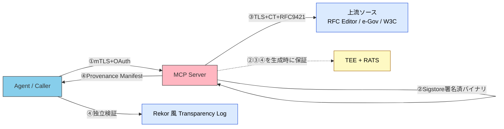

# Verifiable MCP — MCP 出力の出典忠実性をどう検証可能にするか

> [!NOTE]
> 本ページは [`mcp/security`](./security) と [`part-2/placement`](../part-2/placement) の延長として、**「MCP が返した値が、本当にその上流ソースから取られた正確な値か」を第三者が検証可能にする**ための設計原則と実装プリミティブを整理する。
>
> 配置は暫定。運用実績が出た段階で第II部への統合を検討する。

## 問題の所在

[リファレンスソース](../part-2/placement) の 2.2.4 では、検証可能性（Verifiability）を次のように定義した。

> AIの出力が原典と照合して正しいか確認できること。

そして、検証可能性の実装として **AI → MCP → 上流ソース → MCP → AI** という参照経路を提示している。しかしこの経路には、暗黙の前提が 2 つある。

1. MCP サーバが**確かに上流ソースに問い合わせた**こと
2. MCP サーバが**上流ソースのレスポンスを改竄せずに転送した**こと

つまり、**「MCP 経由で取得した」という事実だけでは出典忠実性は保証されない**。「検証可能性」という言葉は実は 4 つの独立した問題を 1 つに詰め込んでおり、それぞれを別の技術で解く必要がある。

| 層 | 問い | 既存対策 | OWASP MCP Top 10 | カバー状況 |
|---|---|---|---|---|
| ① MCP の識別 | この MCP サーバは誰か | OAuth / mTLS / API Key | MCP01・MCP07 | 対応済 |
| ② MCP コード自体の正当性 | この MCP の実行バイナリは改竄されていないか | Sigstore + SBOM + npm-audit | MCP04 | リリース時点のみ部分対応 |
| ③ **MCP の取得先の正当性** | 上流（rfc-editor.org / e-gov.go.jp など）が本物か | TLS + Certificate Transparency + 上流発行者署名 | （該当なし） | **上流が署名していないため空白** |
| ④ **MCP の出力が取得先に忠実か** | レスポンスは捏造・古いキャッシュ・改ざんではないか | （現状の標準的対策なし） | （該当なし） | **完全に空白** |

OWASP MCP Top 10 は ①〜② を扱うが、③〜④ は扱っていない。**「MCP が正しい上流データを忠実に転送している」ことの第三者検証可能性こそが、現状の MCP エコシステムの最大の空白**である。

> [!IMPORTANT]
> 02 章 2.2.4 の検証可能性は **AI 出力に対する原典照合** を扱っていた。本ページが扱うのはそのさらに上流、**MCP の出力に対する上流ソース照合** である。両者を区別せずに「MCP 経由 = 出典明示」と扱うと、悪意ある MCP サーバの存在を構造的に検出できなくなる。

## なぜこの空白が深刻か

02 章で定義した「ブレない参照先」の本質は **AI の推測ではなく検証可能な情報源から取得した事実** である。ところが現状の MCP では:

- MCP サーバは**身分** (Authentication) を証明 **MAY**
- MCP サーバは**コード** (Integrity) の正当性をリリース時点で証明 **MAY**
- しかし MCP サーバが**返した値の出典忠実性** (Verifiable Provenance) は構造的に証明できない

つまり、悪意ある MCP サーバが「e-Gov から取ってきたデータです」と言いつつ実際には改竄したデータを返しても、それを構造的に検出する手段がない。「ブレない参照先」の根幹が崩れる。

> [!WARNING]
> AI 出力が「MCP 経由」であっても、MCP 自身が捏造していた場合は AI から見て区別が付かない。検証可能性の連鎖は MCP の手前で切れている。

## 4 層のスタックと既存技術プリミティブ



### ③ MCP の取得先の正当性

| 技術 | 機能 | 現実性 |
|---|---|---|
| TLS 1.3 + 証明書ピンニング | 上流ドメインのなりすまし防止 | 実装済が大半 |
| Certificate Transparency | 上流証明書発行の公開監視 | ブラウザは利用、MCP では未活用 |
| HTTP Message Signatures | 上流レスポンス自体に発行者署名 | **e-Gov / RFC Editor 側に未実装。将来の働きかけ対象** |

### ④ MCP の出力が取得先に忠実か（本ページの中核）

| 技術 | 機能 | 現実性 |
|---|---|---|
| **Verifiable Fetch Manifest** | MCP レスポンスに `ProvenanceManifest` JSON を添付 | **明日から実装できる最短手段** |
| TLSNotary / Reclaim Protocol / DECO / vlayer | TLS セッション内容を ZKP 付きで第三者証明 | 実装が成熟、現実的選択肢 |
| Content-addressable Transparency Log (Rekor v2) | 取得文書のハッシュを公開ログに刻む | 既存 Sigstore インフラ流用可能 |
| Confidential Computing + RATS | TEE 内で MCP を実行し稼働証明 | SaaS 型 MCP では現実的、npm 配布型では非現実 |
| Reproducible MCP | 同入力→同出力の決定論的フェッチ | RFC のような静的ソースに有効 |

## 実装パターン: ProvenanceManifest

姉妹サイト Situational-Awareness の [data-trust-verification 記事](https://shuji-bonji.github.io/Situational-Awareness-and-Decision-Making/ai-and-future/data-trust-verification/) で整理した Trust Stack（L3 メッセージ署名 / L5 コンテンツ来歴 / L6 時刻保証 / L7 透明性ログ）を MCP 文脈に圧縮すると、**MCP のすべてのレスポンスに次の Manifest を添付するだけ**で ④ の大半が解決する。

```typescript
/**
 * すべての MCP レスポンスに添付する出典証跡
 */
export type ProvenanceManifest = {
  /** 上流ソースの正確な URL（クエリパラメータ含む） */
  source_url: string;

  /** ISO 8601 UTC、上流からの取得時刻 */
  fetched_at: string;

  /** 上流レスポンスの raw バイト列の SHA-256 */
  content_sha256: string;

  /** 上流 TLS 証明書のフィンガープリント (SHA-256) */
  tls_server_cert_sha256?: string;

  /** 該当する場合、上流証明書の CT inclusion proof */
  ct_log_proof?: string;

  /** 上流レスポンスの版情報（e-Gov の revision_date 等） */
  source_revision?: string;

  /** 上記すべてに対する MCP サーバ鍵での署名 (JWS, ES256/EdDSA) */
  mcp_signature: string;

  /** MCP の鍵 ID (DID URL または X.509 SAN URI) */
  mcp_key_id: string;

  /** Optional: ハッシュを刻んだ transparency log の entry ID (Rekor v2 等) */
  transparency_log_id?: string;
};

/**
 * MCP ツール実装の共通ラッパー
 */
export function withProvenance<TInput, TOutput>(
  handler: (input: TInput) => Promise<{
    data: TOutput;
    raw: Buffer;
    sourceUrl: string;
  }>
) {
  return async (input: TInput): Promise<{
    data: TOutput;
    provenance: ProvenanceManifest;
  }> => {
    const { data, raw, sourceUrl } = await handler(input);
    const provenance = await buildProvenance(raw, sourceUrl);
    return { data, provenance };
  };
}
```

この最小実装で次が成立する。

- **④ レスポンス改竄検出**: `mcp_signature` で受信側が検証 **MUST**
- **③ 上流ドメイン詐称検出**: `tls_server_cert_sha256` で「確かにそのドメインから取った」が事後検証可能 **SHOULD**
- **監査**: `fetched_at` + `source_url` + `source_revision` の証跡が残る **MUST**

`shuji-mcp-patterns` Skill に共通規約として組み込めば、自社 MCP 群（rfcxml-mcp / e-gov-law / houki-egov / tax-law 等）に一括適用できる。

## 上流ソース別の最適アプローチ

すべての MCP に同じ仕組みを適用するのではなく、上流の性質ごとに最適解が異なる。

| 上流の性質 | 例 | 推奨アプローチ |
|---|---|---|
| **静的（不変）** | RFC Editor, ISO 規格, EPSG | Reproducible Fetch + `content_sha256` の Rekor v2 記録で十分。再実行で誰でも照合可 |
| **動的（改訂あり、識別子あり）** | e-Gov 法令, W3C 仕様 | `ProvenanceManifest` 必須。`source_revision` + `fetched_at` の組み合わせを記録 |
| **動的（URL 変更頻発）** | 国税庁通達, 厚労省通達 | 上記 + archive.org への自動 push で URL 変更耐性 |
| **動的（リアルタイム）** | センサー API, 株価 API | TLSNotary 系を検討。`ProvenanceManifest` だけでは弱い |
| **ローカルファイル** | PDF, モデルバイナリ | ④ ではなく ②（Sigstore Model Signing + MLBOM） |

## OWASP MCP Top 10 への独自拡張提案: MCP11

筆者は OWASP MCP Top 10（2025、Beta）の延長として、**11 番目の項目**を独自に提唱する。

> [!NOTE]
> 以下は OWASP の公式項目ではなく、shuji-bonji が独自に提唱する拡張項目である。

| ID | 名称 | 概要 |
|---|---|---|
| **MCP11**（独自拡張） | **Unverifiable Source Provenance** | MCP の出力が上流ソースに忠実であることを第三者が検証できない。MCP サーバが悪意あるなら（または侵害されていたら）改竄データを返しても気づけない |

**対策**:

- すべての MCP レスポンスに [`ProvenanceManifest`](#実装パターン-provenancemanifest) を添付する **MUST**
- 静的ソースは `content_sha256` を Rekor v2 に登録する **SHOULD**
- 動的ソースは `tls_server_cert_sha256` と `source_revision` を必須にする **SHOULD**
- 高信頼が必要な領域（法令、規制、安全関連）では TLSNotary または TEE+RATS の併用を検討する **MAY**
- 上流側にも HTTP Message Signatures (RFC 9421) の採用を働きかける **MAY**

**MCP01〜MCP10 との位置づけの違い**: MCP01〜MCP10 が「MCP サーバを使う側のリスク」を扱うのに対し、MCP11 は「**MCP サーバを提供する側がどう検証可能性を設計に組み込むか**」を扱う。オープンな MCP エコシステム成熟への次の課題と位置づけられる。

## 「ブレない参照先」の再定義

本ページの議論を踏まえて、02 章で定義した「ブレない参照先」の定義をより厳密にすると次のようになる。

> [!IMPORTANT]
> **ブレない参照先（厳密版）** = AI の推測ではなく検証可能な情報源から取得した事実であって、**かつ取得経路（MCP）の出典忠実性も第三者検証可能**であるもの。

この再定義の下では、Authentication と Integrity だけでは不十分で、**Verifiable Provenance までを設計に組み込んだ MCP** が初めて「ブレない参照先」を構成する。

## 関連ドキュメント

- [リファレンスソース](../part-2/placement) — 検証可能性（2.2.4）の元定義と MCP の参照経路
- [MCP セキュリティ](./security) — OWASP MCP Top 10 ベースの従来型対策（MCP01〜MCP10）
- [MCP 開発ガイド](./development) — MCP サーバ構築の実践ガイド
- [エージェント ID](../agents/agent-identity) — A2A における識別子設計（本ページの ① に対応）
- [data-trust-verification](https://shuji-bonji.github.io/Situational-Awareness-and-Decision-Making/ai-and-future/data-trust-verification/) — 姉妹サイト Situational-Awareness 側の、ハードウェアからコンテンツ来歴までのレイヤー別カタログ（本ページが圧縮した元）

## 🔗 さらに深く: なぜ検証可能性が必要なのか

本ページは MCP 出力の検証可能性の **構造 (What/How)** を扱った。「**なぜ** LLM の出力に検証可能性が必要なのか」を LLM の構造的制約から理解したい場合は、姉妹サイトを参照。

- [understanding-llm / Part 1: Hallucination](https://shuji-bonji.github.io/understanding-llm-through-claude-code/ja/part1/hallucination) — LLM が「もっともらしいが誤った情報」を生成する構造的理由
- [understanding-llm / Part 1: Knowledge Boundary](https://shuji-bonji.github.io/understanding-llm-through-claude-code/ja/part1/knowledge-boundary) — 学習データのカットオフと現実世界のギャップ

## 参考

- IETF (2024). "RFC 9421 HTTP Message Signatures." IETF. [rfc-editor.org/rfc/rfc9421](https://www.rfc-editor.org/rfc/rfc9421) — HTTP メッセージへの発行者署名仕様
- IETF (2023). "RFC 9334 Remote ATtestation procedureS (RATS) Architecture." IETF. [rfc-editor.org/rfc/rfc9334](https://www.rfc-editor.org/rfc/rfc9334) — TEE 含む遠隔稼働証明のアーキテクチャ
- IETF (2021). "RFC 9162 Certificate Transparency Version 2.0." IETF. [rfc-editor.org/rfc/rfc9162](https://www.rfc-editor.org/rfc/rfc9162) — 証明書発行の公開監視ログ
- Sigstore (2025). "Rekor." Sigstore. [sigstore.dev](https://www.sigstore.dev/) — ソフトウェア署名の透明性ログ。v2 でタイルログアーキテクチャに刷新
- OWASP (2025). "OWASP MCP Top 10." OWASP. [owasp.org/www-project-mcp-top-10](https://owasp.org/www-project-mcp-top-10/) — MCP サーバ開発のセキュリティ Top 10（Phase 3 Beta）
- TLSNotary Project. "TLSNotary." [tlsnotary.org](https://tlsnotary.org/) — TLS セッション内容を第三者に ZKP で証明
- Reclaim Protocol. "Reclaim Protocol." [reclaimprotocol.org](https://reclaimprotocol.org/) — Web レスポンスを ZKP で証明可能にするプロトコル

---

> **次へ**: [MCP 開発ガイド](./development)
> **前へ**: [MCP セキュリティ](./security)
