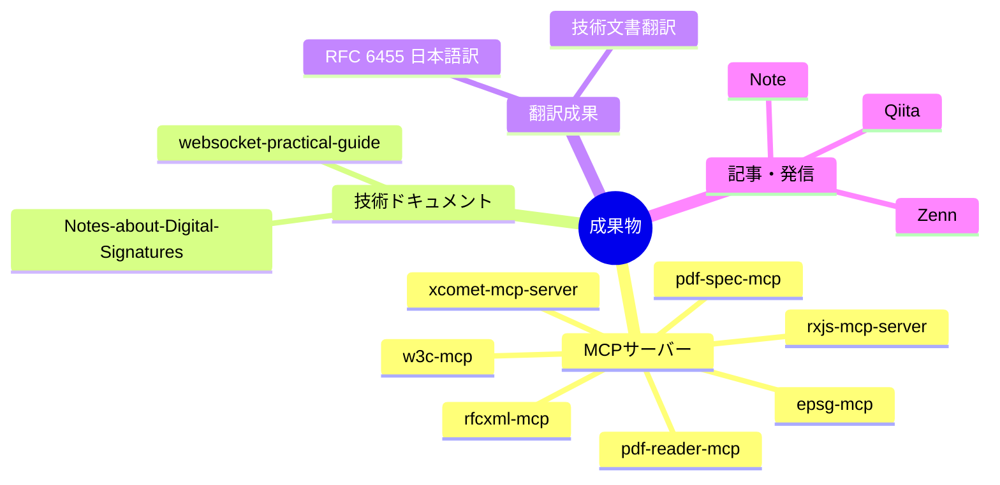
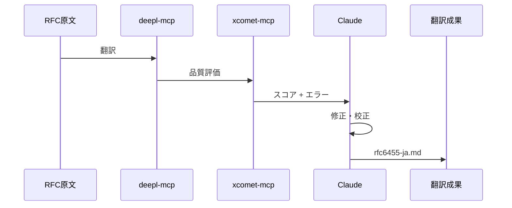
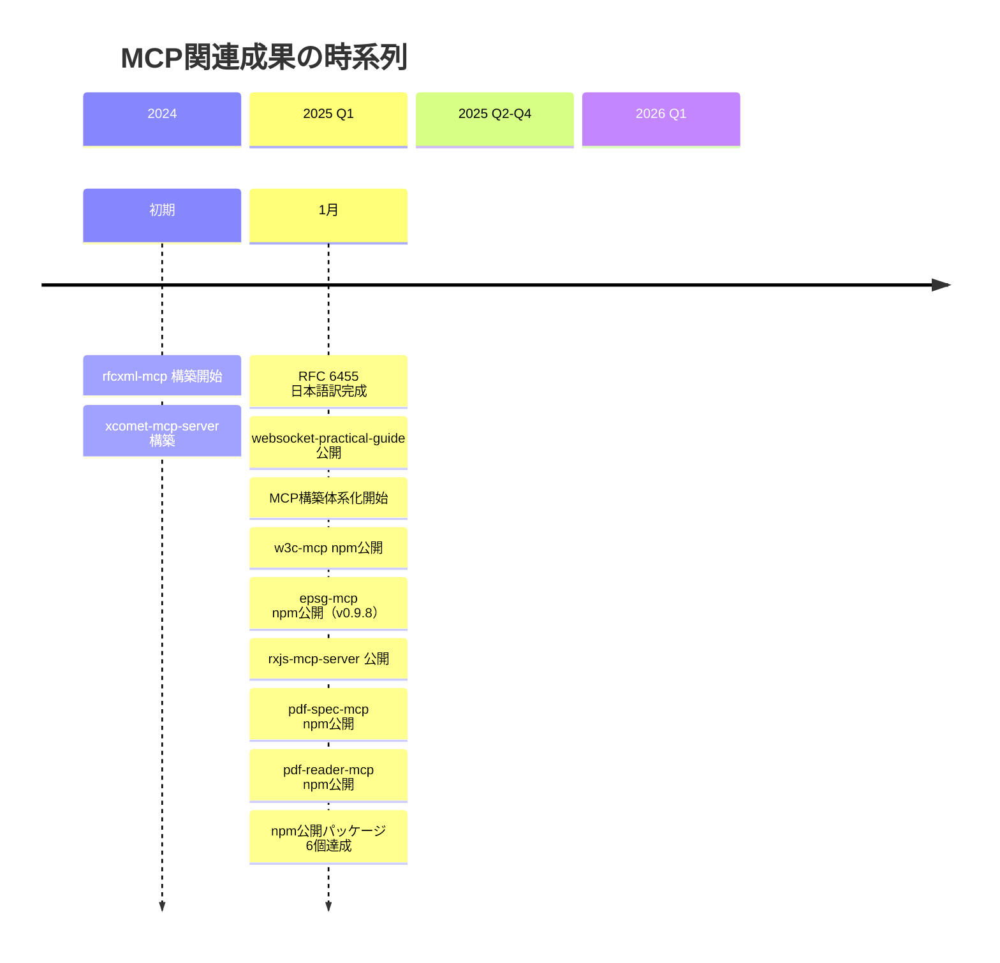

# 実績・アウトプット一覧

> MCP構築・活用による具体的な成果物を整理する。

## このドキュメントについて

このドキュメントは、MCPエコシステム構築を通じて生み出された具体的な成果物をカタログ化したものである。MCPサーバー、技術ドキュメント、翻訳成果、技術記事の4カテゴリで整理し、それぞれの概要、リポジトリURL、定量的な成果指標を記載している。

「何を作ったか」「どれくらいの価値を生んだか」を可視化することで、今後の活動計画の参考にするとともに、外部への発信時の根拠資料としても活用できる。

## 成果物カテゴリ

MCP開発を通じて生み出された成果物を、以下の4つの主要カテゴリに整理しました。各カテゴリの関連性と構成を視覚化したマインドマップです。



## 1. MCPサーバー

### 公開リポジトリ

| リポジトリ                                                            | 説明                     | Stars | npm                              | バージョン |
| --------------------------------------------------------------------- | ------------------------ | :---: | -------------------------------- | ---------- |
| [rfcxml-mcp](https://github.com/shuji-bonji/rfcxml-mcp)               | IETF RFC構造化参照       |   -   | [`@shuji-bonji/rfcxml-mcp`](https://www.npmjs.com/package/@shuji-bonji/rfcxml-mcp) | v0.4.5     |
| [w3c-mcp](https://github.com/shuji-bonji/w3c-mcp)                     | W3C/WHATWG Web標準       |   -   | [`@shuji-bonji/w3c-mcp`](https://www.npmjs.com/package/@shuji-bonji/w3c-mcp) | v0.1.7     |
| [xcomet-mcp-server](https://github.com/shuji-bonji/xcomet-mcp-server) | 翻訳品質評価             |  ⭐1  | [`xcomet-mcp-server`](https://www.npmjs.com/package/xcomet-mcp-server) | v0.3.6     |
| [rxjs-mcp-server](https://github.com/shuji-bonji/rxjs-mcp-server)     | RxJSストリーム実行・分析 |   -   | -                                | -          |
| [epsg-mcp](https://github.com/shuji-bonji/epsg-mcp)                   | EPSG座標参照系           |   -   | [`@shuji-bonji/epsg-mcp`](https://www.npmjs.com/package/@shuji-bonji/epsg-mcp) | v0.9.8     |
| [pdf-spec-mcp](https://github.com/shuji-bonji/pdf-spec-mcp)           | PDF仕様（ISO 32000）     |   -   | [`@shuji-bonji/pdf-spec-mcp`](https://www.npmjs.com/package/@shuji-bonji/pdf-spec-mcp) | v0.2.2     |
| [pdf-reader-mcp](https://github.com/shuji-bonji/pdf-reader-mcp)       | PDF内部構造解読          |   -   | [`@shuji-bonji/pdf-reader-mcp`](https://www.npmjs.com/package/@shuji-bonji/pdf-reader-mcp) | v0.2.0     |

### MCPサーバーの特徴

#### [rfcxml-mcp](https://www.npmjs.com/package/@shuji-bonji/rfcxml-mcp)

```
提供機能:
├── get_rfc_structure    - セクション階層取得
├── get_requirements     - MUST/SHOULD/MAY抽出
├── get_definitions      - 用語定義取得
├── get_rfc_dependencies - 参照関係取得
├── generate_checklist   - 実装チェックリスト生成
└── validate_statement   - 仕様準拠検証

実績:
- RFC 6455 の要件抽出（75 MUST, 23 SHOULD）
- RFC 3161 の要件抽出
- 電子署名法との対応マッピング
```

#### [xcomet-mcp-server](https://www.npmjs.com/package/xcomet-mcp-server)

```
提供機能:
├── xcomet_evaluate       - 品質スコア + エラー検出
├── xcomet_detect_errors  - 詳細エラー分析
└── xcomet_batch_evaluate - バッチ評価

特徴:
- モデル永続ロード（高速推論）
- GPU対応
- バッチ処理対応

実績:
- 180ページ技術文書の品質評価
- 約$12のコストで完了（従来比1/100以下）
```

#### [pdf-spec-mcp](https://www.npmjs.com/package/@shuji-bonji/pdf-spec-mcp)

```
提供機能:
├── list_specs        - 仕様ドキュメント一覧
├── get_structure     - セクション階層取得
├── get_section       - セクション内容取得
├── search_spec       - 全文検索
├── get_requirements  - 規範的要件抽出（shall/must/may）
├── get_definitions   - 用語定義取得
├── get_tables        - テーブル構造抽出
└── compare_versions  - PDF 1.7 vs 2.0 比較

特徴:
- ISO 32000-1（PDF 1.7）と ISO 32000-2（PDF 2.0）の両対応
- セクション単位の構造化アクセス
- バージョン間の差分比較
```

#### [pdf-reader-mcp](https://www.npmjs.com/package/@shuji-bonji/pdf-reader-mcp)

```
提供機能:
├── 基本操作
│   ├── read_text           - テキスト抽出
│   ├── read_images         - 画像抽出
│   ├── search_text         - テキスト検索
│   ├── get_metadata        - メタデータ取得
│   ├── get_page_count      - ページ数取得
│   └── summarize           - 概要レポート
├── 構造検査
│   ├── inspect_structure   - オブジェクト構造
│   ├── inspect_tags        - タグ構造分析
│   ├── inspect_fonts       - フォント情報
│   ├── inspect_annotations - アノテーション
│   └── inspect_signatures  - 電子署名フィールド
└── 検証・分析
    ├── validate_tagged     - PDF/UA検証
    ├── validate_metadata   - メタデータ検証
    ├── compare_structure   - 2PDF比較
    └── read_url            - URL→PDF読取

特徴:
- 3層15ツール構成
- PDF/UAアクセシビリティ検証
- テスト185件（E2E 146件）
```

## 2. 技術ドキュメント

### Notes-about-Digital-Signatures-and-Timestamps

電子署名・タイムスタンプに関する業務知識の体系化。

| リポジトリ | [shuji-bonji/Notes-about-Digital-Signatures-and-Timestamps](https://github.com/shuji-bonji/Notes-about-Digital-Signatures-and-Timestamps) |
| ---------- | ----------------------------------------------------------------------------------------------------------------------------------------- |
| 状態       | Public                                                                                                                                    |
| ファイル数 | 20+個                                                                                                                                     |

#### 主要コンテンツ

| ファイル                     | 内容                     |
| ---------------------------- | ------------------------ |
| `DigitalSignature.md`        | デジタル署名の基礎       |
| `TimeStamps.md`              | タイムスタンプの仕組み   |
| `PublicKeyCertificate.md`    | 公開鍵証明書             |
| `CertificationAuthority.md`  | 認証局                   |
| `LongTermSignature.md`       | 長期署名（PAdES-LTV等）  |
| `EncryptionAndDecryption.md` | 暗号化・復号             |
| `JWT.md` / `JWS.md`          | JSON Web Token/Signature |
| `PKCS.md`                    | 公開鍵暗号標準           |

#### MCP活用

- `hourei-mcp` で電子署名法の条文取得
- `rfcxml-mcp` で RFC 3161（タイムスタンプ）の要件抽出
- 法令×技術仕様のマッピング

### websocket-practical-guide

WebSocket APIの実践的ガイドとRFC 6455翻訳。

| リポジトリ         | [shuji-bonji/websocket-practical-guide](https://github.com/shuji-bonji/websocket-practical-guide) |
| ------------------ | ------------------------------------------------------------------------------------------------- |
| 状態               | Public                                                                                            |
| ライセンス         | CC-BY-4.0                                                                                         |
| 公開サイト         | [GitHub Pages](https://shuji-bonji.github.io/websocket-practical-guide/)                          |
| コントリビューター | shuji-bonji, Claude                                                                               |

#### 主要コンテンツ

| ディレクトリ                | 内容                    |
| --------------------------- | ----------------------- |
| `docs/`                     | WebSocket実践ガイド     |
| `rfc-translations/rfc6455/` | RFC 6455 日本語訳       |
| `src/`                      | デモコード              |
| `tests/e2e/`                | E2Eテスト（Playwright） |

#### 技術スタック

```
Svelte 40.9% | MDsveX 34.4% | TypeScript 21.5% | JavaScript 2.2%
```

## 3. 翻訳成果

### RFC 6455 日本語訳

WebSocketプロトコル（RFC 6455）の完全日本語訳。

| 項目             | 内容                                                                                                                       |
| ---------------- | -------------------------------------------------------------------------------------------------------------------------- |
| 原文             | [RFC 6455](https://www.rfc-editor.org/rfc/rfc6455)                                                                         |
| 翻訳             | [rfc6455-ja.md](https://github.com/shuji-bonji/websocket-practical-guide/blob/main/rfc-translations/rfc6455/rfc6455-ja.md) |
| 文字数           | 約15万文字                                                                                                                 |
| 翻訳ワークフロー | DeepL + xCOMET + Claude                                                                                                    |

#### MCP活用フロー



### 大規模技術文書翻訳

| 項目   | 内容                     |
| ------ | ------------------------ |
| 規模   | 180ページ（約150万文字） |
| 期間   | 1日                      |
| コスト | 約$12                    |
| 従来比 | 1/100以下のコスト        |

#### 実現要因

1. **DeepL API** - 高品質な機械翻訳
2. **xCOMET MCP** - 自動品質評価
3. **バッチ処理** - 効率的な大量処理
4. **品質フィードバックループ** - 低スコア箇所の再翻訳

## 4. 記事・発信

### プラットフォーム

| プラットフォーム | URL                                                      | 用途             |
| ---------------- | -------------------------------------------------------- | ---------------- |
| **Note**         | [note.com/shuji396](https://note.com/shuji396)           | 概念・考察・意見 |
| **Qiita**        | [qiita.com/shuji-bonji](https://qiita.com/shuji-bonji)   | 技術Tips         |
| **Zenn**         | [zenn.dev/shuji_bonji](https://zenn.dev/shuji_bonji)     | 技術記事         |
| **GitHub**       | [github.com/shuji-bonji](https://github.com/shuji-bonji) | ソースコード     |

### 発信方針

```
Note   = 概念的・意見的なコンテンツ
       （MCPの思想、知識の民主化、AI駆動開発論）

Qiita  = 技術的なTips、ツール紹介
       （ただしSEO文化に疑問あり）

Zenn   = 詳細な技術記事、チュートリアル
       （ただし一方通行感あり）

GitHub = 実装、ソースコード
       （成果物の実体）
```

## 5. その他の成果

### MCPエコシステム調査・分析

- LINEヤフーのMCP活用事例分析
- everything-claude-code の機能分析
- A2A（Agent-to-Agent）プロトコル調査

### 知識体系化

- AI駆動開発のビジョン整理
- MCP/A2A/Skill/Agent の構成論
- 「ブレない参照先」の体系化

## 成果の時系列



## 成果指標

### 定量指標

| 指標              | 現在          | 目標（Phase 2） | 状況     |
| ----------------- | ------------- | --------------- | -------- |
| 公開MCPサーバー数 | 7             | 7+              | ✅ 達成  |
| GitHub Stars合計  | 1             | 10+             | 🔄 進行中 |
| npm パッケージ    | 6             | 4+              | ✅ 達成  |
| 翻訳文字数        | 150万+        | -               | ✅ 達成  |
| 技術ドキュメント  | 2リポジトリ   | 3+              | 🔄 進行中 |

### 定性指標

- [x] MCPエコシステムの構築開始
- [x] 翻訳ワークフローの確立
- [x] 法令×技術仕様マッピングの実証
- [ ] コミュニティからの認知
- [ ] 外部からの問い合わせ・貢献

## 関連リンク

### GitHub

- [shuji-bonji](https://github.com/shuji-bonji) - メインプロフィール
- [shuji-bonji/shuji-bonji](https://github.com/shuji-bonji/shuji-bonji) - 活動記録

### npm

- [@shuji-bonji](https://www.npmjs.com/~shuji-bonji) - npmパッケージ

### 発信

- [Note](https://note.com/shuji396)
- [Qiita](https://qiita.com/shuji-bonji)
- [Zenn](https://zenn.dev/shuji_bonji)
