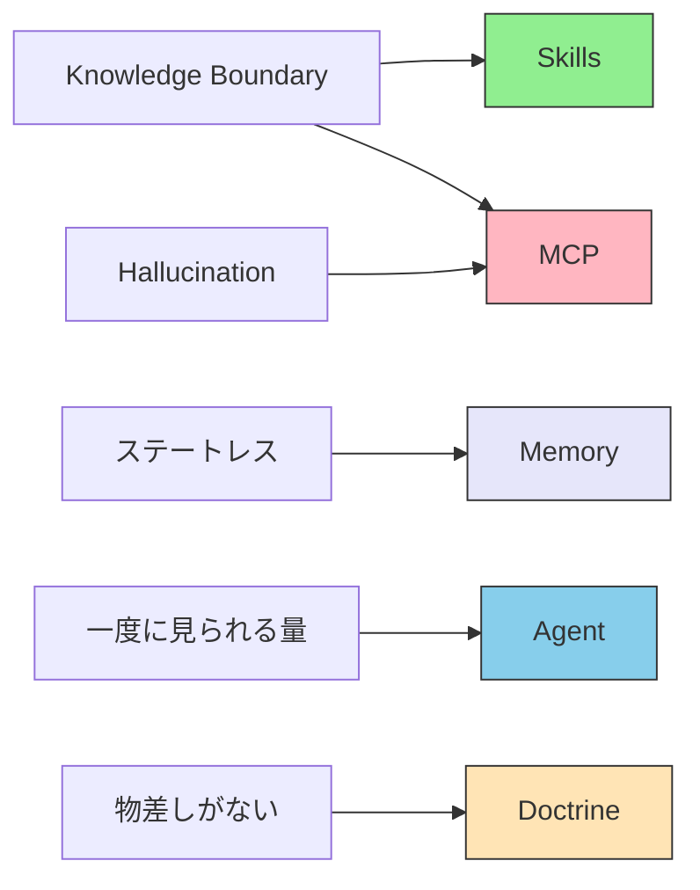

# I.1 制約の要約

> [!NOTE] 第I部の位置づけ
> ここまでの序章で、何を扱うかを決めた。第I部は、設計の前提になる限界を短くまとめる。中で何が起きているかの説明は、姉妹資料 [understanding-llm-through-claude-code](https://shuji-bonji.github.io/understanding-llm-through-claude-code/ja/) に任せる。

この限界は消えない。消すと約束もしない。限界を条件にして、層で受け止める。

## 1.1 推論の前提

たとえば Claude に「RFC 6455 の Close code 1006 は何を意味するか」と聞くと、正しい説明が返ることもある。隣の番号の説明が混ざることもある。存在しない節を、それらしい番号で指すこともある。モデルは「知っている」のではなく、次の言葉を予測して文章を作っている。

本書が扱う AI は、主に LLM（大規模言語モデル）である。LLM は、学習した文章から次の[トークン](../glossary#token)を、確率で選んでつなげる。LLM 以外も含めて呼ぶときは、[基盤モデル](../glossary#foundation-model)と言う。

次のことは、保証しない。

- 答えが事実であること
- 答えが、学習した日より新しいこと
- 答えが、公式の解釈であること
- 答えの責任を、モデルが負えること

入れ物の側にも、次の性質がある。

- LLM は[ステートレス](../glossary#stateless)である。前回の推論を、自分では持たない。
- 一度に渡せる文章量には上限がある（[コンテキストウィンドウ](../glossary#context-window)）。
- プロンプトの言い回しを変えても、この性質は消えない。

## 1.2 構造的制約

姉妹資料は、この限界を 8 項目に分けて定義している。ここには、設計に使う最小の意味だけを置く。

| 名前 | 短い意味 | 設計でやること |
| --- | --- | --- |
| **Knowledge Boundary** | 知識は学習した時点で止まる。知らないことを「知らない」と言いにくい | チームの手順と、いまの事実は、モデルの外に置く |
| **Hallucination** | 事実でないことを、根拠があるように書く | 推測と、原文への参照を分ける |
| **Context Rot** | 渡す文章が増えるほど、答えの質が落ちる | いつも載せる情報を増やさない |
| **Lost in the Middle** | 長い入力の真ん中は、参照されにくい | 大事な条件を、中ほどに埋めない |
| **Priority Saturation** | 同時に出す指示が増えるほど、一つひとつの守りが弱くなる | 指示を層へ分ける |
| **Instruction Decay** | 会話が長くなると、最初の指示が守られにくくなる | 判断の物差しを、会話の履歴だけに置かない |
| **Sycophancy** | 正しさより、相手への同意を優先しやすい | できたかどうかは、モデルの自己申告に任せない |
| **Prompt Sensitivity** | 意味が同じでも、書き方で出力が変わる | 毎回のプロンプトに、条件を全部書き直さない |

定義の一覧は [用語集](../glossary#structural-problems) と、姉妹資料 [Part 1: LLM の構造的問題](https://shuji-bonji.github.io/understanding-llm-through-claude-code/ja/01-llm-structural-problems/) にある。

設計の正面では、次の四つにまとめて扱う。

| 設計上の名前 | 意味 | 主に対応する 8 項目 |
| --- | --- | --- |
| **正確性** | 答えが事実だとは限らない | Hallucination |
| **最新性** | 学習の打ち切りよりあとは持たない | Knowledge Boundary |
| **権威性** | 公式の解釈を、自分では名乗れない | 制度の側にもまたがる。原文への接続が答える |
| **責任性** | 法や倫理の根拠を、自分では持てない | 制度の側にもまたがる。つなぐだけでは足りない |

権威性と責任性は、「モデルの中の仕組み」だけには落ちない。どこまで技術で届くかは第IV部で書く。ここでは次だけ決める。つないで補えるものと、つないでも補えないものがある。

## 1.3 五層との対応

5 層は、上の限界への答えである。つなぐ道具の一覧表ではない。層の定義と置き方は第II部で書く。

| 層 | 答えている限界 | ここに置くもの |
| --- | --- | --- |
| **Doctrine** | 判断の物差しがない。責任性の一部 | 目的、禁止、優先順位 |
| **Agent** | 一度に全部は見られない。Priority Saturation、Instruction Decay | 作業の理解と割り振り |
| **Skills** | Knowledge Boundary（手順や決まり） | 変わらない知識と手順 |
| **Memory** | ステートレス | 残しておきたい記憶と関係 |
| **MCP** | 正確性、最新性、権威性のうち、つないで補える部分 | 外のシステムへの接続 |

法令や RFC の原文へつなげるのは MCP の担当である。責任は MCP だけでは足りない。Doctrine、Skills、人間の確認を組み合わせる。

## 1.4 つないで補えるものと、補えないもの

原文のある場所へつなぐと、推測と事実を分けられる。法令、RFC、W3C の仕様が、その例である。値が変わるデータでも、取った時点の出典が残るものは、つなぎ先になり得る。

つなぐことは、次を保証しない。

- 答えがいつも正しいこと
- モデルが公式の解釈をする権限を持つこと
- 法や倫理の責任を、システムが引き受けること

倫理や、組織だけの価値判断は、Skills に書いた知識と、[Doctrine](../part-3/doctrine) に書いた物差しと、人間の確認で持つ。最後の判断と責任は、人間の側に残る。

## 1.5 責任の所在

仕組みが抽象になっても、責任は消えない。持つ人が変わる。

| いつ | 誰が持つ | 何を持つか |
| --- | --- | --- |
| **設計時** | 人間 | 何を参照するか、どの層に置くか、物差しをどう書くか |
| **実行時** | エージェント | 参照に基づく推論と、作業の実行 |
| **構造の制約** | システム | 一貫性、誰が触れるか、あとから追える記録 |

確認は二段に分けるのがよい（**SHOULD** / するのがよい）。

| 段 | 性質 | 役割 |
| --- | --- | --- |
| **ガードレール** | 越えてはならない | 「この線は超えない」を決める |
| **評価** | 確率で見る | 「この範囲なら通す」を決める |

できたかどうかは、エージェントの自己申告に任せてはならない（**MUST NOT** / してはならない）。テストが通ったかなど、機械で確かめられる条件で決めなければならない（**MUST** / しなければならない）。

## 1.6 本章が決めないこと

| 決めること | 決めないこと | 代わりに置くもの |
| --- | --- | --- |
| 限界を、設計の条件にすること | 限界が技術で消えること | 層で受け止めること |
| 接続と責任を分けること | 人間の確認が不要になること | 設計時の境界と、実行時の記録 |
| 責任を持つ人を明示すること | 法的責任をシステムが引き受けること | 人間に残る最終判断 |

各限界に、いまどこまで届くかは第IV部で書く。何をどこへ置くかは第II部で書く。

## 1.7 要約

LLM は、限られた文章量のなかで、次の言葉を予測して書く。自分では状態を持たない。事実、新しさ、公式の解釈、責任を保証しない。設計は、この限界を前提に 5 層を置く。つないで補えるものと、つないでも補えないものを分ける。最後の判断と責任は、人間に残る。

## 関連ドキュメント

- [序章](../preface) — 本書の問いと範囲
- [II.1 五層](../part-2/layers) — 第II部
- [用語集](../glossary#structural-problems) — 8 項目の短い定義
- [understanding-llm / Part 1: LLM の構造的問題](https://shuji-bonji.github.io/understanding-llm-through-claude-code/ja/01-llm-structural-problems/) — 限界の由来

---

> **前へ**: [序章](../preface)
>
> **次へ**: [II.1 五層](../part-2/layers)
