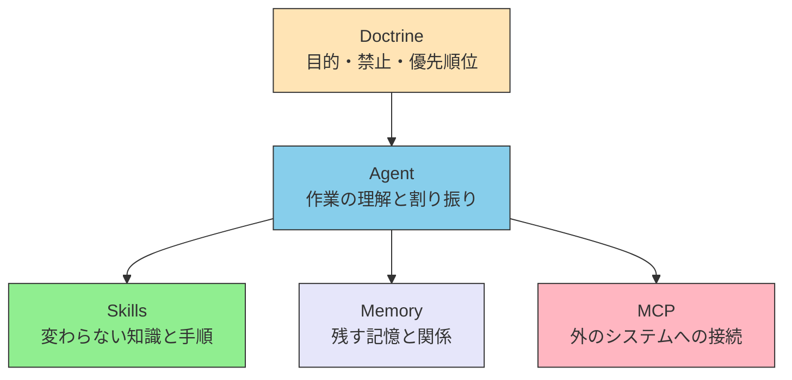

# II.1 五層

> [!NOTE] 第II部の位置づけ
> 第I部で、モデルの限界を短くまとめた。第II部では、その限界への答えとして層を置く。本章は、五層がそれぞれ何を担当するかを決める。何をどの層へ置くかの判定は [II.2 配置基準](./placement) に書く。ファイルの書き方は第III部へ送る。

## 2.1 担当の分け方である

五層は、「誰が何を担当するか」の分け方である。Claude Code の画面の話ではない。サーバを何台置くかの図でもない。

一つのファイルに、複数の層の話が混ざることはある。置く場所は、ファイル名ではなく、中身の担当で決める。

## 2.2 各層の担当

| 層 | 担当すること | 置かないこと |
| --- | --- | --- |
| **Doctrine** | 目的、禁止、優先順位を与える。他の層の物差しになる | 手順の列挙。ツールの呼び方 |
| **Agent** | 作業を理解し、他の層を組み合わせる | 知識の本体。外のシステムの中身 |
| **Skills** | 変わらない知識と手順を、必要なときに読めるようにする | 実行。いまこの瞬間の値 |
| **Memory** | 会話をまたいで残す記憶と関係 | その場限りのプロンプト。原文そのもの |
| **MCP** | 外のシステムへつなぎ、事実と操作を取る | 判断の物差し。静的な手順書 |

たとえば翻訳の仕事なら、品質の下限は Doctrine、作業の割り振りは Agent、用語の決まりは Skills、前回の訳の癖は Memory、辞書サービスへの接続は MCP、と分けられる。

以前の稿は Agent / Skills / MCP の三層を先に置き、Doctrine と Memory を後から足した。本書は五層を、最初から同じ並びで扱う。Memory を「モデルの外」に残さない。

## 2.3 組み合わせ方

ユーザーの依頼は Agent が受ける。進めてよいかは Doctrine の物差しで見る。変わらない手順は Skills を読む。以前の関係は Memory を見る。いまの事実と操作は MCP で取る。結果をまとめるのも Agent の担当である。

Agent の中に、役割を分けたサブエージェントを置いてよい。サブエージェントは MCP の代わりではない。仕事を分ける単位である。詳細は第III部の Agent に書く。

エージェント同士が話すときは、A2A（Agent-to-Agent Protocol）を使う。MCP がつなぐ先はツールとデータである。A2A がつなぐ先は、別のエージェントである。どちらか一方で足りる、という関係ではない。

## 2.4 取り違えやすい点

| 取り違え | 扱い |
| --- | --- |
| 五層を、サーバ構成の図だと思う | 担当の分け方として読む |
| Host / Client / Server を五層と同じだと思う | それは MCP という規格の内側の話である。第III部で書く |
| サブエージェントを MCP の代わりだと思う | サブエージェントは Agent 側の、仕事の分け方である |
| Memory を、ただのキャッシュだと思う | Memory の本義は、関係を残すことである |
| 製品名（Claude Code など）を層の名前だと思う | 製品はホストである。層は担当である |

判断が要らない処理は、MCP に載せなくてよい。人間が自分で判断する操作は、公式の CLI のままでよい。モデルが判断するときは、接続は MCP、知識は Skills、役割の分離は Agent に置く。判定の詳細は [II.2](./placement) に書く。

## 2.5 本章が決めないこと

ホストの操作手順は扱わない。MCP サーバーの作り方も扱わない。Skills のファイルの置き方も扱わない。それらは第III部の各層が持つ。

どのパターンを選ぶか、どこまで届くか、物理世界へどう広げるかは、第IV部である。

## 2.6 要約

五層は、LLM の限界への答えである。Doctrine が物差しになり、Agent が組み合わせ、Skills / Memory / MCP が知識・記憶・接続を持つ。層は担当であり、製品の配置ではない。何をどこへ置くかは、次の章で決める。

## 関連ドキュメント

- [I.1 制約の要約](../part-1/constraints) — 答えている限界
- [II.2 配置基準](./placement) — 何をどの層へ置くか
- [Skillsとは](../skills/what-is-skills) / [MCPとは](../mcp/what-is-mcp) / [エージェント](../agents/) — 第III部のいまの入口
- [understanding-llm / Part 2: コンテキストウィンドウ](https://shuji-bonji.github.io/understanding-llm-through-claude-code/ja/02-context-window/) — 層へ分ける理由の仕組み

---

> **前へ**: [I.1 制約の要約](../part-1/constraints)
>
> **次へ**: [II.2 配置基準](./placement)
