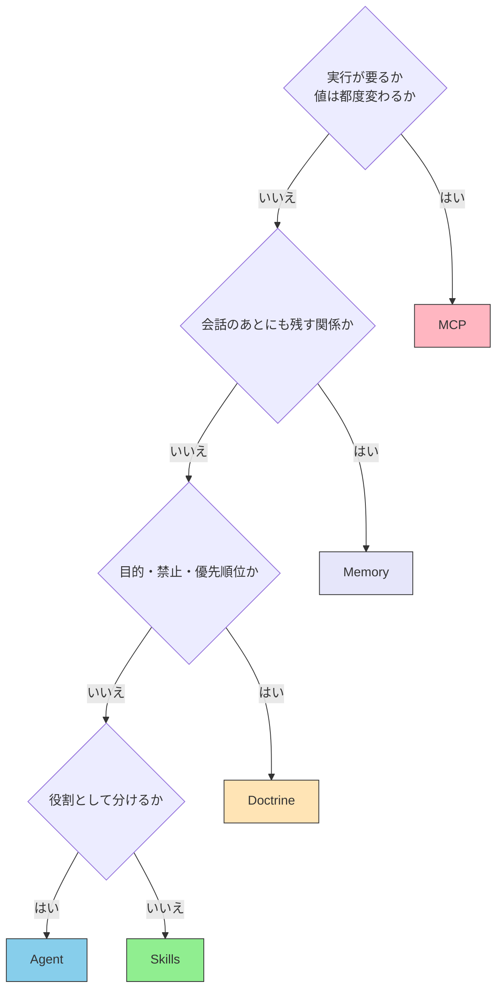

# II.2 配置基準

> [!NOTE] 本章の位置づけ
> [II.1 五層](./layers) で、各層の担当を決めた。本章は、具体的な知識や接続を、どの層へ置くかを決める。限界の説明は繰り返さない。MCP サーバーの作り方と Skill の書き方は第III部へ送る。

## 2.1 置く場所を決める問い

新しい決まり、手順、接続、記憶を、どこへ置くかを決めるとき、次を問う。

1. 実行が要るか。値は、その都度変わるか。
2. 公式の原文へたどれるか。
3. 会話が終わったあとも残す関係か。
4. 目的と優先順位か。手順と例か。
5. 役割として分けた方がよいか。

答えが、層を決める。ファイルをどこに置くかが先ではない。

## 2.2 確認できる参照先

モデルの出力を、推測のままにしない。あとから原文と照合できる参照先を置く。

以前の稿は、これを「ブレない参照先」と呼んだ。本書では、次の性質を文で書く。

| 性質 | 意味 |
| --- | --- |
| **権威性** | 書いた人が、その分野で決める立場にある。または専門家として認められている |
| **版が残ること** | 出したあとに、黙って中身が変わらない。変わるときは版が残る |
| **構造化** | 章・節・条のように、「ここのこと」と指せる |
| **照合できること** | 答えを、原文と突き合わせられる |
| **プログラムから読めること** | 人の目だけでなく、ツールからも取れる形がある |

全部が最高でなくてよい。権威も版も無い情報源を、原文がわりにしてはならない（**MUST NOT** / してはならない）。構造が弱く、プログラムからも取りにくい情報源は、MCP にする価値を別に見るのがよい（**SHOULD** / するのがよい）。

現場での確認は [参照先選定チェックリスト](../reference-selection-checklist) を使う。

## 2.3 強さの順と、置く層

参照先には、守る強さの差がある。強さの言葉は [RFC 2119](https://www.rfc-editor.org/rfc/rfc2119) に合わせる。

| レベル | 内容 | 守り方 | 主に置く層 |
| --- | --- | --- | --- |
| 1 | 国際標準・法令 | **MUST**（しなければならない） | MCP（原文への接続） |
| 2 | 業界で事実上の標準 | **SHOULD**（するのがよい） | MCP。取れ方によっては Skills |
| 3 | 組織やプロジェクトの決まり | その場では守る | Skills。優先順位は Doctrine |
| 4 | よいやり方の例 | 推奨 | Skills |

法令、RFC、W3C の仕様は、推測で埋めない。MCP で原文につなぐ。組織の決まりと作業手順は、モデルの中には入っていない。Skills に書く。何を優先するかは Doctrine に書く。

## 2.4 配置の判定

原文へたどるかどうかは、層を選ぶ話そのものではない。MCP に置いてよいかの質の話である。質は 2.2 と 2.3 で見る。

| 置くもの | 層 | やってはいけないこと |
| --- | --- | --- |
| 法令、RFC、W3C など、原文への接続 | MCP | Skills に原文をコピーして終わりにすること |
| 翻訳ルール、コーディング規約、手順 | Skills | MCP のツール説明文だけに書くこと |
| 目的、禁止、優先順位 | Doctrine | 毎回のプロンプトにだけ書くこと |
| 顧客、案件、前回の決定などの関係 | Memory | 会話の履歴だけに残すこと |
| 役割の分離、依頼、結果のまとめ | Agent | MCP サーバーに役割を埋め込んで終わりにすること |

その場で動かす処理と、外の API は MCP である。変わらない知識は Skills である。コードとして動かす処理が要る場合も MCP である。役割を分けるなら Agent である。

判断が要らない処理は、普通のプログラムに直接置いてよい。人間が自分で判断する操作は、公式の CLI のままでよい。何でも MCP にしてはならない（**MUST NOT** / してはならない）。

## 2.5 食い違いと出典

参照先が食い違うときは、守る強さの高い側を先に採る。法令は業界の慣行に勝つ。いま有効な RFC は、置き換え済みの RFC に勝つ。出典は、どの版の、どの箇所かを付けて残さなければならない（**MUST** / しなければならない）。

推測と参照は、出力のうえで分けて書くのがよい（**SHOULD** / するのがよい）。参照できない箇所は、参照できないと書く。

## 2.6 本章が決めないこと

MCP のツールをどう切るかは第III部である。Skill の書き方も第III部である。Memory に何の製品を使うかも第III部である。どこまで届くかは第IV部である。

## 2.7 要約

置く場所は、実行が要るか、原文へたどるか、記憶の寿命か、目的か手順か、役割を分けるか、で決める。確認できる参照は MCP でつなぎ、手順は Skills に書き、優先順位は Doctrine に置き、関係は Memory に残し、組み合わせは Agent が持つ。推測で原文の代わりをしてはならない。

手段の選択で迷うときは、鮮度・判断の量・データの状態の三軸も使える。資源とアクセスの見取り図は [全体地図](../information/architecture-map) にある。

## 関連ドキュメント

- [II.1 五層](./layers) — 各層の担当
- [全体地図](../information/architecture-map) — 資源・アクセス・循環の見取り図（五層とは軸が違う）
- [参照先選定チェックリスト](../reference-selection-checklist) — 使ってよいかの確認
- [MCP vs Skills](../skills/vs-mcp) — いまの使い分けの各論
- [understanding-llm / Part 6: ツールコンテキスト](https://shuji-bonji.github.io/understanding-llm-through-claude-code/ja/06-tool-context/) — MCP をいつも全部載せない理由

---

> **前へ**: [II.1 五層](./layers)
>
> **次へ**: [Skillsとは](../skills/what-is-skills)
