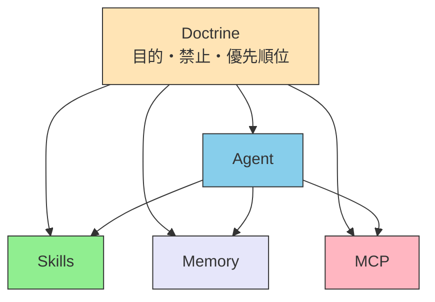

# III.3 Doctrine

> [!NOTE] 本章の位置づけ
> Skills は知識、MCP は接続を置く。どちらも「何を大事にするか」は持たない。Doctrine は、目的と禁止と優先順位を置く層である。ファイルの置き方の詳細は、ホスト製品の文書と第III部の各 How-to に任せる。

## 3.1 手順ではなく、目的と境界

「仕様書で digital signature を検索し、Section 12.8 を抜き出せ」と書くと、仕様の見出しが変わった瞬間に壊れる。

「PDF の電子署名について、公式の要件に我々の実装が沿っているか確かめよ」と書くと、経路はモデルが選ぶ。代わりに、成功の定義と、越えてはならない線が要る。

Doctrine に置くのは、後者である。どうやるかの列は Skills か Agent に置く。

翻訳の仕事で言えば、次が Doctrine である。

- 目的: 公開する訳は、xCOMET 0.85 を下回ってはならない（**MUST** / しなければならない）
- 禁止: 機械訳のまま出してはならない（**MUST NOT** / してはならない）
- 優先: 用語の統一は、速さより先である

用語集の中身や、ツールの呼び順は Skills と MCP の側である。

## 3.2 三つの要素

| 要素 | 問うこと | 例 |
| --- | --- | --- |
| **目的** | 成功とは何か | API は RFC 7231 に沿う。訳は xCOMET 0.85 以上 |
| **制約** | どの線は超えないか | テストを通っていないコードは入れない。壊す操作は人の確認を取る |
| **判断基準** | 目的がぶつかったら、どちらを先にするか | 安全性 > 速さ。分からないときは、推測せず人に聞く |

この三つが揃って、初めて他の層が動ける。どれか一つを毎回のプロンプトにだけ書くと、会話が長いほど薄れる（Instruction Decay）。物差しは、会話の外に置かなければならない（**MUST** / しなければならない）。

Doctrine は、[システムプロンプト](../glossary#system-prompt)の言い換えではない。プロンプトは、その回の入力である。Doctrine は、どの回でも共通の物差しである。Claude Code では `CLAUDE.md` や `.claude/rules/` に置くことが多い。置き場は製品ごとに違う。担当は同じである。

## 3.3 他の層との関係

Agent は、進めてよいかを Doctrine で見る。Skills は、手順の中で優先を Doctrine から受ける。MCP は、つないでよいかの線を Doctrine から受ける。Memory に何を残してよいかも、同じ線である。

通信が切れて、その場で聞けないときほど、共有した物差しが要る。物理世界での例は第IV部で書く。ここでは次だけ持つ。聞けないときにバラバラに動くと、設計は失敗する。

## 3.4 置いてはならないもの

| 置いてはならないもの | 代わりの層 |
| --- | --- |
| ツールの呼び順、チェックリストの手順 | Skills |
| 外の API のつなぎ方 | MCP |
| 前回の案件の中身 | Memory |
| 誰がこの仕事をやるか | Agent |

きびしさの言葉は序章 0.7 と同じである。MUST と SHOULD を混ぜて書くと、モデルは両方を同じ重さで守りがちである。線は MUST に、推奨は SHOULD に分けるのがよい（**SHOULD** / するのがよい）。

## 3.5 本章が決めないこと

評価の仕組み（Evals）の設計は、ここでは切らない。特定ホストでのファイル名の一覧も切らない。自律の段数を何段にするかは、仕事ごとに決める。限界の引き方は第IV部である。

## 3.6 要約

Doctrine は、手順ではなく、目的と禁止と優先順位を置く。他の層は、この物差しの内側で動く。毎回のプロンプトにだけ書いてはならない。

## 関連ドキュメント

- [II.1 五層](../part-2/layers) / [II.2 配置基準](../part-2/placement)
- [III.4 Memory](./memory) — 残す記憶
- [III.5 Agent](../agents/) — 割り振り
- [understanding-llm / Part 3: 常駐コンテキスト](https://shuji-bonji.github.io/understanding-llm-through-claude-code/ja/03-always-loaded-context/) — 物差しを常に載せる理由

---

> **前へ**: [MCPとは](../mcp/what-is-mcp)
>
> **次へ**: [III.4 Memory](./memory)
