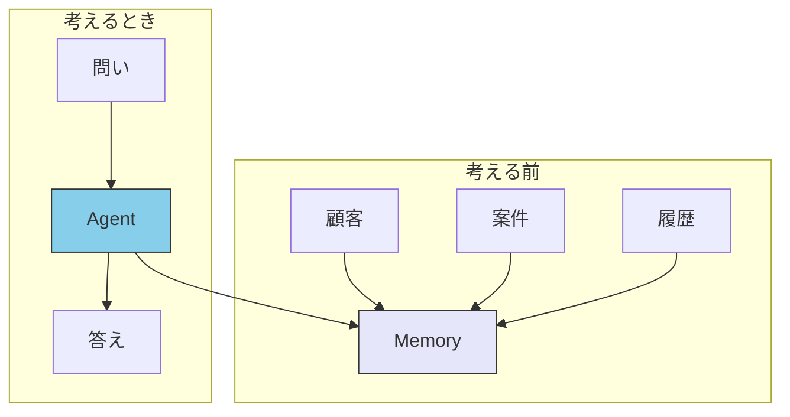

# III.4 Memory

> [!NOTE] 本章の位置づけ
> LLM は、渡した文章の外は見ない。前回の続きも、他システムのつながりも、どこかに残しておかないと、その場の推測になる。本章は Memory 層の担当を決める。製品の選定はしない。

## 4.1 毎回取りに行く設計の限界

「A 社の担当は誰で、いまの案件はどうなっているか」と聞くとする。顧客の仕組み、案件の仕組み、履歴の仕組みを、その場で順に叩くと、答えは組み立てになる。一番遅い呼び出しが全体を遅らせる。渡す文章は毎回ゼロから増える。仕組みをまたぐ関係は、モデルがその場でつなぐ。つながりを推測すると、ずれる。

この取り方を scatter-gather と呼ぶ。ツールを足すほど、賢くなるとは限らない。関係を残す層が無いと、複雑な問いは伸びない。

## 4.2 考える前に、関係を持っておく

答えは、考える前に関係をまとめておくことである。推論のときは、まとめた記憶を聞く。関係をその場で作らない。

MCP で取った値を Memory に流し、普段の参照は Memory で済ませ、いま必要なときだけ MCP を叩く、というつなぎ方がある。MCP は原文と操作、Memory は関係である。同じではない。

Memory を、ただ速いキャッシュだと思ってはならない。本義は、関係を残すことである。

## 4.3 残すものの出所

残すものは、出所で性質が分かれる。

| | 外の公式 | 自分たちの仕事の履歴 |
| --- | --- | --- |
| 例 | 法令、RFC、仕様 | 顧客対応、案件、約束 |
| 欲しいもの | 原文の再現 | 前回の続き |
| 失敗したとき | 法令を間違える | 文脈が途切れる |
| つなぎ先 | 主に MCP | 主に Memory |

実務では両方を行き来する。「A 社とは以前こう約束した（Memory）。ただし下請法のこの条を確認する（MCP）」が、その形である。

ドメイン MCP を作る人は、自分の MCP の中に小さな関係のまとまりを持っている、と考えてよい。法令なら条と通達、RFC なら依存する RFC、である。それは Memory の代わりではない。原文の側の代理である。

## 4.4 規模の目安

最初から大きなグラフを組む必要はない。痛みが出てから段を上げる。

| 段 | 目安 | 向く仕事 |
| --- | --- | --- |
| ファイルと Markdown | 個人、数十から数百 | プロジェクトのメモ、前回の決定 |
| 表形式の DB | チーム、数千から数万 | 案件と担当の 1〜2 段の関係 |
| グラフ DB | 複数の仕組み、関係が 3 段以上 | 顧客—案件—障害—修正のような網 |
| 複数システムを同期 | 本番の記憶基盤 | 名寄せと権限を含む統合 |

次の段へ進む合図は、同じデータを何度も取りに行っていること、「A 社」と英語名を別人と誤ること、3 段以上の関係をよく聞かれること、「前回の続き」が仕事の要件であること、である。

ドメインが一つで、関係が 1〜2 段で足り、過去の文脈が要件でないなら、Memory 層を急いで足さなくてよい。

## 4.5 置いてはならないもの

| 置いてはならないもの | 代わりの層 |
| --- | --- |
| 法令や RFC の原文そのもの | MCP |
| チームの手順書 | Skills |
| 目的と禁止 | Doctrine |
| その場限りの作業指示 | Agent / プロンプト |

誰が、誰の代理として動くかは、Agent の識別の話である。詳細は [エージェント ID](../agents/agent-identity) を見る。

## 4.6 要約

Memory は、会話が終わっても残る記憶と関係を置く。毎回 MCP を並べて集める設計は、遅さとずれを生む。考える前に関係を持っておく。キャッシュではなく、関係の残り方である。小さな仕事では、ファイルからで足りることが多い。

## 関連ドキュメント

- [II.1 五層](../part-2/layers) / [II.2 配置基準](../part-2/placement)
- [III.3 Doctrine](./doctrine) — 物差し
- [エージェント ID](../agents/agent-identity) — 誰の代理か
- [understanding-llm / なぜメモリが問題になるのか](https://shuji-bonji.github.io/understanding-llm-through-claude-code/ja/08-session-management/memory-problem)

---

> **前へ**: [III.3 Doctrine](./doctrine)
>
> **次へ**: [エージェント](../agents/)
