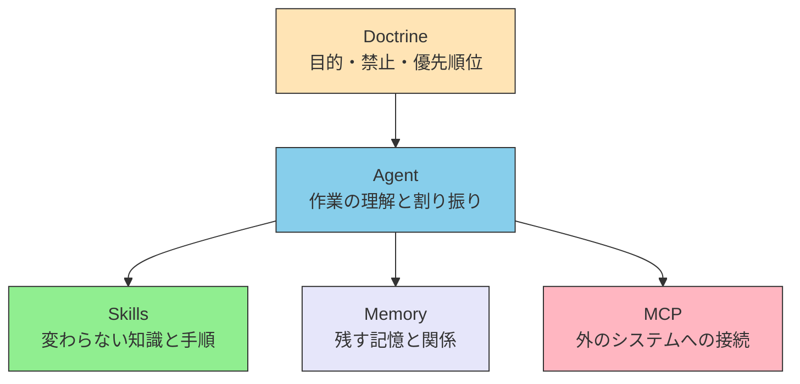

# 序章 — 本書の問いと範囲

> [!NOTE] 本書の位置づけ
> 日本語の書名は **LLMエージェントの設計**、英語の書名は **LLM Agent Design Architecture** である。Claude のような LLM を中心に、エージェントを長く使える形へ組むための本である。製品の操作手順は扱わない。

Claude に「この法令のこの条は、いまも有効か」と聞くと、それらしい答えが返ってくる。ただし、その答えが原文と一致する保証はない。昨日の会話の続きも、こちらが渡さなければ覚えていない。本書は、その前提でエージェントを組む話から入る。

本書が扱う AI は、主に [LLM](./glossary#llm) である。LLM は Large Language Model の略で、日本語では大規模言語モデルと言う。大量の文章を読み、「次はどの言葉が来やすいか」を予測して文章を作る。Claude や ChatGPT の中身がこれに当たる。中で何が起きているかの説明は、姉妹資料 [understanding-llm-through-claude-code](https://shuji-bonji.github.io/understanding-llm-through-claude-code/ja/) に任せる。

LLM 以外も含めて呼ぶときは、[基盤モデル](./glossary#foundation-model)（Foundation Model）と言う。大量のデータで学び、いろいろな仕事へ転用できるモデルのまとめの呼び方である。画像と動作を扱う Vision-Language-Action（VLA）なども、ここに含める。

話の始まりは、このモデルが最初から持っている限界である。あとからツールをつなぐ規格は、その限界への答えの一つとして出てくる。

## 0.1 本書が答える問い

本書が答える問いは、次の三つである。

1. モデルの限界を前提に、エージェントをどの層へ分けるか。
2. 各層に何を置き、何を置かないか。
3. その決め方を、あとから直せる形、人に渡せる形で残すには、何を先に決めておくか。

LLM が一度に見られる文章量には上限がある（[コンテキスト](./glossary#context)）。前回の会話を自分では覚えない。学習した時点よりあとのことは知らない。何を優先するかも、最初からは持っていない。プロンプトの言い回しを変えても、この性質は消えない。

だから設計では、限界を前提にして層を置く。層は、限界への答えである。つなぐ道具の一覧表ではない。

今日の作業を終わらせるだけなら、[ハーネス](./glossary#harness)の使い方で足りることが多い。ハーネスは、モデルのまわりに置く実行の仕組みである。本書が扱うのは、動かしたあとの話である。どこに何を置くか、どこまで厳しく書くか、人に渡すときに何を残すか、である。

## 0.2 本書の対象

対象は、基盤モデルを中心に考えるエージェントの設計である。中身は次の 5 層に分ける。層の名前は英語のまま使う。

| 層 | ここに置くもの | 答えている限界 |
| --- | --- | --- |
| **Doctrine** | 目的、禁止、優先順位 | モデルは、何を大事にするかを自分では持たない |
| **Agent** | 作業の理解と割り振り | 一度に全部は見られない（[コンテキストウィンドウ](./glossary#context-window)） |
| **Skills** | 変わらない知識と手順 | チームの決まりは、モデルの中（[重み](./glossary#weights)）には入っていない |
| **Memory** | 残しておきたい記憶と関係 | 会話が終わると何も残らない（[ステートレス](./glossary#stateless)） |
| **MCP** | 外のシステムへの接続 | 事実と新しさ。[Hallucination](./glossary#structural-problems) と、学習データの打ち切り |

MCP は Model Context Protocol の略である。モデルを、外のツールやデータへつなぐための共通の決まりである。Anthropic がまとめた。本書では、その決まりそのものと、接続を担当する層の両方を MCP と呼ぶ。どちらを指すかは、前後の文で分かるように書く。

5 層は、「誰が何を担当するか」の分け方である。サーバを何台置くかの図ではない。画面のレイアウトでもない。

Doctrine は、他の層が従う物差しになる。Agent は、Skills・Memory・MCP を組み合わせて使う。Skills は読むだけで、自分では外の API を叩かない。Memory は、考える前に関係を持っておく。MCP は、外の事実と操作を取る。

本書は、この 5 層の置き方と、あとから直せる判断の残し方を扱う。

## 0.3 本書が扱わないもの

次は扱わない。

| 扱わないもの | 境界 |
| --- | --- |
| 囲碁 AI のような強化学習、昔の規則ベース、制御理論そのもの | 中心が LLM ではない構成は、対象にしない |
| LLM の内部がどう動くかの詳細 | 「なぜそうなるか」は姉妹資料へ渡す。設計に必要な限界だけ、本書で短くまとめる |
| 特定製品の操作手順 | Claude Code などの使い方は、各製品の文書を見る |
| 情報の持ち主やアクセス権の制度そのもの | それは LLM がなくても成立する話であり、5 層の外である |

画像認識や検索など、LLM 以外の部品は現場ではよく出てくる。本書では、それらを MCP のつなぎ先として扱う。組み立てる側は、基盤モデルの側である。

## 0.4 想定する読者

試作で一度動かして終わり、ではなく、あとからも使い続ける前提でエージェントを組む人を想定する。

機械学習の研究経験は要らない。数式を追う必要もない。モデルには限界がある、それを設計の条件にする、それができれば足りる。

対象の作業は、動かす先の設計、直し、広げ、人への引き渡しである。今日の作業を片付ける手順は、ハーネスの文書を見る。

## 0.5 隣接する資料との関係

関心ごとの分担は、次のとおり。

| 関心 | 資料 | 役割 |
| --- | --- | --- |
| 理解する（限界の由来） | [understanding-llm-through-claude-code](https://shuji-bonji.github.io/understanding-llm-through-claude-code/ja/) | Why。LLM の限界と、その仕組み |
| 設計する | 本書 | What / How。層、置き方、判断の残し方 |
| 運用へ適用する | 別資料（準備中） | 運用への適用 |

Why は姉妹サイト、What / How は本書、と分ける。姉妹サイトを先に読まなくても、本書の入口は成立する。限界の要約は第I部で行う。仕組みの細部は姉妹サイトが持つ。

## 0.6 本書の構成

全体は四部である。骨格の章は新しい場所へ移してある。Skills / MCP / Agent の入口は、いまの場所のまま中身を直した。古い URL を開いても、移したページへ送る。

| 部 | 内容 | いま読める場所 |
| --- | --- | --- |
| **第I部 前提** | 限界の要約。仕組みの細部には入らない | [part-1/constraints](./part-1/constraints) |
| **第II部 モデル** | 層と、何をどこへ置くか | [part-2/layers](./part-2/layers)、[part-2/placement](./part-2/placement) |
| **第III部 各層** | Skills / MCP / Doctrine / Memory / Agent | [skills/](./skills/what-is-skills)、[mcp/](./mcp/what-is-mcp)、[part-3/doctrine](./part-3/doctrine)、[part-3/memory](./part-3/memory)、[agents/](./agents/) |
| **第IV部 構成と展開** | パターン、限界、物理世界、プロンプトの分解 | [part-4/patterns](./part-4/patterns)、[part-4/limits](./part-4/limits)、[part-4/physical](./part-4/physical)、[part-4/prompt-decomposition](./part-4/prompt-decomposition) |

Skills、MCP、Doctrine、Memory、Agent、A2A の実践例は消さない。読む順を、限界から層へ組み替える。

いま残している FAQ のスコープ説明も消さない。範囲の定義は、この序章が持つ。

## 0.7 用語と表記

層名 **Doctrine** / **Agent** / **Skills** / **Memory** / **MCP** は固有名なので、英語のまま使う。普通の概念は日本語を先にする。言葉は、最初に出たところで説明する。あとから探すときは [用語集](./glossary) を見る。

LLM と基盤モデルは、本章の冒頭で説明した。

きびしさの言葉は [RFC 2119](https://www.rfc-editor.org/rfc/rfc2119) の意味で使う。記号だけに意味を預けない。

| キーワード | 本文での言い方 | 意味 |
| --- | --- | --- |
| **MUST** / **SHALL** | しなければならない | 守らないと、設計として欠陥になる |
| **MUST NOT** / **SHALL NOT** | してはならない | やってはいけない |
| **SHOULD** | するのがよい | やむを得ない理由があるときだけ、外してよい |
| **SHOULD NOT** | しないのがよい | やむを得ない理由があるときだけ、採用してよい |
| **MAY** | してもよい | 選んでも選ばなくてもよい |

本文は常体で書く。口語、絵文字、記号だけの断言は使わない。

英語版の書名は LLM Agent Design Architecture である。英語本文は、日本語に対応させて置く。以前の書名は AI Agent Architecture だった。かつての副題は、入口には使わない。

## 0.8 序章の要約

本書は、LLM を中心にしたエージェントの設計の本である。始まりは、モデルが最初から持っている限界である。対象は Doctrine / Agent / Skills / Memory / MCP の 5 層である。読者は、一度動かして終わりではなく、あとからも使う人である。姉妹資料は「なぜそうなるか」を持ち、本書は「何を、どう置くか」を持つ。構成は第I部から第IV部である。

## 関連ドキュメント

- [I.1 制約の要約](./part-1/constraints) — 第I部
- [II.1 五層](./part-2/layers) — 第II部
- [用語集](./glossary) — 言葉の定義
- [understanding-llm-through-claude-code](https://shuji-bonji.github.io/understanding-llm-through-claude-code/ja/) — 限界の由来（Why）

---

> **次へ**: [I.1 制約の要約](./part-1/constraints)
