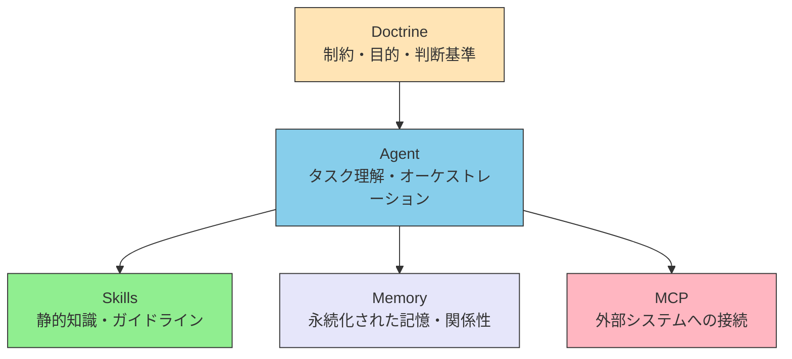

# 序章 — 本書の問いと範囲

> [!NOTE] 本書の位置づけ
> 日本語書名は **LLMエージェントの設計** である。英語書名は **LLM Agent Design Architecture** である。本書は、基盤モデルを推論の中核とするエージェントを、継続利用に耐える形で設計するための文書である。実行手順書ではない。

基盤モデルは、主に LLM を指す。Vision-Language-Action（VLA）など、隣接するモデルも含む。

論理の起点は、LLM（基盤モデル）の構造的制約である。外部接続の規格ではない。

## 0.1 本書が答える問い

本書が答える問いは、次の三つである。

1. 基盤モデルの構造的制約を前提に、エージェントの構成をどの層へ分解するか。
2. 各層に何を置き、何を置いてはならないか。
3. その判断を、再利用、保守、引き渡しに耐える形で残すには、何を固定すべきか。

LLM は、有限の[コンテキスト](./glossary#context)で推論する。状態を自ら保持しない。学習時点の知識境界を越えない。判断基準を自前では持たない。これらの制約は、プロンプトの言い回しでは解消しない。

設計は、この制約を前提として層を置く。層は、制約への応答である。接続手段のカタログではない。

エージェントを今日動かす方法は、[ハーネス](./glossary#harness)の実装パターンで足りることが多い。本書が扱うのは、動かしたあとの設計である。扱う対象は、構成の選択、規範の強度、層の境界、引き渡し可能な判断基準である。

## 0.2 本書の対象

本書の対象は、基盤モデルを推論の中核とするエージェントの設計である。

対象を、次の 5 層に置く。層名は固有名として英語のまま用いる。

| 層 | 置くもの | 応答する制約 |
| --- | --- | --- |
| **Doctrine** | 制約、目的、判断基準 | 判断基準の不在。モデルは目的も優先順位も自前では持たない |
| **Agent** | タスク理解とオーケストレーション | [コンテキストウィンドウ](./glossary#context-window)の有限性。一度にすべてを置けない |
| **Skills** | 静的な知識とガイドライン | 知識境界。ドメイン固有の手順や規約は[重み](./glossary#weights)に含まれない |
| **Memory** | 永続化された記憶と関係性 | [ステートレス](./glossary#stateless)性。セッションを跨いで何も残らない |
| **MCP** | 外部システムへの接続 | 正確性と最新性。[Hallucination](./glossary#structural-problems)と学習データのカットオフ |

MCP は Model Context Protocol の略称である。モデルと外部ツール・リソースを接続するオープンプロトコルを指す。策定は Anthropic による。本書では、この規格と、外部接続を担う層の両方を MCP と呼ぶ。層を指すか規格を指すかは、文脈で区別する。

5 層は、責務の分離である。デプロイ構成ではない。実装の物理配置と混同してはならない。

Doctrine は他の層を統治する。Agent は残り 3 層を編成する。Skills は参照される知識であり、実行しない。Memory は関係性を推論前に保持する。MCP は外部の事実と操作へ接続する。

本書は、この 5 層の配置基準と、再利用・保守・引き渡しのための判断基準を扱う。

## 0.3 本書が扱わないもの

本書は、次を扱わない。

| 扱わないもの | 境界 |
| --- | --- |
| 強化学習エージェント、古典的な規則ベース、制御理論そのもの | 推論の中核が基盤モデルでない構成は対象外である |
| LLM 内部構造の詳細 | 制約の由来と機序は姉妹資料へ委ねる。設計に必要な制約は本書内で要約する |
| 特定製品の操作手順 | ハーネス製品の使い方は、各製品の文書に属する |
| 情報ガバナンスの制度設計そのもの | オーナー、アクセス権、品質管理の制度は、LLM がなくても成立する。本書の層モデルの外である |

非 LLM の構成要素は、実システムでは MCP の接続先として現れる。知覚、検索、計画、識別がそれに当たる。本書が設計の中核に置くのは、それらを編成する基盤モデル側である。

## 0.4 想定する読者

想定する読者は、試作ではなく継続利用する前提でエージェントを組み立てる技術者である。

機械学習の研究経験は必須としない。モデル内部の導出を追う必要はない。必要なのは、制約を設計条件として扱えることである。

対象とする作業は、動かす先にある設計、保守、拡張、引き渡しである。単発の自動化を今日完遂する手順は、ハーネスの文書に属する。

## 0.5 隣接する資料との関係

関心ごとの分担は、次である。

| 関心 | 資料 | 役割 |
| --- | --- | --- |
| 理解する（制約の由来） | [understanding-llm-through-claude-code](https://shuji-bonji.github.io/understanding-llm-through-claude-code/ja/) | Why。LLM の構造的制約とその機序 |
| 設計する | 本書 | What / How。層、配置基準、判断基準 |
| 運用へ適用する | 別資料（準備中） | 運用への適用 |

Why は姉妹サイトが担う。What / How は本書が担う。本書の入口は、姉妹サイトを先に読まなくても成立する。制約の要約は第I部で行う。機序の詳細は姉妹サイトが担う。

## 0.6 本書の構成

目標とする構成は、次の四部である。現行ファイルのパスは、この序章の追加では変更しない。以下は読む順の目標である。現行ファイルの強制リネームではない。

| 部 | 内容 | 現行パス（参考） |
| --- | --- | --- |
| **第I部 前提** | 制約の要約。機序の詳細には入らない | [concepts/01-vision](./concepts/01-vision) |
| **第II部 モデル** | 層と配置基準 | [concepts/03-architecture](./concepts/03-architecture)、[concepts/02-reference-sources](./concepts/02-reference-sources) |
| **第III部 各層** | Skills / MCP / Doctrine / Memory / Agent | [skills/](./skills/what-is-skills)、[mcp/](./mcp/what-is-mcp)、[concepts/07-doctrine-and-intent](./concepts/07-doctrine-and-intent)、[concepts/08-memory-and-knowledge](./concepts/08-memory-and-knowledge)、[agents/](./agents/) |
| **第IV部 構成と展開** | パターン、限界、物理世界、プロンプトの分解 | [concepts/04-ai-design-patterns](./concepts/04-ai-design-patterns)、[concepts/05-solving-ai-limitations](./concepts/05-solving-ai-limitations)、[concepts/06-physical-ai](./concepts/06-physical-ai)、[concepts/09-prompt-decomposition](./concepts/09-prompt-decomposition) |

既存の実践知（Skills、MCP、Doctrine、Memory、Agent、A2A）は捨てない。読む順を、制約から層へ組み替える。

現行の FAQ によるスコープ説明は残置する。範囲の定義は、本章が担う。

## 0.7 用語と表記

層名 **Doctrine** / **Agent** / **Skills** / **Memory** / **MCP** は固有名である。本文では英語のまま用いる。一般概念は日本語を優先する。用語は初出で定義する。定義の参照先は [用語集](./glossary) である。

規範キーワードは [RFC 2119](https://www.rfc-editor.org/rfc/rfc2119) の意味で使う。本文では記号だけに意味を預けない。

| キーワード | 本文での併記 | 意味 |
| --- | --- | --- |
| **MUST** / **SHALL** | しなければならない | 絶対的な要件。違反は設計上の欠陥である |
| **MUST NOT** / **SHALL NOT** | してはならない | 絶対的な禁止である |
| **SHOULD** | するのがよい | 正当な理由がある場合のみ逸脱できる |
| **SHOULD NOT** | しないのがよい | 正当な理由がある場合のみ採用できる |
| **MAY** | してもよい | 完全に選択的である |

本文の日本語は常体（である調）で統一する。口語、絵文字、記号だけの断言は用いない。

英語版の書名は LLM Agent Design Architecture である。英語本文は未訳である。旧称は AI Agent Architecture である。副題に用いていた句は、本書の入口には使わない。

## 0.8 序章の要約

本書は、基盤モデルを推論の中核とするエージェントの設計文書である。起点は LLM の構造的制約である。対象は Doctrine / Agent / Skills / Memory / MCP の 5 層である。読者は、継続利用を前提にエージェントを組み立てる技術者である。姉妹資料は制約の由来を担う。本書は設計を担う。構成の目標は第I部から第IV部である。現行パスは、本章では動かさない。

## 関連ドキュメント

- [AI駆動開発のビジョン](./concepts/01-vision) — 現行 Concepts の起点
- [MCP/A2A/Skill/Agent の構成論](./concepts/03-architecture) — 層モデル
- [用語集](./glossary) — 初出用語の定義
- [understanding-llm-through-claude-code](https://shuji-bonji.github.io/understanding-llm-through-claude-code/ja/) — 制約の由来（Why）

---

> **次へ**: [AI駆動開発のビジョン](./concepts/01-vision)
