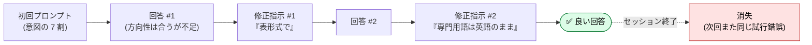
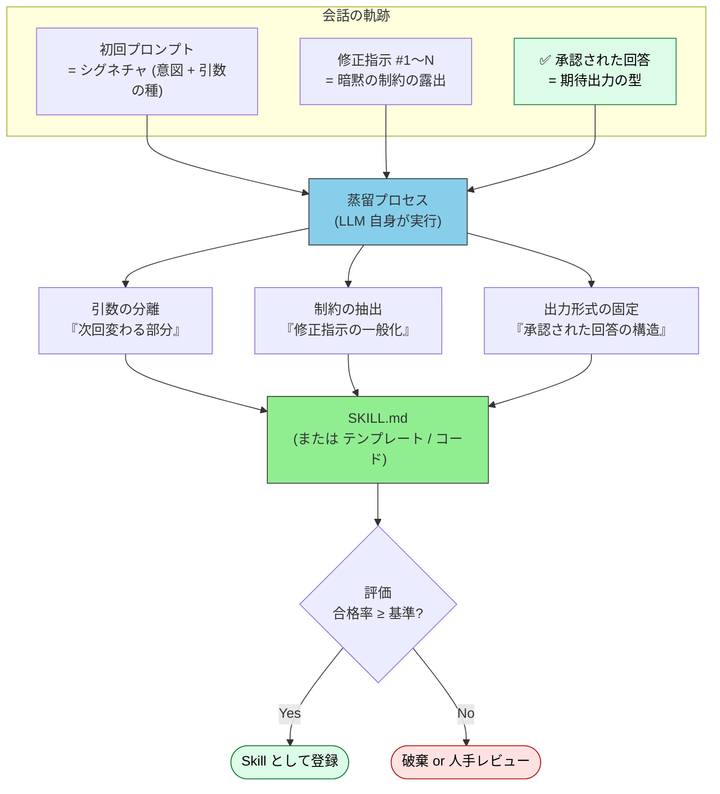
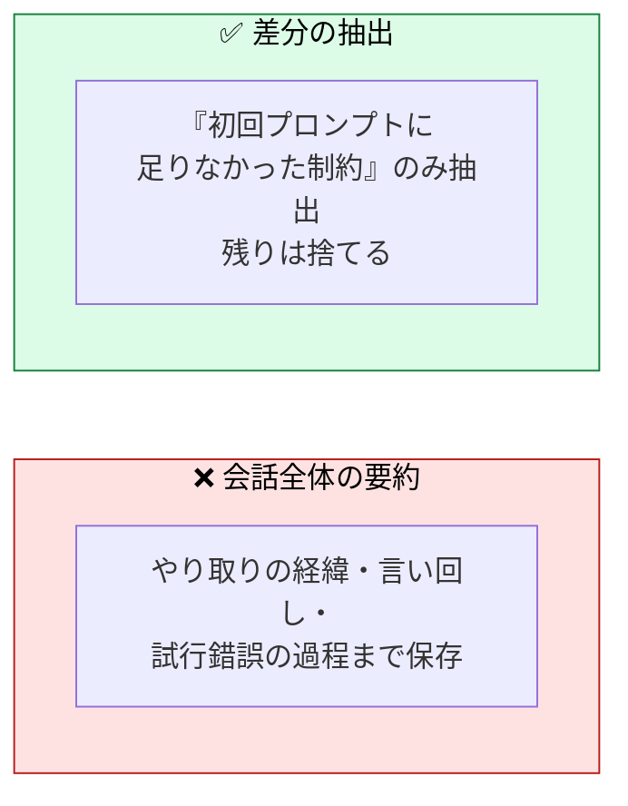
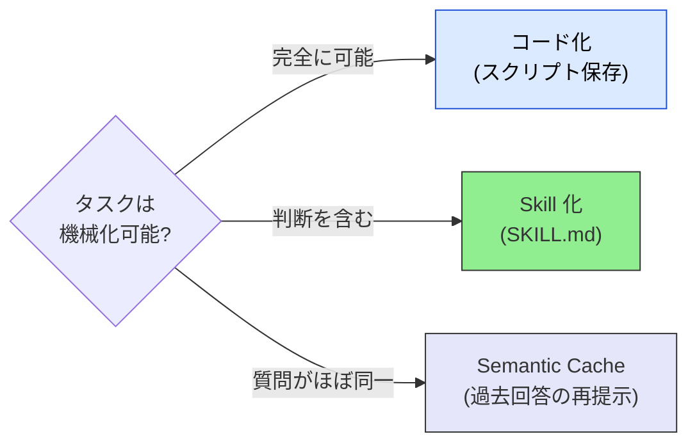

# 会話からの Skill 蒸留 — 良い回答を再利用可能な単位に変える

> 「この回答、良かった」をボタン 1 つで次回から再現可能にする — ただし固定化の罠を避けて

## このドキュメントについて

良い回答にたどり着いた会話は、多くの場合そのまま捨てられる。同じ種類のタスクが来るたびに、同じ試行錯誤（プロンプト → 修正指示 → 再修正）を繰り返す。本ページは、**成功した会話の軌跡（trajectory）を再利用可能な単位 — Skill・プロンプトテンプレート・コード — に圧縮する設計**を扱う。

[Skill設計ガイド](./creating-skills) と [スキル作成ガイド](./how-to-create-skills) が「**人が** Skill を書く」方法を扱うのに対し、本ページは「**会話から** Skill を生成する」逆方向のパスを扱う。

> **対象読者**: エージェントとのやり取りで得た知見を資産化したい開発者・チーム。Skill の基礎は [Skillsとは何か](./what-is-skills) を前提とする。

::: warning このページの位置づけ
本ページで扱う「蒸留」は**運用時（エージェント層）の Trajectory Distillation** であり、モデル学習時の Knowledge Distillation とは別物である（後述「『蒸留』という言葉の整理」参照）。
:::

::: details メタ情報

- **固定するもの**: 成功した会話から抽出する 3 要素（引数・制約・期待出力）と、Skill 昇格の判断基準
- **扱わないこと**: モデルの[重み](../glossary#weights)を変える蒸留（Knowledge Distillation / Context Distillation）、Skill の書き方そのもの（→ [スキル作成ガイド](./how-to-create-skills)）
- **依存**: [Skillsとは何か](./what-is-skills)、[Memory と知識](../concepts/08-memory-and-knowledge)
- **誤用ポイント**: 「会話ログをそのまま保存すること」だと誤解すること。蒸留の本質は**捨てること**にある

:::

## 「蒸留」という言葉の整理

「蒸留 (distillation)」は文脈によって指すものが異なる。混同しやすい 3 種を先に区別する。

| 種類 | 何を何に圧縮するか | 実行タイミング | 層 |
| --- | --- | --- | --- |
| Knowledge Distillation | 大モデルの出力分布 → 小モデルの重み | 学習時 | LLM 内部 |
| Context Distillation | プロンプト指示 → モデルの重み | 学習時 | LLM 内部 |
| **Trajectory Distillation** | 会話の軌跡 → 再利用可能な Skill・テンプレート・コード | **運用時** | **エージェント層** |

> [!NOTE]
> 上 2 つはモデルの重みを変更する学習手法であり、姉妹サイト understanding-llm の領分に近い。本ページで扱うのは 3 つ目のみ — **重みを一切変えず、コンテキストとして再注入可能な資産を作る**アプローチである。ファインチューニング不要でチーム内共有・バージョン管理・レビューが可能という点で、エージェント運用に適する。

## 問題の所在 — 良い回答は使い捨てられている

典型的な会話は次のように進む。

ここで失われているのは回答そのものではない。**「初回プロンプトに何が足りなかったか」という差分情報**である。修正指示 #1 と #2 は、次回同種のタスクでも高い確率で再び必要になる制約なのに、[セッション](../glossary#session)とともに消える。

> [!IMPORTANT]
> 会話の軌跡には「このユーザー・このチーム・このタスク種別に固有の暗黙の要求」が露出している。蒸留とは、この暗黙の要求を**明示的な制約として成文化する**ことである。会話ログの保存（Memory）とは目的が異なる — Memory は「何があったか」を残し、蒸留は「次回どうすべきか」を残す。

## 仕組み — ボタンから Skill まで

ユーザー体験としては「良い回答が得られた会話の**起点**（初回プロンプト）にボタンを置き、押すと蒸留が走る」という形になる。

「初回プロンプトにボタンを置く」のには理由がある。初回プロンプトは**関数シグネチャ**（意図 + 引数の種）に相当し、以降のやり取りは実質的なデバッグだからである。承認された最終回答だけを保存しても、そこに至る修正の文脈が失われ、再現性が下がる。

### 蒸留プロセスの中身

蒸留は LLM 自身に次の 3 分離を実行させる。

| 抽出対象 | 元データ | Skill での置き場所 |
| --- | --- | --- |
| **引数 (Inputs)** | 初回プロンプトのうち「次回のタスクでは変わる」部分 | Inputs セクション |
| **制約 (Constraints)** | 途中の修正指示を一般化したもの | Constraints (MUST / SHOULD) |
| **期待出力 (Outputs)** | 承認された回答の構造・形式 | Outputs + Examples |

このとき生成する SKILL.md の構造は [Skill設計ガイド](./creating-skills) の必須セクションに従う。蒸留はあくまで**入力の作り方**が違うだけで、品質基準は人が書く Skill と同一である。

## 圧縮するのは会話ではなく差分

蒸留の最重要原則。3 往復の会話を全部要約してはいけない。

理由は 2 つある。

1. **[Context Rot](../glossary#structural-problems) 対策** — 蒸留物は将来のセッションに再注入される。経緯まで含めた長い Skill は、それ自体が[コンテキスト](../glossary#context)を汚染する。Skill は短いほど強い
2. **一般化可能性** — 「あのときこう言い直した」という個別の経緯は再利用できないが、「表形式で出力する」「専門用語は英語のまま」という一般化された制約は再利用できる

> [!TIP]
> 開発者向けアナロジー: 会話全体の要約は「コミット履歴を全部 squash して README に貼る」ことに近い。差分の抽出は「レビューコメントを lint ルールに変換する」ことに近い。後者だけが資産になる。

## 出力先は 3 段階 — 再現性のスペクトラム

蒸留結果の落とし先は 1 つではない。タスクの性質に応じて 3 段階から選ぶ。

| 出力先 | 再現性 | 適するケース | 実例 |
| --- | --- | --- | --- |
| **コード（真の関数化）** | 決定的 | 手順が完全に機械化可能（変換・集計・整形） | Voyager の Skill Library、エージェントが書いたスクリプトの保存 |
| **Skill / プロンプトテンプレート** | 高いが確率的 | 判断を含む定型タスク | Agent Skills (SKILL.md)、DSPy の Signature |
| **Semantic Cache（レコメンド）** | 過去回答の再提示 | 同種の質問が繰り返される FAQ 型 | GPTCache、過去 Q&A への埋め込み検索 |

> [!IMPORTANT]
> 迷ったら上（コード）を目指す。LLM の確率的判断を挟む箇所は少ないほど再現性が上がる。「Skill に書かれた手順のうち、判断を要しない部分をスクリプトに切り出す」という段階的なコード化も有効である。この原則は [Semantic Layer](../mcp/semantic-layer) の「意味の解釈を LLM の推測から決定的な定義へ委ねる」という設計思想と同じ系譜にある。

## 1 サンプル問題 — 評価なしの昇格は禁止

「ボタンを押した = 良い」は **1 サンプル**にすぎない。たまたま良かった回答をそのまま固定化すると、以後のセッションで偏った挙動を再生産する。

- 蒸留された Skill は登録前に**複数の類似タスクで試行**し、合格率を確認する — **SHOULD**
- 合格基準は Skill の Decision Criteria として明文化する（例: 5 回中 4 回以上で期待出力の構造に一致） — **SHOULD**
- 評価を通らない蒸留物を自動登録してはならない — **MUST NOT**

これは研究側でも中心的課題として扱われている。ACE (Agentic Context Engineering) は Generator / Reflector / Curator の 3 役を分離し、**Reflector が実行フィードバックから何を残すべきかを判定**してから Curator が差分更新する。蒸留（生成）と評価（判定）と登録（更新）を同一ステップで行わない、という分離が共通パターンである。

> [!WARNING]
> もう 1 つの罠は**コンテキスト崩壊 (context collapse)** — 蒸留物を後から繰り返し「要約し直す」と、反復のたびに詳細が削れて劣化する。ACE が全面書き換えではなく**差分更新 (delta updates)** を採るのはこのためである。Skill の更新も同様に、全体の書き直しではなく制約の追加・修正として行うのが安全である。

## 既存実装・研究との対応

この設計は 2025〜2026 年に研究・製品の両面で急速に体系化された。

| 実装 / 研究 | アプローチ | 本ページとの対応 |
| --- | --- | --- |
| Voyager (2023) | 成功した行動を実行可能コードとして Skill Library に蓄積 | 「コード化」の原型 |
| ACE (2025) | Generator / Reflector / Curator による差分更新でコンテキストを進化 | 蒸留・評価・登録の分離、差分更新 |
| Trace2Skill (2026) | 軌跡に局所的な教訓を転移可能な Skill に蒸留 | 「差分の抽出」の研究版 |
| Skill-SD (2026) | 完了した軌跡を圧縮された自然言語 Skill に要約し自己教師信号に | 軌跡 → Skill の自動化 |
| SoK: Agentic Skills (2026) | Skill 蒸留アプローチの体系化（人のデモ・エージェント自身の成功例等） | 本ページの学術的裏付け |
| Claude Code `/remember` | 会話から記憶ファイルへの昇格 | Memory 側の隣接機能 |
| skill-creator (Anthropic) | Skill の作成・改善・**eval 実行** | 評価の実装例 |
| GPTCache | 埋め込み検索による過去回答の再提示 | Semantic Cache の実装例 |

## アンチパターン

| アンチパターン | 何が起きるか | 対策 |
| --- | --- | --- |
| **会話ログの丸ごと保存** | Context Rot。再注入コストが再取得コストを上回る | 差分のみ抽出し、経緯は捨てる |
| **1 サンプルでの自動登録** | 偶然の成功が固定化され、偏りを再生産 | 評価ゲートを必須にする |
| **引数の未分離** | 前回の固有値（日付・プロジェクト名）が焼き付き、別タスクで誤動作 | 「次回変わる部分」を蒸留時に明示的に問う |
| **蒸留物の再蒸留** | context collapse — 反復要約で詳細が消失 | 更新は差分（制約の追加・修正）で行う |
| **Skill の無限増殖** | 類似 Skill が乱立し発見性が低下 | 登録前に既存 Skill との統合を検討（→ [アンチパターン集](./anti-patterns)） |

## Memory との住み分け

蒸留は [Memory](../concepts/08-memory-and-knowledge) と混同されやすい。判断基準は「**次回も同じ手順を踏むか**」である。

| | Memory | Skill 蒸留 |
| --- | --- | --- |
| 残すもの | 事実・状態・関係性（何があったか） | 手順・制約・出力形式（次回どうすべきか） |
| 想起のされ方 | 関連時に注入される | タスク種別に応じて発動する |
| 更新頻度 | 会話のたびに追記されうる | 評価を通ったときのみ |
| 例 | 「このプロジェクトは Angular 20 を使う」 | 「リリースノート生成は必ずこの手順・この形式で」 |

「事実」は Memory へ、「手順化できた成功」は Skill へ。両方に触れる会話も多く、その場合は分けて昇格させる。

## 関連ドキュメント

- [Skillsとは何か](./what-is-skills) — Skill の基礎
- [Skill設計ガイド](./creating-skills) — 蒸留物が満たすべき品質基準（人が書く場合と同一）
- [スキル作成ガイド](./how-to-create-skills) — SKILL.md の書き方
- [アンチパターン集](./anti-patterns) — Skill 運用の落とし穴
- [Memory と知識](../concepts/08-memory-and-knowledge) — 「何を記憶するか」という隣接概念
- [Semantic Layer](../mcp/semantic-layer) — 確率的推測を決定的定義へ委ねる同系譜の設計規律

## 🔗 さらに深く: なぜ「差分だけ」を残すべきなのか

本ページは会話からの Skill 蒸留の **構造 (What/How)** を扱った。「**なぜ** 会話全体ではなく差分だけを残すべきなのか」を LLM の構造的制約から理解したい場合は、姉妹サイトを参照。

- [understanding-llm / Part 1: Context Rot](https://shuji-bonji.github.io/understanding-llm-through-claude-code/ja/01-llm-structural-problems/context-rot) — 入力が長いほど性能が劣化する構造的理由
- [understanding-llm / Part 8: 何を記憶すべきか](https://shuji-bonji.github.io/understanding-llm-through-claude-code/ja/08-session-management/what-to-remember) — 記憶の選別基準
- [understanding-llm / Part 5: Skills の設計原理](https://shuji-bonji.github.io/understanding-llm-through-claude-code/ja/05-on-demand-context/skills) — オンデマンドコンテキストとしての Skills

## 参考

- Zhang, Q. et al. (2025). "Agentic Context Engineering: Evolving Contexts for Self-Improving Language Models." arXiv. [arxiv.org/abs/2510.04618](https://arxiv.org/abs/2510.04618) — Generator / Reflector / Curator の分離と差分更新。brevity bias と context collapse の指摘
- Wang, G. et al. (2023). "Voyager: An Open-Ended Embodied Agent with Large Language Models." arXiv. [arxiv.org/abs/2305.16291](https://arxiv.org/abs/2305.16291) — 成功した行動を実行可能コードとして蓄積する Skill Library の原型
- "SoK: Agentic Skills — Beyond Tool Use in LLM Agents" (2026). arXiv. [arxiv.org/abs/2602.20867](https://arxiv.org/abs/2602.20867) — Skill 蒸留アプローチの体系化
- "Trace2Skill: Distill Trajectory-Local Lessons into Transferable Agent Skills" (2026). arXiv. [arxiv.org/abs/2603.25158](https://arxiv.org/abs/2603.25158) — 軌跡の局所的教訓を転移可能な Skill に蒸留
- "Skill-SD: Skill-Conditioned Self-Distillation for Multi-turn LLM Agents" (2026). arXiv. [arxiv.org/abs/2604.10674](https://arxiv.org/abs/2604.10674) — 完了軌跡の要約を教師信号とする自己蒸留
- Bang, F. (2023). "GPTCache: An Open-Source Semantic Cache for LLM Applications." NLP-OSS @ EMNLP. [github.com/zilliztech/GPTCache](https://github.com/zilliztech/GPTCache) — 埋め込み検索による Semantic Cache の実装
- Anthropic (2025). "Equipping agents for the real world with Agent Skills." Anthropic Engineering. [anthropic.com/engineering](https://www.anthropic.com/engineering/equipping-agents-for-the-real-world-with-agent-skills) — Agent Skills の設計思想
- Snell, C. et al. (2022). "Learning by Distilling Context." arXiv. [arxiv.org/abs/2209.15189](https://arxiv.org/abs/2209.15189) — Context Distillation（本ページの蒸留とは別物であることの参照用）

---

> **次へ**: [スキル導入・利用ガイド](./how-to-use-skills)
> **前へ**: [スキル作成ガイド](./how-to-create-skills)

**最終更新**: 2026年7月
