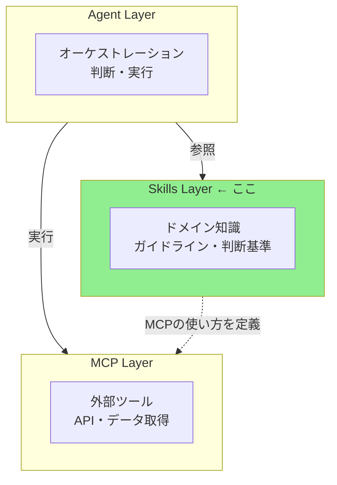
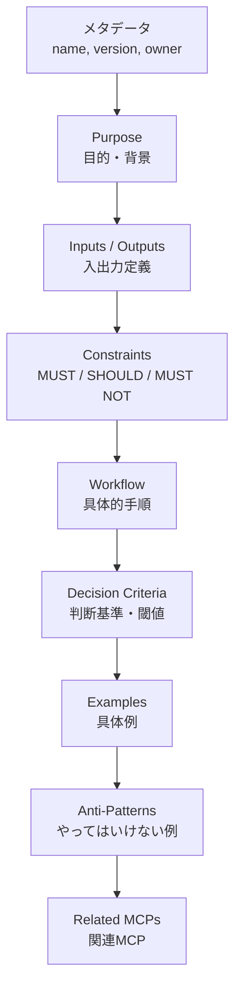
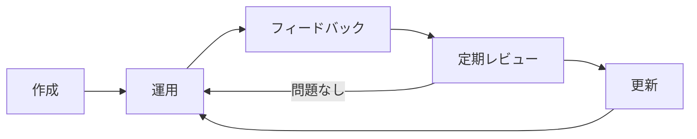

# Skill設計ガイド

> いつ・どのようにSkillを設計するか — 判断基準と品質標準。

## このドキュメントについて

このドキュメントでは、Skillの**設計と判断**に焦点を当てる。いつSkillを作るべきか、品質の高い構造設計、そして長期的なメンテナンス方法を解説する。実際の作成手順については [スキル作成ガイド](./how-to-create-skills) を参照。

## Skillの位置づけ

### 三層アーキテクチャにおける役割



### Skillが適しているケース

Skillの利用が適しているケースを以下に整理する。

| ケース           | 例                       | 理由                                 |
| ---------------- | ------------------------ | ------------------------------------ |
| 品質基準の定義   | 翻訳品質スコア ≥ 0.85    | 判断基準は知識であり、ツールではない |
| ワークフロー定義 | 翻訳 → 評価 → 修正の手順 | 手順は知識であり、実行はMCPが担う    |
| コーディング規約 | SOLID原則、命名規則      | チーム内の知識は静的                 |
| レビュー観点     | セキュリティチェック項目 | チェック項目は知識                   |

### Skillが適していないケース

逆に、Skill以外の手段が適しているケースは以下の通りである。

| ケース                     | 適切な手段       | 理由             |
| -------------------------- | ---------------- | ---------------- |
| 外部API呼び出し            | MCP              | 動的な実行が必要 |
| リアルタイムデータ取得     | MCP              | 外部通信が必要   |
| 複雑なオーケストレーション | サブエージェント | 判断の委譲が必要 |

> 判断に迷ったら [MCP vs Skills 選択判断ガイド](./vs-mcp) を参照

## Skillの構造

### ファイル配置

Skillファイルは以下のディレクトリ構成で配置する。

```
.claude/skills/
├── translation-quality/       # ← Skill名のディレクトリ
│   └── SKILL.md               # ← 本体（必須）
├── code-review/
│   └── SKILL.md
└── translation-workflow/
    └── SKILL.md
```

### SKILL.md の必須セクション

Skillの品質を担保するために、以下のセクション構成を推奨する。



> **実際に作り始める準備ができたら？** 各セクションの書き方を [スキル作成ガイド](./how-to-create-skills) で解説しています。

## Skill品質チェックリスト

作成したSkillが高品質かどうかを確認するためのチェックリスト。

```markdown
## 基本チェック

- [ ] メタデータ（name, version, owner, last_reviewed）が揃っている
- [ ] Purposeが具体的で、背景が説明されている
- [ ] Inputs/Outputsがテーブル形式で定義されている

## 制約チェック

- [ ] MUST/SHOULD/MUST NOTの分類が適切
- [ ] 数値基準や具体的条件が含まれている
- [ ] 曖昧な表現（「良い」「適切な」）を避けている

## ワークフローチェック

- [ ] 手順が番号付きで明確
- [ ] 各ステップで何をするかが具体的
- [ ] 判断基準（Decision Criteria）が表形式で定義されている

## 例チェック

- [ ] 最低1つの具体的な使用例がある
- [ ] 入力 → 処理 → 出力の流れが示されている
- [ ] Anti-Patternsが含まれている

## 設計原則チェック

- [ ] 単一責任（1 Skill = 1 責務）を守っている
- [ ] 特定MCPの内部実装に依存していない
- [ ] 関連MCPが明示されている
```

## ライフサイクル管理

### 更新サイクル

Skillの継続的な改善サイクルを以下のフローで示す。



### アンチパターン「更新されないSkill」の対策

Skillが放置されないための具体的な対策を以下に示す。

| 対策                 | 方法                                     |
| -------------------- | ---------------------------------------- |
| **オーナー明記**     | `owner` フィールドに責任者を記載         |
| **最終確認日**       | `last_reviewed` を定期的に更新           |
| **レビューサイクル** | 3ヶ月に1回の見直しを推奨                 |
| **運用との整合**     | 実際のワークフローと乖離していないか確認 |

> 詳細は [アンチパターン集](./anti-patterns) の「6. 更新されないSkill」を参照

## Vercel Skills CLIとの互換性

### Agent Skills Specification 対応

作成したSkillは、Vercel Skills CLIでインストール可能な形式にすることで、Claude Code以外のエージェント（Cursor, Windsurf等）でも利用可能になる。

```bash
# Claude Code向け
npx skills add ./my-skills -a claude-code

# 複数エージェント向け
npx skills add ./my-skills -a claude-code -a cursor -a windsurf
```

> 詳細は [スキル導入・利用ガイド](./how-to-use-skills) でCLIの完全ガイドとプロジェクト導入手順を解説しています。

## ロードマップ上の目標

現在の状況と目標を以下に示す。

| 指標         | 現状                     | 目標（Phase 1） |
| ------------ | ------------------------ | --------------- |
| Skill定義数  | 1（translation-quality） | 3個以上         |
| テンプレート | ✅ 作成済み              | —               |
| ドキュメント | ✅ 本ドキュメント        | —               |

### 次に作成すべきSkill候補

今後の作成候補として以下のSkillを検討している。

| Skill名              | 概要                             | 優先度   | 関連MCP       |
| -------------------- | -------------------------------- | -------- | ------------- |
| translation-workflow | 翻訳 → 評価 → 修正のワークフロー | ⭐⭐⭐⭐ | deepl, xcomet |
| rfc-compliance       | RFC準拠チェックのガイドライン    | ⭐⭐⭐⭐ | rfcxml        |
| code-review          | TypeScript/Angularレビュー規約   | ⭐⭐⭐   | —             |

## 次に読むべきドキュメント

| 目的                              | ドキュメント                                                  |
| --------------------------------- | ------------------------------------------------------------- |
| 実際にSkillを作成する             | [スキル作成ガイド](./how-to-create-skills)                    |
| プロジェクトにSkillsを導入する    | [スキル導入・利用ガイド](./how-to-use-skills)                 |
| ユースケースを知りたい            | [活用パターンガイド](./skill-use-cases)                       |
| MCP vs Skillsの判断               | [MCP vs Skills 選択判断ガイド](./vs-mcp)                      |
| 避けるべきパターン                | [アンチパターン集](./anti-patterns)                           |
| 実例を見たい                      | [実例ショーケース](./showcase)                                |
| 全体アーキテクチャ                | [アーキテクチャ](../concepts/03-architecture)                 |
| Skill+MCPの組み合わせ例           | [連携パターン](../workflows/patterns)                         |

## 参考リンク

- [Agent Skills Specification](https://agentskills.io) — 標準仕様
- [Vercel Skills CLI](https://github.com/vercel-labs/skills) — CLI ツール
- [templates/skill/](https://github.com/shuji-bonji/ai-agent-architecture/tree/main/templates/skill) — テンプレート集
- [.claude/skills/translation-quality/SKILL.md](https://github.com/shuji-bonji/ai-agent-architecture/blob/main/.claude/skills/translation-quality/SKILL.md) — 実装例
