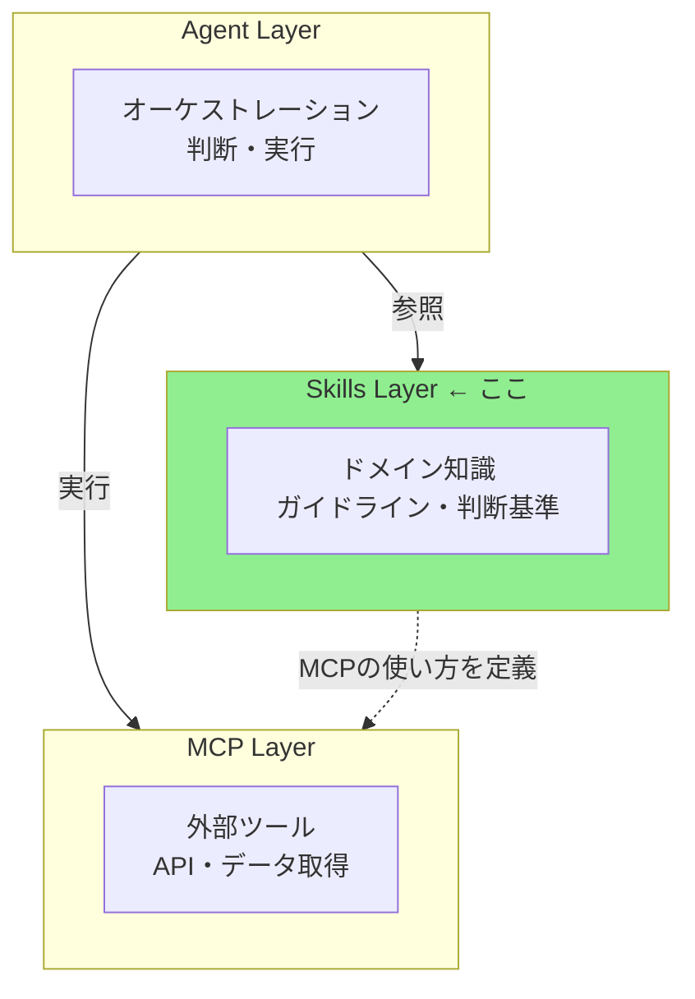
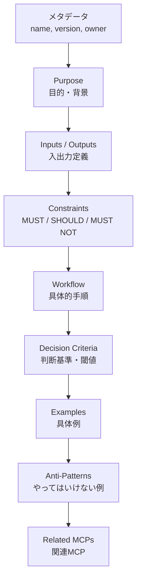
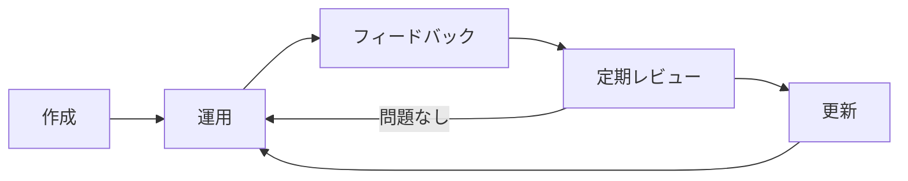

# Skill作成ガイド

> 高品質なSkill定義の作成方法と、実践的なベストプラクティス。

## このドキュメントについて

Skillは、AIエージェントにドメイン知識・ガイドライン・判断基準を提供する静的なMarkdownファイルである。MCPが「何ができるか（ツール）」を提供するのに対し、Skillは「どう実行するか（知識）」を提供する。

このドキュメントでは、Skillの設計から作成、テスト、メンテナンスまでのライフサイクルを実践的に解説する。既存のSkill（`translation-quality`）とテンプレートを基にしたガイドとなっている。

## Skillの位置づけ

### 三層アーキテクチャにおける役割



### Skillが適しているケース

Skillの利用が適しているケースを以下に整理する。

| ケース           | 例                       | 理由                                 |
| ---------------- | ------------------------ | ------------------------------------ |
| 品質基準の定義   | 翻訳品質スコア ≥ 0.85    | 判断基準は知識であり、ツールではない |
| ワークフロー定義 | 翻訳 → 評価 → 修正の手順 | 手順は知識であり、実行はMCPが担う    |
| コーディング規約 | SOLID原則、命名規則      | チーム内の知識は静的                 |
| レビュー観点     | セキュリティチェック項目 | チェック項目は知識                   |

### Skillが適していないケース

逆に、Skill以外の手段が適しているケースは以下の通りである。

| ケース                     | 適切な手段       | 理由             |
| -------------------------- | ---------------- | ---------------- |
| 外部API呼び出し            | MCP              | 動的な実行が必要 |
| リアルタイムデータ取得     | MCP              | 外部通信が必要   |
| 複雑なオーケストレーション | サブエージェント | 判断の委譲が必要 |

> 判断に迷ったら [MCP vs Skills 選択判断ガイド](./vs-mcp) を参照

## Skillの構造

### ファイル配置

Skillファイルは以下のディレクトリ構成で配置する。

```
.claude/skills/
├── translation-quality/       # ← Skill名のディレクトリ
│   └── SKILL.md               # ← 本体（必須）
├── code-review/
│   └── SKILL.md
└── translation-workflow/
    └── SKILL.md
```

### SKILL.md の必須セクション

Skillの品質を担保するために、以下のセクション構成を推奨する。



## 作成手順

### Step 1: メタデータ定義

YAML Front Matterで基本情報を記述する。

```yaml
---
name: code-review
description: TypeScript/Angularプロジェクトのコードレビューガイドライン
version: 1.0.0
owner: @shuji-bonji
last_reviewed: 2026-02-11
---
```

| フィールド      | 必須 | 説明                                                    |
| --------------- | ---- | ------------------------------------------------------- |
| `name`          | ✅   | Skill識別子（kebab-case）                               |
| `description`   | ✅   | 一行の説明                                              |
| `version`       | ✅   | セマンティックバージョン                                |
| `owner`         | ✅   | 責任者（更新担当）                                      |
| `last_reviewed` | ✅   | 最終確認日（アンチパターン「更新されないSkill」の対策） |

### Step 2: Purpose（目的）の記述

「なぜこのSkillが必要か」を明確に書く。曖昧な記述はアンチパターン。

```markdown
## Purpose

TypeScript/Angularプロジェクトにおけるコードレビューの品質と一貫性を確保する。

### Why This Skill?

- レビュアーによって観点がバラバラになりがち
- SOLID原則やAngularのベストプラクティスへの準拠を自動チェックしたい
- 新メンバーでも一定品質のレビューが可能になる
```

### Step 3: Inputs / Outputs の定義

Skillが何を受け取り、何を生成するかを明示する。

```markdown
## Inputs

| Input          | Type             | Description              |
| -------------- | ---------------- | ------------------------ |
| source_files   | TypeScript files | レビュー対象のファイル群 |
| pr_description | Markdown         | PRの説明文               |
| changed_lines  | diff             | 変更行の差分             |

## Outputs

| Output          | Type     | Description                         |
| --------------- | -------- | ----------------------------------- |
| review_report   | Markdown | レビュー結果レポート                |
| action_items    | List     | 修正必須事項のリスト                |
| approval_status | enum     | approve / request-changes / comment |
```

### Step 4: Constraints（制約）の定義

RFC 2119のキーワード（MUST/SHOULD/MUST NOT）を用いて、明確な制約を定義する。

```markdown
## Constraints

### MUST（必須）

- ESLintエラーがゼロであることを確認する
- 型安全性（any型の使用禁止）を検証する
- テストカバレッジ80%以上を要求する

### SHOULD（推奨）

- 単一責任の原則（SRP）への準拠を確認する
- RxJSのサブスクリプション管理を確認する
- Angular のChangeDetectionStrategy.OnPushの使用を推奨する

### MUST NOT（禁止）

- セキュリティに関するレビューをスキップしない
- テストなしのコードをapproveしない
- console.log を本番コードに残さない
```

**ポイント**: 数値基準・具体的な条件を含めること。「良いコードを書きましょう」のような曖昧な記述はアンチパターン。

### Step 5: Workflow（ワークフロー）の記述

エージェントが実行する具体的な手順を記述する。

```markdown
## Workflow

### Step 1: 変更内容の把握

PRの説明文と変更ファイル一覧を確認し、変更の目的と範囲を理解する。

### Step 2: 静的解析

ESLint、TypeScriptコンパイラの結果を確認する。
エラーがある場合は即座に `request-changes` とする。

### Step 3: コード品質チェック

以下の観点でコードを確認する

1. SOLID原則への準拠
2. Angular ベストプラクティス
3. RxJS パターンの適切さ
4. テストの網羅性

### Step 4: レポート生成

確認結果をMarkdownレポートとして出力する。
```

### Step 6: Decision Criteria（判断基準）の定義

定量的な判断基準を表で明示する。

```markdown
## Decision Criteria

| Condition          | Action                  | Rationale      |
| ------------------ | ----------------------- | -------------- |
| ESLintエラー > 0   | ❌ request-changes      | 基本品質未達   |
| any型使用あり      | ❌ request-changes      | 型安全性違反   |
| カバレッジ < 80%   | ⚠️ request-changes      | テスト不足     |
| SRP違反の疑い      | 💬 comment              | 改善提案として |
| 軽微なスタイル問題 | ✅ approve with comment | ブロックしない |
```

### Step 7: Examples（使用例）の記述

具体的な入出力例を示す。エージェントはこの例を参考に動作する。

```markdown
## Examples

### Example 1: ESLintエラーのあるPR

**Input:**
PRに `any` 型の使用が3箇所

**Process:**

1. ESLint結果確認 → エラー3件
2. 型安全性チェック → 違反あり

**Output:**
❌ request-changes

- `src/service.ts:25` - `any` → 適切な型に変更
- `src/service.ts:42` - `any` → interface定義を推奨
- `src/component.ts:15` - `any` → generic型の使用を推奨
```

### Step 8: Anti-Patterns（やってはいけない例）の記述

```markdown
## Anti-Patterns

### パターン: スタイルだけのレビュー

**問題のあるアプローチ:**
インデントや命名のみ指摘し、ロジックの正しさを確認しない

**なぜ問題か:** 本質的な問題を見逃す

**正しいアプローチ:**
ロジック → 設計 → 型安全性 → スタイル の順で確認
```

## テンプレートの活用

テンプレートが `templates/skill/` に用意されている。

```bash
# テンプレートのコピー
cp templates/skill/SKILL.ja.md.template .claude/skills/my-skill/SKILL.md
```

利用可能なテンプレートファイルは以下の通りである。

| テンプレート       | パス                                                  |
| ------------------ | ----------------------------------------------------- |
| 日本語テンプレート | `templates/skill/SKILL.ja.md.template`                |
| 英語テンプレート   | `templates/skill/SKILL.md.template`                   |
| コードレビュー例   | `templates/skill/examples/code-review.ja.md`          |
| 翻訳ワークフロー例 | `templates/skill/examples/translation-workflow.ja.md` |

## 既存Skillの実例

### translation-quality（実装済み）

`.claude/skills/translation-quality/SKILL.md` に279行のSkill定義が存在する。

```
構成:
├── メタデータ（name, version, owner, last_reviewed）
├── Purpose + Why This Skill?
├── Inputs / Outputs（テーブル形式）
├── Constraints（MUST / SHOULD / MUST NOT）
├── Workflow（5ステップ）
├── Decision Criteria（平均スコア + セグメント別）
├── Examples（2パターン：単一ファイル / ディレクトリ一括）
├── Anti-Patterns（2パターン）
└── Related MCPs（xcomet, deepl）
```

**学べるポイント**:

- 閾値が明確（0.85, 0.90, 0.95）
- ワークフローが具体的（5ステップ）
- 出力例がそのまま埋め込み可能なMarkdown形式
- 関連MCPとの連携が明示的

## Skill品質チェックリスト

作成したSkillが高品質かどうかを確認するためのチェックリスト。

```markdown
## 基本チェック

- [ ] メタデータ（name, version, owner, last_reviewed）が揃っている
- [ ] Purposeが具体的で、背景が説明されている
- [ ] Inputs/Outputsがテーブル形式で定義されている

## 制約チェック

- [ ] MUST/SHOULD/MUST NOTの分類が適切
- [ ] 数値基準や具体的条件が含まれている
- [ ] 曖昧な表現（「良い」「適切な」）を避けている

## ワークフローチェック

- [ ] 手順が番号付きで明確
- [ ] 各ステップで何をするかが具体的
- [ ] 判断基準（Decision Criteria）が表形式で定義されている

## 例チェック

- [ ] 最低1つの具体的な使用例がある
- [ ] 入力 → 処理 → 出力の流れが示されている
- [ ] Anti-Patternsが含まれている

## 設計原則チェック

- [ ] 単一責任（1 Skill = 1 責務）を守っている
- [ ] 特定MCPの内部実装に依存していない
- [ ] 関連MCPが明示されている
```

## ライフサイクル管理

### 更新サイクル

Skillの継続的な改善サイクルを以下のフローで示す。



### アンチパターン「更新されないSkill」の対策

Skillが放置されないための具体的な対策を以下に示す。

| 対策                 | 方法                                     |
| -------------------- | ---------------------------------------- |
| **オーナー明記**     | `owner` フィールドに責任者を記載         |
| **最終確認日**       | `last_reviewed` を定期的に更新           |
| **レビューサイクル** | 3ヶ月に1回の見直しを推奨                 |
| **運用との整合**     | 実際のワークフローと乖離していないか確認 |

> 詳細は [アンチパターン集](./anti-patterns) の「6. 更新されないSkill」を参照

## Vercel Skills CLIとの互換性

### Agent Skills Specification 対応

作成したSkillは、Vercel Skills CLIでインストール可能な形式にすることで、Claude Code以外のエージェント（Cursor, Windsurf等）でも利用可能になる。

```bash
# Claude Code向け
npx skills add ./my-skills -a claude-code

# 複数エージェント向け
npx skills add ./my-skills -a claude-code -a cursor -a windsurf
```

> 詳細は [Skills概要](./overview) の「Vercel Skills CLIとの統合」を参照

## ロードマップ上の目標

現在の状況と目標を以下に示す。

| 指標         | 現状                     | 目標（Phase 1） |
| ------------ | ------------------------ | --------------- |
| Skill定義数  | 1（translation-quality） | 3個以上         |
| テンプレート | ✅ 作成済み              | —               |
| ドキュメント | ✅ 本ドキュメント        | —               |

### 次に作成すべきSkill候補

今後の作成候補として以下のSkillを検討している。

| Skill名              | 概要                             | 優先度   | 関連MCP       |
| -------------------- | -------------------------------- | -------- | ------------- |
| translation-workflow | 翻訳 → 評価 → 修正のワークフロー | ⭐⭐⭐⭐ | deepl, xcomet |
| rfc-compliance       | RFC準拠チェックのガイドライン    | ⭐⭐⭐⭐ | rfcxml        |
| code-review          | TypeScript/Angularレビュー規約   | ⭐⭐⭐   | —             |

## 関連ドキュメント

Skill作成に関連するドキュメントを以下に示す。

- [Skills概要](./overview) — Vercel Skills / Agent Skills Specification
- [MCP vs Skills 選択判断ガイド](./vs-mcp) — 何をSkillにすべきか
- [アンチパターン集](./anti-patterns) — 避けるべきパターン
- [MCP/Skills/Agentの構成論](../concepts/03-architecture) — 三層アーキテクチャ
- [連携パターン・ワークフロー](../workflows/patterns) — Skill+MCPの組み合わせ例

## 参考リンク

参考になる外部リンクを以下に示す。

- [Agent Skills Specification](https://agentskills.io) — 標準仕様
- [Vercel Skills CLI](https://github.com/vercel-labs/skills) — CLI ツール
- [templates/skill/](../../templates/skill/) — テンプレート集
- [.claude/skills/translation-quality/SKILL.md](../../.claude/skills/translation-quality/SKILL.md) — 実装例
