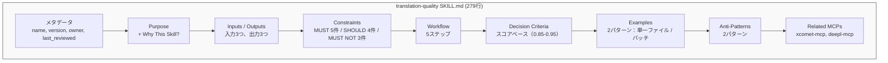

# スキル作成ガイド

> SKILL.md をゼロから作る実践チュートリアル — 実例とテンプレート付き。

## このドキュメントについて

このガイドは、Skillを実際に手を動かして作成するためのステップバイステップチュートリアルである。ユースケースがSkillとして適切かどうかの判断がまだの場合は、先に [Skill設計ガイド](./creating-skills) を参照してほしい。

このガイドを終えると、Claude Code、Cursor、その他16以上のAIエージェントで利用可能な完全な `SKILL.md` ファイルが完成する。

## SKILL.md の全体構造

### ディレクトリ構成

すべてのSkillは専用のディレクトリに配置され、必須ファイルは1つだけである。

```
.claude/skills/
├── translation-quality/       # ← Skill名（kebab-case）
│   └── SKILL.md               # ← 必須：Skill定義
├── code-review/
│   └── SKILL.md
└── my-new-skill/
    ├── SKILL.md               # ← 必須
    ├── data/                   # ← オプション：埋め込みデータ
    └── scripts/               # ← オプション：補助スクリプト
```

### 命名規則

| ルール                     | 例                                     | 理由                              |
| -------------------------- | -------------------------------------- | --------------------------------- |
| ディレクトリ名はkebab-case | `translation-quality`                  | 全エージェント共通の標準規約      |
| ファイル名は `SKILL.md`    | `SKILL.md`（`skill.md` ではない）      | Agent Skills Specification の要件 |
| 名前は単一責任を反映       | `code-review`（`code-tools` ではない） | 1 Skill = 1 ドメイン              |

### セクションの流れ

よく構造化されたSKILL.mdは、以下の順序で記述する。


## ステップバイステップ作成

### Step 1: メタデータ定義

YAML Front Matterで基本情報を記述する。

```yaml
---
name: code-review
description: TypeScript/Angularプロジェクトのコードレビューガイドライン
version: 1.0.0
owner: @shuji-bonji
last_reviewed: 2026-02-11
---
```

**フィールド一覧：**

| フィールド      | 必須 | 説明                                                    |
| --------------- | ---- | ------------------------------------------------------- |
| `name`          | ✅   | Skill識別子（kebab-case）                               |
| `description`   | ✅   | 一行の説明                                              |
| `version`       | ✅   | セマンティックバージョン                                |
| `owner`         | ✅   | 責任者（更新担当）                                      |
| `last_reviewed` | ✅   | 最終確認日（アンチパターン「更新されないSkill」の対策） |

### Step 2: Purpose（目的）の記述

「なぜこのSkillが必要か」を明確に書く。曖昧な記述はアンチパターン。

```markdown
## Purpose

TypeScript/Angularプロジェクトにおけるコードレビューの品質と一貫性を確保する。

### Why This Skill?

- レビュアーによって観点がバラバラになりがち
- SOLID原則やAngularのベストプラクティスへの準拠を自動チェックしたい
- 新メンバーでも一定品質のレビューが可能になる
```

**チェック項目：**

- ✅ 具体的な目的が述べられている
- ✅ 背景・文脈が提供されている
- ✅ 対象シナリオが明確
- ❌ 避けるべき：「良いコードにする」（曖昧すぎる）

### Step 3: Inputs / Outputs の定義

Skillが何を受け取り、何を生成するかをテーブル形式で明示する。

```markdown
## Inputs

| Input          | Type             | Description              |
| -------------- | ---------------- | ------------------------ |
| source_files   | TypeScript files | レビュー対象のファイル群 |
| pr_description | Markdown         | PRの説明文               |
| changed_lines  | diff             | 変更行の差分             |

## Outputs

| Output          | Type     | Description                         |
| --------------- | -------- | ----------------------------------- |
| review_report   | Markdown | レビュー結果レポート                |
| action_items    | List     | 修正必須事項のリスト                |
| approval_status | enum     | approve / request-changes / comment |
```

### Step 4: Constraints（制約）の定義

RFC 2119のキーワード（MUST/SHOULD/MUST NOT）を用いて、明確な制約を定義する。

```markdown
## Constraints

### MUST（必須）

- ESLintエラーがゼロであることを確認する
- 型安全性（any型の使用禁止）を検証する
- テストカバレッジ80%以上を要求する

### SHOULD（推奨）

- 単一責任の原則（SRP）への準拠を確認する
- RxJSのサブスクリプション管理を確認する
- Angular のChangeDetectionStrategy.OnPushの使用を推奨する

### MUST NOT（禁止）

- セキュリティに関するレビューをスキップしない
- テストなしのコードをapproveしない
- console.log を本番コードに残さない
```

**ポイント**: 数値基準・具体的な条件を含めること。「良いコードを書きましょう」のような曖昧な記述はアンチパターン。

### Step 5: Workflow（ワークフロー）の記述

エージェントが実行する具体的な手順を記述する。

```markdown
## Workflow

### Step 1: 変更内容の把握

PRの説明文と変更ファイル一覧を確認し、変更の目的と範囲を理解する。

### Step 2: 静的解析

ESLint、TypeScriptコンパイラの結果を確認する。
エラーがある場合は即座に `request-changes` とする。

### Step 3: コード品質チェック

以下の観点でコードを確認する

1. SOLID原則への準拠
2. Angular ベストプラクティス
3. RxJS パターンの適切さ
4. テストの網羅性

### Step 4: レポート生成

確認結果をMarkdownレポートとして出力する。
```

### Step 6: Decision Criteria（判断基準）の定義

定量的な判断基準を表で明示する。

```markdown
## Decision Criteria

| Condition          | Action                  | Rationale      |
| ------------------ | ----------------------- | -------------- |
| ESLintエラー > 0   | ❌ request-changes      | 基本品質未達   |
| any型使用あり      | ❌ request-changes      | 型安全性違反   |
| カバレッジ < 80%   | ⚠️ request-changes      | テスト不足     |
| SRP違反の疑い      | 💬 comment              | 改善提案として |
| 軽微なスタイル問題 | ✅ approve with comment | ブロックしない |
```

### Step 7: Examples（使用例）の記述

具体的な入出力例を示す。エージェントはこの例を参考に動作する。

```markdown
## Examples

### Example 1: ESLintエラーのあるPR

**Input:**
PRに `any` 型の使用が3箇所

**Process:**

1. ESLint結果確認 → エラー3件
2. 型安全性チェック → 違反あり

**Output:**
❌ request-changes

- `src/service.ts:25` - `any` → 適切な型に変更
- `src/service.ts:42` - `any` → interface定義を推奨
- `src/component.ts:15` - `any` → generic型の使用を推奨
```

### Step 8: Anti-Patterns（やってはいけない例）の記述

よくある間違いを文書化する。

```markdown
## Anti-Patterns

### パターン: スタイルだけのレビュー

**問題のあるアプローチ:**
インデントや命名のみ指摘し、ロジックの正しさを確認しない

**なぜ問題か:** 本質的な問題を見逃す

**正しいアプローチ:**
ロジック → 設計 → 型安全性 → スタイル の順で確認
```

## 実例ウォークスルー: `translation-quality` の分解

実際のプロダクションSkill — `translation-quality`（279行）— を分解し、各セクションの設計意図を理解する。

### 構造マップ



### 設計判断のポイント

| セクション            | 判断                            | 理由                                                 |
| --------------------- | ------------------------------- | ---------------------------------------------------- |
| **Constraints**       | "MUST: score ≥ 0.85"            | 数値閾値により曖昧さを排除                           |
| **Workflow**          | 具体的な5ステップ               | 各ステップがエージェントの実行可能なアクションに対応 |
| **Decision Criteria** | スコア階層（0.85/0.90/0.95）    | エージェントが結果を正確に分類できる                 |
| **Examples**          | 単一ファイル + ディレクトリ一括 | 最も一般的な2つの使用パターンをカバー                |
| **Related MCPs**      | xcomet-mcp, deepl-mcp           | MCP依存を明示的に宣言                                |

### なぜ効果的なのか

`translation-quality` Skillが機能する理由

1. **すべての閾値が数値** — 解釈の余地がない
2. **ワークフローが直線的** — エージェントが順番に実行できる
3. **例が両方の一般的パターンをカバー** — 単一ファイルとバッチ処理
4. **アンチパターンがよくある間違いを防止** — 品質評価のスキップなど

## テンプレートの活用

テンプレートをコピーしてカスタマイズすることで、素早く開始できる。

```bash
# テンプレートのコピー
cp templates/skill/SKILL.md.template .claude/skills/my-skill/SKILL.md

# 日本語テンプレートの場合
cp templates/skill/SKILL.ja.md.template .claude/skills/my-skill/SKILL.md
```

**利用可能なテンプレート：**

| テンプレート       | パス                                                  |
| ------------------ | ----------------------------------------------------- |
| 英語テンプレート   | `templates/skill/SKILL.md.template`                   |
| 日本語テンプレート | `templates/skill/SKILL.ja.md.template`                |
| コードレビュー例   | `templates/skill/examples/code-review.ja.md`          |
| 翻訳ワークフロー例 | `templates/skill/examples/translation-workflow.ja.md` |

**カスタマイズのコツ：**

1. `{{placeholder}}` をすべて実際の内容に置き換える
2. Skillの複雑さに応じてセクションを追加・削除する
3. MUST制約から始める — 最も重要
4. チームに共有する前に、最低1つのExampleを書く

## よくある質問（FAQ）

### Skillの粒度はどのくらいが適切か？

**単一責任の原則**に従う。1つのSkillは1つのドメインに対応すべきである。説明に「と」が入る場合（例：「コードレビュー**と**デプロイ」）、2つのSkillに分割すべきサイン。

### MCPと組み合わせるべきタイミングは？

Skillのワークフローに外部ツールの使用が含まれる場合。Skillがツールの**使い方**を定義し、MCPがツール自体を提供する。[活用パターンガイド](./skill-use-cases) の「知識提供型 vs 実行型」フレームワークを参照。

### 1つのディレクトリに複数のSKILL.mdを置けるか？

置けない。各Skillディレクトリには正確に1つの `SKILL.md` を配置する。関連するSkillは別ディレクトリに作成する。

```
.claude/skills/
├── code-review/SKILL.md           # レビューガイドライン
├── code-review-angular/SKILL.md   # Angular固有の追加
└── code-review-rxjs/SKILL.md      # RxJS固有の追加
```

### 作成したSkillのテスト方法は？

1. `.claude/skills/your-skill/SKILL.md` に配置する
2. 新しいClaude Codeセッションを開始する
3. Skillが発動すべきタスクをエージェントに指示する
4. エージェントがSkillのガイドラインを参照・遵守しているか確認する
5. エージェントの挙動に基づいて内容を改善する

## 次に読むべきドキュメント

| 目的                   | ドキュメント                                  |
| ---------------------- | --------------------------------------------- |
| 設計判断・計画         | [Skill設計ガイド](./creating-skills)          |
| プロジェクトへの導入   | [スキル導入・利用ガイド](./how-to-use-skills) |
| ユースケースを知りたい | [活用パターンガイド](./skill-use-cases)       |
| 避けるべきパターン     | [アンチパターン集](./anti-patterns)           |
| 実例を見たい           | [実例ショーケース](./showcase)                |
