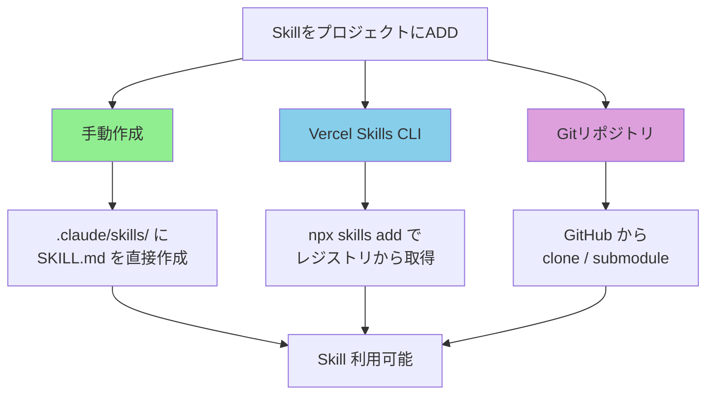
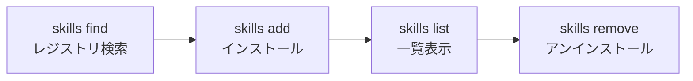
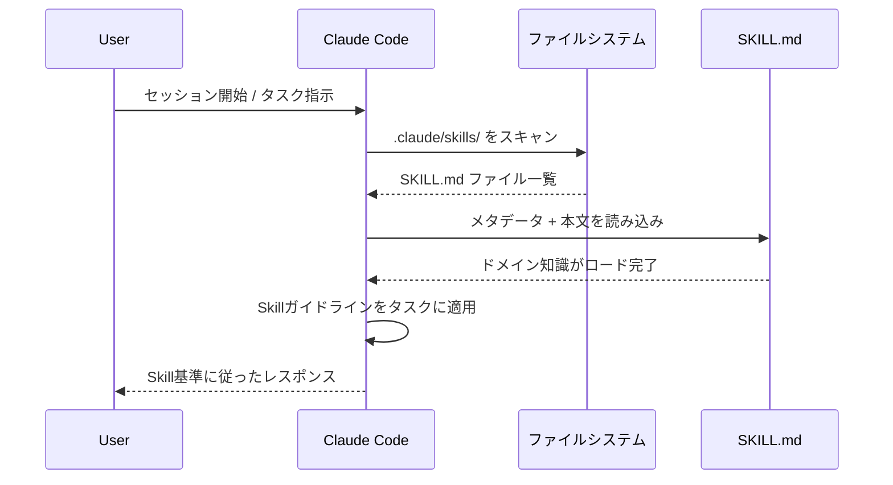
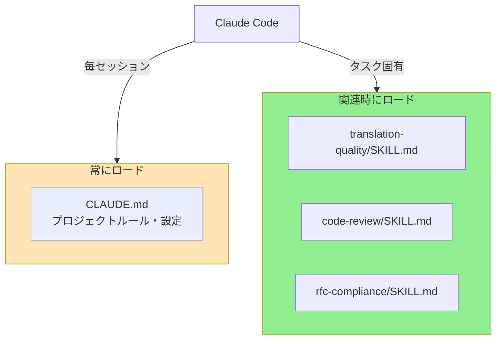
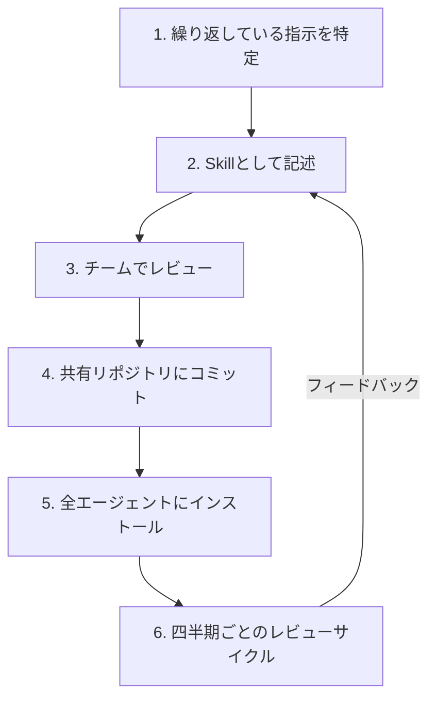

# スキル導入・利用ガイド

> インストールから日常ワークフローまで — Skillsをプロジェクトとチームに導入する。

## このドキュメントについて

このガイドでは、Skillsを実際のプロジェクトに**インストール、設定、活用**する方法を解説する。レジストリからコミュニティSkillを追加する場合も、自作のSkillをチームに展開する場合も、すべての統合パターンを網羅している。

Skillの作成方法は [スキル作成ガイド](./how-to-create-skills)、Skillが適切なアプローチかの判断は [Skill設計ガイド](./creating-skills) を参照。

## Skillsの導入方法 3パターン



### パターン1: 手動作成（ローカル）

最もシンプルな方法 — プロジェクト内にSkillを直接作成する。

```bash
# ディレクトリとファイルを作成
mkdir -p .claude/skills/my-skill
touch .claude/skills/my-skill/SKILL.md
```

その後、SKILL.mdの内容を記述する。ステップバイステップガイドは [スキル作成ガイド](./how-to-create-skills) を参照。

**適しているケース**: 外部に共有しないプロジェクト固有のSkill。

### パターン2: Vercel Skills CLI（レジストリ）

グローバルレジストリからコミュニティSkillをインストールする。

```bash
# Skillを検索
npx skills find "code review"
npx skills search "translation"

# 特定のSkillを追加
npx skills add vercel-labs/agent-skills --skill frontend-design

# 複数エージェント向けに一括追加
npx skills add vercel-labs/agent-skills -a claude-code -a cursor

# ローカルSkillをレジストリ形式で追加
npx skills add ./local-skill
```

**適しているケース**: コミュニティのベストプラクティスを活用し、プロジェクト間でSkillを共有する場合。

### パターン3: Gitリポジトリ

Gitリポジトリからクローンまたは参照する。

```bash
# 別リポジトリとしてクローン
git clone https://github.com/shuji-bonji/code-review-skill.git
cp -r code-review-skill/.claude/skills/* .claude/skills/

# Git submoduleとして追加
git submodule add https://github.com/shuji-bonji/code-review-skill.git .claude/skills/code-review
```

**適しているケース**: バージョン管理と共同更新が必要なチーム管理のSkill。

## Vercel Skills CLI 完全ガイド

### インストール

CLIは `npx` で実行するため、グローバルインストール不要。

```bash
npx skills --help
```

### 主要コマンド



| コマンド | 説明 | 例 |
|---------|------|-----|
| `npx skills find <クエリ>` | Skillレジストリを検索 | `npx skills find "code review"` |
| `npx skills search <クエリ>` | `find` のエイリアス | `npx skills search "translation"` |
| `npx skills add <ソース>` | Skillをインストール | `npx skills add vercel-labs/agent-skills` |
| `npx skills add <ソース> --skill <名前>` | 特定のSkillをインストール | `npx skills add vercel-labs/agent-skills --skill frontend-design` |
| `npx skills add <ソース> -a <エージェント>` | 特定エージェント向けにインストール | `npx skills add ./my-skill -a cursor` |

### エージェント指定

`-a` フラグでSkillをインストールするエージェントを指定する。

```bash
# 単一エージェント
npx skills add ./my-skill -a claude-code

# 複数エージェント
npx skills add ./my-skill -a claude-code -a cursor -a windsurf

# 多数のエージェント
npx skills add ./my-skill -a claude-code -a cursor -a codex -a opencode
```

各エージェントのSkill配置先：

| エージェント | インストールパス |
|-------------|---------------|
| Claude Code | `.claude/skills/` |
| Cursor | `.cursor/skills/` |
| Windsurf | `.windsurf/skills/` |
| Codex | `.codex/skills/` |
| GitHub Copilot | `.github/skills/` |

## Claude Code での読み込まれ方

Claude CodeがSkillsをどのように発見し適用するかを理解することが、効果的な活用の鍵。

### 自動検出の仕組み



Claude Codeはセッション開始時に `.claude/skills/` を自動スキャンし、発見した `SKILL.md` をエージェントのコンテキストに読み込む。

### Skills vs CLAUDE.md: 役割の分担

「これはCLAUDE.mdに書くべきか、Skillにすべきか？」は よくある質問。以下が使い分けの基準：

| 観点 | CLAUDE.md | Skills |
|------|-----------|--------|
| **スコープ** | プロジェクト全体のルール | タスク固有のドメイン知識 |
| **内容** | コーディングスタイル、プロジェクト構成、技術スタック | ワークフロー、品質基準、判断閾値 |
| **読み込み** | 常に（毎セッション） | 関連タスク発生時 |
| **例** | "TypeScript strictモードを使用"、"Angular スタイルガイドに従う" | "翻訳品質は 0.85以上必須"、"レビュー順序: ロジック → 設計 → スタイル" |
| **サイズ** | 短く簡潔 | 詳細可能（100-300行） |



**判断基準**: すべてのタスクに適用される → CLAUDE.md。特定のタスクにのみ適用される → Skill。

## マルチエージェント対応

Agent Skills Specificationに準拠したSkillは16以上のエージェントで利用可能。

### 対応エージェント一覧

| エージェント | CLI引数 | プロジェクトパス |
|-------------|--------|---------------|
| Claude Code | `claude-code` | `.claude/skills/` |
| Cursor | `cursor` | `.cursor/skills/` |
| Codex | `codex` | `.codex/skills/` |
| OpenCode | `opencode` | `.opencode/skills/` |
| GitHub Copilot | `github-copilot` | `.github/skills/` |
| Windsurf | `windsurf` | `.windsurf/skills/` |
| Cline | `cline` | `.cline/skills/` |
| Roo Code | `roo-code` | `.roo/skills/` |
| Gemini CLI | `gemini-cli` | `.gemini/skills/` |

全リスト: https://github.com/vercel-labs/skills#supported-agents

### クロスエージェント対応

チームが使用する複数のエージェントでSkillを共有するには：

```bash
# チームが使うすべてのエージェントにインストール
npx skills add ./my-skill -a claude-code -a cursor -a windsurf
```

これにより、各エージェント指定のディレクトリにSkillのコピーが作成される。

## プロジェクトへの組み込み手順

### 個人開発者の場合

1. **Skillsディレクトリを作成**: `mkdir -p .claude/skills/`
2. **Skillを追加**: 手動作成またはCLIでインストール
3. **Gitにコミット**: コードと一緒にSkillsをバージョン管理
4. **改善を繰り返す**: エージェントの挙動に基づいてSkillを改善

### チームの場合



**展開ステップ：**

1. **パターンを特定する**: AIエージェントに繰り返し伝えている指示は何か？それがSkill候補
2. **小さく始める**: 最も一般的なワークフロー用に1〜2個のSkillから開始
3. **Gitで共有**: プロジェクトリポジトリにSkillをコミットし、全チームメンバーが利用可能に
4. **レビュー周期を設定**: 四半期ごとのレビューで、Skillが実際のワークフローと整合しているか確認
5. **効果を追跡**: エージェントがSkillガイドラインに正しく従う場合とそうでない場合を記録

### バージョン管理

SkillsはGit内のMarkdownファイルなので、バージョン管理は自動的に得られる。

```bash
# 変更履歴を追跡
git log --oneline .claude/skills/

# バージョン比較
git diff HEAD~1 .claude/skills/code-review/SKILL.md

# 必要に応じてリバート
git checkout HEAD~1 -- .claude/skills/code-review/SKILL.md
```

メタデータの**セマンティックバージョニング**（`version: 1.0.0`）で変更の性質を伝える：
- **Major**（2.0.0）: ワークフローや基準の破壊的変更
- **Minor**（1.1.0）: 新セクションや例の追加
- **Patch**（1.0.1）: タイポ修正、表現の明確化

## トラブルシューティング

### Skillsが読み込まれない

| 症状 | 原因 | 対処法 |
|------|------|--------|
| エージェントがSkillを無視する | ファイルが正しいディレクトリにない | パスが `.claude/skills/<名前>/SKILL.md` であることを確認 |
| Skillが部分的にしか適用されない | ファイル名が間違っている | `SKILL.md`（大文字）でなければならない |
| インストール後にSkillが見つからない | エージェント指定が間違っている | 使用中のエージェントとそのディレクトリを確認 |

### 期待通りに動作しない

| 症状 | 原因 | 対処法 |
|------|------|--------|
| エージェントがワークフローに従わない | 手順が曖昧 | 各ワークフローステップに具体的なアクションを追加 |
| 判断を間違える | 判断基準が曖昧 | 数値閾値と明確な条件を追加 |
| 挙動が一貫しない | 例が不足 | Skillに入出力例を追加 |

### よくある間違い

1. **Skillsを間違ったディレクトリに配置** — `.claude/skills/` であり、`.claude/skill/` や `skills/` ではない
2. **小文字の `skill.md` を使用** — ファイル名は `SKILL.md`（大文字）が必須
3. **Skillが広すぎる** — 1つのSkillは1つのドメインに焦点を当てる（[アンチパターン](./anti-patterns) 参照）
4. **例がない** — エージェントは期待される動作を理解するために例に大きく依存する

## 次に読むべきドキュメント

| 目的 | ドキュメント |
|------|------------|
| 新しいSkillを作成 | [スキル作成ガイド](./how-to-create-skills) |
| ユースケースを知りたい | [活用パターンガイド](./skill-use-cases) |
| 設計判断 | [Skill設計ガイド](./creating-skills) |
| 避けるべきパターン | [アンチパターン集](./anti-patterns) |
| 実例を見たい | [実例ショーケース](./showcase) |
| MCP vs Skillsの比較 | [MCP vs Skills](./vs-mcp) |
