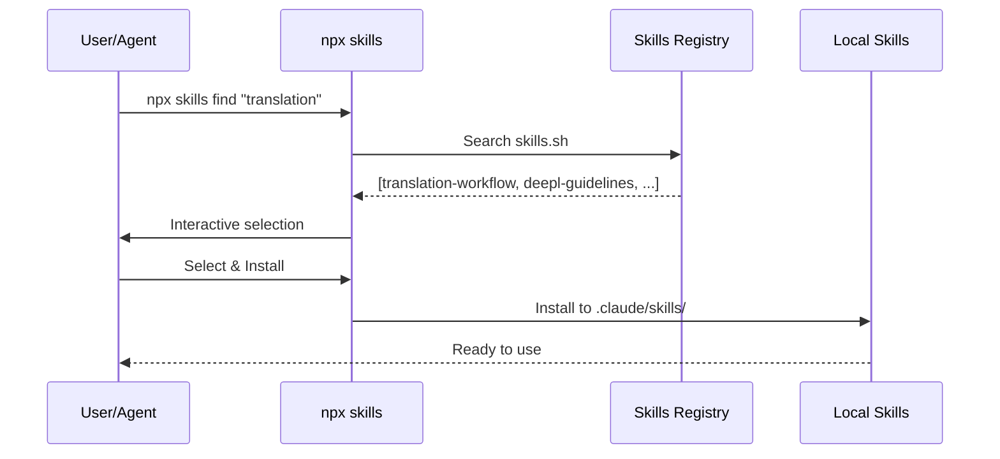
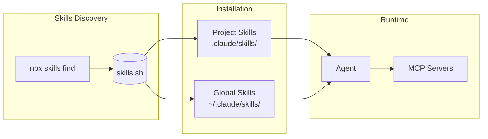

> ⚠️ **このドキュメントは [what-is-skills](./what-is-skills) に統合されました。**
> 今後はそちらを参照してください。

# Skills の概要

## Vercel Skills とは

Vercel Skills は、AIエージェント向けの標準化されたドメイン知識表現フレームワークです。MCPと異なり、**特定のドメインやタスクに対する実行可能なノウハウ**をエージェントが習得・活用できるようにします。

### 特徴

- **ドメイン知識の体系化**: 特定分野の専門知識・ベストプラクティスを構造化
- **インタラクティブな発見**: エージェントが利用可能なSkillsを対話的に探索
- **標準仕様への準拠**: Agent Skills Specification に基づく相互運用性
- **オープンソース化**: [Vercel Skills v1.1.1](https://vercel.com/changelog/skills-v1-1-1-interactive-discovery-open-source-release-and-agent-support) がリリース

## Agent Skills Specification

[https://agentskills.io](https://agentskills.io) で標準化されている仕様。

## 対応エージェント一覧（27種類）

Vercel Skills CLI は以下のエージェントに対応しています。

| Agent          | CLI引数          | プロジェクトパス    |
| -------------- | ---------------- | ------------------- |
| Claude Code    | `claude-code`    | `.claude/skills/`   |
| Cursor         | `cursor`         | `.cursor/skills/`   |
| Codex          | `codex`          | `.codex/skills/`    |
| OpenCode       | `opencode`       | `.opencode/skills/` |
| GitHub Copilot | `github-copilot` | `.github/skills/`   |
| Windsurf       | `windsurf`       | `.windsurf/skills/` |
| Cline          | `cline`          | `.cline/skills/`    |
| Roo Code       | `roo`            | `.roo/skills/`      |
| Gemini CLI     | `gemini-cli`     | `.gemini/skills/`   |
| その他         | ...              | ...                 |

> 完全な一覧は [Vercel Skills README](https://github.com/vercel-labs/skills#supported-agents) を参照

## Skill の構成要素

### 1. メタデータ

```json
{
	"name": "frontend-design",
	"version": "1.0.0",
	"description": "React/Next.js フロントエンド設計のベストプラクティス",
	"author": "example-org",
	"tags": ["frontend", "react", "design"]
}
```

### 2. 実行可能なガイドライン

- ディレクトリ構成の推奨パターン
- コンポーネント設計の原則
- テストカバレッジ要件
- パフォーマンス最適化の指針

### 3. リアルタイムの学習

- エージェントが対話を通じてSkillを習得
- タスク実行中のコンテキスト内で実装

## MCPとSkillsの使い分け

| 側面             | MCP                   | Skills                           |
| ---------------- | --------------------- | -------------------------------- |
| **目的**         | 外部ツール・API連携   | ドメイン知識・実行ノウハウ       |
| **対象**         | 外部システム          | 実装パターン・ベストプラクティス |
| **ユースケース** | rfcxml-mcp, deepl-mcp | frontend-design, doc-coauthoring |
| **運用形態**     | サーバープロセス      | メモリ内（Skillモデル）          |

> 詳細は [vs-mcp.md](./vs-mcp) を参照。

## Skillsの作成・活用パターン

1. **既存ドキュメント化フェーズ**
   - チーム内のベストプラクティスをSkillsに変換
   - 例: Figma設計ガイド → `design-system-skill`

2. **エージェント習得フェーズ**
   - エージェントがSkillを通じてドメイン知識を習得
   - 対話的なクエリで理解度を深める

3. **運用・改善フェーズ**
   - エージェントの実行結果をフィードバック
   - Skillの内容を継続的に最適化

## Vercel Skills CLIとの統合

### find-skills によるSkills発見フロー



### 動的なSkills拡張パターン



### インストールコマンド例

```bash
# Skillを検索
npx skills find "code review"

# 特定のSkillをインストール
npx skills add vercel-labs/agent-skills --skill frontend-design

# 複数エージェントに対応
npx skills add vercel-labs/agent-skills -a claude-code -a cursor

# プロジェクトスコープでインストール（デフォルト）
npx skills add ./my-skills

# グローバルスコープでインストール
npx skills add ./my-skills -g
```

## 参考リンク

- [Agent Skills Specification](https://agentskills.io)
- [Vercel Skills 公式ドキュメント](https://vercel.com/changelog/skills-v1-1-1-interactive-discovery-open-source-release-and-agent-support)
- [関連リンク集](../../references/skills/links)
