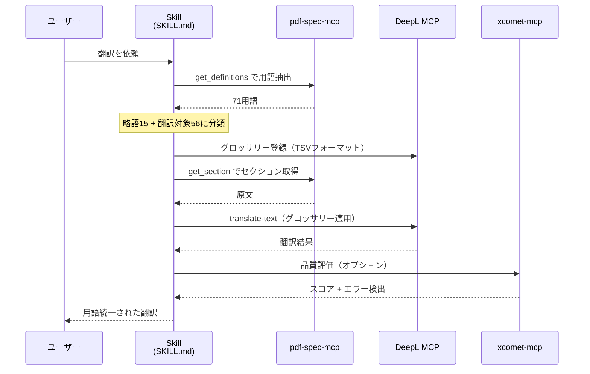
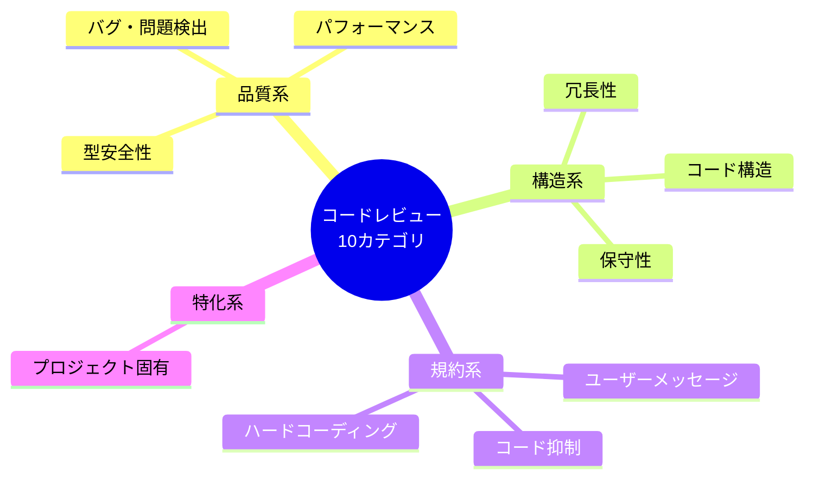
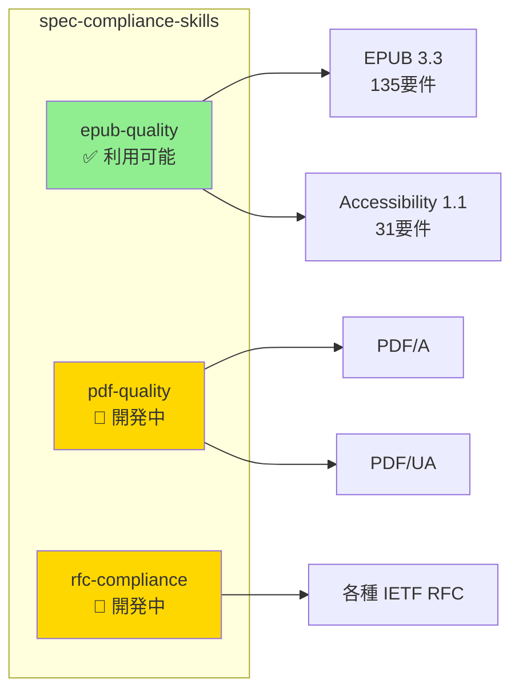
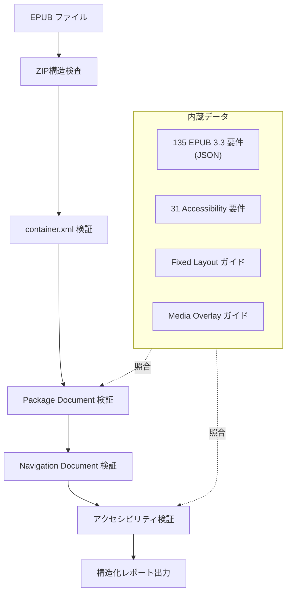
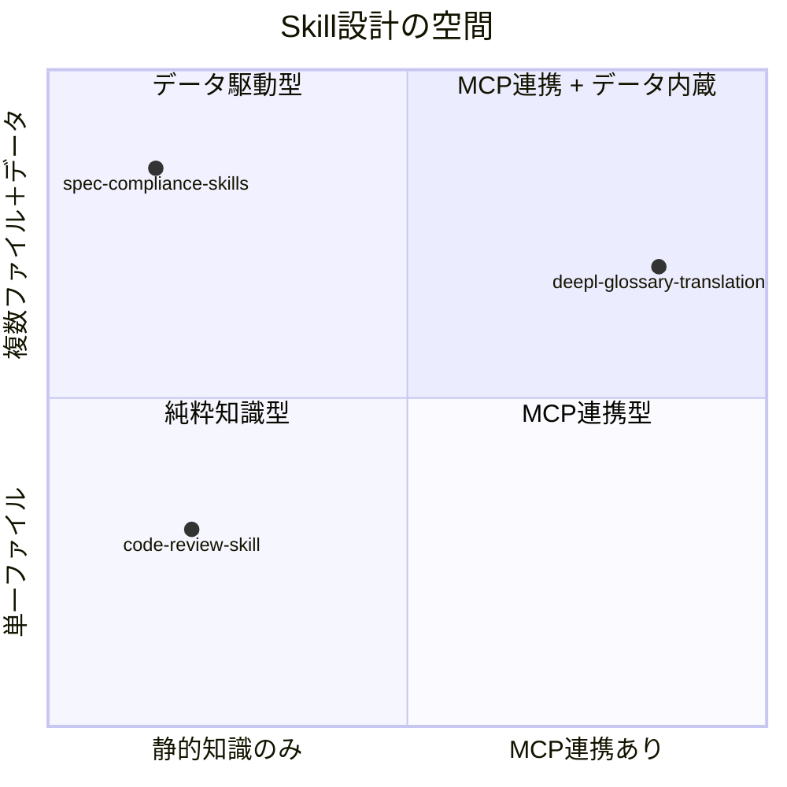

# Skill 実例ショーケース

> 実際に稼働しているSkillの具体例を紹介する。概念ではなく実装を知りたい方向け。

## このドキュメントについて

[Skillsとは](./what-is-skills)で概念を、[Skill作成ガイド](./creating-skills)で設計手法を学んだ上で、このページでは**実稼働しているSkillの実装パターン**を3つ紹介する。それぞれのSkillは、設計アプローチ・MCP連携の深さ・配布形態が異なり、Skill設計の幅を理解するための実例集となっている。

## 実例一覧

| Skill名 | パターン | MCP連携 | 配布形態 |
|---|---|---|---|
| [deepl-glossary-translation](#deepl-glossary-translation) | MCP連携オーケストレーション型 | pdf-spec-mcp + DeepL MCP | `.claude/skills/` |
| [code-review-skill](#code-review-skill) | チェックリスト型 | なし（静的知識のみ） | `.claude/skills/` / Project Knowledge |
| [spec-compliance-skills](#spec-compliance-skills) | データ駆動バリデーション型 | なし（事前パース済みデータ） | Cowork Plugin |

## deepl-glossary-translation

**リポジトリ**: [shuji-bonji/deepl-glossary-translation](https://github.com/shuji-bonji/deepl-glossary-translation)

### 概要

pdf-spec-mcp と DeepL MCP Server を連携させ、PDF仕様書（ISO 32000-2）を**用語統一された日本語**に翻訳するSkill。MCPが「できること」を提供し、Skillが「どうやるか」を定義する、三層アーキテクチャの本質的な例。

### アーキテクチャ

### 設計のポイント

このSkillが示す設計パターンの特徴は以下の通りである。

**複数MCPのオーケストレーション**: pdf-spec-mcp（データ取得）→ DeepL MCP（翻訳）→ xcomet-mcp（品質評価）の3つのMCPを連携させる。Skill自体はツールを持たず、既存MCPの「使い方」を定義する。

**5ステップのワークフロー定義**: 用語抽出 → 分類 → グロッサリー登録 → 翻訳 → 品質検証という明確な手順をMarkdownで記述。エージェントはこの手順に従って自律的に実行する。

**外部スクリプトの活用**: グロッサリー登録にはDeepL APIの直接呼び出しが必要なため、`scripts/` にシェルスクリプトを同梱。Skillの制約（静的知識）を実行可能なスクリプトで補完するパターン。

### 分類

[複合構成パターン](../strategy/composition-patterns)における **パターン4: MCPs + Skills（完全統合）** に該当する。

---

## code-review-skill

**リポジトリ**: [shuji-bonji/code-review-skill](https://github.com/shuji-bonji/code-review-skill)

### 概要

TypeScript / MCP Serverプロジェクトを中心としたコードレビューを行うためのSkill。10カテゴリの評価基準と3段階の優先度フレームワークを定義し、一貫したレビュー品質を提供する。

### 10カテゴリのチェックリスト

| カテゴリ | チェック内容の例 |
|---|---|
| バグ・問題検出 | プレースホルダー検出、null チェック、async ハンドリング |
| ユーザーメッセージ | 言語一貫性、エラーのアクション可能性 |
| コード抑制 | `eslint-disable` / `@ts-ignore` の必要性検証 |
| ハードコーディング | マジックナンバー、埋め込み設定値の検出 |
| パフォーマンス | N+1 問題、キャッシュ不足、逐次 async 呼び出し |
| 冗長性 | コード重複、未使用変数、デッドコード |
| 型安全性 | `any` 型の排除、Zod による外部データ検証 |
| 保守性 | 責任分離、依存方向、一貫したエラーハンドリング |
| コード構造 | ファイルサイズ 300行超、関数 50行超、循環依存 |
| プロジェクト固有 | MCP: ツール説明・Zod `.strict()` / Angular: コンポーネント分離 |

### 優先度フレームワーク

| レベル | 対象 |
|---|---|
| 🔴 High | ランタイムバグ、セキュリティ、パフォーマンス劣化 |
| 🟡 Medium | 将来バグになりやすい構造、型安全性の低下 |
| 🟢 Low | 可読性改善、軽微なリファクタリング |

### 設計のポイント

**MCP不要の純粋Skill**: 外部APIを呼び出す必要がなく、エージェントの持つコード解析能力と組み合わせるだけで機能する。Skillの最もシンプルな形態。

**分割配置設計**: Claude.ai（Project Knowledge）と Claude Code（`.claude/`）で異なる詳細度の配置を推奨。コンテキストウィンドウの制約に応じた設計指針を `PLACEMENT-GUIDE.md` で提供している。

### 分類

三層アーキテクチャにおける **Skills単体** のパターン。MCPなしでもSkillとして十分に機能することを示す例。

---

## spec-compliance-skills

**リポジトリ**: [shuji-bonji/spec-compliance-skills](https://github.com/shuji-bonji/spec-compliance-skills)

### 概要

W3C/IETF仕様に対するドキュメントの準拠性を検証するCowork Plugin。事前パース済みの規範要件（MUST/SHOULD/MAY）データを内蔵し、構造化されたバリデーションレポートを生成する。

### 含まれるSkill

### epub-quality の検証フロー

### 設計のポイント

**データ駆動バリデーション**: 仕様書の規範要件を事前にJSONとしてパースし、Skill内に同梱。MCPサーバーへのリアルタイムアクセスなしに検証を実行できる。

**Skill → Plugin への進化**: 単体のSkillとしても機能するが、Cowork Plugin形式（`.plugin`）で配布することで、インストール・更新が容易になる。Skillの配布形態の進化例。

**段階的な拡張**: epub-quality を最初にリリースし、pdf-quality、rfc-compliance を順次追加。1つのPluginに複数のSkillを束ねる構成パターン。

### 分類

三層アーキテクチャにおける **Skills単体（データ内蔵型）** のパターン。MCPが提供するリアルタイムデータの代わりに、事前パース済みデータをSkillに内蔵するアプローチ。

---

## 3つの実例から見えるSkill設計の幅

Skillは「Markdownに書かれた知識」という単純な定義から始まるが、実際にはデータファイルの同梱、スクリプトの併用、MCP連携の定義、Plugin化による配布など、多様な設計パターンが存在する。重要なのは、**すべてのパターンにおいてSkillの本質（エージェントへの知識提供）は変わらない**ということである。
