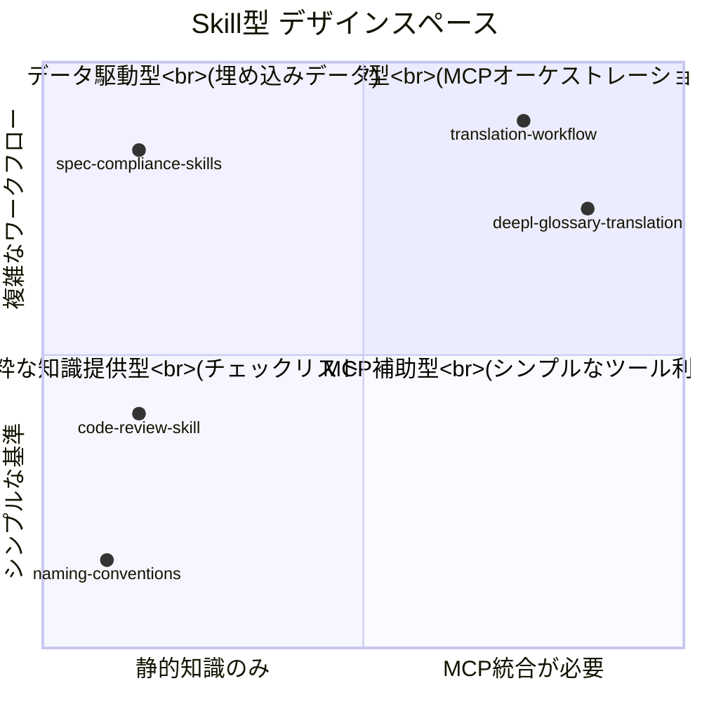
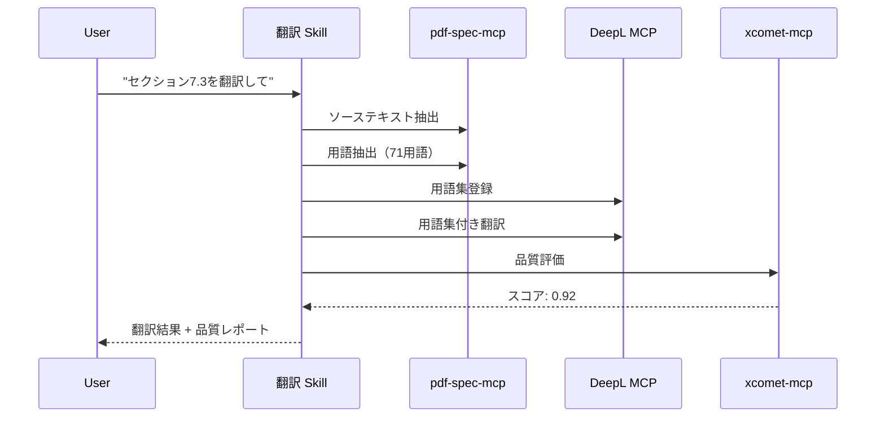
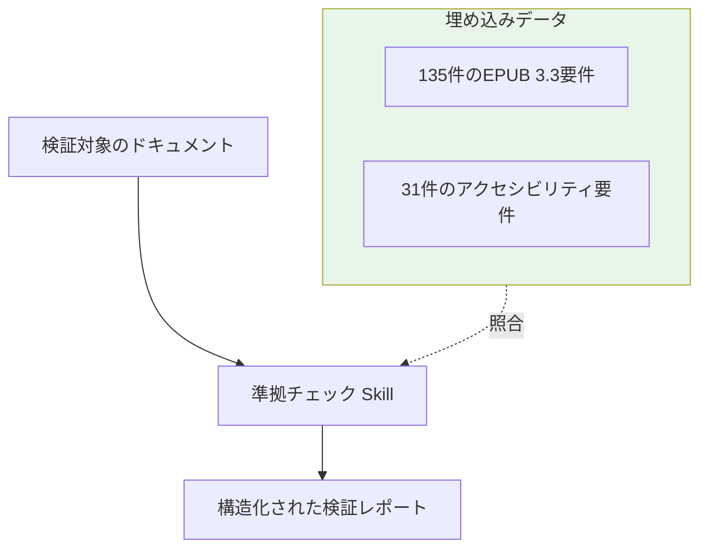
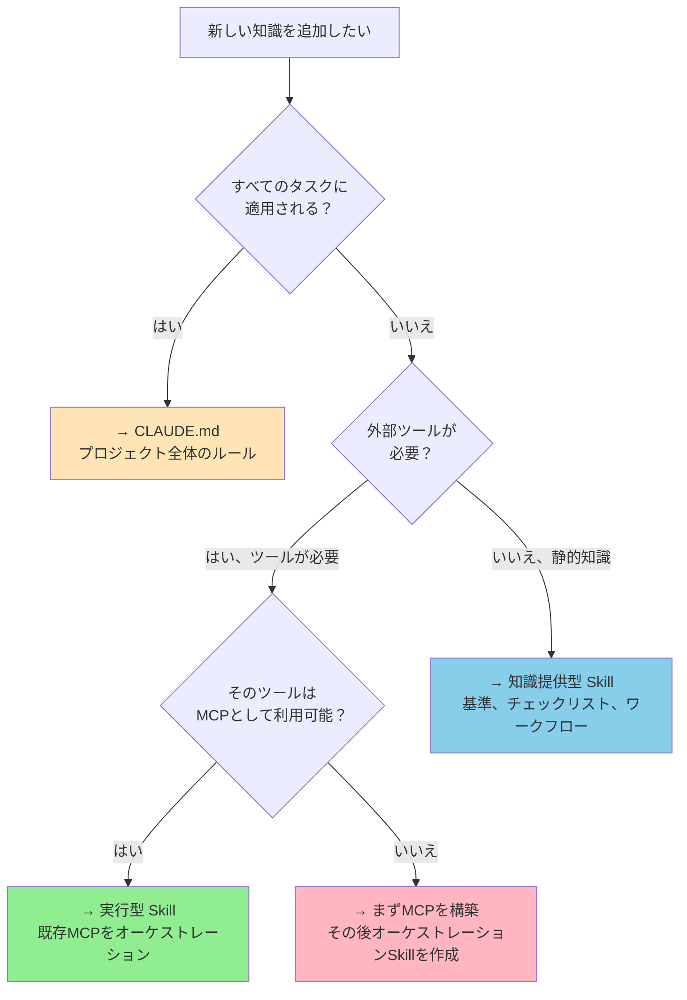
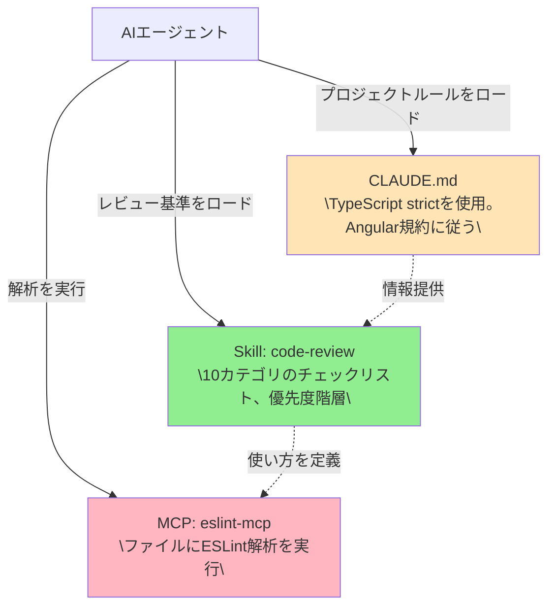

# 活用パターンガイド

> いつ・どこで・どのようにSkillsを使うか — ユースケースパターンとMCP・CLAUDE.mdとの役割分担。

## このドキュメントについて

このガイドは、ワークフローの中で**Skillsがどこで価値を発揮するか**を特定する手助けをする。2つの基本的なSkill型を紹介し、カテゴリ別の具体的なユースケースを解説し、Skills・MCP・CLAUDE.mdそれぞれの役割分担を明確にする。

Skillの作成方法は [スキル作成ガイド](./how-to-create-skills)、プロジェクトへの導入は [スキル導入・利用ガイド](./how-to-use-skills) を参照。

## Skillの2つの型

すべてのSkillは2つの基本型のいずれかに分類される。この区別を理解することが、効果的なSkill設計の鍵である。

### 知識提供型（Knowledge-Providing）

**何をするか**: エージェントが実行時に参照する静的な基準、チェックリスト、標準を提供する。

**特徴**:

- 外部ツール不要
- エージェントの組み込み能力で知識を適用
- 単独のリファレンスとして機能

**例**: code-review-skill, spec-compliance-skills

```markdown
# 例: code-review Skill（知識提供型）

## Decision Criteria

| Condition        | Action             |
| ---------------- | ------------------ |
| ESLintエラー > 0 | ❌ request-changes |
| any型使用あり    | ❌ request-changes |
| カバレッジ < 80% | ⚠️ request-changes |
```

### 実行型（Execution-Guiding）

**何をするか**: 1つ以上のMCPをオーケストレーションするマルチステップワークフローを定義する。Skillが「使い方」を提供し、MCPが「できること」を提供する。

**特徴**:

- MCP統合が必要
- エージェントが従うステップバイステップの手順を定義
- 複数のツールを順番に連携

**例**: deepl-glossary-translation

```markdown
# 例: translation-workflow Skill（実行型）

## Workflow

1. ソースから用語を抽出 → pdf-spec-mcp
2. 用語集を分類・登録 → DeepL MCP
3. 用語集付きで翻訳 → DeepL MCP
4. 品質を評価 → xcomet-mcp
5. スコア < 0.85 なら修正
```

### 比較



| 観点                 | 知識提供型               | 実行型                             |
| -------------------- | ------------------------ | ---------------------------------- |
| **MCP必要**          | 不要                     | 必要                               |
| **複雑さ**           | 低〜中                   | 中〜高                             |
| **エージェント依存** | 組み込み能力             | 特定のMCPツール                    |
| **向いているケース** | 標準、レビュー、チェック | ワークフロー、オーケストレーション |
| **メンテナンス**     | 基準の変更時に更新       | MCP APIやワークフロー変更時に更新  |

## ユースケース別ガイド

### ドキュメント生成・翻訳

**シナリオ**: チームが定期的に技術文書を翻訳し、一貫した用語と品質が求められる。

**Skillアプローチ**（実行型）:



**実際の実装**: [deepl-glossary-translation](https://github.com/shuji-bonji/deepl-glossary-translation)

**Skillの要素**:

- 用語分類ルール（略語 vs 翻訳対象用語）
- 品質閾値: スコア ≥ 0.85
- 用語集登録ワークフロー
- 評価後の修正サイクル

### コード品質・レビュー

**シナリオ**: レビュアーに関係なく、重要な問題を見逃さない一貫したコードレビューを実現したい。

**Skillアプローチ**（知識提供型）:

10の評価カテゴリと優先度フレームワークを定義

| 優先度 | 対象領域                                             |
| ------ | ---------------------------------------------------- |
| 🔴 高  | ランタイムバグ、セキュリティ問題、パフォーマンス劣化 |
| 🟡 中  | バグの温床となる構造、弱い型安全性                   |
| 🟢 低  | 可読性の改善、軽微なリファクタリング                 |

**実際の実装**: [code-review-skill](https://github.com/shuji-bonji/code-review-skill)

**Skillの要素**:

- 10カテゴリのチェックリスト（バグ検出、パフォーマンス、型安全性など）
- 3段階の優先度フレームワーク
- プロジェクト固有ルール（MCP: ツール記述、Angular: コンポーネント分離）
- 異なるエージェントコンテキスト向けの配置設計

### 仕様準拠チェック

**シナリオ**: W3C/IETF仕様に準拠しなければならないドキュメント（EPUB, PDF）を制作している。

**Skillアプローチ**（知識提供型 + 埋め込みデータ）:



**実際の実装**: [spec-compliance-skills](https://github.com/shuji-bonji/spec-compliance-skills)

**Skillの要素**:

- 仕様から事前解析した規範的要件（MUST/SHOULD/MAY）をJSON形式で埋め込み
- MCP不要 — データがSkill内に埋め込まれている
- 段階的拡張: 1つの仕様から始めて、徐々に追加
- 簡単なインストールのためCowork Pluginとして配布

### プロジェクト固有ナレッジ

**シナリオ**: 新しいチームメンバーが、プロジェクトの慣例、アーキテクチャ決定、デプロイプロセスについて同じ質問を繰り返す。

**Skillアプローチ**（知識提供型）:

| Skill                    | 内容                                             | 対象         |
| ------------------------ | ------------------------------------------------ | ------------ |
| `onboarding`             | プロジェクト構成、主要コマンド、コーディング規約 | 新メンバー   |
| `architecture-decisions` | ADRサマリー、特定パターンの選択理由              | 全メンバー   |
| `deployment-checklist`   | デプロイ前チェック、ステージング検証ステップ     | デプロイ担当 |
| `domain-glossary`        | ビジネスドメイン用語と正しい使い方               | 全員         |

**Skillの要素**:

- 誰でも更新できるMarkdown形式
- 人の頭の中にしかなかった暗黙知をキャプチャ
- エージェントがプロジェクト固有の質問に答える際に参照

### CI/CD統合

**シナリオ**: AIエージェントにCI/CDパイプラインで特定の手順に従ってほしい。

**Skillアプローチ**（実行型）:

```markdown
## Workflow

1. push前にローカルでテストを実行
2. push後にCIステータスを確認
3. CI失敗時はログを分析し修正を提案
4. ブランチ命名規則に従う: feature/TICKET-xxx
5. PR説明にはテストプランセクションを含める
```

**Skillの要素**:

- PR作成時にエージェントが従うステップバイステップの手順
- 人的介入が必要な場合の判断基準
- プロジェクト固有のツーリングとの統合

## MCP・CLAUDE.md との役割分担

どのツールを使うかの判断は重要。以下の判断フローチャートを使う。



### 具体的な使い分け例

| 知識                                                 | 配置先        | 理由                           |
| ---------------------------------------------------- | ------------- | ------------------------------ |
| "TypeScript strictモードを常に使用"                  | CLAUDE.md     | すべてのタスクに適用           |
| "翻訳品質は 0.85以上必須"                            | Skill（知識） | タスク固有の閾値               |
| "DeepLで翻訳 → xCOMETで評価 → 修正"                  | Skill（実行） | マルチステップMCPワークフロー  |
| "DeepL APIを呼び出してテキストを翻訳"                | MCP           | 外部ツールの機能               |
| "プロジェクトはAngular 17、standalone component使用" | CLAUDE.md     | プロジェクト全体のコンテキスト |
| "レビュー順序: ロジック → 設計 → スタイル"           | Skill（知識） | タスク固有の手順               |

### 組み合わせパターン

実践では、これら3つは連携して機能する。



## 新しいユースケースの発見方法

### 「繰り返し指示」メソッド

Skill候補を見つける最も簡単な方法

1. **繰り返しを記録する**: AIエージェントに2回以上与えた指示をリスト化
2. **ドメインでグループ化**: 類似の指示をクラスタリング
3. **Skillとして記述**: 各クラスターを構造化されたSKILL.mdに変換
4. **検証**: エージェントでテストし改善を繰り返す

### よくあるサイン

以下の場合にSkillを作成すべき

- AIエージェントに「常に〜を覚えておいて」と言っている
- チームメンバーによってエージェントへの指示が矛盾している
- エージェントが同じ種類の間違いを繰り返す
- 頭の中にはあるが書き下ろしていないチェックリストがある
- ワークフローに特定の順序で使うべき複数のツールが含まれる

### 暗黙知から形式知へ


暗黙知から共有Skillsへの進化

| ステージ | 形態                                       | 問題                       |
| -------- | ------------------------------------------ | -------------------------- |
| 暗黙知   | 「知っているけど書き下ろしていない」       | 人が離れると失われる       |
| 記述済み | チャットメッセージ、Wikiページ、PRコメント | 散在して見つけにくい       |
| 構造化   | 定義されたフォーマットのSKILL.md           | エージェントが直接参照可能 |
| 共有済み | Git管理、レジストリ公開                    | チーム全体、バージョン管理 |

## 次に読むべきドキュメント

| 目的                | ドキュメント                                  |
| ------------------- | --------------------------------------------- |
| Skillを作成する     | [スキル作成ガイド](./how-to-create-skills)    |
| プロジェクトに導入  | [スキル導入・利用ガイド](./how-to-use-skills) |
| 実例を見たい        | [実例ショーケース](./showcase)                |
| 避けるべきパターン  | [アンチパターン集](./anti-patterns)           |
| 設計判断            | [Skill設計ガイド](./creating-skills)          |
| MCP vs Skillsの比較 | [MCP vs Skills](./vs-mcp)                     |
