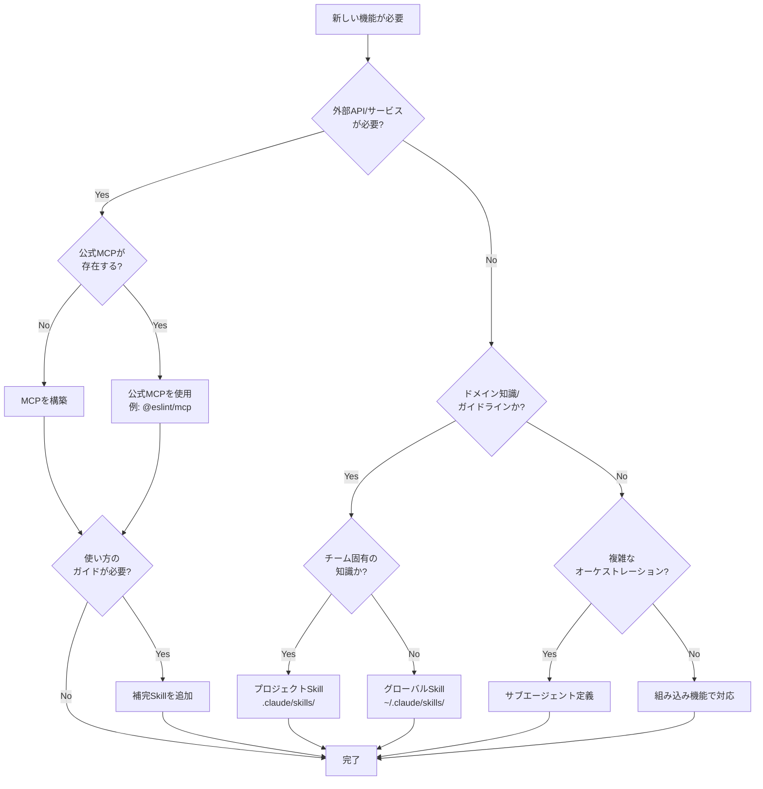
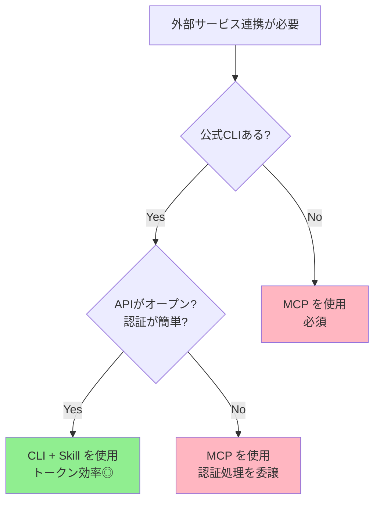

# MCP vs Skills：本質的な違いと選択判断

MCPとSkillsは補完関係にあるが、混同しやすい。このドキュメントでは両者の本質的な違いを明確にし、適切な選択を支援する。

## 概要比較表

MCPとSkillsの基本的な違いを以下の表で概観する。

| 観点         | MCP                                                | Skills                                          |
| ------------ | -------------------------------------------------- | ----------------------------------------------- |
| **定義**     | Model Context Protocol - 外部ツール・API連携の標準 | Agent Skills - ドメイン知識・実行パターンの標準 |
| **主要用途** | 外部システムへのアクセス提供                       | エージェントの知識・実行能力の拡張              |
| **実装場所** | サーバープロセス（独立）                           | エージェント内（統合）                          |
| **更新頻度** | 低（安定運用）                                     | 高（タスク・フィードバック駆動）                |
| **運用責任** | プロバイダー（DevOps）                             | エージェント所有者（AI/ML チーム）              |

## 本質的な違い

### MCP: 「何ができるか」を宣言

```
[External System]
    ↓
[MCP Server]
    ↓ (Tool定義)
[Claude/Agent]
```

MCPは、**外部システムの能力を道具化** する。

**例**: RFC検索エンジンを Claude に提供

- MCPサーバー: IETF RFC全文検索・解析
- Tool: `search_rfc()`, `get_rfc_details()`
- 利用:「RFC 3986 の URI仕様を調べて」

### Skills: 「どう実行するか」を教授

```
[Domain Knowledge]
    ↓
[Skill Representation]
    ↓ (Learn/Execute)
[Claude/Agent]
```

Skillsは、**実行パターン・ベストプラクティスをエージェント内に組み込む**。

**例**: React フロントエンド設計Skill

- メタデータ: 設計原則・推奨パターン
- 学習コンテンツ: ファイル構成・コンポーネント階層・テスト戦略
- 実行: エージェントが新規プロジェクトで自動適用

## 選択判断フロー

### フローチャート（Decision Flow）

新しい機能が必要になったとき、MCP・Skill・サブエージェントのどれを選ぶべきかを以下のフローチャートで判断できる。



### 具体的な判断例

代表的なユースケースごとの判断例を以下に示す。

| ユースケース                 | 判断                  | 理由                       |
| ---------------------------- | --------------------- | -------------------------- |
| DeepL APIで翻訳したい        | MCP                   | 外部API呼び出しが必要      |
| 翻訳の品質基準を定義したい   | Skill                 | ドメイン知識・ガイドライン |
| SOLID原則に従いたい          | Skill                 | 静的な知識                 |
| ESLintでコードチェックしたい | MCP（公式）           | @eslint/mcp が存在         |
| チームのコーディング規約     | Skill（プロジェクト） | チーム固有の知識           |
| RFC仕様を検索したい          | MCP                   | 外部データ取得が必要       |
| 翻訳→品質評価→修正の自動化   | サブエージェント      | 複雑なオーケストレーション |

### 簡易判断図

もっとシンプルに判断したい場合は、以下の図を参考にしてほしい。

```
┌─────────────────────────────────┐
│  必要な機能は何か？              │
└─────────────────────────────────┘
           ↓
    ┌──────────────┬──────────────┐
    ↓              ↓
┌─────────────┐ ┌──────────────────┐
│ 外部サービス │ │ 内部知識・パターン │
│ へのアクセス  │ │ (チーム内ノウハウ) │
└─────────────┘ └──────────────────┘
    ↓                    ↓
  ┌──────┐           ┌──────────┐
  │ MCP  │           │ Skills   │
  └──────┘           └──────────┘
```

### MCPを選ぶ場合

✅ **こんな時は MCP**

- 外部 API・ツール連携が必要
- リアルタイムデータ取得
- 第三者システムとの統合
- 認証・トークン管理が必要

**例**:

- `rfcxml-mcp`: IETF RFC 検索
- `deepl-mcp`: DeepL翻訳 API
- `github-mcp`: GitHub リポジトリ操作

### Skillsを選ぶ場合

✅ **こんな時は Skills**

- チーム内のベストプラクティス共有
- 実装パターン・設計原則の標準化
- エージェントが「やり方」を習得して実行
- 継続的な改善・フィードバック

**例**:

- `frontend-design`: React/Next.js 最適設計
- `doc-coauthoring`: ドキュメント共著ガイドライン
- `testing-strategy`: テスト戦略とカバレッジ要件

## アンチパターン：過度な采配

### over-MCPization: MCPの過剰使用

❌ **反パターン例**:

```
// ❌ これはMCPではなくSkillsで実装すべき
- MCP: 「全社コーディング規約取得」
- 理由: 外部システムではなく、チーム知識
- 正解: Skillsで「コーディング規約Skill」を提供
```

**問題点**:

- MCPサーバーの責務が肥大化
- 運用コスト増加
- エージェント側のカスタマイズ困難

### over-Skillization: Skillsの過剰使用

❌ **反パターン例**:

```
// ❌ これはMCPで実装すべき
- Skill: 「このビジネスのプロセスはDeepL翻訳を活用」
- 理由: 外部APIであり、チーム知識ではない
- 正解: `deepl-mcp` を使用
```

**問題点**:

- Skillが肥大化・複雑化
- 外部システムの更新に対応困難
- 認証・トークン管理の混乱

## 組み合わせ活用パターン

実際の運用では、MCPと Skillsを **相補的に組み合わせ** る。

### パターン 1: 翻訳機能の提供

```
[翻訳ガイドラインSkill]
           ↓
[DeepL API] ←─── deepl-mcp
           ↓
[エージェント]
    ↓
「顧客対応メールを翻訳」→ Skillで「トーン・文体」を学習
                        → MCPで「正確な翻訳」を実行
```

### パターン 2: フロントエンド開発

```
[デザイン規約Skill] + [Component ライブラリMCP]
           ↓
[エージェント]
    ↓
「新規UIコンポーネント作成」
    → Skillで「デザイン原則」習得
    → MCPで「既存コンポーネント参照」
```

### パターン 3: コード品質チェック

```
[SOLID原則Skill]
    ├─ 5原則の定義・目的
    ├─ 違反パターンの識別
    └─ リファクタリング指針

    → 「何を守るべきか」の知識
           ↓
[ESLint公式MCP（@eslint/mcp）]
    ├─ Lint実行
    ├─ 自動修正
    └─ ルール違反の検出

    → 「実際に検出する」ツール
```

**ポイント**: SOLID原則のMCPを自作する必要はない

- 知識・原則 → Skill で定義
- 検出・修正 → 公式MCPを活用

### 使い分けの整理

主要な領域ごとのSkillとMCPの使い分けを以下にまとめる。

| 領域           | Skill（知識）      | MCP（ツール）      |
| -------------- | ------------------ | ------------------ |
| **翻訳**       | 翻訳ガイドライン   | DeepL公式 + xCOMET |
| **コード品質** | SOLID原則          | ESLint公式         |
| **RFC準拠**    | 実装チェックリスト | rfcxml-mcp         |

> **原則**: 公式MCPがあるものは使う。知識・原則はSkillで定義する。

## 運用上の考慮事項

MCPとSkillsの運用面での違いを以下に整理する。

| 運用活動           | MCP                          | Skills                         |
| ------------------ | ---------------------------- | ------------------------------ |
| **デプロイ**       | サーバー側（DevOps）         | エージェント側（AI チーム）    |
| **バージョン管理** | セマンティックバージョニング | Task/Feedback ドリブン         |
| **テスト**         | 統合テスト（API互換性）      | ユースケーステスト（実行品質） |
| **ドキュメント**   | APIリファレンス              | 実行ガイド・ナレッジベース     |

## ベストプラクティス

MCPとSkillsを適切に活用するためのベストプラクティスを以下にまとめる。

### 1. **責任分離の明確化**

- MCP: 「何ができるか」の宣言に専念
- Skills: 「どう活用するか」の指針に専念

### 2. **段階的な導入**

- 第1段階: MCPで外部連携を実装
- 第2段階: Skillsで内部知識を体系化
- 第3段階: MCPとSkillsの相互補完

### 3. **継続的改善**

- MCPはサーバー側で安定運用
- Skillsはフィードバック駆動で進化

## CLI vs MCP: CLIで十分なケース

MCPを構築する前に、専用CLIが存在するかを確認しましょう。

### なぜ重要か

CLI + Skillの組み合わせがMCPよりも効率的である理由を以下に整理する。

| 観点             | CLI + Skill                  | MCP                            |
| ---------------- | ---------------------------- | ------------------------------ |
| **トークン消費** | 低い（コマンドのみ）         | 高い（全ツール定義を読み込む） |
| **用途特化**     | ✅（CLIは専用設計）          | △（汎用インターフェース）      |
| **起動コスト**   | なし（既にインストール済み） | サーバープロセスが必要         |
| **認証**         | ローカルで完結               | MCP側で管理                    |

### 判断フロー

公式CLIの有無と認証の複雑さに基づく判断フローを以下に示す。



### 判断基準

CLI + Skill と MCP の判断基準を以下のチェックリストで整理する。

| チェック項目               | CLI + Skill | MCP |
| -------------------------- | ----------- | --- |
| 公式CLIあり                | ✅          | -   |
| APIがオープン/文書化       | ✅          | -   |
| 認証がシンプル（ローカル） | ✅          | -   |
| 複雑な認証（OAuth）        | -           | ✅  |
| CLIなし                    | -           | ✅  |

### 具体例

代表的なサービスについて、推奨アプローチを以下に示す。

| サービス     | CLI      | 推奨                |
| ------------ | -------- | ------------------- |
| GitHub       | `gh`     | CLI + Skill         |
| AWS          | `aws`    | CLI + Skill         |
| Google Cloud | `gcloud` | CLI + Skill         |
| PostgreSQL   | `psql`   | CLI + Skill         |
| Linear       | ❌       | MCP                 |
| Greptile     | ❌       | MCP                 |
| Slack        | 部分的   | MCP（フル機能向け） |

### パターン: CLI + Skill

CLIをMCPの代わりに使う場合、

1. **Skill が定義**: CLIの効果的な使い方
2. **Tool呼び出し**: 直接CLIコマンド（例: `gh pr list`）
3. **認証**: ローカルで処理（既に認証済み）

### 重要な洞察

> **CLI がある → CLI + Skill（トークン効率的）**
> **CLI がない → MCP（必須）**

このパターンは r/ClaudeAI でのコミュニティ議論から生まれ、すでに優れた CLI を持つサービスに対して MCP が「トークンを大量消費する」という実際の使用パターンを反映しています。

## 関連ドキュメント

MCPとSkillsの選択判断に関連するドキュメントを以下に示す。

- [Skillsとは](./what-is-skills) - Skills 概要
- [MCP Catalog](../mcp/catalog.md) - 構築済みMCPカタログ
- [Architecture](../concepts/03-architecture.md) - MCP/Skills/Agent構成論
