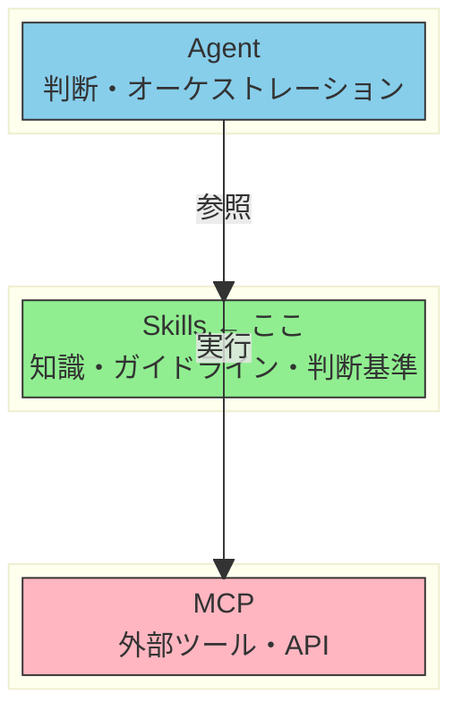
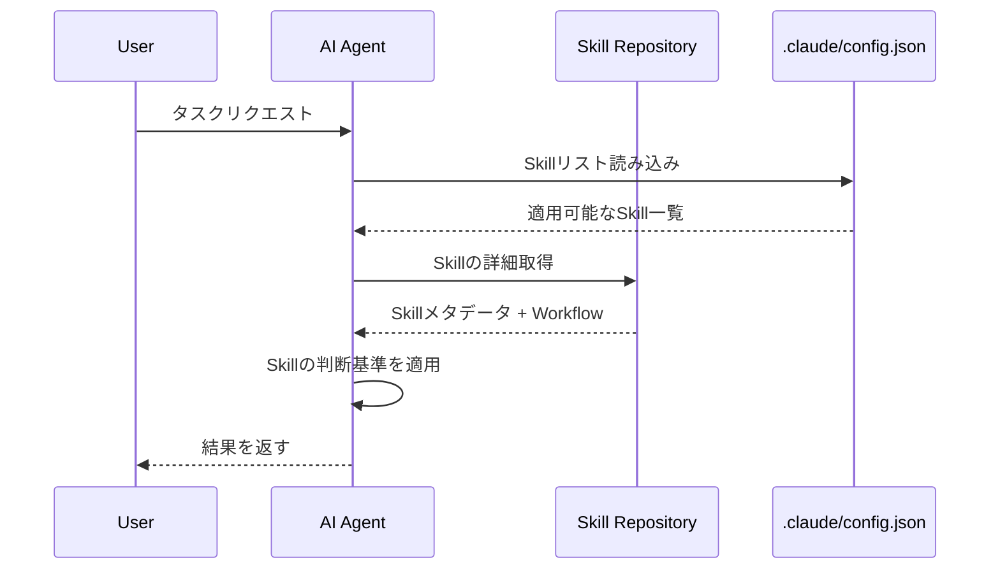
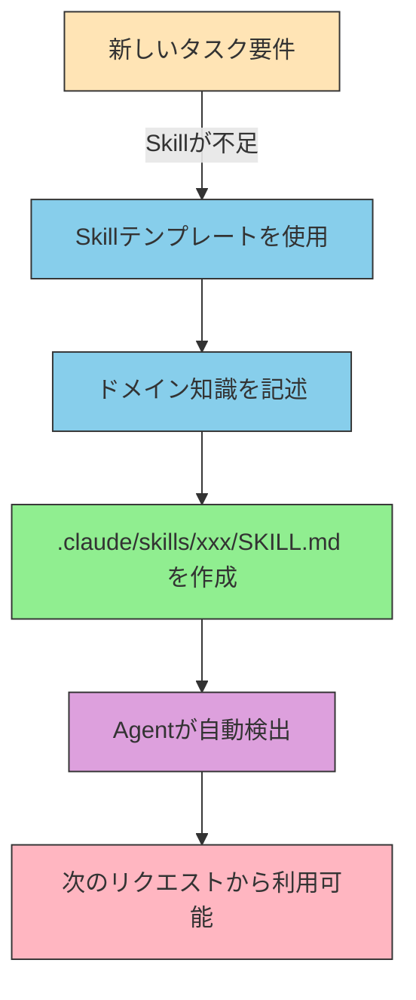

# Skillsとは何か

> AIエージェントにドメイン知識・ガイドライン・判断基準を提供する静的な知識レイヤー

## このドキュメントについて

Skillsの基本概念、種類、メリット・デメリットを解説する。Skillの作成方法は [creating-skills.md](./creating-skills.md) を参照。

## Skillsとは何か

**Vercel Skills** は、AIエージェント向けの標準化されたドメイン知識表現フレームワークです。

MCPと異なり、**特定のドメインやタスクに対する実行可能なノウハウ**をエージェントが習得・活用するための仕組みです。

### 基本情報

Skillsの基本的な情報を以下にまとめる。

- **仕様**: Agent Skills Specification (https://agentskills.io)
- **形式**: Markdownファイル（`SKILL.md`）
- **配置場所**:
  - プロジェクト単位: `.claude/skills/xxx/SKILL.md`
  - ユーザー単位: `~/.claude/skills/xxx/SKILL.md`
- **一言で表現**: 「AIに**何を知っているべきか**を教える仕組み」

### Skillsの4つの特徴

Skillsの中核的な特徴は以下の4点である。

- **知識ベース**: AIが参照すべきドメイン知識やベストプラクティスを構造化
- **実行可能なガイドライン**: 抽象的なルールではなく、判断基準や手順を明確化
- **スコープ限定**: プロジェクト単位やチーム単位で知識を管理
- **進化的学習**: フィードバックに基づいて継続的に更新可能

## なぜ「知識」を分離するのか

### 問題設定

AIエージェントは汎用的な知識は豊富ですが、以下の情報を持っていません。

- あなたのプロジェクト特有のルール
- チームの品質基準や判断基準
- ドメイン固有の専門知識
- 組織のベストプラクティス

### 解決策

Skillとして知識を構造化し、AIに参照させることで、エージェントが**プロジェクト固有の判断**を下せるようになります。

### MCPとの違い

MCPとSkillの違いを以下の表で比較する。

| 観点     | MCP                             | Skill                                    |
| -------- | ------------------------------- | ---------------------------------------- |
| 提供物   | 「何ができるか」（ツール・API） | 「何を知るべきか」（知識・ガイドライン） |
| 実装形式 | サーバー（動的）                | MarkdownまたはJSON（静的）               |
| 用途     | 外部サービス連携                | 内部知識の統一                           |

### アーキテクチャ図

Agent・Skills・MCPの3層がどのように連携するかを以下の図で示す。Skillsは中間の知識レイヤーとして位置づけられる。



## Skillsの種類

Skillは用途に応じて、以下のような種類に分類できます。

| 種類               | 説明                     | 例                                           |
| ------------------ | ------------------------ | -------------------------------------------- |
| ワークフロー定義型 | 手順・プロセスの定義     | 翻訳ワークフロー、コードレビュー手順         |
| 品質基準型         | 閾値・基準の定義         | 翻訳品質スコア ≥ 0.85、テストカバレッジ基準  |
| ガイドライン型     | ベストプラクティス・原則 | コーディング規約、命名規則                   |
| テンプレート型     | 定型的な出力形式の定義   | ドキュメントテンプレート、PR説明テンプレート |

これらの種類を組み合わせることで、より複雑なSkillを構成することも可能です。

## Skillの構成要素

### メタデータ（YAML Front Matter）

Skillファイルの先頭には、メタデータをYAMLフォーマットで記述する。以下は翻訳品質Skillの例である。

```yaml
name: translation-quality
version: 1.0.0
description: 翻訳品質評価ガイドライン
author: @shuji-bonji
tags:
  - translation
  - quality-assurance
  - deepl
agent-support:
  - claude-code
  - cursor
```

### 必須セクション

メタデータに続いて、以下のセクションを本文に含めることが推奨される。

| セクション            | 内容                                | 例                                                             |
| --------------------- | ----------------------------------- | -------------------------------------------------------------- |
| **Purpose**           | 目的・背景・なぜこのSkillが必要か   | 「翻訳品質を統一し、品質スコアが0.85以上であることを保証する」 |
| **Inputs / Outputs**  | 入出力の定義                        | 入力: 原文テキスト / 出力: 翻訳文 + 品質スコア                 |
| **Constraints**       | MUST / SHOULD / MUST NOT による制約 | MUST: スコア ≥ 0.85 / MUST NOT: 自動翻訳のみを使用             |
| **Workflow**          | 具体的な手順・プロセス              | 「1. 機械翻訳を実施、2. ネイティブレビュー、3. スコア計算」    |
| **Decision Criteria** | 判断基準・閾値                      | スコア計算式、品質指標の定義                                   |
| **Examples**          | 具体例・ユースケース                | 良い例、悪い例                                                 |
| **Anti-Patterns**     | やってはいけない例                  | 「文脈を無視した直訳」など                                     |

## メリット

Skillsを採用することで、以下のメリットが得られます。

- ✅ **低コンテキスト消費**: 参照時のみ読み込まれ、MCPのように常駐しない
- ✅ **誰でも編集可能**: Markdownなので、コードが書けなくても更新できる
- ✅ **即座に反映**: ファイルを保存すれば次の対話から有効
- ✅ **チーム知識の集約**: 属人化した暗黙知をSkillとして可視化
- ✅ **標準仕様準拠**: Agent Skills Specificationに基づく相互運用性
- ✅ **バージョン管理**: Gitで履歴管理が容易

## デメリット・限界

Skillsには以下の制限があります。

- ❌ **動的処理不可**: 外部APIの呼び出しや計算はできない（MCPが必要）
- ❌ **静的コンテンツ**: リアルタイムデータの参照ができない
- ❌ **更新の手動管理**: 外部仕様の変更を自動追従できない
- ❌ **スコープ限定**: プロジェクト単位またはユーザー単位（グローバル共有はnpmではなくGitで管理）

> **注**: Skillsの限界を超える処理が必要な場合は、[what-is-mcp.md](../mcp/what-is-mcp.md) を参照してください。

## 対応エージェント一覧

Skillsは以下のAIエージェントで利用可能です。

| Agent               | CLI引数          | プロジェクトパス      |
| ------------------- | ---------------- | --------------------- |
| Claude Code         | `claude-code`    | `.claude/skills/`     |
| Cursor              | `cursor`         | `.cursor/skills/`     |
| Codex               | `codex`          | `.codex/skills/`      |
| OpenCode            | `opencode`       | `.opencode/skills/`   |
| GitHub Copilot      | `github-copilot` | `.github/skills/`     |
| Windsurf            | `windsurf`       | `.windsurf/skills/`   |
| Cline               | `cline`          | `.cline/skills/`      |
| Roo Code            | `roo-code`       | `.roo/skills/`        |
| Gemini CLI          | `gemini-cli`     | `.gemini/skills/`     |
| Continue            | `continue`       | `.continue/skills/`   |
| Aide                | `aide`           | `.aide/skills/`       |
| Cosine              | `cosine`         | `.cosine/skills/`     |
| Bolt.new            | `bolt`           | `.bolt/skills/`       |
| Claude.dev          | `claude-dev`     | `.claude-dev/skills/` |
| BasedHardware Agent | `based-hw`       | `.based/skills/`      |
| val-town Agent      | `val-town`       | `.val-town/skills/`   |

詳細: https://github.com/vercel-labs/skills#supported-agents

## Vercel Skills CLIとの統合

Vercel Skills CLIを用いることで、Skillの検索・追加・管理が簡単になります。

### Skillの検索

`npx skills` コマンドでSkillレジストリを検索できる。

```bash
npx skills find "code review"
npx skills search "translation"
```

### Skillの追加

見つけたSkillは以下のコマンドでプロジェクトに追加できる。

```bash
# 特定のSkillを追加
npx skills add vercel-labs/agent-skills --skill frontend-design

# 複数エージェント向けに追加
npx skills add vercel-labs/agent-skills -a claude-code -a cursor

# ローカルSkillを登録
npx skills add ./local-skill
```

### Skillsの発見フロー

エージェントがSkillを発見し適用するまでの流れを以下のシーケンス図で示す。



### Skillの動的拡張フロー

新しいタスク要件に対してSkillが不足している場合の拡張フローを以下に示す。



## このリポジトリでの実績

このリポジトリでは、以下のSkillを実装・管理しています。

### 実装済みSkill

| Skill                 | 行数  | 説明                                         |
| --------------------- | ----- | -------------------------------------------- |
| `translation-quality` | 279行 | 翻訳品質評価ガイドライン（xCOMETスコア連携） |

### テンプレート

新しいSkillを作成する際に利用できるテンプレートを用意している。

- `templates/skill/SKILL.ja.md.template` - 新規Skill作成用テンプレート
- `templates/skill/SKILL.en.md.template` - English版テンプレート

### 目標

- **Phase 1**: Skill/Agent定義 3個以上（現在1個 → 拡充予定）
- **次のSkill候補**:
  - `translation-workflow` - 翻訳プロセスの定義
  - `rfc-compliance` - RFC仕様準拠チェック
  - `code-review` - コードレビューガイドライン

## 次に読むべきドキュメント

Skillsについてさらに深く学ぶために、以下のドキュメントを参照してほしい。

| 目的                           | ドキュメント                                         |
| ------------------------------ | ---------------------------------------------------- |
| 設計判断・計画                 | [Skill設計ガイド](./creating-skills)                 |
| 実際にSkillを作成する          | [スキル作成ガイド](./how-to-create-skills)           |
| プロジェクトにSkillsを導入する | [スキル導入・利用ガイド](./how-to-use-skills)        |
| ユースケースを知りたい         | [活用パターンガイド](./skill-use-cases)              |
| MCP vs Skillsの判断            | [MCP vs Skills](./vs-mcp)                            |
| 避けるべきパターン             | [アンチパターン集](./anti-patterns)                  |
| 実例を見たい                   | [実例ショーケース](./showcase)                       |
| MCPについて知りたい            | [MCPとは](../mcp/what-is-mcp)                        |
| 全体アーキテクチャ             | [アーキテクチャ](../concepts/03-architecture)        |

**最終更新**: 2026年2月

**関連リソース**:

- [Agent Skills Specification](https://agentskills.io)
- [Vercel Labs Skills GitHub](https://github.com/vercel-labs/skills)
- [Skill設計ガイド](./creating-skills)
