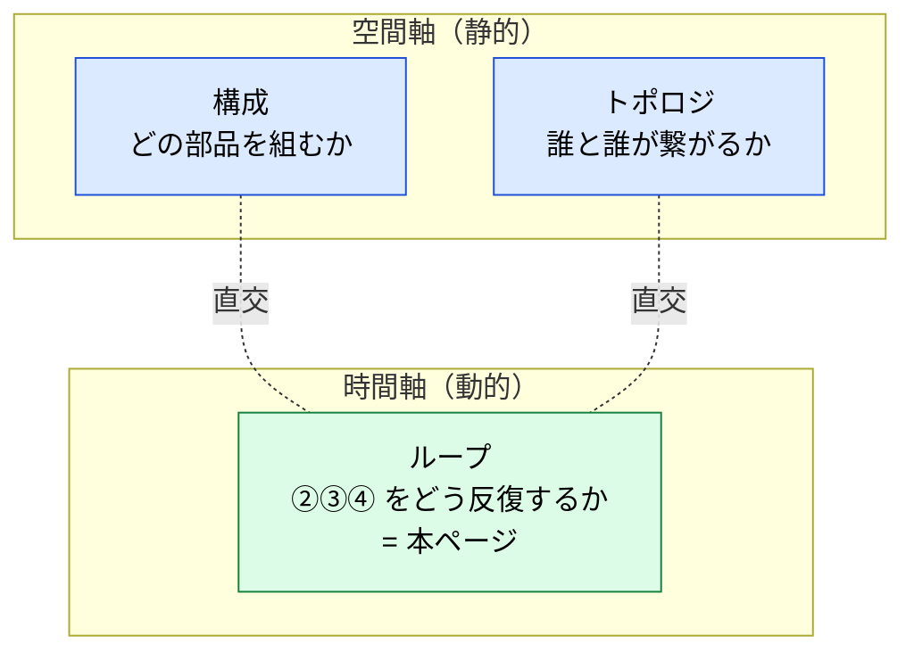
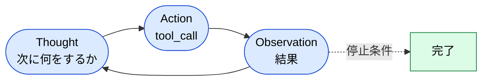
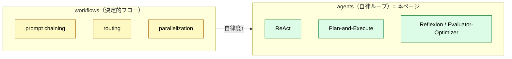

# エージェントループのパターン — ハーネスが ②③④ をどう回すか

> 「連携パターン」でも「ワークフロー」でもない、第 3 の軸。単一エージェントの**ループの駆動型**を整理する。

## このドキュメントについて

> [!NOTE]
> 本ページは [Harness Engineering との対応関係](./harness-engineering-mapping) の **Orchestration（ループ制御）→ Agent 層** の写像の「中身」を扱う。ハーネスが `① tool_call → ② 実 I/O → ③ 結果 → ④ 文脈に戻す` のループを**どう反復するか**の型（ReAct / Plan-and-Execute / Reflexion / Evaluator-Optimizer）をカタログ化する。

「ハーネスパターン」という名前は標準用語ではないが、その中身は確立して存在する。文献では **agent patterns / single-agent patterns / agentic reasoning patterns** と呼ばれる。

> [!TIP]
> **3 行で言うと**
>
> - 本サイトの「パターン」には 3 軸ある: **構成**（どの部品を組むか）/ **トポロジ**（複数エージェントの繋がり方）/ **ループ**（単一エージェントの回し方）。本ページは 3 つ目。
> - ループの型は **ReAct**（密な反復）/ **Plan-and-Execute**（計画と実行の分離）/ **Reflexion**（自己批評）/ **Evaluator-Optimizer**（生成役と評価役の分離）。
> - Anthropic の「**workflows（決定的フロー）vs agents（自律ループ）**」二分では、本ページは **agents 側**にあたる。

## 3 つの「パターン」軸を混同しない

エージェント設計で「パターン」と言う時、実は層の違う 3 つを指している。

| 軸 | 問い | 性質 | 本サイトのページ |
| --- | --- | --- | --- |
| **構成パターン** | どの**部品**を静的に組むか | 空間的・静的 | [構成パターン](./composition-patterns)（MCP + Skill 等） |
| **トポロジ（設計パターン）** | **複数エージェント**がどう繋がるか | 空間的・静的 | [エージェント概念の分類](../agents/agent-taxonomy)（Orchestrator-Worker / Swarm） |
| **ループパターン** | **単一エージェント**が ②③④ をどう反復するか | 時間的・動的 | **本ページ** |

> [!IMPORTANT]
> `Orchestrator-Worker` や `Swarm` は「**誰と誰が繋がるか**」のトポロジであって、「**どう反復するか**」のループ型ではない。両者は直交する。たとえば Orchestrator-Worker の各 Worker が内部で ReAct を回す、という組み合わせが成立する。

## ループパターンのカタログ

### 1. ReAct — 密な反復ループ

`Thought（思考）→ Action（ツール呼び出し）→ Observation（結果）` を 1 ステップずつ回し、観測を次の思考に戻す。最も基本的で適応的。`② 実 I/O` ごとに次手を考え直すため、動的・探索的なタスクに強い。

- **長所**: 各ステップで軌道修正できる。実装が単純。
- **短所**: ステップごとに観測を文脈へ積むためトークン消費が増える。長いタスクで脱線・暴走しやすい（→ 上限ガードが必須）。

### 2. Plan-and-Execute / ReWOO — 計画と実行の分離

先に**全手順を計画**し、その後は計画どおり実行に徹する。Planner（計画役・ツールを呼ばない）と Executor（実行役）に分かれる。ReWOO は観測を推論から切り離し、トークン消費を抑える派生。

- **長所**: 手順が監査可能・再現可能。長い調査やレポート生成で効率的。
- **短所**: 計画時の前提が崩れると弱い（実行中の軌道修正が効きにくい）。

> [!TIP]
> 実務では **外側を Plan-and-Execute、各ステップ内を ReAct** にする組み合わせが多い。予測可能な骨格を保ちつつ、ステップ内では適応する。

### 3. Reflexion — 自己批評ループ

ReAct を拡張し、各サイクル後に**自分の出力を批評**し、その洞察を**記憶**して次に活かす。失敗を学習に変える外側のループ。

- **長所**: 自己修正で難タスクの成功率が上がる。
- **短所**: 批評・再試行のたびにコストが増える。停止条件が甘いと回り続ける。

### 4. Evaluator-Optimizer — 生成役と評価役の分離

生成役（Optimizer）と評価役（Evaluator）を分け、評価が「不足」と判断したら再生成させる。本サイトの[品質ゲート](../agents/subagent-quality-gate)や、翻訳の xcomet ゲートがこの型。

- **長所**: 評価基準が明文化され、品質が安定する。
- **短所**: 評価のオーバーヘッドがコストの天井になる（節約を超えたら本末転倒）。

> [!NOTE]
> Reflexion が「**自分で自分を**批評する」のに対し、Evaluator-Optimizer は「**別役が**評価する」。前者はループ内の自己反省、後者は役割分離。実装では混ざることも多い。

## workflows と agents の二分での位置づけ

Anthropic の "Building Effective Agents" は、決まった制御フロー＝**workflows** と、自律的にループを回す＝**agents** を区別する。

本サイトの [連携パターン・ワークフロー](../workflows/patterns) は**決定的フロー（workflows 側）**のドメイン別カタログ。本ページは**自律ループ（agents 側）**の駆動型を扱う。両者は補完関係にある。

## 選択ガイド

| 状況 | 推奨パターン |
| --- | --- |
| タスクが動的・探索的で、毎ステップ判断が要る | **ReAct** |
| 手順が予測可能で、監査・再現性が要る（長い調査・レポート） | **Plan-and-Execute** |
| トークン消費を抑えたい（観測を推論から切り離す） | **ReWOO** |
| 失敗から学習させ、成功率を上げたい | **Reflexion** |
| 品質基準を明文化し、出力を安定させたい | **Evaluator-Optimizer** |
| 入口で種類ごとに振り分けたい | routing（→ [Routing vs Cascading](./routing-vs-cascading)） |

> [!WARNING]
> どの型でも **上限ガード（最大ラウンド / recursionLimit）** は必須。ツールがエラーを返してもモデルは止まらず回り続けるため、収束ガイドと打ち切りがないと暴走とコスト超過を招く。

## ハーネス 4 責務との対応

| ループパターン | 主に効くハーネス責務 |
| --- | --- |
| ReAct / Plan-and-Execute | **Orchestration（ループ制御）** |
| Reflexion / Evaluator-Optimizer | **Orchestration + フィードバック（評価）** |
| 全パターン共通 | **Guardrails（上限ガード・打ち切り）** |

→ 責務の全体像は [Harness Engineering との対応関係](./harness-engineering-mapping)、評価の自律修正は [サブエージェント品質ゲート](../agents/subagent-quality-gate) を参照。

## 🔗 さらに深く: なぜ自律ループに「評価」と「上限ガード」が要るのか

本ページはループの**型 (What/How)** を扱った。「**なぜ** 自己批評・評価ゲート・上限ガードが必要なのか」を LLM の構造的制約から理解したい場合は、姉妹サイトを参照。

- [understanding-llm / Part 1: 構造的問題](https://shuji-bonji.github.io/understanding-llm-through-claude-code/ja/01-llm-structural-problems/) — モデルが自分の確信度を信頼できない（Sycophancy / Knowledge Boundary）から、外側の評価が要る
- [understanding-llm / 付録: Harness と LLM の構造的制約](https://shuji-bonji.github.io/understanding-llm-through-claude-code/ja/appendix/harness-and-llm-constraints) — ハーネス各要素 ⇔ 8 問題の対応

## 関連ドキュメント

- [Harness Engineering との対応関係](./harness-engineering-mapping) — 本ページの親（ループ制御＝Orchestration の中身）
- [連携パターン・ワークフロー](../workflows/patterns) — 決定的フロー側のドメイン別カタログ
- [エージェント概念の分類](../agents/agent-taxonomy) — トポロジ（Orchestrator-Worker / Swarm）
- [Routing vs Cascading](./routing-vs-cascading) — モデルの振り分け軸
- [サブエージェント品質ゲート](../agents/subagent-quality-gate) — Evaluator-Optimizer の実装

## 参考文献

- Anthropic (2024). "Building Effective Agents." Anthropic Engineering. [anthropic.com/engineering](https://www.anthropic.com/engineering/building-effective-agents) — workflows vs agents の二分、Evaluator-Optimizer 等の定義
- Yao, S. et al. (2022). "ReAct: Synergizing Reasoning and Acting in Language Models." arXiv. [arXiv:2210.03629](https://arxiv.org/abs/2210.03629) — Thought-Action-Observation ループの原典
- Shinn, N. et al. (2023). "Reflexion: Language Agents with Verbal Reinforcement Learning." arXiv. [arXiv:2303.11366](https://arxiv.org/abs/2303.11366) — 自己批評と言語による強化
- Xu, B. et al. (2023). "ReWOO: Decoupling Reasoning from Observations for Efficient Augmented Language Models." arXiv. [arXiv:2305.18323](https://arxiv.org/abs/2305.18323) — 観測を推論から切り離しトークン削減

---

> **前へ**: [Routing vs Cascading](./routing-vs-cascading.md)
> **次へ**: [Discovery vs Production](./discovery-vs-production.md)

**最終更新**: 2026 年 6 月
