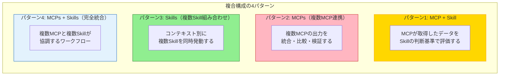
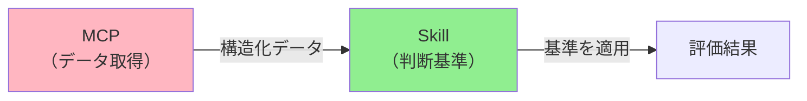
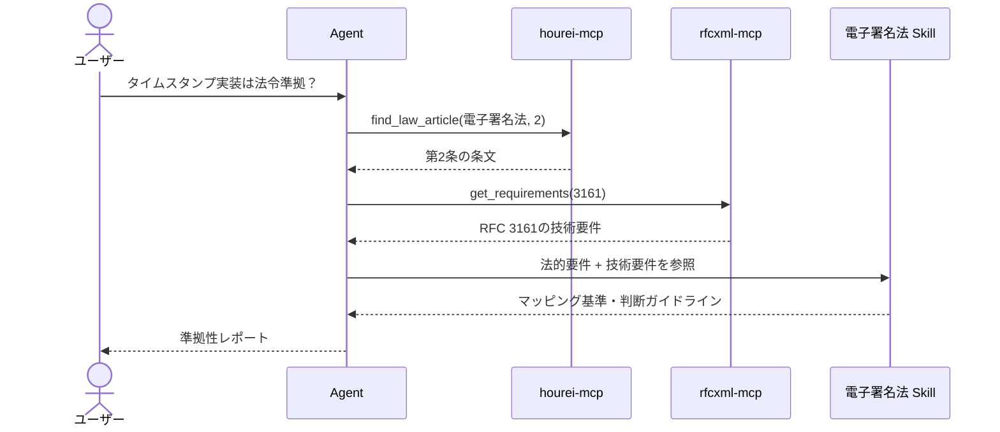
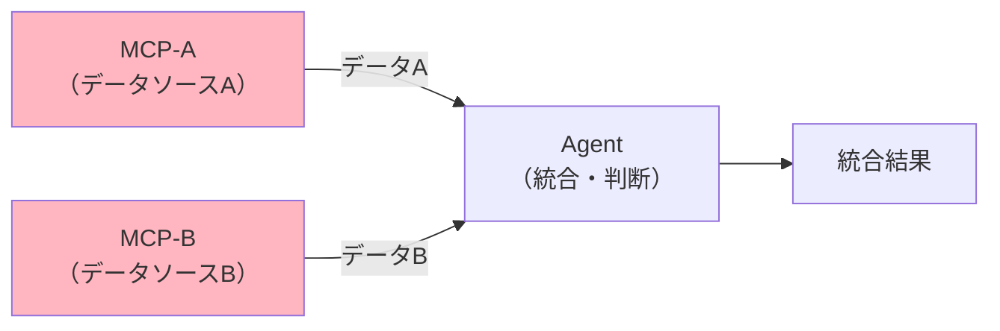
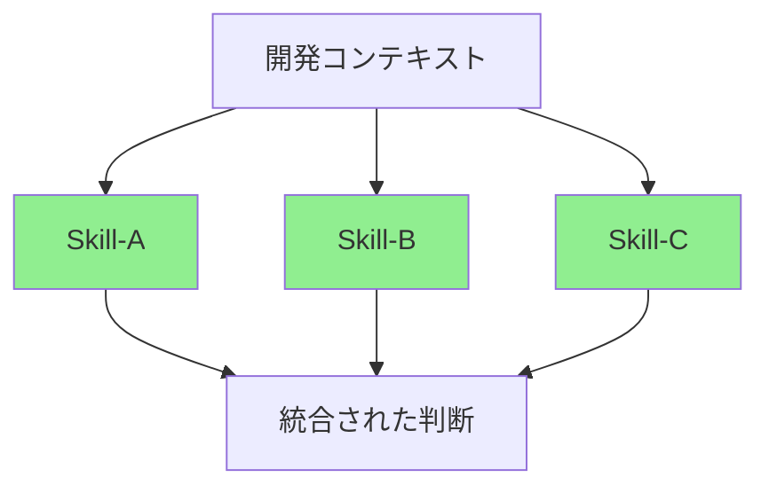
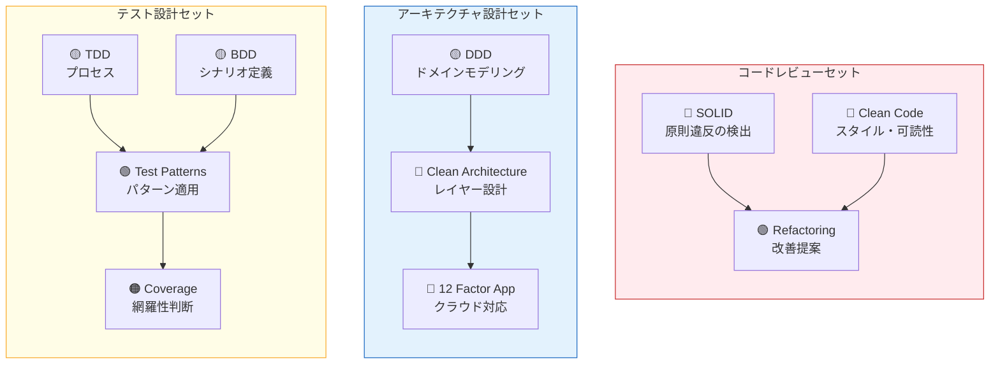
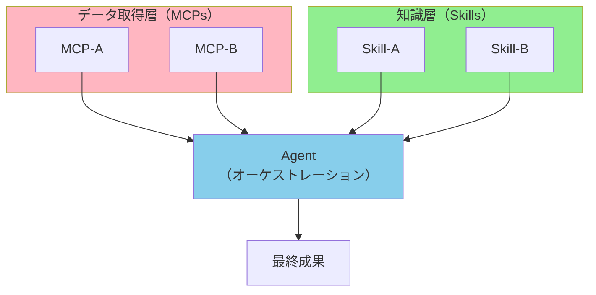
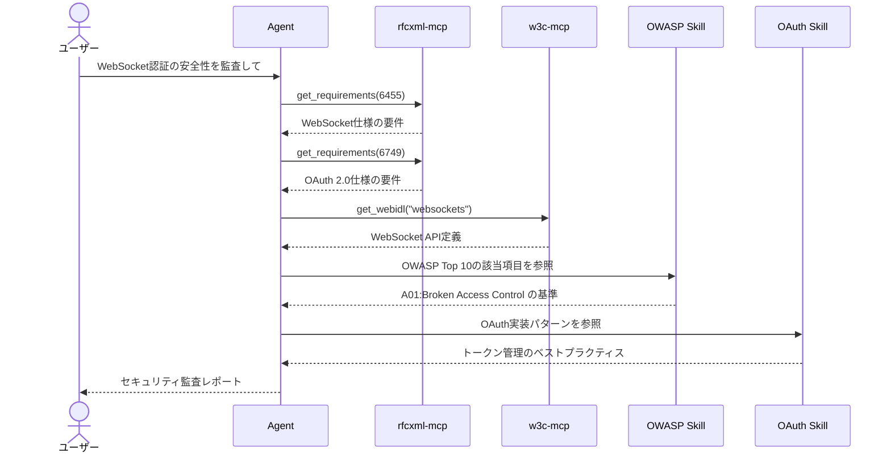
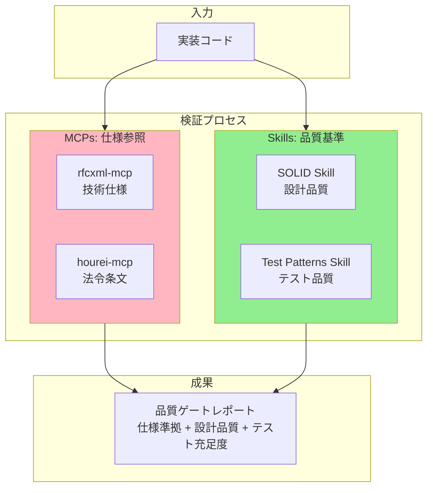
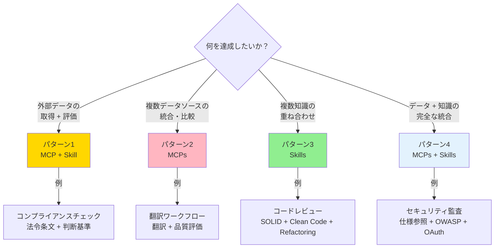

# 複合構成パターン

> MCP × Skill × Agent の組み合わせパターンと設計指針を整理する。

[English](./composition-patterns.md)

## このドキュメントについて

MCP単体、Skill単体でも価値はあるが、**組み合わせることで初めて発揮される価値**がある。本ドキュメントでは、4つの複合構成パターンを定義し、それぞれの設計指針・発動コンテキスト・活用事例を整理する。

MCP構築戦略は [mcp-roadmap.md](./mcp-roadmap)、Skill構築戦略は [skill-roadmap.md](./skill-roadmap) を参照。

## 4つの複合構成パターン

| パターン          | 構成                  | 核心                  | 難易度 |
| ----------------- | --------------------- | --------------------- | ------ |
| **MCP + Skill**   | 1 MCP + 1 Skill       | データ取得 + 判断基準 | ★★☆    |
| **MCPs**          | 複数 MCP              | データの統合・比較    | ★★☆    |
| **Skills**        | 複数 Skill            | 知識の重ね合わせ      | ★☆☆    |
| **MCPs + Skills** | 複数 MCP + 複数 Skill | 完全なワークフロー    | ★★★    |

## パターン1: MCP + Skill

MCPが外部から取得した「生データ」を、Skillが持つ「判断基準」で評価する構成。**ハイブリッド構成**の基本形。

### 設計原則

MCPは「何が書いてあるか」を返し、Skillは「それが良いか悪いか」を判断する。この分離が重要。

### 具体例

#### 電子署名法コンプライアンスチェック

| 要素             | 役割                                         |
| ---------------- | -------------------------------------------- |
| `hourei-mcp`     | 電子署名法の条文テキスト取得（MCP）          |
| `rfcxml-mcp`     | RFC 3161の技術要件取得（MCP）                |
| 電子署名法 Skill | 法的要件 ↔ 技術要件のマッピング基準（Skill） |

#### OAuth/JWT 実装レビュー

| 要素            | 役割                                             |
| --------------- | ------------------------------------------------ |
| `rfcxml-mcp`    | RFC 6749（OAuth 2.0）/ RFC 7519（JWT）の仕様取得 |
| OAuth/JWT Skill | トークン管理のベストプラクティス、実装パターン   |

### 設計上のポイント

- **Skillは MCPの出力に依存しない形で書く**: 「hourei-mcpが返す JSON の `article_text` フィールドを見る」のような実装依存は避け、「法令条文に以下の要件が含まれるか確認する」のような抽象的な記述にする
- **Skillの判断基準は検証可能にする**: 「準拠している」「準拠していない」「判断できない（追加情報が必要）」の3状態を明確にする

### 候補一覧

| テーマ         | MCP                       | Skill                    | 状態                   |
| -------------- | ------------------------- | ------------------------ | ---------------------- |
| 電子署名法     | hourei-mcp + rfcxml-mcp   | 実装ガイドライン         | ⚡ MCP側は既存で対応可 |
| 個人情報保護法 | hourei-mcp                | 対応チェックリスト       | ⚡ MCP側は既存で対応可 |
| 電子帳簿保存法 | hourei-mcp                | 保存要件チェック         | ⚡ MCP側は既存で対応可 |
| GDPR           | 規制テキストMCP（構想中） | DPIAチェックリスト       | 🔲 未着手              |
| OWASP          | 脆弱性DB MCP（構想中）    | セキュリティレビュー基準 | 🔲 未着手              |
| OAuth/JWT      | rfcxml-mcp                | 実装パターン             | ⚡ MCP側は既存で対応可 |

## パターン2: MCPs（複数MCP連携）

複数のMCPから取得したデータを統合・比較・検証する構成。すでに [workflows/patterns.md](../workflows/patterns) に実績がある。

### 設計原則

### 実績のある組み合わせ

| 組み合わせ                        | 用途                            | 実績                              |
| --------------------------------- | ------------------------------- | --------------------------------- |
| **deepl-mcp + xcomet-mcp**        | 翻訳 → 品質評価 → 再翻訳        | 180ページ技術文書を1日で翻訳・$12 |
| **rfcxml-mcp + w3c-mcp**          | RFC仕様 + Web API定義の統合参照 | WebSocket仕様確認ワークフロー     |
| **rfcxml-mcp + hourei-mcp**       | 技術仕様 × 法令条文のマッピング | 電子署名法 × RFC 3161 対応表      |
| **pdf-spec-mcp + pdf-reader-mcp** | PDF仕様参照 + 実ファイル検証    | PDF/UA準拠性検証                  |

### 設計上のポイント

- **順序依存か並列可能かを明確にする**: deepl → xcomet は順序依存、rfcxml + w3c は並列可能
- **データ統合のロジックはAgent層が担う**: MCPは生データを返すだけ。統合・判断はAgentの役割

## パターン3: Skills（複数Skill組み合わせ）

コンテキスト（開発局面）に応じて複数のSkillを同時に発動する構成。

### 設計原則

### コンテキスト別Skillセット

### 設計上のポイント

- **Skill間の優先順位を定める**: コードレビューセットでは、SOLID（原則）→ Clean Code（スタイル）→ Refactoring（改善）の順で評価する
- **「定義の一次ソース」ルール**: スコープが重複する概念（例: SRP）は、一方のSkillを一次ソース、他方は参照とする
- **セット全体をメタSkill化できる**: 「コードレビューセット」自体を1つのSkillとして定義し、3つのSkillを内部で参照する構成も可能

## パターン4: MCPs + Skills（完全統合）

複数のMCPと複数のSkillが協調する、最も複雑だが最も強力な構成。

### 設計原則

### 具体例

#### セキュリティ監査ワークフロー

| 層        | 要素        | 役割                         |
| --------- | ----------- | ---------------------------- |
| **MCP**   | rfcxml-mcp  | RFC 6455/6749 の仕様要件取得 |
| **MCP**   | w3c-mcp     | WebSocket API定義取得        |
| **Skill** | OWASP Skill | 脆弱性の判断基準             |
| **Skill** | OAuth Skill | 認証実装のベストプラクティス |

#### 仕様準拠の品質ゲート

### 設計上のポイント

- **Agent のオーケストレーションが鍵**: どのMCPを先に呼び、どのSkillをいつ参照するかの判断はAgent層が行う
- **MCP呼び出しの並列化**: 独立したMCP呼び出しは並列実行してコンテキストウィンドウを効率的に使う
- **Skillの発動タイミング**: データ取得後にまとめて判断するか、逐次判断するかを明確にする

## パターン選択ガイド

## 成果の蓄積

各パターンの実践結果は [outputs.md](../outputs.md) に記録する。以下の情報を含める。

| 項目         | 内容                                       |
| ------------ | ------------------------------------------ |
| 使用パターン | 4パターンのどれか                          |
| 構成要素     | 使用したMCP・Skill                         |
| 入力         | 何を対象としたか                           |
| 成果         | 定量的な結果（時間・コスト・品質スコア等） |
| 学び         | 改善点・次回への示唆                       |

## 関連ドキュメント

- [mcp-roadmap.md](./mcp-roadmap) — MCP構築ロードマップ
- [skill-roadmap.md](./skill-roadmap) — Skill構築ロードマップ
- [workflows/patterns.md](../workflows/patterns) — 既存のワークフローパターン（パターン2の実績）
- [concepts/03-architecture.md](../concepts/03-architecture) — MCP / Skill / Agent のレイヤー構造
- [mcp/catalog.md](../mcp/catalog) — 構築済みMCPカタログ
